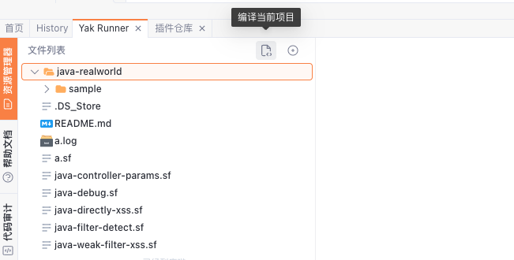
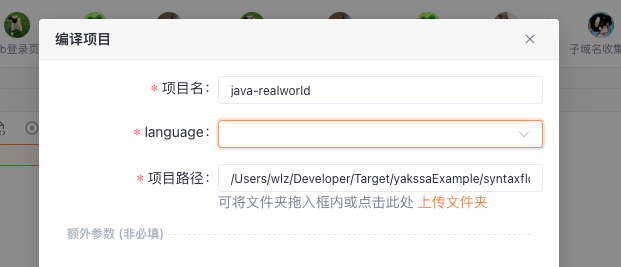
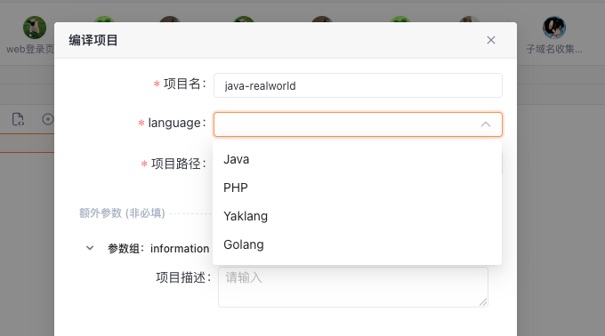
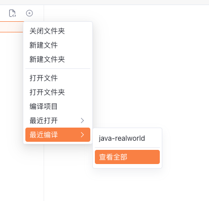
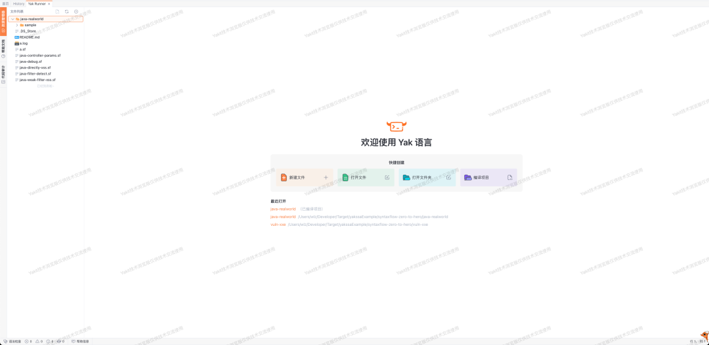
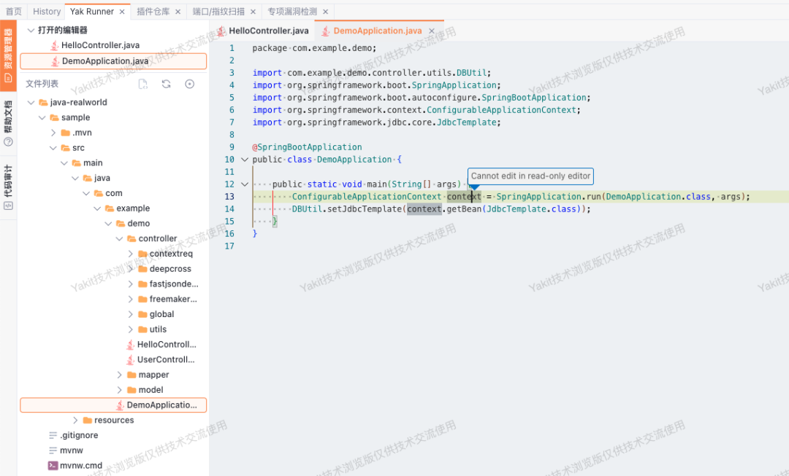
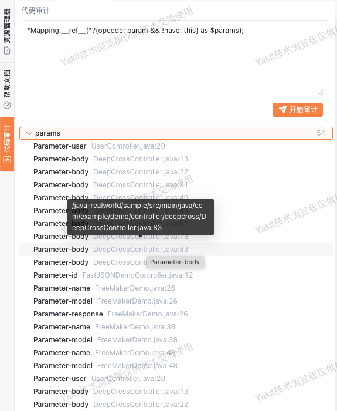
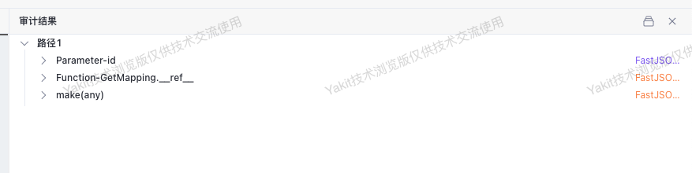
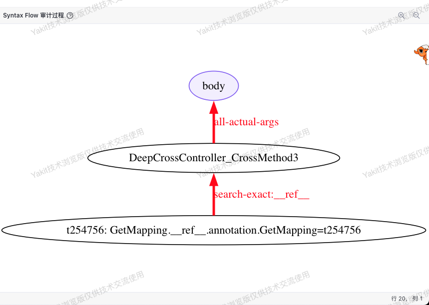
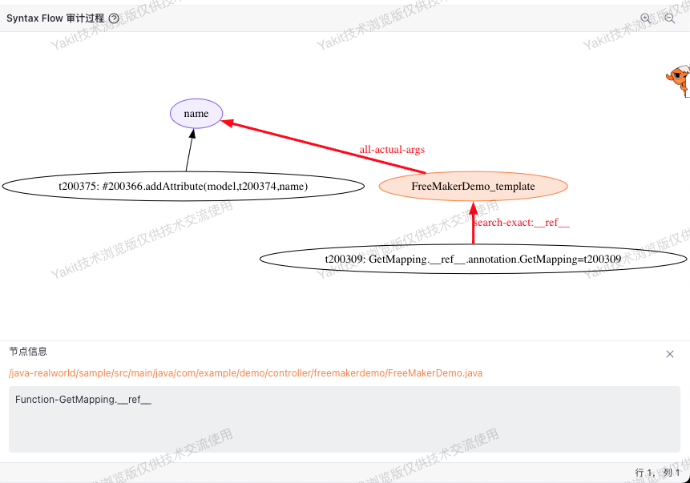

# 代码审计
  
## 页面入口
  
点击代码审计功能会进入到项目管理页面， 在此页面将会展示已编译的所有项目，可以在操作中选择跳转到代码扫描页面或代码审计页面。  
  
  
  
在此页面也可以在右上角开始编译新的项目，将会在编译完成以后自动跳转到代码审计页面：  
  
代码审计页面如下：  
  
  
  
  

## 编译项目
  
SyntaxFlow代码查询需要先进行项目编译。  
  

在前端的YakRunner界面，主界面或选项栏可以直接点击“编译项目”功能。  
> 可见图中红色方框圈起的选项  
  
  
  
  
编译项目的选项如下：必选项为项目名、语言和项目路径。  
  
  
  
其他额外信息、数据库路径、项目入口文件等都非必填。  
  
  
<!-- ## 编译当前项目 
##   
## 当在YakRunner中打开一个项目以后，可以使用快捷方式直接编译当前打开的项目。  
  
  
  
此时将会自动填充路径和项目名等信息。需要用户手动选择语言。  
  
  
  
  
   -->
###    已编译项目列表 

在最近编译项目中，可以快速打开已编译项目。  
  
选择查看全部将会打开已编译项目列表。  
  
  
  
将会显示已编译项目的名称、路径、编译时间和相关操作。可以进行该项目的打开以及项目删除。  
  
  
###    打开已编译项目 

打开已编译的项目，将会显示文件资源管理器页面，同时会显示 "Yakit技术预览版"的水印。  
  
  
  
可以检查文件内容，但这些已经编译的项目文件内容是只读的。  
  
  
  
<!--    -->
##  输入SyntaxFlow语句查询 

在左侧侧边栏中可以看到代码审计选项， 点开以后可以发现编写SyntaxFlow查询语句的窗口：  
  
  
  
在这里我们编写一段代码：  
- 查找所有的*Mapping  
注解，并找到其实例，然后通过()  
得到参数，并过滤去掉this参数，然后将结果保存在Params  
里面。  
  
- 或者说：查找所有被*Mapping  
修饰的方法的参数。  
  
然后我们可以看到结果是保存的变量：   
- Param: 是保存的$param  
变量， 其中有54个值，表示被*Mapping  
修饰的方法的参数。  
  
每一次查询都会得到一个变量列表，如同上文所示，在SyntaxFlow规则中定名的变量都会在结果中列出。  
  
点开变量名将会展示该变量内保存的所有结果：将会标注其IR表示以及源码位置：  
  
  
  
###    查询结果信息 
点击查看其中的某一项结果，YakRunner将会展开以下结构：  
  
  
- 编辑器将会跳转到该结果对应的源码位置：  
  
  
### 审计结果：分析路径  
  
  在右侧上半部分审计结果将会展示获得该结果的所有分析路径。  
  
  默认展开路径信息。  
  
  
- 可以继续点击获得每一个路径节点对应的源码信息。  
  
  
- 点击右侧信息也可以直接在编辑器跳转。  
  
- 点击右上角为关闭详细信息或对路径进行折叠。  
  
### 审计结果：分析图  
  
右侧下半部分将会展示分析过程的图：  
  
紫色节点代表当前结果，其他的普通节点代表分析过程中的节点。  
  
  
  
普通节点可以点击并且显示节点信息，点击文件路径可以在编辑器跳转：  
  
  

## 其他 

### 快捷键 
代码审计页面快捷键一览：

**代码审计页面内**：

- 双击 `shift` 唤出代码搜索功能
- 选中内容将自动进行搜索

**代码搜索窗口**：

   - ⬆️⬇️ 上下选择搜索结果
   - `tab` 切换搜索类型
   - `回车` 跳转到对应代码

**规则编写窗口**：
   - `command/control + 回车` 运行当前编写的规则

### 审计漏洞与风险视图 

在代码审计页面左侧，目前出现两个新的页面视图：“漏洞文件” “规则汇总”

两个页面都有下拉框，用于选择某一次代码扫描的任务或该项目全部的漏洞与风险信息：
* 漏洞文件汇总：显示在该项目中扫描存在漏洞风险的文件，以及其中的漏洞信息

* 规则汇总： 显示所有在该项目中扫描存在漏洞风险的规则，二级目录按照文件分类。

同样，当代码扫描任务结束以后， 我们可以在代码扫描任务看到新的关联按钮： “在代码审计中打开”

将会直接跳转并打开对应项目，并在汇总视图中选中对应的扫描任务。

