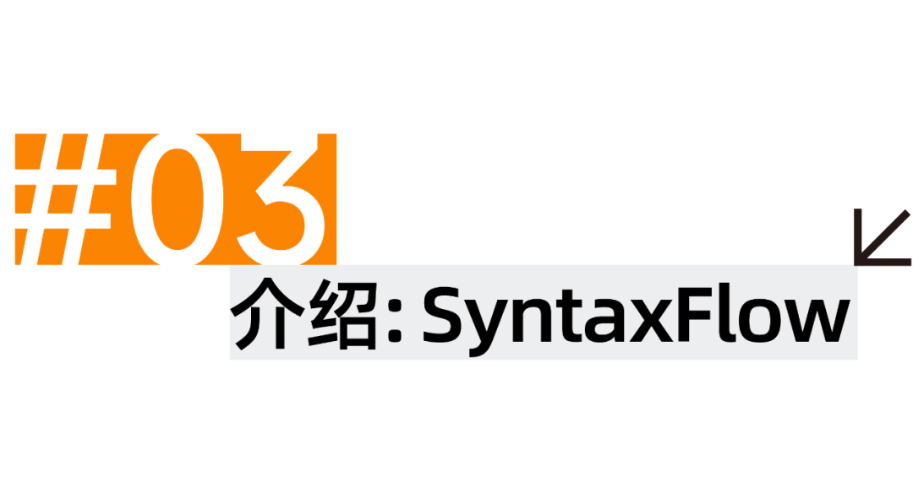

# 欢迎使用 SyntaxFlow 

SyntaxFlow 是一个 Yaklang 出品的编译器级的高级静态分析语言。你可以使用 SyntaxFlow 分析被 Yaklang SSA 编译器编译后的程序（IrCode in Database）。

# !!DANGEROUS NOTICE

**SyntaxFlow 技术目前仅供技术交流使用，商业合作与授权二次开发请与 Yak Project 联系**

**研发过程不代表最终品质呈现，如果想体验最新的技术与实现，请查阅 yaklang 项目源码** 

##  SyntaxFlow 在线体验
**无需安装yakit**  ，[在线启动代码审计](/codeAnalysis) ! 
  
全新风格平台，代码扫描启动！AI协助研判， 代码片段快速分析，误报漏报一键反馈  
  
  
  
  

## 支持特性

SyntaxFlow 支持各种静态分析中遇到的难题，并且在解决他们的过程中，可以抹除语言 AST 的特性，抹除赋值，编译分支与循环成为基本块和 Phi 的结构。

### SyntaxFlow 基础特性

1. 代码容错：可以针对不完整的代码进行审计；
1. 支持精确搜索，模糊搜索，指定方法搜索；
1. 支持 SSA 格式下的数据流分析；
1. 支持 Phi 指令处理 IF For 循环等控制流程；
1. 支持 OOP 编译成 SSA 格式后的搜索；
1. 支持 Java 注解的追踪与 SSA 实例化，以适应各类注解入口的框架代码；
1. 支持 Use-Def 链的运算符（向上递归寻找定义，向下递归寻找引用）

### SyntaxFlow 高级特性

1. 通用语言架构：支持 Yaklang / Java / PHP(Alpha*) / JavaScript(ES) Alpha*;
1. 自动跨过程，OOP 对象追踪，OOP 内方法跨过程，上下文敏感与函数栈敏感特性，可以支持复杂数据流分析；
1. 编译产物符号化，构建 Sqlite 格式的标准化符号和 IrCode 表，支持中间表达的可视化。
1. 支持跨过程与数据流可视化（根据 SF 分析过程自动生成），支持数据 Dot 格式的分析步骤图和数据流图

## SyntaxFlow 相关资料：

[SyntaxFlow 案例仓库](https://github.com/yaklang/syntaxflow)

<!--  -->
  

<!--    -->
  
<!-- SyntaxFlow 是一个 Yaklang 出品的编译器级的高级静态分析语言。旨在分析被 Yaklang SSA 编译器编译后的程序。SyntaxFlow支持高级数据流分析、自动的跨过程分析和面向对象或闭包的抽象等高级特性。如果感兴趣的话，欢迎访问网站：ssa.to 了解更多。  
   -->
## SyntaxFlow 商业合作 
**SyntaxFlow 技术目前仅供技术交流使用，商业合作与授权二次开发请与 Yak Project 联系**

目前的YakRunner登陆的SyntaxFlow功能为技术预览版，接下来将会持续更新SyntaxFlow和YakSSA HIR的分析能力以及相关使用教程，欢迎持续关注。  
  
Yakit现分为企业版与社区版，**社区版始终坚持开源且免费**。相较社区版，企业版提供更为全面的功能及能力，更丰富的内置规则，还能够进行人员配置及权限管理，欢迎来询。  
  
  
**企业版获取方式1:**  
  

公众号回复关键词“企业版”或“yakit企业版”，填写信息后，会有专人联系，提供企业版采购咨询及服务。  
  
**企业版获取方式2**  
  
填写[问卷](https://feishu-4dogs.feishu.cn/share/base/form/shrcnOEt7X4HQ12OvQOmDCnKocb)，会有专人联系，提供企业版采购咨询及服务。  
  
  
