# 第二章：详解静态单赋值形式

我们在前面章节已经讨论了 SSA 形式在编译器技术中的重要性，以及 SSA 形式在现代编译器技术中的应用。

那么，我们希望在接下来的章节中，更详细的介绍 SSA 的概念，以及在现代编程语言特性中的应用。

------

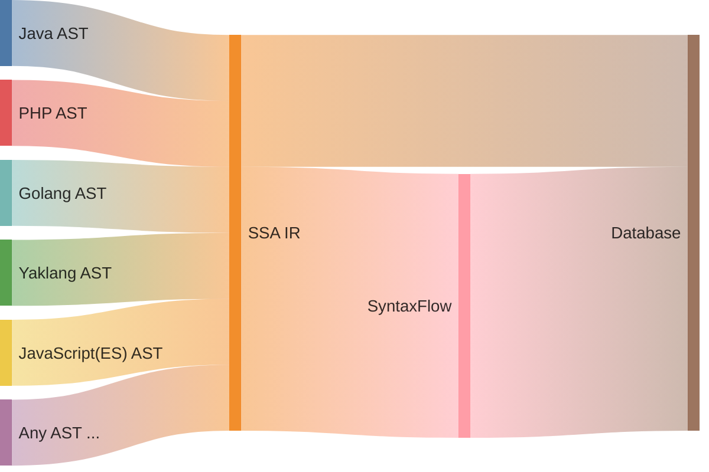

------

import TOCInline from '@theme/TOCInline';

<TOCInline toc={toc} />

## 术语介绍：

本文开始，将会出现很多编译技术中的术语，我们希望在这里做一个简单的介绍，以便于大家理解。

- **AST**：抽象语法树（Abstract Syntax Tree），是源代码的树形结构表示，每个节点代表一个语法结构。
- **SSA IR**：静态单赋值形式中间表示（Static Single Assignment Form Intermediate Representation），是编译器中一种中间表示形式，每个变量只能被赋值一次。
- **IR**：中间表示（Intermediate Representation），是编译器中一种中间表示形式，通常是SSA IR。
- **左值**：可以出现在赋值符号左边的东西，通常是变量，指针，数组，结构体等。
- **右值**：可以出现在赋值符号右边的值，通常是常量，变量，指针，数组，结构体等。
- **Phi 函数或 `φ` 符号**：在 SSA 形式中，Phi 函数用于处理多路分支情况下的变量赋值，根据控制流图的不同路径，选择不同的赋值，在后续文章中的 `φ` 符号均表示 Phi 函数。
- **基本块**：在编译器中，基本块是代码的连续执行序列，没有分支和跳转，通常是循环或条件语句的内部。
- **CFG: 控制流图**：在编译器中，控制流图是代码执行流程的图形化表示，每个节点代表一个基本块，边代表控制流关系。
- **闭包**：在编译器中，闭包是指一个函数与其相关的环境（包括自由变量）一起被捕获和存储的组合。
- **OOP**：面向对象编程（Object-Oriented Programming），是一种编程范式，通过类和对象来组织代码，实现代码的复用和抽象。

## SSA 的基本概念

SSA（Static Single Assignment）是一种中间表示形式，其核心特征是：

1. 每个变量只能被赋值一次
2. 每次使用变量时都能明确知道它的定义来源
3. 使用版本号来区分同一个变量的不同定义

我们接下来将会根据下图来讨论 SSA 的几个核心问题与他们在实际生产中的概念扩展

---
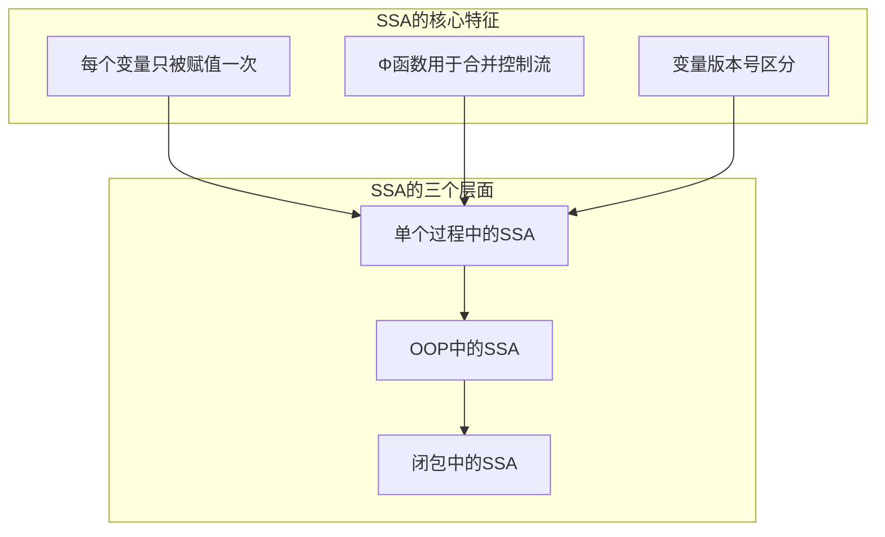
---

### 核心特征一：每个变量只能被赋值一次

SSA 的核心特征是“每个变量只能被赋值一次”，这个特征在现代编译器技术中非常重要，作为对比，我们可以观察下面这个案例：

```
# 原始代码
x = 1
x = x + 1
x = x * 2

# SSA 形式
x1 = 1
x2 = x1 + 1
x3 = x2 * 2
```

在 SSA 形式中，每个变量只能被赋值一次，因此我们可以看到，原始代码中的 `x` 变量在 SSA 形式中被拆分成了多个版本，每个版本都用不同的变量名来表示。

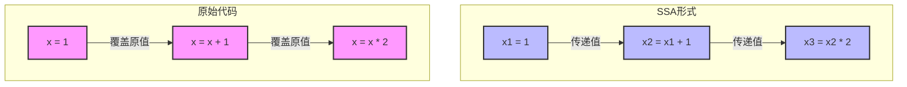

#### “覆盖” 与 “传递” 概念解析

##### 覆盖释义

在原始代码中，我们使用 `=` 符号表示赋值，覆盖掉了名字为 `x` 的变量。在这个操作中，`x` 这个词法符号表示的变量是一个可以重复赋值的容器。虽然在运行时，`x` 变量在任何时候都只有一个值，但是在原代码的编译期（无脚手架），我们无法知道 `x` 变量在运行时会被赋值几次，每次赋值的值是什么。

我们每一次对 `x` 的操作，都会“覆盖”掉 `x` 变量之前存储的值。

##### 传递释义

我们在 SSA 的形式中，可以认为 `x1` 和 `x2` 是两个不同的变量，`x3` 是另一个变量。`x` 被分割成了三个变量，每隔变量也都可以准确的找到他的数据流依赖关系。

### 核心特征二：Phi 函数用于合并控制流

在静态单赋值形式（SSA）中，Phi 函数（通常写作 `φ` 函数）是一个用于在基本块的合流点处合并来自不同控制流路径的变量值的特殊函数。当程序中存在条件分支或循环时，变量可能在不同的路径上被赋予不同的值。为了保持 SSA 的特性——每个变量只被赋值一次，我们需要一种机制来在这些路径汇合时合并变量的多个版本，这就是 Phi 函数的作用。

#### Phi 函数的基本概念

Phi 函数的形式为：

```
x = φ(x1, x2, ..., xn)
```

其中，`x1` 到 `xn` 是来自不同控制流路径的同一个变量的不同版本，Phi 函数选择其中一个适当的值赋给 `x`，具体选择取决于实际的执行路径。

:::tip

Phi 函数并不是真实存在的运行时函数，而是编译器中用于表示变量合并的一种抽象概念。在实际的代码生成过程中，Phi 函数会被消解，具体的实现方式取决于目标机器架构。例如，编译器可能通过寄存器分配和移动指令来实现变量值的合并。

:::

:::note

关于 Phi 函数消解的问题，一般会在 IR 编译到更低级的字节码（LIR 或机器码）的过程中进行消解。一般编译器中的各种条件跳转，循环跳转，都会在编译期间被展开，展开后的代码中将不再存在 Phi 函数。

:::

#### 示例分析

考虑下面一段包含条件分支的代码：

```python
# 原始代码
let x;
if condition:
    x = 1
else:
    x = 2
y = x + 1
```

在这段代码中，最终 `y` 使用到了 `x` 的值，而 `x` 在 `if` 和 `else` 分支中被赋予了不同的值，由于 if 的条件语句 `condition` 的存在，`x` 变量在 `if` 和 `else` 分支中产生了不同的值，我们无法在编译的时候确定 `x` 的值究竟是谁，所以使用 `phi` 来创建一个新的 `x` 的版本，并根据条件分支的执行路径来选择正确的 `x` 的版本。

```python
# 转换后的 SSA 形式
if condition:
    x1 = 1
else:
    x2 = 2
x3 = φ(x1, x2)
y1 = x3 + 1
```

#### 图形化表示

为了更直观地理解，我们可以使用控制流图（CFG）来表示上述代码的执行路径和变量赋值。

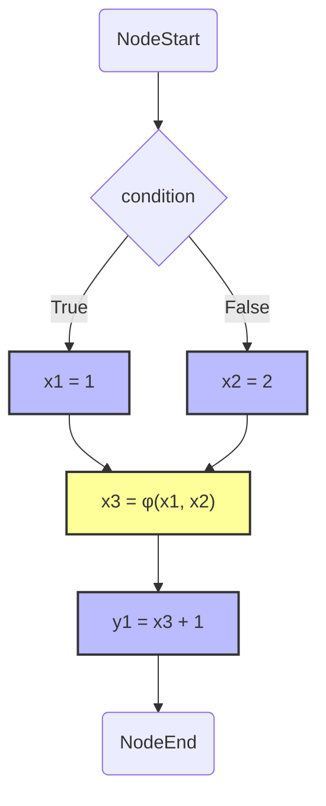

在这个图中，`MergePoint` 节点表示控制流的合流点，Phi 函数在此处用于选择正确的 `x` 值。

#### Phi 函数的必要性

如果不使用 Phi 函数，我们无法在 SSA 中正确地表示从不同控制流路径合并的变量值，因为这会导致变量被多次赋值，违反 SSA 的单赋值特性。

例如，下面的示例在 SSA 中是非法的：

```python
# 非法的 SSA 形式（错误）
if condition:
    x1 = 1
else:
    x1 = 2  # x1 被重复赋值，违反了 SSA 规则
y1 = x1 + 1
```

使用 Phi 函数可以解决这个问题：

```python
# 正确的 SSA 形式
if condition:
    x1 = 1
else:
    x2 = 2
x3 = φ(x1, x2)
y1 = x3 + 1
```

#### Phi 函数在循环中的应用

:::tip

在本小节中,我们仅简单探讨 Phi 函数在循环结构中的应用场景。

需要注意的是,在实际的编译过程中,编译器需要首先对循环进行基本块分割(Loop Basic Block Splitting),然后通过数据流分析(Data Flow Analysis)来确定 Phi 函数的精确插入位置。这是因为 Phi 函数的插入并非循环结构的必然结果,而是取决于变量的活跃性(Variable Liveness)和定值-使用链(Def-Use Chain)等因素。

:::

Phi 函数也用于处理循环中的变量合并。考虑下面的例子：

```python
# 原始代码
i = 0
while i < 10:
    i = i + 1
```

转换为 SSA 形式：

```python
# SSA 形式
i0 = 0
loop:
    i1 = φ(i0, i2)
if i1 < 10:
    i2 = i1 + 1
    goto loop
else:
    exit

```

在这个例子中，Phi 函数 `i1 = φ(i0, i2)` 用于合并循环进入点的 `i0` 和循环体内部更新后的 `i2`。这表示在循环的每一遍迭代中，`i1` 的值要么是初始值 `i0`，要么是上一轮迭代更新的 `i2`。

:::tip

在普通的代码修改为 SSA 形式之后，用户很容易读懂，但是在循环修改为 SSA 形式之后，用户就会发现一些和之前不一样的内容，这是因为上述代码 SSA 形式的循环中，涉及到了 loop 基本块，if 块儿和 else 块儿。这些块儿是把代码从循环结构中切分出来得到的，在后续的文章中，我们会讲解基本块儿的划分问题。

:::

#### 图解循环中的 Phi 函数

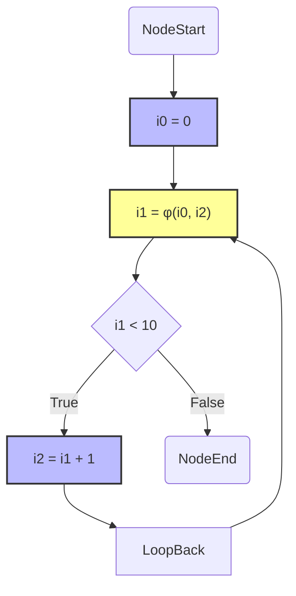

在这个控制流图中，Phi 函数所在的 `MergePoint` 节点合并了初始值 `i0` 和循环后更新的 `i2`，以供下一次迭代或退出循环时使用。

:::danger

需要注意的是，Phi 函数并不是真实存在的运行时函数，而是编译器中用于表示变量合并的一种抽象概念。在实际的代码生成过程中，Phi 函数会被消解，具体的实现方式取决于目标机器架构。例如，编译器可能通过寄存器分配和移动指令来实现变量值的合并。

:::

### 核心特征三：变量版本号区分

SSA 的第三个核心特征是变量版本号区分。为了确保每个变量在 SSA 形式中只被赋值一次，我们需要一种机制来区分同一变量在不同赋值点的不同版本。变量版本号的引入正是为了实现这一目标。

:::tip

虽然在上面的内容中，我们已经直接或者间接的接触到了变量版本号，但是为了让大家更好的理解变量版本号，我们在这里会额外给出一些案例。

:::

#### 基本概念

在 SSA 形式中，每当一个变量被赋值时，都会生成该变量的一个新版本。这通常通过在变量名后添加下标或其他标识符来实现。例如，对于变量 `x`，其不同的版本可以表示为 `x1`、`x2`、`x3` 等。每一个版本都代表了变量在某个特定赋值点的值。

**示例分析**

考虑以下原始代码：

```python
# 原始代码
x = 1
x = x + 1
if condition:
    x = x * 2
y = x + 3
```

将其转换为 SSA 形式后：

```python
# SSA 形式
x1 = 1
x2 = x1 + 1
if condition:
    x3 = x2 * 2
else:
    x4 = x2
x5 = φ(x3, x4)
y1 = x5 + 3
```

在这个例子中：

- `x1` 是 `x` 的第一次赋值。
- `x2` 是基于 `x1` 的第二次赋值。
- 在条件分支中，`x3` 来自 `x2 * 2` 分支，`x4` 来自 `x2` 分支，通过 Phi 函数合并为 `x5`（在前面的核心特征二中已详细介绍）。
- `y1` 最终使用了经过 Phi 函数合并后的 `x5` 的值。

#### 变量版本号的管理

变量版本号的管理通常由编译器在 SSA 转换过程中自动处理。以下是变量版本号管理的几个关键步骤：

1. **变量重命名（Renaming）：**
   - 当一个变量被赋值时，编译器为其生成一个新的版本号。
   - 该过程确保每个变量版本在 SSA 中只被赋值一次。

2. **追踪变量依赖（Dependency Tracking）：**
   - 通过版本号，编译器可以精确追踪每个变量版本的定义和使用位置。
   - 这有助于后续的优化，如常量传播、死代码消除等。

3. **消解 Phi 函数（Phi Function Resolution）：**
   - 在存在多个控制流路径的情况下，Phi 函数帮助合并不同路径上的变量版本。
   - 编译器在后端会将 Phi 函数转换为具体的机器指令。

:::info

在变量的版本号管理中，虽然我们可以做到消解一定程度的 Phi 函数，但是在实际的工程实践中，我们会有更优秀的算法来生成 Phi 函数，通过更好的 Phi 函数生成算法（定义域打表法），我们可以减少 Phi 函数带来的开销。

:::

#### 变量版本号的优势

引入变量版本号带来了多方面的优势：

- **简化数据流分析：** 每个变量版本都有唯一的定义点，使得数据流分析更加直接和高效。
- **支持高级优化：** 例如，常量传播、死代码消除、寄存器分配等优化技术都依赖于变量版本号的精确管理。
- **消除赋值冲突：** 通过版本号，避免了变量多次赋值带来的冲突，实现了更清晰的变量依赖关系。

#### 图形化表示

以下图示展示了变量版本号在 SSA 形式中的应用，并如何与 Phi 函数协同工作：

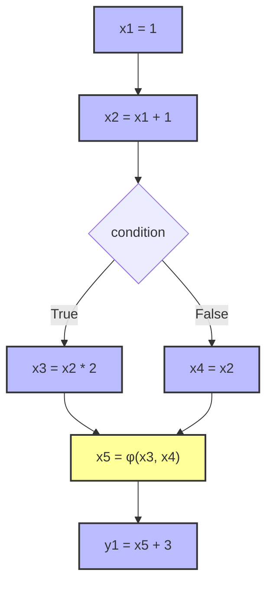

在这个控制流图中：

- 每次对 `x` 的赋值都会生成一个新的版本号。
- Phi 函数指令所在的基本块合并了来自不同控制流路径的 `x3` 和 `x4`，生成新的版本 `x5`，确保 `y1` 使用的是正确的 `x5` 版本。


:::tip
实际应用中的变量版本号

在现代编译器中，变量版本号的实现可能更加复杂，以支持高效的代码生成和优化。以下是一些实际应用中的考虑因素：

1. **寄存器分配（Register Allocation）：**
   - 编译器需要将 SSA 中的每个变量版本映射到物理寄存器或内存位置。
   - 变量版本号在此过程中帮助避免寄存器冲突，提高寄存器利用率。

2. **优化联合（Optimization Fusion）：**
   - 通过跟踪变量版本，编译器可以更准确地进行指令级并行优化，如指令合并和流水线优化。

3. **错误诊断与调试：**
   - 变量版本号的引入使得编译器能够更精确地定位变量定义和使用点，辅助错误诊断和调试工具的开发。
:::

#### 示例：更复杂的 SSA 转换

考虑以下更复杂的代码片段，其中变量 `a` 和 `b` 多次赋值，并存在嵌套的控制流结构：

```python
# 原始代码
a = 5
b = a + 2
if condition1:
    a = b * 3
    if condition2:
        b = a + 4
    else:
        b = a - 1
else:
    a = b + 5
y = a + b
```

转换为 SSA 形式后：

```python
# SSA 形式
a1 = 5
b1 = a1 + 2
if condition1:
    a2 = b1 * 3
    if condition2:
        b2 = a2 + 4
    else:
        b3 = a2 - 1
    b4 = φ(b2, b3)
else:
    a3 = b1 + 5
    b5 = b1
a4 = φ(a2, a3)
b6 = φ(b4, b5)
y1 = a4 + b6
```

在这个例子中：

- 每次对 `a` 和 `b` 的赋值都生成了新的版本。
- Phi 函数 `b4 = φ(b2, b3)` 合并了内部 `if` 分支的不同赋值路径。
- Phi 函数 `a4 = φ(a2, a3)` 合并了外部 `if` 分支的不同赋值路径。
- Phi 函数 `b6 = φ(b4, b5)` 合并了外部 `if` 分支中 `b` 的赋值路径。
- 最终的 `y1` 使用了合并后的 `a4` 和 `b6` 版本，确保了 SSA 的单赋值特性。

#### 图形化表示

下面的控制流图展示了上述复杂示例中变量版本号和 Phi 函数的应用：

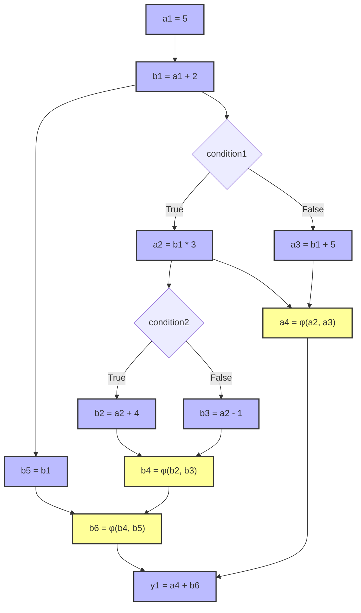

在这个图中：

- **赋值操作**：
    - 每个赋值操作（如 `a1 = 5`、`b1 = a1 + 2` 等）生成了新的变量版本，确保每个变量的定义点都是唯一的。

- **外部 `if-else` 分支**：
    - 在 `condition1` 为 `True` 时，`a` 被赋值为 `a2 = b1 * 3`，然后进入内部的 `if condition2` 分支。
    - **内部 `if-else` 分支**：
        - 如果 `condition2` 为 `True`，`b` 被赋值为 `b2 = a2 + 4`。
        - 如果 `condition2` 为 `False`，`b` 被赋值为 `b3 = a2 - 1`。
        - 不论 `condition2` 的结果如何，内部 `if-else` 分支结束后，插入 Phi 函数 `b4 = φ(b2, b3)`，将 `b2` 和 `b3` 的值合并为 `b4`。
    - 如果 `condition1` 为 `False`，`a` 被赋值为 `a3 = b1 + 5`，并且 `b` 保持为 `b5 = b1`。

- **Phi 函数的插入**：
    - **Phi 函数 `a4 = φ(a2, a3)`**：
        - 位于外部 `if-else` 分支的汇合点，合并了 `condition1` 为 `True` 时的 `a2` 和 `condition1` 为 `False` 时的 `a3`。
    - **Phi 函数 `b6 = φ(b4, b5)`**：
        - 位于外部 `if-else` 分支的汇合点，合并了 `condition1` 为 `True` 时的 `b4` 和 `condition1` 为 `False` 时的 `b5`。

- **最终赋值**：
    - `y1 = a4 + b6` 使用了合并后的 `a4` 和 `b6` 版本，确保 `y1` 的计算基于 SSA 形式中的唯一变量版本。

:::info

读者可以自行检查自己对上述案例的理解，来自己评价自己是否真理解了值的版本化和 Phi 函数的位置目的。

:::

## 基本块：分割代码是 SSA 编译的重要前提

在编译器设计中，基本块（Basic Block）的划分是实现 SSA（静态单赋值）形式的关键步骤之一。基本块将程序的控制流划分为若干不含分支的连续指令序列，每个基本块内的指令按照顺序执行，且只有入口和出口。这种划分不仅简化了控制流分析，还为后续的优化步骤奠定了基础。

编译器在构建 SSA 形式时,通常会先将代码划分成基本块,然后在基本块的基础上进行变量重命名和 Phi 函数的插入。

### 基本概念

**基本块**是指在程序中一系列连续的指令，这些指令满足以下条件：

1. **入口唯一**：基本块内的指令只能通过块的第一个指令被执行。
2. **无分支中途跳入**：基本块内不会有跳转指令，除了块的最后一条指令可能是跳转指令。
3. **无分支中途跳出**：基本块中的指令会顺序执行，直到块的最后一条指令。

换句话说，基本块是程序中无法被分割的最小执行单元。

### 划分基本块（Basic Block）的重要性

在 SSA 转换过程中，基本块的划分具有以下重要作用：

1. **简化控制流图（CFG）**：将程序划分为基本块后，可以更清晰地构建控制流图，便于分析程序的执行路径。
2. **便于插入 Phi 函数**：如果有基本块儿的概念，我们就可以在需要的时候通过各种算法来插入 Phi 函数（打表或高开销的遍历变量版本）。
3. **优化分析和转换**：基本块作为 SSA 转换和各种优化算法（如死代码消除、常量折叠等）的基本处理单元，提高了编译器的效率和准确性。

### 基础基本块划分概述

#### 非 SSA 形式的基本块划分

让我们以之前的代码示例为基础，进一步展示基本块的划分过程，在这个案例中，我们作为对比，先讲解非 SSA 形式的基本块划分：

```python
# 原始代码
a = 5
b = a + 2
if condition1:
    a = b * 3
    if condition2:
        b = a + 4
    else:
        b = a - 1
else:
    a = b + 5
y = a + b
```

##### 基本块划分

将上述代码划分为多个基本块，每个基本块满足前述的基本块定义：

1. **入口块**（Entry Block）：
    - `a = 5`
    - `b = a + 2`

2. **条件判断块**（Condition1 Block）：
    - `if condition1:`

3. **True 分支块**（True Branch Block）：
    - `a = b * 3`

4. **内部条件判断块**（Condition2 Block）：
    - `if condition2:`

5. **内部 True 分支块**（Internal True Branch Block）：
    - `b = a + 4`

6. **内部 False 分支块**（Internal False Branch Block）：
    - `b = a - 1`

7. **Else 分支块**（Else Branch Block）：
    - `a = b + 5`

8. **下一个语块**（Next Statement Block）：
    - `y = a + b`

##### 基本块的控制流图

通过 Mermaid 图表展示基本块之间的控制流关系：

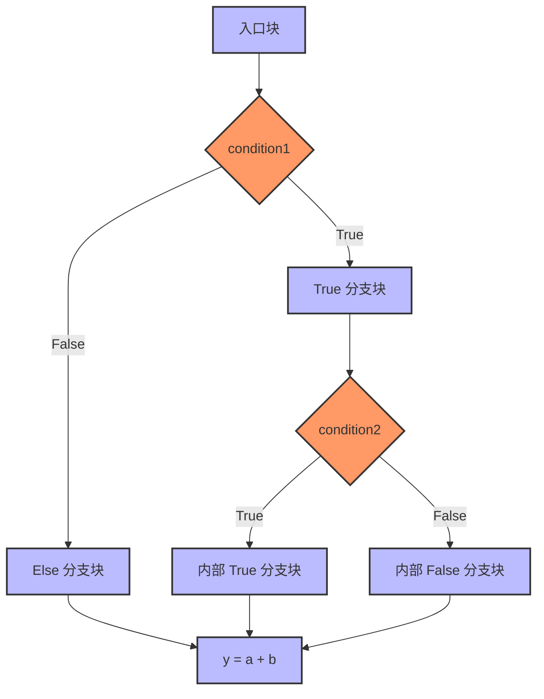

#### IF 语句中 SSA 形式的基本块划分

考虑以下 SSA 形式的比较复杂的 IF 代码：

```python
# SSA 形式
a1 = 5
b1 = a1 + 2
if condition1:
    a2 = b1 * 3
    if condition2:
        b2 = a2 + 4
    else:
        b3 = a2 - 1
    b4 = φ(b2, b3)
else:
    a3 = b1 + 5
    b5 = b1
a4 = φ(a2, a3)
b6 = φ(b4, b5)
y1 = a4 + b6
```

##### 基本块的控制流图

上述代码的基本块之间的控制流关系：

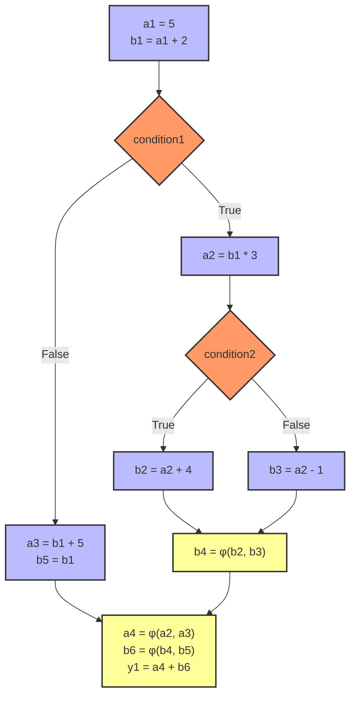

在上述 SSA 友好的基本块儿切割方案中，我们把 phi 插入在条件判断块的出口处紧接的代码块儿中，这样我们就可以在条件判断块的出口处插入 Phi 函数。

### 基本块（Basic Block）之间的关系

在了解完基本概念和基本切割案例之后，我们来总结一下基本块之间的关系：

基本块之间的关系主要体现在以下几个方面：

1. **连续性**: 基本块通常是连续的指令序列
2. **前驱关系（Predecessor Relationships）**: 每个基本块可能有一个或多个前驱基本块
3. **后继关系（Successor Relationships）**: 每个基本块可能有一个或多个后继基本块

其中基本块的前驱和后继关系是基本块之间关系的主要体现，复杂的前驱后继关系共同构成了复杂的代码控制流

### 典型的条件分支中的基本块关系

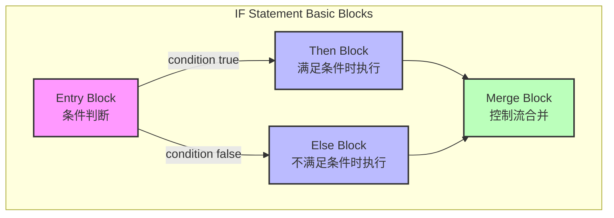

:::tip

由于 IF 我们在前面已经讨论过很多次了，相对来说不会构造成复杂的控制力流关系，所以不再进行展开。用户可以自行根据上述的图示来理解基本块之间的关系。

:::

### 典型的循环中的基本块关系

考虑一个相对完整的循环，我们一般认为一个循环语句，有如下要素：

- 初始化
- 循环条件
- 循环体
- 循环更新
- 循环结束
- break 语句
- continue 语句

如果我们把上面所有要素考虑成基本块儿切割的一句，那么我们就可以得到一个相对完整的循环基本块切割方案。

##### 简单条件循环（不含 break 和 continue）

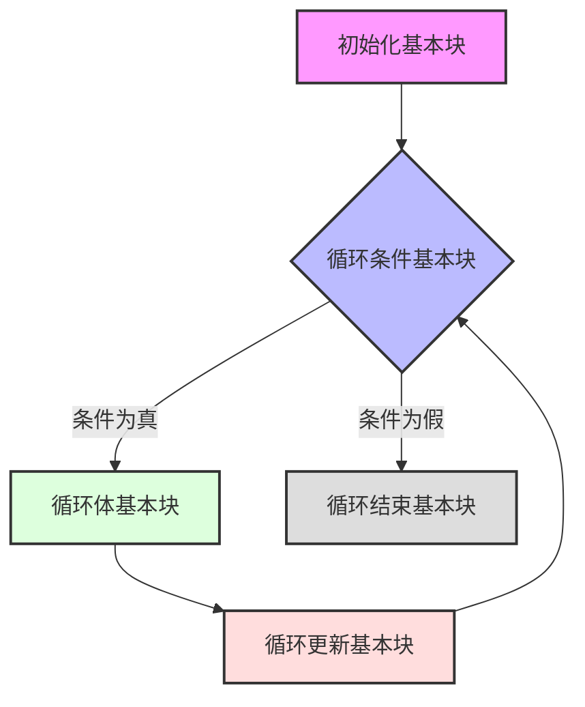

这个案例非常简单，我们不需要考虑复杂前驱后继关系，只需要考虑循环条件和循环体即可。

:::tip

案例如下：

```c
// 计算 1 到 100 的和
int main() {
    // 初始化基本块
    int sum = 0;
    int i = 1;
    
    // 循环条件基本块
    while (i <= 100) {
        // 循环体基本块
        sum = sum + i;
        
        // 循环更新基本块
        i = i + 1;
    }
    
    // 循环结束基本块
    printf("Sum from 1 to 100 is: %d\n", sum);
    return 0;
}
```

上述内容对应的控制流图如下：

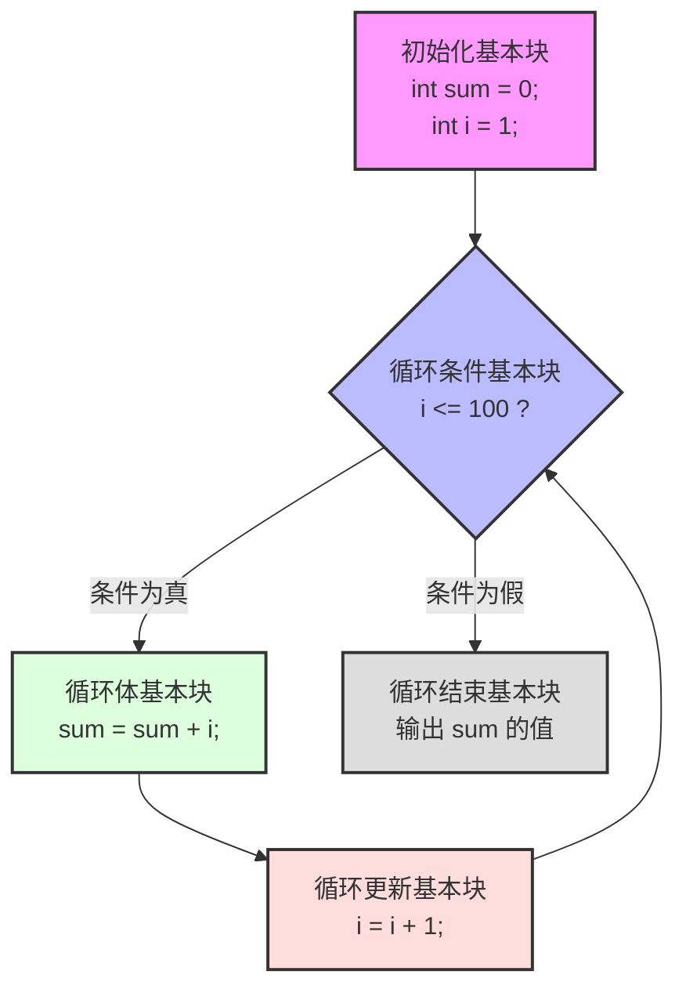

:::

##### 考虑 break 和 continue 的循环基本块切割

break 和 continue 是循环中常用的语句，它们会改变循环的执行流程。

- continue 语句会跳过当前循环的剩余部分，直接进入下一次循环（跳转到更新表达式的位置）。
- break 语句会终止循环，并跳出循环体。

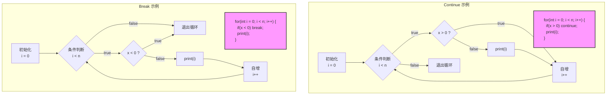


### 案例研究：复合控制流结构中的基本块划分分析

本案例将详细探讨一个包含循环结构(Loop Structure)和条件分支语句(Conditional Branch)的程序片段，着重分析其基本块(Basic Block)的划分原理及其控制流图(Control Flow Graph, CFG)的构建过程。

#### 1. 源代码分析

考虑以下示例代码片段：

```c
int sum;
for (sum = 0; i < 100; i++) {
    if (i % 2 == 0) {
        sum += i;
    }
}
printf("%d", sum);
```

该代码实现了一个求偶数和的算法，其中包含了典型的循环控制结构和条件分支语句，这为我们研究基本块划分提供了一个理想的范例。

#### 2. 基本块划分及控制流分析

基本块的划分遵循以下关键准则：
- 一个基本块只能从其第一条指令进入
- 只能从最后一条指令退出
- 块内指令顺序执行，无分支和汇合

根据上述准则，该程序可划分为7个基本块，其层次结构如下：

````mermaid
    graph TB
        subgraph While Loop Basic Blocks
            A["Entry Block (B1)<br>初始化基本块<br>sum = 0;"] --> B

            B["Loop Header (B2)<br>循环条件判断<br>i < 100"] -->|condition true| C
            B -->|condition false| F

            C["Condition Block (B3)<br>循环体条件判断<br>i % 2 == 0"] -->|even| D
            C -->|odd| E

            D["Even Handler (B4)<br>偶数处理<br>sum += i;"] --> E

            E["Loop Update (B5)<br>循环更新<br>i++;"] --> B

            F["Exit Block (B6)<br>循环结束"] --> G

            G["Print Block (B7)<br>printf('%d', sum);"]
        end

        classDef init fill:#f9f,stroke:#333,stroke-width:2px
        classDef loop fill:#bbf,stroke:#333,stroke-width:2px
        classDef exit fill:#bfb,stroke:#333,stroke-width:2px
        
        class A init
        class B,C,D,E loop
        class F,G exit
````

#### 3. 控制流图与前驱-后继关系分析

为了更深入地理解程序的执行流程，我们构建了详细的控制流图，并分析了各基本块间的前驱-后继关系：

````mermaid
    graph TB
        subgraph Flow Graph
            direction LR
            B1((B1)) --> B2((B2))
            B2 --> B3((B3))
            B2 --> B6((B6))
            B3 --> B4((B4))
            B3 --> B5((B5))
            B4 --> B5
            B5 --> B2

            %% 为节点添加说明标签
            L1[/"Entry Block"/]
            L2[/"Loop Header"/]
            L3[/"Condition Block"/]
            L4[/"Even Handler"/]
            L5[/"Loop Update"/]
            L6[/"Exit Block"/]

            %% 连接标签和节点
            L1 -.-> B1
            L2 -.-> B2
            L3 -.-> B3
            L4 -.-> B4
            L5 -.-> B5
            L6 -.-> B6
        end

        subgraph Predecessor-Successor Analysis
            direction LR
            X["Predecessor → Successor Relationships<br>================================<br>B1 → B2 (初始化到循环头)<br>B2 → B3, B6 (循环条件分支)<br>B3 → B4, B5 (偶数判断分支)<br>B4 → B5 (偶数处理到更新)<br>B5 → B2 (更新到循环头)"]
        end

        classDef block fill:#f9f,stroke:#333,stroke-width:2px
        classDef label fill:none,stroke:none
        class B1,B2,B3,B4,B5,B6 block
        class L1,L2,L3,L4,L5,L6 label
````
#### 关键特性分析

根据控制流图和前驱-后继关系分析,我们可以总结出以下关键特性:

#### 循环结构特征
- 循环头(Loop Header, B2)作为循环的入口点
- 回边(Back Edge)从B5指向B2,构成循环结构 
- 循环出口边(Exit Edge)从B2指向B6

##### 分支结构特征
- 条件分支节点(B3)实现了偶数判断逻辑
- 分支合并点(B5)确保了控制流的正确汇合

##### 数据流特性
- 循环归纳变量i的更新在B5中进行
- 累加操作(sum += i)在B4中执行

:::tip
这种结构化的分析方法不仅有助于理解程序的控制流程，也为后续的代码优化和转换提供了基础。
:::

### Label - Goto 中的基本块切割

除了条件分支和循环流程控制之外，Goto 语句也是常见的控制流结构，一般情况下，Goto 语句会和 Label 语句一起使用，形成一个跳转表，从而实现复杂的控制流。

在大多数的语言中，Goto 都不允许跨函数跳转，我们这里讨论的也是不跨函数的情况。

:::tip

事实上，我们也几乎想不到 Goto 跨函数跳转的实际应用场景。

:::

一般情况下，Goto 的应用场景常见于“错误处理（例如 Kernel C 中存在大量 Goto 到 Error 的标签）”，“状态机”（例如 Lua 语言中使用 Goto 语句实现状态机）这类比较高阶的编程中。虽然不常用，但是并不代表我们在进行代码块儿切割的时候不考虑这种情况。

#### 如何切割 GOTO 基本块

考虑如下伪代码：

```c
// 代码块
x = 1
y = 2
z = x + y

LABEL: // 标记位置
// 代码块2-2
print(z)

// 条件判断和代码块3
IF z < 10 {
    z = z + 1
    GOTO LABEL
}

// 代码块4
print("完成")
```

我们要注意，上述代码中包含 LABEL 和 GOTO，一般 GOTO 语句会和 LABEL 语句一起使用，形成一个跳转表，从而实现复杂的控制流。我们要在 LABEL 语句之前和之后进行代码块切割。同时也需要在 GOTO 语句处进行代码块切割（因为基本块中不允许存在跳转）。

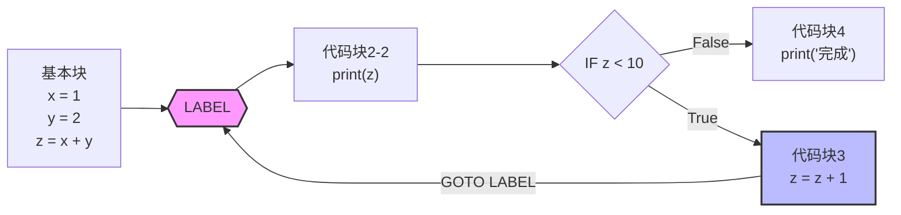


## SSA 基于基本块产生 Phi 函数

根据我们在前面讨论的 SSA 三大核心特征，我们发现最难处理的其实是 phi 的生成。

在一些教科书中，Phi 的生成强制绑定伴随条件分支语句和循环语句的编译实现。但是在现代的编译理论中，我们完全可以将 Phi 的生成和条件分支语句和循环语句的编译实现分离，从而简化编译器实现的复杂度。

我们以下面这个高难度案例来介绍这种分离的方法：

考虑以下 Goto 构建的复杂代码：

```
int x = 1;

L3:
if (cond) {
    goto L1;
} else {
    goto L2;
}

L2:
    x = 2;
    goto L3;
L1:
    y = x + 1;
```

:::tip

上述代码并不是 SSA 形式的，并且读者会发现，想要凭借人脑直接把上述内容“编译”成SSA格式，其实是非常有挑战的。但是我们在本大节讲述的基本 SSA 编译方法可以比较好的解决这个问题。

:::

上述代码非常复杂，包含了三个 Goto 语句，分别为 L1, L2, L3。其中，L3 中还包含了需要切割的 IF 语句。我们可以按照前文中的 GOTO 基本块切割方法，将上述代码切割成多个基本块。同时在使用 IF 的切割方法，将 L3 切割成两个基本块。

切割完成后，我们将得到下面的内容：

### 非 SSA 切割基本块

我们把代码成功切分后，发现 `x` 的值有一些奇怪，我们暂时无法确定 `x` 的值，因此使用了 `[something]` 来表示。


上述的内容虽然我们切对了，但是并不是 SSA 形式，这也直接导致我们无法知道 `x` 的值究竟是谁。但是实际上，我们可以推断出 `x` 的值的两种可能性，一种是 `1` 一种是 `2`，那么 `y` 的值也就有 `2` 和 `3` 两种可能性。

根据我们本章内容的描述，其实大家更容易接受 phi 函数可以同时表示他是 `1` 或者 `2` 两种可能性，因此我们进行 SSA 改造的时候，就得到了如下结果

### 基本块的 SSA 转换

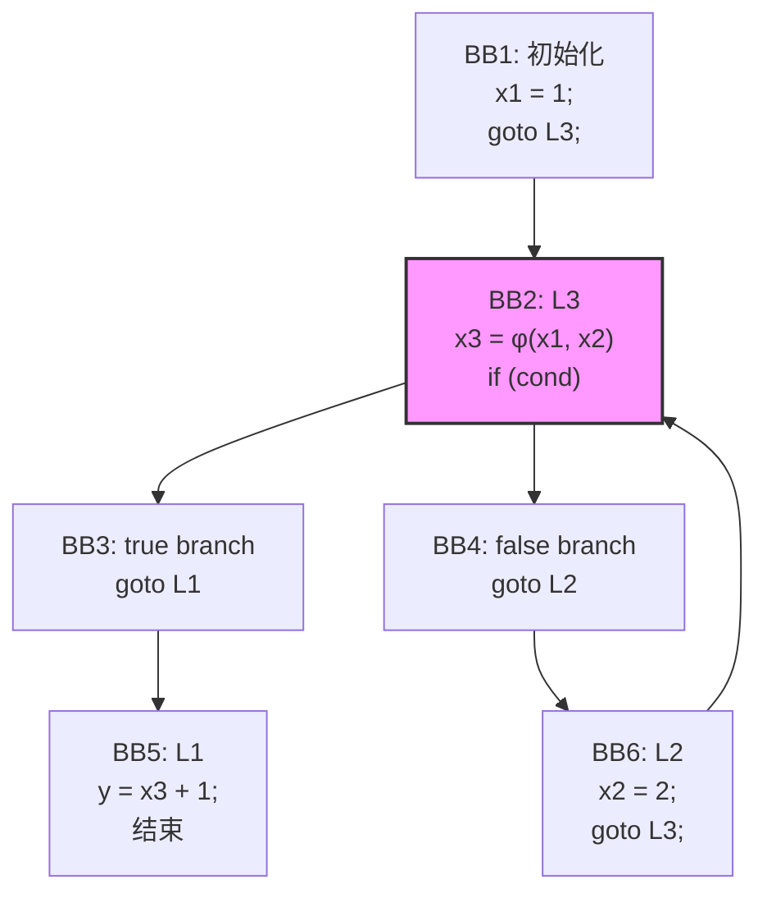

我们发现，切割后反而画出了 SSA 形式的代码反而更容易得到最一开始的代码的切分后的 SSA 代码形式：

```c
int x1 = 1;

L3:
if (cond) {
    goto L1;
} else {
    goto L2;
}

L2:
    x2 = 2;
    goto L3;
L1:
    x3 = φ(x1, x2)
    y = x3 + 1;
```

### 基于前驱基本块生成 Phi 函数

我们仔细观察上述的图，就会发现，phi 产生的位置实际上在 BB2 中，而 BB2 的前驱基本块是 BB1 和 BB6，因此我们就可以推断出 `x3 = φ(x1, x2)`。


因此，我们可以得到（推断）一个前驱块生成 phi 函数的规则：

对于基本块 [B]，如果它有多个前驱基本块 [P₁, P₂, ..., Pₙ]，并且变量 [v] 在这些前驱基本块中被定义（赋值）过，那么在基本块 [B] 的起始处，我们需要插入一个 phi 函数来合并来自不同前驱的 [v] 的版本。

##### Phi 函数的形式

```
vₐ = φ(v₁, v₂, ..., vₙ)
```

其中：
- `vᵢ` 表示变量 v 在前驱基本块 Pᵢ 中的版本
- `vₐ` 表示在基本块 B 中新的 SSA 版本的变量 v

##### 详细解释

1. **多前驱情况**
   - 当一个基本块有多个前驱时，变量 [v] 可能在不同的前驱中具有不同的值（版本）
   - 需要在当前基本块开始处引入新的版本来维持 SSA 特性

2. **Phi 函数的作用**
   - 为变量引入新的版本
   - 在运行时选择正确的前驱值
   - 维护 SSA 形式的单一赋值特性

#### 实际示例

考虑以下情况，基本块 BB2（对应代码中的 L3）有两个前驱基本块：

```
BB1: x₁ = 1
BB6: x₂ = 2

BB2: x₃ = φ(x₁, x₂)  // 在 BB2 开始处插入
```

#### 示意图

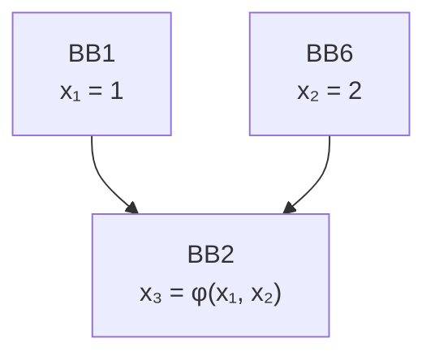

## 讨论区

import Giscus from '@site/src/components/Giscus';

<Giscus />