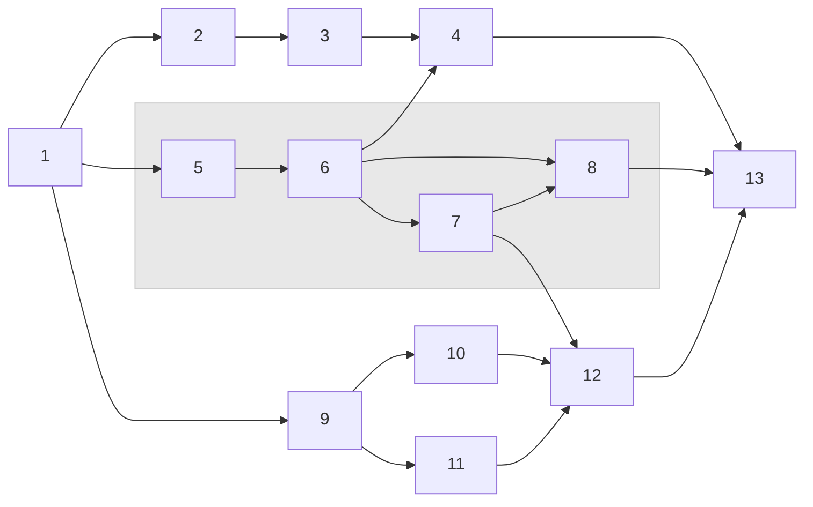

# 第八章：控制流中的支配关系与 SSA Phi 指令

:::danger 未完成的章节

本章是一个未完成的章节，将会基本介绍控制流和支配的关系，并且会介绍 SSA 的 Phi 节点问题。

:::

## 控制流与基本块

## 控制流中的支配关系

import TOCInline from '@theme/TOCInline';
import Math, { BlockMath, InlineMath } from '@site/src/components/Math';

在接下来的内容中，我们重点将会讨论控制流中基本块之间的支配问题。

控制流分析中，支配是一个非常重要的概念，他描述了基本块之间的依赖关系，我们以 <InlineMath math="Dom(x, y)" /> 来表示基本块 <InlineMath math="x" /> 支配基本块 <InlineMath math="y" />。

<BlockMath math={`
对于基本块\\ x\\ 和\\ y，如果：\\\\
Dom(x,\\ y)\\ \\iff\\ \\text{所有到达\\ y\\ 的路径都必须经过\\ x}
`} />

我们可以进一步形式化定义支配关系：

<BlockMath math={`
Dom(x,\\ y)\\ =\\ \\begin{cases}
true\\ &\\ \\text{若\\ x\\ 支配\\ y}\\ \\\\
false\\ &\\ \\text{其他情况}
\\end{cases}
`} />

其中：
- <InlineMath math="x" /> 是支配者(dominator)
- <InlineMath math="y" /> 是被支配者(dominee)

### CFG 中的基本块支配边界

在用户了解完支配问题之后，接下来我们提出一个问题，“一个数据节点的支配的范围有多大？”

要回答这个问题，我们需要定义一个概念叫支配边界。考虑任何离开块 B 的路径。最初路径上的块由 B 支配。最终到达一个不由 B 支配的块。除非路径返回到 B，否则之后的所有块都不受 B 支配。不被 B 支配的第一个块是重要的，因为它指示了 B 支配的块的范围，并使用有关 B 中的计算的信息指示了优化的限制。考虑到所有路径，拥有该特征的块的集合称为支配 B 的边界。

让我们首先给出支配边界的形式化定义：

<BlockMath math={`
DF(X) = \\{Y | \\exists Z \\in Dom(X) \\text{ such that } Y \\text{ is an immediate successor of } Z \\text{ and } X \\not\\in Dom(Y)\\}
`} />

其中：
- <InlineMath math={"DF(X)"} /> 表示节点X的支配边界
- <InlineMath math={"Dom(X)"} /> 表示被X支配的节点集合
- Y是X的支配边界中的一个节点
- Z是被X支配的某个节点
- Y是Z的直接后继节点
- X不支配Y

让我们用一个具体的例子来说明：



我们给出图中各节点的支配边界分析表格：
| 节点 | 支配的节点集合 Dom(X) | 直接后继节点 | 支配边界 DF(X) |
|-----|-------------------|------------|-------------|
| 1 | \{1,2,3,4,5,6,7,8,9,10,11,12,13\} | \{2,5,9\} | ∅ |
| 2 | \{2,3\} | \{3\} | \{4\} |
| 3 | \{3\} | \{4\} | \{4\} |
| 4 | \{4\} | \{13\} | \{13\} |
| 5 | \{5,6,7,8\} | \{6\} | \{4,12,13\} |
| 6 | \{6,7,8\} | \{4,7,8\} | \{4,12,13\} |
| 7 | \{7\} | \{8,12\} | \{8,12\} |
| 8 | \{8\} | \{13\} | \{13\} |
| 9 | \{9,10,11\} | \{10,11\} | \{12\} |
| 10 | \{10\} | \{12\} | \{12\} |
| 11 | \{11\} | \{12\} | \{12\} |
| 12 | \{12\} | \{13\} | \{13\} |
| 13 | \{13\} | ∅ | ∅ |

给出支配边界计算算法的形式化表示：

<BlockMath math={`
\\begin{aligned}
DF_{local}(X) &= \\{Y \\in succ(X) \\mid X \\not\\in Dom(Y)\\} \\\\
DF_{up}(X) &= \\bigcup_{Z \\in DomTree_{children}(X)} \\{Y \\in DF(Z) \\mid X \\not\\in Dom(Y)\\} \\\\
DF(X) &= DF_{local}(X) \\cup DF_{up}(X)
\\end{aligned}
`} />

其中：
- <InlineMath math={"DF_{local}(X)"} /> 表示节点X的局部支配边界
- <InlineMath math={"DF_{up}(X)"} /> 表示从X的支配树子节点上传递来的支配边界
- <InlineMath math={"succ(X)"} /> 表示X的直接后继节点集合
- <InlineMath math={"DomTree_{children}(X)"} /> 表示X在支配树中的直接子节点集合

下面是计算支配边界的完整算法伪代码：

```javascript
// 计算所有节点的支配边界
function computeDominanceFrontiers(cfg) {
    let DF = new Map()  // 存储每个节点的支配边界
    
    // 按照支配树的后序遍历节点
    for (let X of postorderTraversal(cfg.domTree)) {
        DF.set(X, new Set())  // 初始化空集
        
        // 计算局部支配边界
        for (let Y of X.successors) {
            if (X.immediateDominator !== Y.immediateDominator) {
                DF.get(X).add(Y)
            }
        }
        
        // 计算来自子节点的支配边界
        for (let Z of X.domTreeChildren) {
            for (let Y of DF.get(Z)) {
                if (!dominates(X, Y) || X === Y) {
                    DF.get(X).add(Y)
                }
            }
        }
    }
    return DF
}

// 判断X是否支配Y
function dominates(X, Y) {
    return Y.dominators.has(X)
}
```
