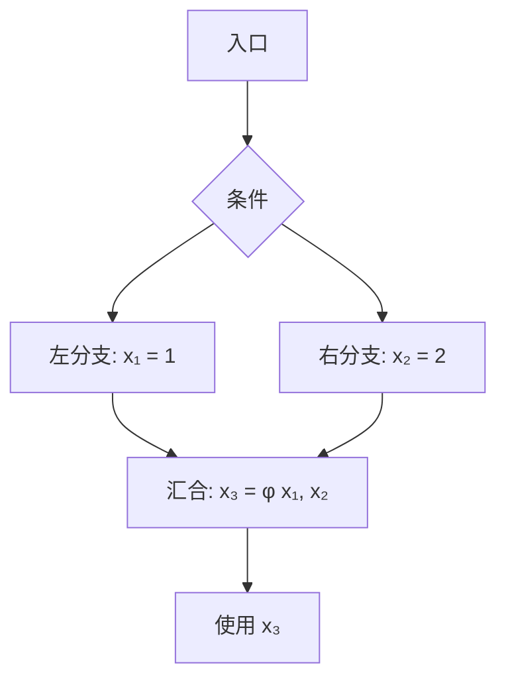

# 控制流、支配与 Phi

数据依赖说明一个值来自哪里；控制流说明程序可以沿哪些路径执行。SSA 构建需要同时考虑二者：在存在多条进入路径的基本块中，如何为后续使用确定一个唯一的值定义？本章用一个分支示例说明基本块、支配关系、支配边界与 Phi 节点的联系。

## 控制流与基本块

基本块是具有单一入口的直线执行序列，控制转移发生在块末尾。控制流图（CFG）以基本块为节点，以可能的控制转移为有向边。


```mermaid
flowchart TD
  Entry[入口] --> Branch{条件}
  Branch --> Left[左分支: x₁ = 1]
  Branch --> Right[右分支: x₂ = 2]
  Left --> Merge[汇合: x₃ = φ x₁, x₂]
  Right --> Merge
  Merge --> Use[使用 x₃]
```

图中的左右分支分别定义一个值。在汇合块中，后续代码需要使用由进入路径决定的那个值；SSA 用新的定义 `x₃` 表达这一关系。

## 支配关系

在具有入口节点的 CFG 中，如果从入口到基本块 B 的每一条路径都经过 A，则称 A **支配** B。根据这个定义，每个节点都支配自身；排除自身时称为**严格支配**。

在上图中，入口支配所有可达块。左右分支都不支配汇合块，因为存在一条经过另一个分支到达汇合块的路径。

### 直接支配者与支配树

一个非入口块的**直接支配者**，是离它最近的严格支配者。将每个块与其直接支配者连接起来，便得到支配树。

支配树提供的是“必经关系”。它不是 CFG 的另一种绘制方式，也不表示数据值的定义与使用关系。

## 支配边界

A 的支配边界由满足以下条件的块 B 构成：

- A 支配 B 的至少一个前驱；
- A 不严格支配 B。

直观上，这是从 A 支配的区域到达一个可能与其他路径汇合的地方。在上图中，汇合块位于左右两个分支块的支配边界中。

“非严格支配”这一条件需要保留：循环可能使一个块出现在自身的支配边界中。因此，简单地排除所有被 A 支配的节点，会漏掉某些循环情况。

### 一个用于教学的计算过程

下面的伪代码假设 CFG 的可达节点、前驱列表与直接支配者已经计算完成。`idom` 中入口节点的直接支配者为 `null`。

```javascript title="沿支配树回溯，收集汇合块"
function dominanceFrontiers(blocks, predecessors, idom) {
  const frontier = new Map(blocks.map(block => [block, new Set()]));

  for (const block of blocks) {
    const incoming = predecessors.get(block) || [];
    if (incoming.length < 2) continue;

    for (const predecessor of incoming) {
      let runner = predecessor;
      while (runner != null && runner !== idom.get(block)) {
        frontier.get(runner).add(block);
        runner = idom.get(runner);
      }
    }
  }
  return frontier;
}
```

这段代码用于解释支配边界的计算思路，不代表 Yak SSA 内部使用的具体实现。完整的 SSA 构建还需要变量定义信息与重命名过程。

## Phi 节点如何连接路径与值

对于在不同块中定义的同一源变量，可以从定义块的支配边界寻找 Phi 放置位置，并继续迭代处理新定义带来的汇合点。是否保留一个候选 Phi，还与采用的 SSA 构建方案及变量的活跃性有关。

在分支示例中，教学表示如下：

```text title="两个前驱，两个输入值，一个新的 SSA 定义"
left:
    x₁ = 1
    goto merge

right:
    x₂ = 2
    goto merge

merge:
    x₃ = φ(left: x₁, right: x₂)
    use(x₃)
```

Phi 在语义上选择**刚刚执行的前驱基本块**对应的值。从左分支进入时，`x₃` 取 `x₁`；从右分支进入时取 `x₂`。它不是一次普通函数调用，也不是对两条路径的值同时求值。

## 回到静态分析

在审计中，看到某个值的多个上游来源时，应进一步检查这些来源关联的控制路径。某条数据依赖存在，并不能独立证明它在所有执行路径上都成立。

阅读 [SSA 数据流与跨过程分析](./deep-dive-into-ssa-dataflow-and-cross-procedure) 时，可以用这两个问题区分概念：

1. 这个值的定义与使用通过哪些依赖连接？
2. 从入口到相关调用，哪些基本块必须经过？

前者属于数据流问题，后者属于控制流与支配问题。

## 参考资料

- Cytron, Ferrante, Rosen, Wegman, Zadeck. *Efficiently Computing Static Single Assignment Form and the Control Dependence Graph*, 1991。[原始技术报告](https://cs.brown.edu/research/pubs/techreports/reports/CS-91-21.html)。
- LLVM Language Reference Manual。[Phi 指令的输入与语义](https://llvm.org/docs/LangRef.html#phi-instruction)。
