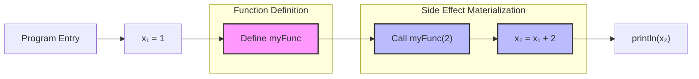
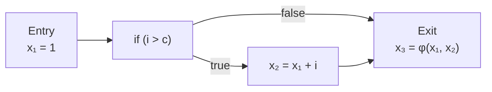
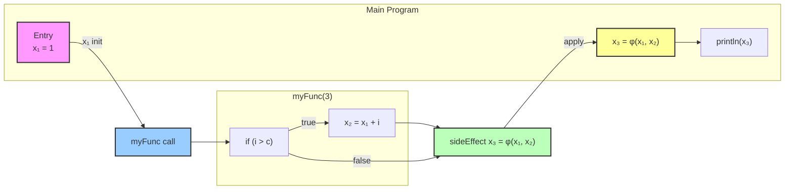
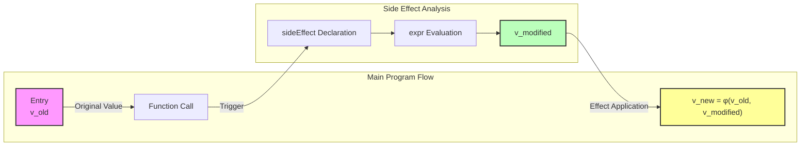
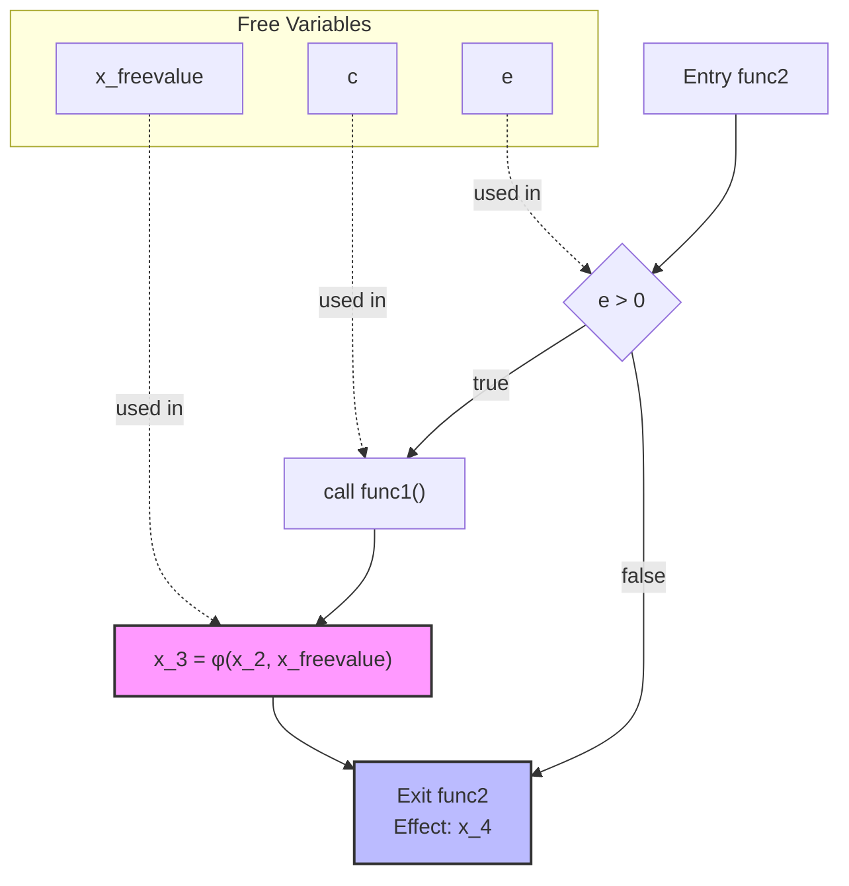
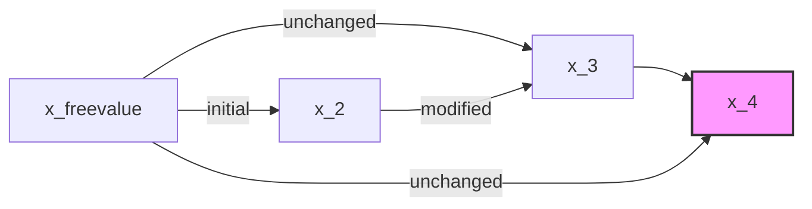
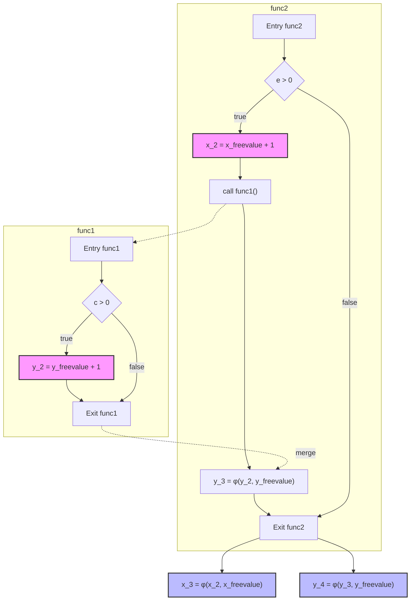

# 第四章：SSA 深水区 - 分析闭包函数

:::tip 题外话

虽然有一些语言对闭包的支持并不好，但是作为 “通用静态” 编译技术，闭包函数是无论如何都绕不过去的一个话题。在更贴近用户的高级编程语言中，闭包和使用和深入了解在编程中的意义巨大（虽然它本身对编译器来说非常不友好，会极大增加编译器的设计复杂度）

我们强烈建议读者在了解完之前的所有内容，再开始阅读这一章节。本章节涉及到的一系列复杂的概念需要用户本身对编译器有一定了解。

:::

我们在前面的内容中，讨论了各种语言的高级特性的 SSA 编译手段，并且给出了很多形式化表达，但是这些内容基本停留在基础的 SSA 层面。

在接下来的内容中，我们将讨论一些更深层次的 SSA 内容，包括我们怎么对待闭包函数，我们怎么对待 OOP 并且怎么找到 OOP 相关概念与 Classless 概念的联系。

这两大话题是 SSA 中非常具有实践意义的话题。

import TOCInline from '@theme/TOCInline';
import Math, { BlockMath, InlineMath } from '@site/src/components/Math';

---
<TOCInline toc={toc} />
---

## 术语解析

:::tip 在本节中，我们将会讨论一些闭包中的术语，这些术语将会贯穿整个闭包的讨论过程。

- 副作用（SideEffect, Effects）：在函数中，修改了捕获变量的值。
- 自由变量：在函数中，未在函数参数和函数局部变量中定义的变量。
- MVP: 最小可用产品或代码（Minimum Viable Product）

:::

## 闭包函数概念

闭包（Closure）是一个函数与其相关的引用环境的组合体。从技术角度来说，闭包是一个记录结构（record），它包含了一个函数和一个关联的环境组件。

这个环境组件中包含了函数体内引用的、但是既不是函数参数也不是函数局部变量的所有变量的绑定。

:::tip 题外话

我们在定义讨论中将会暂时忘掉 SSA 这个事情，如果你已经深入了解了闭包是什么，那你可以直接查看 SSA 相关的闭包编译技术。

:::

闭包的定义如下：

<BlockMath math={`
Closure = (F, E)
`} />

其中：

- <InlineMath math="F" /> 表示函数本身
- <InlineMath math="E" /> 表示捕获的环境（Captured Environment）

:::tip 闭包的本质

从计算机科学的角度来看，闭包实际上是一种特殊的作用域规则的实现机制。它允许内部函数访问外部函数的变量，即使外部函数已经返回。这种机制打破了常规的栈式作用域规则。

这就要求在运行的时候，函数可以访问到捕获的环境，并且捕获的环境可能和“符号表”不一样，而是一个定义与实体的映射。

:::


### 闭包的核心特性

1. **变量捕获**：闭包可以捕获其定义时所在作用域的变量，我们再补充一点，这个变量必须被使用的时候才算是“捕获”，如果不被使用，就不需要考虑这个事情了。

<BlockMath math={`
CapturedVars(closure) = \\{ v \\mid v \\in Scope(F) \\land v \\notin (Params(F) \\cup Locals(F)) \\}
`} />


2. **生命周期延展**：被捕获的变量的生命周期会被延长至闭包函数的生命周期。

3. **状态保持**：每个闭包实例都维护着其自己的变量状态。

### 形式化表达

我们可以将闭包的形式化定义扩展为：

<BlockMath math={`
\\begin{aligned}
& \\textbf{Closure Definition:} \\\\
& Closure = (F: Function, E: Environment) \\\\
\\\\
& \\textbf{Function Structure:} \\\\
& Function = (Params \\times Body \\times FreeVars) \\\\
\\\\
& \\textbf{Environment Mapping:} \\\\
& Environment: CapturedVars \\to Location \\\\
& Location = (Address \\times Type) \\\\
\\\\
& \\textbf{Variable Capture Rules:} \\\\
& FreeVars(F) = Used(F) \\setminus (Params(F) \\cup Locals(F)) \\\\
& CapturedVars(F) = \\{ v \\mid v \\in FreeVars(F) \\land v \\in Scope(Parent(F)) \\} \\\\
\\\\
& \\textbf{Environment Construction:} \\\\
& E = \\{(v, ref(v)) \\mid v \\in CapturedVars(F)\\} \\\\
& ref: Var \\to Location
\\end{aligned}
`} />

接下来我们将会就形式化表达配合 MVP 来进行详细讲解闭包函数的各种神奇的特性。

### 自由变量：闭包捕获变量

我们在开始 SSA 编译之前，一定要知道闭包中的重要概念都是什么，虽然在形式表达中我们有一些符号，但是这些符号都是可以被替换为更加详细并且容易理解的形式。

#### 如何捕获自由变量？

:::caution 因地制宜

每一种语言的闭包捕获变量的方式都不一样，虽然我们会讨论一些特例，但是通用情况对我们来说更加重要。

:::

闭包捕获变量的情况虽然绝大多数是通过变量名直接来捕获的，但是也总有例外情况：

1. PHP 中，需要通过 `use` 关键字来显式声明捕获变量
2. 在 Python 中，需要通过 `nonlocal` 关键字来显式声明捕获变量

这两种情况实际上会改变捕获变量的方式，但是捕获变量的本质还是不变的。我们把这两种情况称为显式捕获，而绝大多数情况我们称为隐式捕获。

:::info 形式定义（自由变量）

我们给出显示捕获和隐式捕获的形式化定义：

<BlockMath math={`
\\begin{aligned}
& \\textbf{Capture Mechanisms:} \\\\
\\\\
& \\textbf{Implicit Capture:} \\\\
& CapturedVars_{implicit}(F) = \\{ v \\mid v \\in FreeVars(F) \\land v \\in Scope(Parent(F)) \\} \\\\
\\\\
& \\textbf{Explicit Capture:} \\\\
& CapturedVars_{explicit}(F) = \\{ v \\mid v \\in DeclaredVars(F) \\land v \\in Scope(Parent(F)) \\} \\\\
& DeclaredVars(F) \\subseteq FreeVars(F)
\\end{aligned}
`} />

不论是显式捕获还是隐式捕获，捕获变量的本质可以用以下形式化表达：

<BlockMath math={`
\\begin{aligned}
& \\textbf{Capture Essence:} \\\\
& Capture = (Var \\times AccessMethod \\times LifetimeExtension) \\\\
\\\\
& \\textbf{Where:} \\\\
& AccessMethod = Direct \\mid Indirect \\mid Reference \\\\
& LifetimeExtension = \\{t \\mid t_{capture} \\leq t \\leq t_{closure_{death}}\\}
\\end{aligned}
`} />

:::

##### 隐式捕获（Implicit Capture）

隐式捕获是编译器自动分析和处理的捕获方式，主要特点是：

```javascript
function outer() {
    let x = 1;
    let y = 2;
    return function inner() {
        return x + y;  // x 和 y 被自动捕获
    }
}
```

:::tip 隐式捕获的工作原理
1. 编译器自动分析变量使用
2. 识别函数中使用但未在本地定义的变量
3. 在外层作用域中查找这些变量
4. 自动建立捕获关系
:::

##### 显式捕获（Explicit Capture）

显式捕获需要程序员明确声明要捕获的变量：

```php
// PHP 的显式捕获
$x = 1;
$y = 2;
$closure = function() use ($x, $y) {
    return $x + $y;
};

// Python 的显式声明
def outer():
    x = 1
    def inner():
        nonlocal x  # 显式声明使用外部变量
        x += 1
        return x
    return inner
```

:::tip 显式捕获的特点
1. 需要明确的语法标记（如 `use`、`nonlocal`）
2. 捕获的变量集合是声明变量的子集
3. 编译器可以直接根据声明进行优化
:::

#### 捕获的归一化处理

无论是显式还是隐式捕获，在了解到他的本质之后，我们可以统一处理这些内容：

引入 FreeValues 这个概念，把捕获的变量统一称为 FreeValues，要求函数处理的时候，需要对 FreeValues 进行处理。

##### FreeValues 的形式化定义

<BlockMath math={`
\\begin{aligned}
& \\textbf{FreeValues Definition:} \\\\
& FreeValues = \\{(v_i, AccessMode_i, CaptureKind_i) \\mid v_i \\in CapturedVars\\} \\\\
\\\\
& \\textbf{Where:} \\\\
& AccessMode = ReadOnly \\mid ReadWrite \\\\
& CaptureKind = Declared \\mid Implicit \\\\
\\\\
& \\textbf{Constraints:} \\\\
& Declared(v) \\Rightarrow v \\in DeclaredVars \\\\
& Implicit(v) \\Rightarrow v \\in FreeVars(F) \\setminus DeclaredVars
\\end{aligned}
`} />

类似 PHP 的 use，只不过我们的 freevalue 可以通过声明或者自动捕获（编译时的选项）。


### 副作用：闭包中捕获变量的修改

在上一节我们讨论了变量捕获的概念，现在让我们深入探讨闭包中捕获变量的修改所导致的副作用问题。

#### 副作用定义

首先我们来定义副作用的概念：

副作用（Side Effect）是指函数在执行过程中，除了返回值之外，还对函数作用域外部的状态进行了修改。

#### 形式化表达

<BlockMath math={`
\\begin{aligned}
& \\textbf{Side Effects Definition:} \\\\
& SideEffect = (Var \\times Operation \\times Scope) \\\\
\\\\
& \\textbf{Where:} \\\\
& Operation = Write \\mid ReadWrite \\\\
& Scope = Local \\mid Captured \\mid Global \\\\
\\\\
& \\textbf{Effect Analysis:} \\\\
& Effects(F) = \\{(v, op, scope) \\mid v \\in Modified(F) \\} \\\\
& Modified(F) = \\{v \\mid v \\in CapturedVars(F) \\land IsModified(v, F)\\} \\\\
\\\\
& \\textbf{Effect Propagation:} \\\\
& HasEffect(F) \\Leftrightarrow Modified(F) \\neq \\emptyset
\\end{aligned}
`} />

#### 代码示例

考虑以下代码：

```javascript
function outer() {
    let x = 1;
    let y = 2;
    return function inner() {
        x = x + 1;      // 副作用：修改闭包中的捕获变量
        return x + y;
    }
}
```

这段代码展示了一个重要的概念：函数的副作用。让我们分析其中的关键点：

1. **闭包与变量捕获**
   - inner 函数形成了一个闭包，捕获了外部作用域的 x 和 y
   - 这些变量在 outer 函数执行完毕后仍然存在于闭包环境中

2. **副作用的识别**
   - inner 函数中对 x 的修改构成了一个副作用
   - 这是因为它修改了函数作用域之外的状态（闭包中的变量）

3. **副作用的特性**
   ```javascript
   const innerFn = outer();
   console.log(innerFn()); // 第一次调用
   console.log(innerFn()); // 第二次调用会得到不同的结果
   ```
   - 副作用的存在是函数的静态特性，不依赖于函数是否被调用
   - 副作用的实际影响只有在函数执行时才会发生
   - 由于副作用的存在，多次调用 inner 函数会得到不同的结果

### 副作用与自由变量关系

我们知道了自由变量和副作用的基本概念之后，就可以思考这两个概念之间的关系。

:::note

简单我们可以理解为，如果存在自由变量，如果不修改自由变量，就不会产生副作用。

:::

#### 形式化表达

我们知道产生副作用的核心一定是 “修改”。因此我们可以做出如下定义，<InlineMath math="IsModified(v)" /> 表示变量 <InlineMath math="v" /> 是否被修改。

<BlockMath math={`


\\begin{aligned}
& \\textbf{Effect-Free Variable Relationship:} \\\\
& HasSideEffect(F) \\Leftrightarrow \\exists v \\in FreeVars(F): IsModified(v) \\\\
\\\\
& \\textbf{Where:} \\\\
& IsModified(v) = \\begin{cases}
    true & \\text{if } v \\text{ is written to} \\\\
    false & \\text{if } v \\text{ is only read}
\\end{cases}
\\end{aligned}
`} />

让我们用更严格的数学语言来描述这些关系：

<BlockMath math={`
\\begin{aligned}
& \\textbf{Relationship Categories:} \\\\
& PureObservation(F) \\Leftrightarrow \\forall v \\in FreeVars(F): \\neg IsModified(v) \\\\
\\\\
& Modification(F) \\Leftrightarrow \\exists v \\in FreeVars(F): IsModified(v) \\\\
\\\\
& Hybrid(F) \\Leftrightarrow \\exists v_1, v_2 \\in FreeVars(F): \\\\
& \\quad IsModified(v_1) \\land \\neg IsModified(v_2)
\\end{aligned}
`} />

根据 “修改” 这个概念，我们可以分为三个类别：“观察”，”修改“，”混合“。


#### 1. PureObservation(F) - 纯观察关系

<BlockMath math={`
PureObservation(F) \\Leftrightarrow \\forall v \\in FreeVars(F): \\neg IsModified(v)
`} />
这个公式表示：
- 对于函数 <InlineMath math="F" /> 中的所有自由变量 <InlineMath math="v" />
- <InlineMath math="\forall" /> 表示"对所有"
- <InlineMath math="\neg IsModified(v)" /> 表示"<InlineMath math="v" /> 没有被修改"
- <InlineMath math="\Leftrightarrow" /> 表示"当且仅当"

例子：
```javascript
function createReader() {
    const config = { maxSize: 100 };
    const threshold = 50;
    
    return function read() {
        // 只读取自由变量，不修改
        return {
            config: config,
            threshold: threshold
        };
    }
}
```

#### 2. Modification(F) - 修改关系

<BlockMath math={`
Modification(F) \\Leftrightarrow \\exists v \\in FreeVars(F): IsModified(v)
`} />

这个公式表示：
- 存在（<InlineMath math="\exists" />）至少一个自由变量 <InlineMath math="v" />
- <InlineMath math="IsModified(v)" /> 表示"<InlineMath math="v" /> 被修改"
- 只要有一个自由变量被修改，就满足这个关系

例子：
```javascript
function createCounter() {
    let count = 0;
    
    return function increment() {
        count++; // 修改自由变量
        return count;
    }
}
```

#### 3. Hybrid(F) - 混合关系

<BlockMath math={`
\\begin{aligned}
& Hybrid(F) \\Leftrightarrow \\exists v_1, v_2 \\in FreeVars(F): \\\\
& \\quad IsModified(v_1) \\land \\neg IsModified(v_2)
\\end{aligned}
`} />

这个公式表示：
- 存在两个自由变量 <InlineMath math="v_1" /> 和 <InlineMath math="v_2" />
- <InlineMath math="v_1" /> 被修改（<InlineMath math="IsModified(v_1)" />）
- <InlineMath math="v_2" /> 不被修改（<InlineMath math="\neg IsModified(v_2)" />）
- <InlineMath math="\land" /> 表示"且"，两个条件同时成立

例子：
```javascript
function createLogger() {
    let logCount = 0;        // v₁: 会被修改
    const maxLogs = 1000;    // v₂: 只被读取
    
    return function log(message) {
        if (logCount < maxLogs) {  // 读取 maxLogs
            logCount++;            // 修改 logCount
            console.log(`[${logCount}/${maxLogs}] ${message}`);
        }
    }
}
```

### 无副作用：纯函数

本节需要额外引入一个概念：纯函数。这是一个函数式编程的概念。

<BlockMath math={`
\\begin{aligned}
& \\textbf{Pure Function Definition:} \\\\
& PureFunction(F) \\Leftrightarrow \\begin{cases}
    \\forall v \\in FreeVars(F): \\neg IsModified(v) & \\text{(1) No Side Effects} \\\\
    \\land \\\\
    \\forall x: F(x) = F(x) & \\text{(2) Referential Transparency} \\\\
    \\land \\\\
    \\nexists g: F \\text{ calls } g \\land \\neg PureFunction(g) & \\text{(3) Pure Calls}
\\end{cases}
\\end{aligned}
`} />

这个公式定义了纯函数的三个核心特性：

1. **无副作用**：函数不修改任何自由变量（<InlineMath math="\forall v \in FreeVars(F): \neg IsModified(v)" />）

2. **引用透明性**：对于相同的输入 x，函数总是返回相同的结果（<InlineMath math="\forall x: F(x) = F(x)" />）

3. **纯调用**：函数只调用其他纯函数，不调用任何非纯函数（<InlineMath math="\nexists g: F \text{ calls } g \land \neg PureFunction(g)" />）

这三个条件必须同时满足（用 <InlineMath math="\land" /> 连接），函数才能被称为纯函数。

#### 纯函数的特性

1. **无副作用（No Side Effects）**
   - 不修改任何外部状态
   - 不修改输入参数
   - 不进行I/O操作

2. **引用透明性（Referential Transparency）**
   - 相同的输入总是产生相同的输出
   - 函数调用可以被其结果替换

3. **纯调用（Pure Calls）**
   - 只调用其他纯函数
   - 不依赖外部可变状态

#### 纯函数与副作用的关系：**互斥关系**

<BlockMath math={`
\\begin{aligned}
& PureFunction(F) \\Rightarrow \\neg HasSideEffect(F) \\\\
& HasSideEffect(F) \\Rightarrow \\neg PureFunction(F)
\\end{aligned}
`} />


#### **代码示例**

```javascript
// 纯函数示例
function pure(x, y) {
    return x + y;
}

// 非纯函数示例（有副作用）
let total = 0;
function impure(x) {
    total += x;  // 副作用：修改外部状态
    return total;
}
```

---

## SSA 视角下的函数（闭包讨论）

在了解完上面的内容之后，读者确认已经初步了解闭包中的一些编译器核心概念后，我们就可以开始讨论 SSA 视角下的闭包了。

函数定义的核心是不会变的，我们只是需要对闭包中的一些概念进行一系列的 SSA 改造。

复习一下，函数核心定义需要包含：

- 元信息（也叫函数签名）
    - 函数名（可选）
    - 参数列表
- SSA 与基本块（BasicBlock）
    - 基本块（CFG）
    - SSA 形式指令集存储（包含在基本块中）
- 闭包
    - 自由变量
    - 副作用

为了方便进一步处理，我们还需要上述定义进行一些改造或者细节补充，其内容如下：

1. 闭包中的自由变量需要转换为隐藏形式参数
2. 闭包中的副作用需要转换为静态属性值，这个属性值在 Call 发生时传递出去。

改造后的 SSA 优化后的函数定义如下：

### 形式化定义改造

函数的形式化定义需要将闭包的概念融入到参数系统中：

<BlockMath math={`
\\begin{aligned}
& Function_{SSA} = (Meta_{SSA}, CFG, SSA\\_Form, Effects_{Static}) \\text{ where:} \\\\
& Meta_{SSA} = (Name, ExplicitParams \\cup ImplicitParams, Returns) \\\\
& ImplicitParams = \\{captured\\_freevalues \\text{ from closure}\\} \\\\
& CFG = (V, E, Entry, Exit) \\\\
& SSA\\_Form = \\{\\phi\\_functions, definitions, uses\\} \\\\
& Effects_{Static} = \\{effect\\_descriptors\\}
\\end{aligned}
`} />

其中：

* <InlineMath math={`Meta_{SSA}`}/> 表示函数签名
* <InlineMath math={`ExplicitParams`}/> 表示显式参数（一般定义为形式参数）
* <InlineMath math={`ImplicitParams`}/> 表示隐式参数（自由变量被闭包系统自动添加到函数中）
* <InlineMath math={`captured\\_freevalues`}/> 表示自由变量
* <InlineMath math={`Effects_{Static}`}/> 表示副作用静态描述符

改造后的函数具有以下性质：

<BlockMath math={`
\\begin{aligned}
& \\text{SSA Core Properties:} \\\\
& 1. \\forall v \\in Variables: |Def(v)| \\leq 1 \\\\
& 2. \\forall b \\in CFG: HasDominanceFrontier(b) \\\\
& 3. \\forall \\phi \\in \\phi\\_functions: IsProperlyPlaced(\\phi) \\\\
\\\\
& \\text{Implicit Parameters Properties:} \\\\
& 1. \\forall v \\in ImplicitParams: IsStaticallyResolved(v) \\\\
& 2. \\forall v \\in ImplicitParams: HasUniqueSSAName(v) \\\\
\\\\
& \\text{Static Effects Properties:} \\\\
& 1. Effects_{Static} \\text{ is compile-time constant} \\\\
& 2. \\forall e \\in Effects_{Static}: IsAnalyzable(e)
\\end{aligned}
`} />

:::tip 主要改动说明：

1. **闭包转换**：
   - 原来的 <InlineMath math="Closure"/> 组件被转换为 <InlineMath math="ImplicitParams"/>
   - 所有捕获的变量现在都是函数的隐式参数
   - 每个隐式参数都有唯一的 SSA 命名

2. **副作用静态化**：
   - <InlineMath math="Effects"/> 被转换为 <InlineMath math="Effects_{Static}"/>
   - 所有副作用都在编译时被静态分析和记录
   - 副作用描述符成为函数的静态属性

3. **SSA 一致性**：
   - 显式参数和隐式参数都遵循 SSA 规则
   - 所有变量（包括捕获的变量）都确保单一赋值
   - <InlineMath math="\phi"/> 函数的放置考虑了所有参数类型

这种改造使得闭包的实现更加透明和可优化，同时保持了 SSA 形式的核心优势。
:::

我们在之前不了解闭包的情况下，粗略的给了函数一个形式化定义，实际上并不方便我们进行后续的编译处理，在我们改造闭包之后，我们就可以对函数进行进一步的讨论了。

### 自由变量转隐藏形式参数

在上述定义改造后，多出了一个隐式参数列表，这个列表中包含所有被捕获的自由变量。

我们在此已经不会觉得自由变量是一个新概念，如果对这个有疑问的话，可以参考闭包中的概念进行复习。

在这里我们可以把捕获到的自由变量直接编程函数的参数，这样在函数中使用自由变量的时候，本质上和使用形式参数差不多，这样基本就不会有太割裂的情况。考虑如下代码的编译：

```typescript
x = 1
myFunc = i => {
    y = x + i
}
```

:::tip 注意

上述代码编译后，x 的值并没有被修改，x 仅仅是外部的一个捕获变量（自由变量。）

:::

上述代码 SSA 编译后结果为：

```typescript
package:  application
main 
type: () -> null
entry-0:
	<any> t3 = make any [<nil>, <nil>]

extern type:
myFunc <any> (7) i
parent: main
freeValue: x:(8)x
type: (any) -> null
entry-0:
	<number> t9 = <number> x add <any> i

extern type:
```

:::tip 代码转换过程解释

在 SSA 形式中，自由变量的转换遵循以下步骤：

1. **识别自由变量**：
   - 在示例中，`x` 被识别为自由变量
   - 编译器检测到 `x` 在 `myFunc` 中使用但未在其作用域内定义

2. **转换为隐藏参数**：
   - `x` 被转换为 `myFunc` 的一个隐藏参数
   - 在 SSA 中表现为 `freeValue: x:(8)x`
   - 这个隐藏参数和普通参数 `i` 一样都是函数的输入

3. **SSA 命名规则**：
   - 自由变量获得唯一的 SSA 标识符（示例中是 `(8)x`）
   - 这确保了即使在多重嵌套闭包中也能正确追踪变量

:::

:::note

由于自由变量的转变非常简单，我们就不再赘述了。

:::

### 副作用作为属性之一

考虑如下代码：

```golang
x := 1
myFunc := i => {
    x = x + i
}
```

这段代码和之前的代码非常像，唯一的区别是 x 的值被修改了（产生了副作用）。

```typescript
package:  application
main 
type: () -> null
entry-0:
	<any> t3 = make any [<nil>, <nil>]

extern type:
myFunc <any> (7) i
parent: main
freeValue: x:(8)x
sideEffects: x
type: (any) -> null
entry-0:
	<number> t9 = <number> x add <any> i

extern type:
```

对比这个编译结果和上述的编译结果，我们可以看到，x 的值被修改了，并且副作用被转换为了静态属性，这个属性直接体现在了 SSA 编译后的函数属性中。

这个概念其实也非常简单，知道怎么改造和具体长什么样子之后并不是重点，知道怎么用才是最重要的。

转换过程的形式化表达：

<BlockMath math={`
\\begin{aligned}
& \\text{Original Code:} \\\\
& F = \\lambda i . (x := x + i) \\text{ where } x \\text{ is free} \\\\
\\\\
& \\text{SSA Transformation:} \\\\
& F' = \\lambda (i, x_{in}) . \\{x_{out} = x_{in} + i, Effects = \\{x\\}\\} \\\\
& \\text{where } x_{in} \\text{ is input value and } x_{out} \\text{ is modified value}
\\end{aligned}
`} />

## 深入讨论：副作用生效（实例化）机制

在前文中，我们已经探讨了副作用的形式化定义及其静态属性特征。本节将深入分析副作用指令的执行机制、传播特性以及其在静态分析中的应用。

:::caution 名词解释

我们在这里说的副作用生效，物化（Materialization），实例化等概念，本质上指的是一个东西，就是作为属性存在的副作用什么时候变成虚拟指令影响构建流程。

:::

:::tip 核心概念

副作用实例化（SideEffect Materialization）是指程序中状态改变实际发生的时刻。虽然这本质上是一个运行时概念，但通过静态分析，我们可以：

1. 预测和追踪副作用的传播路径
2. 优化副作用的执行时机
3. 在保证程序正确性的前提下进行代码重排

:::

:::caution 副作实例化时机分析

在本知识体系中，副作用实例化时机的讨论标志着我们首次深入静态程序分析领域。这种分析不同于传统的数据流分析，它需要我们，可以用静态手段追踪状态变化的传播路径，评估副作用对程序行为的影响，并确保优化变换的正确性。

这种分析方法将为我们后续讨论更复杂的编译分析技术奠定基础。

:::

### 分析简单的副作用实例化

一般来说，副作用发生作用经常发生在函数调用的时候，我们来看一个具体的例子：

```typescript
x = 1
myFunc = i => {
    x = x + i
}
myFunc(2)
println(x) // 3
```

这个例子从代码层面非常好理解，接下来我们用一个图来表示关键的执行流程：



我们通过这个图可以很方便的把函数的调用和副作用的执行关联起来。


在分析副作用时，我们可以将函数调用中的副作用显式地提取出来，转换为专门的 SideEffect 指令。这样的转换可以帮助我们更好地理解和分析副作用的传播路径：

:::note

注意：SideEffect 指令并不一定需要直接被编译成更低级的指令，他表示的是分析的时候的副作用传播路径。真正在运行的时候，副作用在修改的那个时候就已经生效了。

:::

所以我们需要理解的是副作用的传播路径和副作用的执行时机。这对分析和潜在优化非常重要。

### Phi 函数下的副作用实例化

我们在前面讨论了 Phi 函数的时候，讨论了 Phi 函数在 SSA 中的作用，这里我们再讨论一下 Phi(<InlineMath math="\phi"/>) 函数下的副作用物化。这个案例要稍微比简单的副作用实例化复杂一些。

考虑如下代码：

```typescript
x = 1
myFunc = i => {
    if (i > c) {
        x = x + i
    }
}
myFunc(3)
println(x) // 无法确定 x 的值，要取决于 c 的值
           // 因此这里是一个 phi 函数
```

上述代码关键的 x 变量的编译后结果为：



:::caution 注意

<InlineMath math="\\x_3"/> 虽然是一个 <InlineMath math="\\phi"/> 但是它一定是一个静态的值（静态值才有 <InlineMath math="\\phi"/> 而动态值没有）

这个 <InlineMath math="\\phi"/> 如何产生呢？显然这个 <InlineMath math="\\phi"/> 是通过 `myFunc(3)` 产生的，在这个函数中，存在一个 IF，这个 IF 的判断条件是 `i > c`，显然这个条件在运行时才会知道，因此这个 <InlineMath math="\\phi"/> 是一个动态值。

我们发现，这个值被一个函数调用影响了，在不深入函数内部每一条指令的时候，我们其实就可以知道这个副作用的传播路径。

通过副作用机制我们成功实现了第一次复杂的跨过程数据流的分析

:::

因此我们可以画一个更详细的编译时分析的过程图方便大家来理解：



:::tip 数据流说明
1. **主程序流程**：
   - 从 `x₁ = 1` 的初始化开始
   - 通过函数调用传递到 myFunc
   - 最终在主程序中通过 φ 函数合并结果

2. **函数内部流程**：
   - 条件判断 `if (i > c)`
   - true 分支：计算 `x₂ = x₁ + i`
   - 两个分支都会到达内部的副作用计算点
   - 副作用结果通过函数返回传递给主程序

3. **副作用传播**：
   - 函数内的副作用计算（P节点）明确地显示了对外部变量的修改
   - 这个修改通过 "apply sideEffect" 边传递到主程序的 φ 函数
:::


:::danger 实例化的时机

副作用要在整个函数分析完成之后才能确定它最终值是什么，且副作用在分析的时候实例化也需要在函数调用分析完成之后。

:::

### 副作用实例化的总结

在阅读和深入理解上述案例之后，我们可以给出一个副作用的实例化的时机流程图：




其形式化表示为：

<BlockMath math={`
\\begin{aligned}
& \\textbf{SideEffect Materialization Algorithm} \\\\
\\\\
& \\textbf{1. Definitions:} \\\\
& \\mathcal{V} : \\text{Variables} \\\\
& \\mathcal{E} : \\text{Expressions} \\\\
& \\mathcal{B} : \\text{BasicBlocks} \\\\
& \\mathcal{S} : \\text{SideEffects} \\\\
\\\\
& \\textbf{2. Collection Phase:} \\\\
& Collect: \\mathcal{B} \\rightarrow \\mathcal{P}(\\mathcal{S}) \\\\
& Collect(b) = \\{s \\mid s = (v, e, b, c) \\land v \\in FreeVars \\land e \\in \\mathcal{E}\\} \\\\
& \\text{where } c = IsConditional(b) \\\\
\\\\
& \\textbf{3. Analysis Phase:} \\\\
& Analyze: \\mathcal{S} \\rightarrow \\mathcal{P}(\\phi) \\\\
& Analyze(s) = \\begin{cases}
    \\{\\phi(v_{old}, e(v_{old}))\\} & \\text{if } s.conditional = true \\\\
    \\{v_{new} = e(v_{old})\\} & \\text{otherwise}
\\end{cases} \\\\
\\\\
& \\textbf{4. Application Phase:} \\\\
& Apply: \\mathcal{S} \\times \\mathcal{V} \\rightarrow \\mathcal{V} \\\\
& Apply(s, v) = \\begin{cases}
    v_{new} = \\phi(v, s.expr(v)) & \\text{if } s.conditional \\\\
    v_{new} = s.expr(v) & \\text{otherwise}
\\end{cases} \\\\
\\\\
& \\textbf{5. Correctness Conditions:} \\\\
& \\forall v \\in \\mathcal{V}: |Def(v)| = 1 \\text{ (SSA Property)} \\\\
& \\forall s \\in \\mathcal{S}: \\exists v \\in \\mathcal{V}: Apply(s, v) \\text{ (Effect Coverage)} \\\\
& \\forall b \\in \\mathcal{B}: HasEffect(b) \\Rightarrow JoinPoint(b) \\neq \\emptyset \\\\
\\\\
& \\textbf{6. Optimization Rules:} \\\\
& Merge(s_1, s_2) \\text{ if } Adjacent(s_1, s_2) \\land Target(s_1) = Target(s_2) \\\\
& Eliminate(\\phi) \\text{ if } \\forall i: \\phi(i) = v \\text{ (Trivial Phi)} \\\\
\\\\
& \\textbf{7. Final Effect State:} \\\\
& Effect_{final}(v) = \\begin{cases}
    \\phi(v_{old}, v_{new}) & \\text{if } \\exists s \\in \\mathcal{S}: Conditional(s) \\\\
    v_{new} & \\text{if } \\exists s \\in \\mathcal{S}: \\neg Conditional(s) \\\\
    v_{old} & \\text{otherwise}
\\end{cases}
\\end{aligned}
`} />

副作用实例化(SideEffect Materialization)算法的各个关键部分：

:::tip 算法概述
这是一个处理程序中副作用的算法，主要用于SSA形式的编译优化过程中。它的目的是将闭包函数属性中的副作用转换为显式的操作，使得后续的分析和优化更容易进行。
:::

让我们逐部分分析：

1. **基本定义部分**
```
𝒱 : Variables (变量集合)
ℰ : Expressions (表达式集合)
ℬ : BasicBlocks (基本块集合)
𝒮 : SideEffects (副作用集合)
```

2. **收集阶段 (Collection Phase)**
```
Collect: ℬ → 𝒫(𝒮)
```
这个阶段的关键点是：
- 函数将基本块映射到副作用的幂集（所有可能的副作用组合）
- `s = (v, e, b, c)` 表示一个副作用四元组：
  - v: 受影响的变量
  - e: 产生副作用的表达式
  - b: 所在的基本块
  - c: 是否是条件执行

:::tip 重要说明
FreeVars 指的是在表达式中出现但未在当前作用域定义的变量。IsConditional(b) 用于判断一个基本块是否在条件执行路径上。
:::

3. **分析阶段 (Analysis Phase)**
这个阶段决定如何处理每个副作用：
- 对于条件性副作用：创建一个φ函数
- 对于非条件性副作用：直接创建赋值语句

4. **应用阶段 (Application Phase)**
实际执行副作用转换：
```
Apply(s, v) = {
    v_new = φ(v, s.expr(v))  // 条件副作用
    v_new = s.expr(v)        // 非条件副作用
}
```

5. **正确性条件**
包含三个关键条件：
- SSA属性：每个变量只能被定义一次
- 效果覆盖：所有副作用都必须被处理
- 连接点存在：有副作用的基本块必须有对应的连接点

6. **优化规则**
两个主要优化：
- 合并相邻且目标相同的副作用
- 消除平凡的φ函数（所有输入相同时）

7. **最终效果状态**
```
Effect_final(v) = {
    φ(v_old, v_new)  // 条件副作用情况
    v_new            // 非条件副作用情况
    v_old            // 无副作用情况
}
```

:::tip 实际应用示例
假设有如下代码：
```c
if (cond) {
    x++;  // 副作用
}
```
经过算法处理后变为：
```c
temp = x + 1;
x_new = φ(x, temp);  // 物化的副作用
```
:::

## 再深入：副作用通过实例化传播

:::danger 结论先行

在这里，我们先给出结论，然后再尝试论证这个结论的正确性。

我们认为闭包函数的副作用属性本身并不具备传递性，但是可以通过实例化进行传播影响。

一个函数编译过程中，实际上会对这个函数内部的过程都进行编译，他的副作用等于函数内所有代码都编译之后的副作用实例化结果的总和。而不需要去关心在这个过程内定义的函数。

:::

### 简单案例：副作用实例化后影响本函数

考虑如下代码：

```typescript
x = 1
func1 = () => {
    if c > 0 {
        x = x + 1
    }
}
func2 = () => {
    if e > 0 {
        func1()
    }
}
func2()
println(x)
```

把这段代码进行 SSA 改造：得到结果为：

```typescript
x_1 = 1
func1 = () => {
    if c > 0 {
        x_2 = x_freevalue + 1
    }
}
func2 = () => {
    if e > 0 {
        func1()
        x_3 = φ(x_2, x_freevalue)
    }
}
func2()
x_4 = φ(x_3, x_freevalue)
println(x_4)
```

在这个代码中 `c` 和 `e` 都是外部变量，我们至少可以回答 func2 的副作用为 `x_4`。我们发现，func2 的副作用应该包含 func1 的副作用实例化的结果。

分析结果如下：



#### 分析要点

1. **自由变量（Free Variables）**：

<BlockMath math={`
\\begin{aligned}
& FreeVars(func2) = \\{\\text{e}, \\text{x\\_freevalue}\\} \\\\
& FreeVars(func1) = \\{\\text{c}, \\text{x\\_freevalue}\\}
\\end{aligned}
`} />

2. **副作用分析**：

<BlockMath math={`
\\begin\{aligned\}
& Effects(func2) = \\{\\text{def}(\\text{x\\_4})\\} \\\\
& \\text{where: } \\text{x\\_4} = \\phi(\\text{x\\_3}, \\text{x\\_freevalue})
\\end{aligned}
`} />

3. **控制流依赖**：
```typescript
ControlDeps = {
    'e > 0': ['x_3 = φ(x_2, x_freevalue)'],
    'c > 0': ['x_2 = x_freevalue + 1']
}
```

#### 重要观察

1. **副作用的确定性**：
   - `func2` 的副作用确实是 `x_4`
   - 这是因为 `x_4` 是在 `func2` 的控制流范围内定义的

2. **φ 节点的作用**：
```typescript
// 在 func2 中
x_3 = φ(x_2, x_freevalue)  // 合并来自 func1 的修改和原值
x_4 = φ(x_3, x_freevalue)  // 最终的合并结果
```

3. **值流分析**：



:::tip 关键结论
1. `func2` 的副作用是确定的（`x_4`）
2. 这个副作用是通过 SSA 形式明确表达的
3. φ 节点准确捕获了所有可能的值流
:::

:::warning 注意
虽然我们可以确定 `func2` 的副作用是 `x_4`，但是：
1. `x_4` 的具体值依赖于运行时条件
2. 需要考虑 `func1` 的潜在副作用
3. 自由变量的值可能影响最终结果
:::

根据上面的分析，我们可以得出一个结论：

虽然一个函数的副作用不可直接传递给下一个函数，但是这个函数内所有函数调用的副作用实例化后的结果，都会影响这个函数最终副作用。

### 扩展案例：副作用实例化生成副作用（无关本函数）

考虑如下代码：

```typescript
x = 1
y = 2
func1 = () => {
    if c > 0 {
        y = y + 1
    }
}
func2 = () => {
    if e > 0 {
        x = x + 1
        func1()
    }
}
func2()
println(x)
println(y)
```

这段代码 SSA 改造得到结果为：

```typescript
x_1 = 1
y_1 = 2
func1 = () => {
    if c > 0 {
        y_2 = y_freevalue + 1
    }
}
func2 = () => {
    if e > 0 {
        x_2 = x_freevalue + 1
        func1()
        y_3 = φ(y_2, y_freevalue)
    }
}
func2()
x_3 = φ(x_2, x_freevalue)
y_4 = φ(y_3, y_freevalue)
println(x_3)
println(y_4)
```

这段代码可以遵循如下分析过程：




我们发现，func1 被调用后，func2 需要创建一个新的 φ 节点来合并 func1 的副作用，并且这个 y 在非 SSA 改造之前，我们是无法感知的。

### 形式化总结：副作用通过实例化传播

1. **副作用实例化函数** (Effect Instantiation Function):

<BlockMath math={`
\\begin{aligned}
& InstEffect: Function \\times Context \\rightarrow Effect \\\\
& \\text{where:} \\\\
& Context = \\{\\text{ControlFlow}, \\text{FreeVars}, \\text{CallSite}\\}
\\end{aligned}
`} />

2. **副作用传播规则** (Effect Propagation Rules):

<BlockMath math={`
\\begin{aligned}
& Effects(F) = DirectEffect(F) \\cup \\bigcup_{c \\in Calls(F)} InstEffect(c, ctx_F) \\\\
& \\text{where:} \\\\
& DirectEffect(F) = \\{\\text{直接在}F\\text{中定义的变量}\\} \\\\
& Calls(F) = \\{\\text{F中的所有函数调用}\\}
\\end{aligned}
`} />