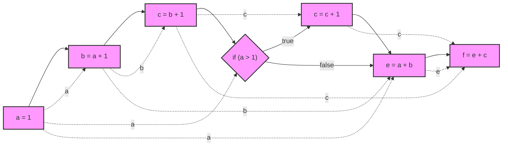
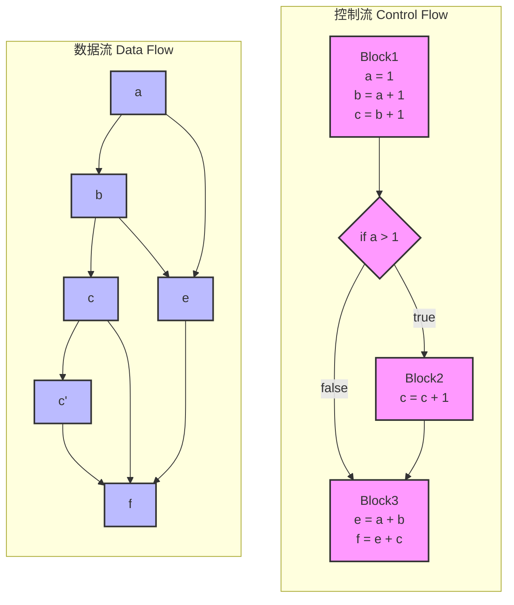
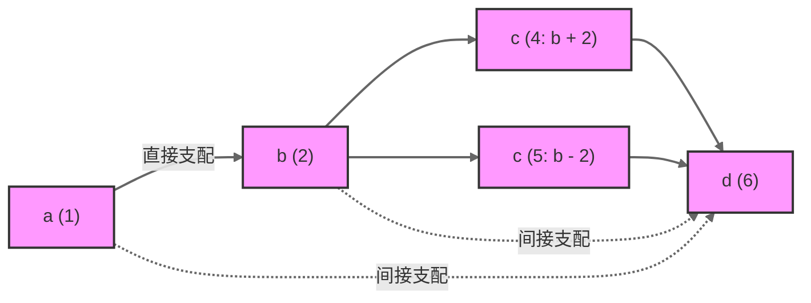
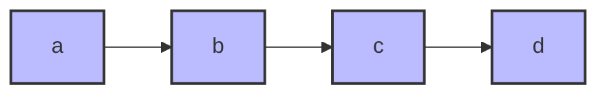
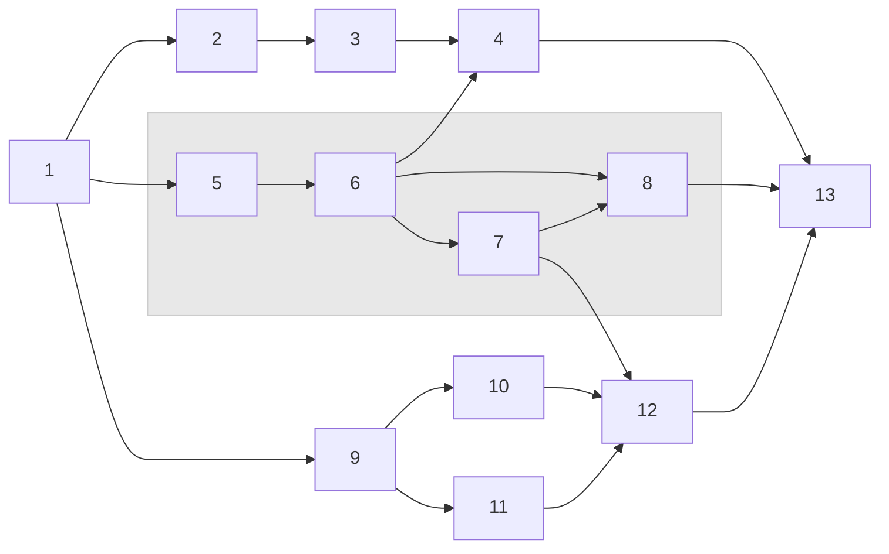

# 第六章：SSA 数据流与跨过程分析

在对闭包和 OOP 的讨论结束后，我们基本可以知道现代编程语言的大部分语法和特性都是可以用 SSA 来表示的。前面的所有内容共同构成了我们后续讨论的基础。

那么，接下来我们就会进一步讨论静态分析在 SSA 视角下将会变的多简单。

:::tip 本章目标

基本了解 SSA 视角下的数据流分析和跨过程分析。

知道 Yak SSA 系统是如何实现数据流分析和跨过程分析，他们的表现如何。

:::

import TOCInline from '@theme/TOCInline';
import Math, { BlockMath, InlineMath } from '@site/src/components/Math';

<TOCInline toc={toc} />

---

## 数据流基本概念

在本章开始，我们需要重温静态分析中的两个重要且令人头疼的话题，数据流和跨过程分析。并且结合我们前面讨论的 SSA 系统，来讨论这两个话题。读者可以很容易发现这两个话题在 SSA 系统将变的非常具象。

### 数据流与控制流分离

#### 定义

首先是数据流与控制流问题，一般来说数据流定义为变量和数据依赖边的组合。

- **数据流(Data Flow)**: 描述数据如何在程序中流动和转换
  - 可以表示为: <InlineMath math="DF = (V, E)" />
  - 其中 <InlineMath math="V" /> 是变量集合
  - <InlineMath math="E" /> 是数据依赖边集合

- **控制流(Control Flow)**: 描述程序执行的路径和顺序
  - 可以表示为: <InlineMath math="CF = (B, T)" />
  - 其中 <InlineMath math="B" /> 是基本块集合
  - <InlineMath math="T" /> 是转移边集合

上述案例结合下面代码大家可以更容易理解控制流和数据流

```go
a = 1;
b = a + 1;
c = b + 1;
if (a > 1) {
    c = c + 1;
}
e = a + b;
f = e + c;
```

我们把上述代码案例制作一个流程图，来同时包含控制流和数据流，也最接近人类理解的代码执行流程。



在这个图中，我们发现，数据流和控制流是混合在一起的，通过棱型来区分 `IF` 分支。

1. 实线表示控制流
2. 虚线表示数据流（变量之间直接连接）

接下来，我们尝试分离上述图中的数据流和控制流，把它分成两个图。



在用户阅读完分离图之后：


:::note 控制流与数据流的区别
控制流和数据流是程序分析中两个基本但截然不同的概念。它们分别描述了程序的不同方面：控制流关注"程序执行的路径"，而数据流关注"数据的传播和转换"。
:::

让我们从形式化的角度来详细解释：

1. **控制流图 (Control Flow Graph, CFG)**

<BlockMath math={`
CFG = (B, T) \\\\
其中：\\\\
B = \\{b_1, b_2, ..., b_n\\} \\text{ 是基本块的集合} \\\\
T \\subseteq B \\times B \\text{ 是基本块之间的转移边集合}
`} />

在示例代码中：
- <InlineMath math="b_1" /> 包含了 `a = 1; b = a + 1; c = b + 1` 这些顺序执行的语句
- <InlineMath math="b_2" /> 包含了 `c = c + 1`
- <InlineMath math="b_3" /> 包含了 `e = a + b; f = e + c`
- 转移边 <InlineMath math="T" /> 包含了条件跳转和顺序执行的边

2. **数据流图 (Data Flow Graph, DFG)**

<BlockMath math={`
DFG = (V, E) \\\\
其中：\\\\
V = \\{v_1, v_2, ..., v_m\\} \\text{ 是变量的集合} \\\\
E \\subseteq V \\times V \\text{ 是数据依赖边的集合}
`} />

在示例代码中：
- <InlineMath math="V" /> 包含了变量 `{a, b, c, e, f}`
- 数据依赖边 <InlineMath math="E" /> 表示变量间的依赖关系，如 `a → b` 表示 `b` 的计算依赖于 `a`

在示例代码中，我们可以观察到：
1. 变量 `c` 在控制流的不同路径上有不同的定值（`c = b + 1` 和 `c = c + 1`）
2. 最终的变量 `f` 依赖于多个变量（`a`、`b`、`c`、`e`）的值
3. 控制流决定了 `c` 的实际值，进而影响到 `f` 的计算结果

这种控制流和数据流的交织关系，正是后续我们要讨论的 SSA 重要话题。

:::danger 重要提示

在很多不熟悉静态代码分析的读者眼里，他其实并不知道控制流和数据流是两个完全不同的概念，而是习惯性的把控制流和数据流混为一谈。

当然也并不是说必须去分离控制流和数据流，毕竟在 “代码属性图” 或 “节点之海” 中，控制关系和数据关系又被放在了一起。

:::

### 数据流中的支配关系

在接下来的内容中，我们重点将会讨论数据节点（变量）的支配问题。

数据流分析中，变量支配是一个非常重要的概念，他描述了变量之间的依赖关系，我们以 <InlineMath math="Dom(x, y)" /> 来表示变量 <InlineMath math="x" /> 支配变量 <InlineMath math="y" />。

<BlockMath math={`
对于变量\\ x\\ 和\\ y，如果：\\\\
Dom(x,\\ y)\\ \\iff\\ \\text{所有到达\\ y\\ 的路径都必须经过\\ x}
`} />

我们可以进一步形式化定义支配关系：

<BlockMath math={`
Dom(x,\\ y)\\ =\\ \\begin{cases}
true\\ &\\ \\text{若\\ x\\ 支配\\ y}\\ \\\\
false\\ &\\ \\text{其他情况}
\\end{cases}
`} />

其中：
- <InlineMath math="x" /> 是支配者(dominator)
- <InlineMath math="y" /> 是被支配者(dominee)

在深入思考，我们认为支配应该包含直接支配和间接支配两种，因此我们定义了三种支配关系：


1. **一般支配关系**

<BlockMath math={`
Dom(x, y) \\iff \\text{所有到达 y 的路径都必须经过 x}
`} />

2. **直接支配关系**

直接支配关系描述了两个变量之间最直接的依赖关系，没有任何中间变量。形式化定义如下：

<BlockMath math={`
iDom(x, y) \\iff \\begin{cases}
Dom(x, y) \\land \\\\
\\neg\\exists z(Dom(x, z) \\land Dom(z, y)) \\land \\\\
Connected(x, y)
\\end{cases}
`} />

其中：
- <InlineMath math="Dom(x, y)" /> 表示 x 支配 y
- <InlineMath math="\neg\exists z(Dom(x, z) \land Dom(z, y))" /> 表示不存在中间节点 z 同时被 x 支配且支配 y
- <InlineMath math="Connected(x, y)" /> 表示 x 和 y 在数据流图中直接相连

3. **间接支配关系**

<BlockMath math={`
indirectDom(x, y) \\iff \\begin{cases}
Dom(x, y) \\land \\\\
\\exists z(Dom(x, z) \\land Dom(z, y))
\\end{cases}
`} />


让我们通过一个具体的代码示例来理解上述的内容：

```go
a = input()      // 1
b = a + 1        // 2
if a > 0 {       // 3
    c = b + 2    // 4
} else {
    c = b - 2    // 5
}
d = c * 2        // 6
```

我们可以绘制这段代码的数据流图和支配关系：



上述支配关系有点奇怪，因为 IF 分支的存在，导致有两个 `C` 节点。但是在 “变量” 的角度来说，我们应该合并 C，我们会只出来的支配关系应该如下：



:::caution 注意

上述图示中，我们只保留了变量 C，这显然是看着非常别扭的，我们习惯了 SSA 思路之后，上述图显然是不合适的，我们后续就要解决这个问题

:::

接下来，我们再来讨论另一个案例，这是一个易错点。

```java
a = input()
b = input()
c = a + b
```

这种情况下，变量 `c` 同时依赖于 `a` 和 `b`，但是并不能说 `a` 支配 `c`，或者也不能说 `b` 支配 `c`。

`a` 和 `b` 仅仅是 `c` 的前继节点。


### 数据节点（变量）支配边界

在用户了解完支配问题之后，接下来我们提出一个问题，“一个数据节点的支配的范围有多大？”

要回答这个问题，我们需要定义一个概念叫支配边界。考虑任何离开块 B 的路径。最初路径上的块由 B 支配。最终到达一个不由 B 支配的块。除非路径返回到 B，否则之后的所有块都不受 B 支配。不被 B 支配的第一个块是重要的，因为它指示了 B 支配的块的范围，并使用有关 B 中的计算的信息指示了优化的限制。考虑到所有路径，拥有该特征的块的集合称为支配 B 的边界。

让我们首先给出支配边界的形式化定义：

<BlockMath math={`
DF(X) = \\{Y | \\exists Z \\in Dom(X) \\text{ such that } Y \\text{ is an immediate successor of } Z \\text{ and } X \\not\\in Dom(Y)\\}
`} />

其中：
- <InlineMath math={"DF(X)"} /> 表示节点X的支配边界
- <InlineMath math={"Dom(X)"} /> 表示被X支配的节点集合
- Y是X的支配边界中的一个节点
- Z是被X支配的某个节点
- Y是Z的直接后继节点
- X不支配Y

让我们用一个具体的例子来说明：



我们给出图中各节点的支配边界分析表格：
| 节点 | 支配的节点集合 Dom(X) | 直接后继节点 | 支配边界 DF(X) |
|-----|-------------------|------------|-------------|
| 1 | \{1,2,3,4,5,6,7,8,9,10,11,12,13\} | \{2,5,9\} | ∅ |
| 2 | \{2,3\} | \{3\} | \{4\} |
| 3 | \{3\} | \{4\} | \{4\} |
| 4 | \{4\} | \{13\} | \{13\} |
| 5 | \{5,6,7,8\} | \{6\} | \{4,12,13\} |
| 6 | \{6,7,8\} | \{4,7,8\} | \{4,12,13\} |
| 7 | \{7\} | \{8,12\} | \{8,12\} |
| 8 | \{8\} | \{13\} | \{13\} |
| 9 | \{9,10,11\} | \{10,11\} | \{12\} |
| 10 | \{10\} | \{12\} | \{12\} |
| 11 | \{11\} | \{12\} | \{12\} |
| 12 | \{12\} | \{13\} | \{13\} |
| 13 | \{13\} | ∅ | ∅ |


### 数据流与 UD(DU) 链

### 定义跨过程分析

## 数据流的跨过程分析

### 基础话题：通过函数调用跨过程

### 进阶话题：通过闭包跨过程

### 进阶话题：广义跨过程定义

## 遍历数据流

### UD(DU) 链与分析方向

### 自顶向下：从定义(Def)到使用(Use)

### 自底向上：从使用(Use)到定义(Def)


