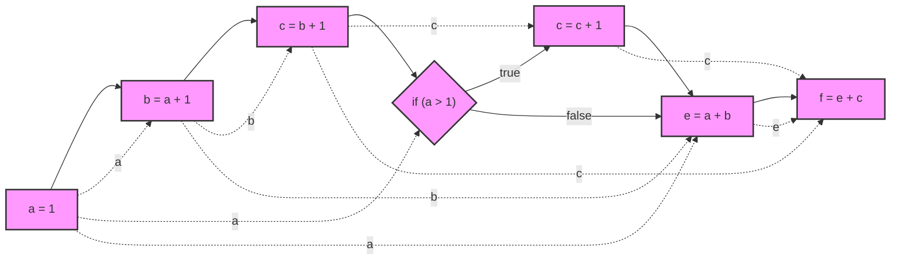
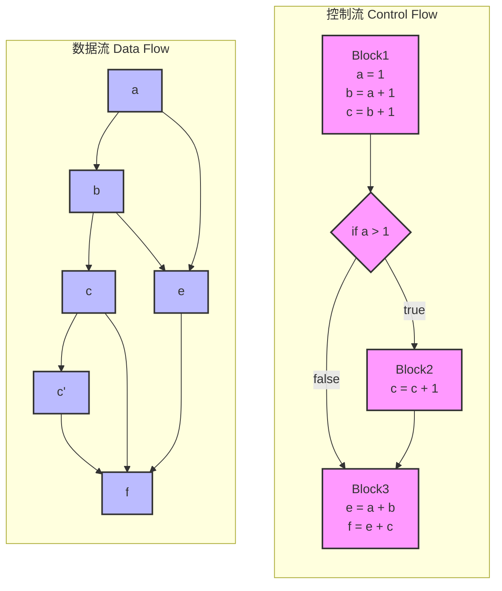

# 第六章：SSA 数据流与跨过程分析

在对闭包和 OOP 的讨论结束后，我们基本可以知道现代编程语言的大部分语法和特性都是可以用 SSA 来表示的。前面的所有内容共同构成了我们后续讨论的基础。

那么，接下来我们就会进一步讨论静态分析在 SSA 视角下将会变的多简单。

:::tip 本章目标

基本了解 SSA 视角下的数据流分析和跨过程分析。

知道 Yak SSA 系统是如何实现数据流分析和跨过程分析，他们的表现如何。

:::

import TOCInline from '@theme/TOCInline';
import Math, { BlockMath, InlineMath } from '@site/src/components/Math';

<TOCInline toc={toc} />

---

## 数据流基本概念

在本章开始，我们需要重温静态分析中的两个重要且令人头疼的话题，数据流和跨过程分析。并且结合我们前面讨论的 SSA 系统，来讨论这两个话题。读者可以很容易发现这两个话题在 SSA 系统将变的非常具象。

### 数据流与控制流分离

#### 定义

首先是数据流与控制流问题，一般来说数据流定义为变量和数据依赖边的组合。

- **数据流(Data Flow)**: 描述数据如何在程序中流动和转换
  - 可以表示为: <InlineMath math="DF = (V, E)" />
  - 其中 <InlineMath math="V" /> 是变量集合
  - <InlineMath math="E" /> 是数据依赖边集合

- **控制流(Control Flow)**: 描述程序执行的路径和顺序
  - 可以表示为: <InlineMath math="CF = (B, T)" />
  - 其中 <InlineMath math="B" /> 是基本块集合
  - <InlineMath math="T" /> 是转移边集合

上述案例结合下面代码大家可以更容易理解控制流和数据流

```go
a = 1;
b = a + 1;
c = b + 1;
if (a > 1) {
    c = c + 1;
}
e = a + b;
f = e + c;
```

我们把上述代码案例制作一个流程图，来同时包含控制流和数据流，也最接近人类理解的代码执行流程。



在这个图中，我们发现，数据流和控制流是混合在一起的，通过棱型来区分 `IF` 分支。

1. 实线表示控制流
2. 虚线表示数据流（变量之间直接连接）

接下来，我们尝试分离上述图中的数据流和控制流，把它分成两个图。



在用户阅读完分离图之后：


:::note 控制流与数据流的区别
控制流和数据流是程序分析中两个基本但截然不同的概念。它们分别描述了程序的不同方面：控制流关注"程序执行的路径"，而数据流关注"数据的传播和转换"。
:::

让我们从形式化的角度来详细解释：

1. **控制流图 (Control Flow Graph, CFG)**

<BlockMath math={`
CFG = (B, T) \\\\
其中：\\\\
B = \\{b_1, b_2, ..., b_n\\} \\text{ 是基本块的集合} \\\\
T \\subseteq B \\times B \\text{ 是基本块之间的转移边集合}
`} />

在示例代码中：
- <InlineMath math="b_1" /> 包含了 `a = 1; b = a + 1; c = b + 1` 这些顺序执行的语句
- <InlineMath math="b_2" /> 包含了 `c = c + 1`
- <InlineMath math="b_3" /> 包含了 `e = a + b; f = e + c`
- 转移边 <InlineMath math="T" /> 包含了条件跳转和顺序执行的边

2. **数据流图 (Data Flow Graph, DFG)**

<BlockMath math={`
DFG = (V, E) \\\\
其中：\\\\
V = \\{v_1, v_2, ..., v_m\\} \\text{ 是变量的集合} \\\\
E \\subseteq V \\times V \\text{ 是数据依赖边的集合}
`} />

在示例代码中：
- <InlineMath math="V" /> 包含了变量 `{a, b, c, e, f}`
- 数据依赖边 <InlineMath math="E" /> 表示变量间的依赖关系，如 `a → b` 表示 `b` 的计算依赖于 `a`

在示例代码中，我们可以观察到：
1. 变量 `c` 在控制流的不同路径上有不同的定值（`c = b + 1` 和 `c = c + 1`）
2. 最终的变量 `f` 依赖于多个变量（`a`、`b`、`c`、`e`）的值
3. 控制流决定了 `c` 的实际值，进而影响到 `f` 的计算结果

这种控制流和数据流的交织关系，正是后续我们要讨论的 SSA 重要话题。

:::danger 重要提示

在很多不熟悉静态代码分析的读者眼里，他其实并不知道控制流和数据流是两个完全不同的概念，而是习惯性的把控制流和数据流混为一谈。

当然也并不是说必须去分离控制流和数据流，毕竟在 “代码属性图” 或 “节点之海” 中，控制关系和数据关系又被放在了一起。

:::

### 数据流与 UD(DU) 链

:::note

由于本章主要讨论数据依赖相关内容，所以关于控制流的讨论，我们就暂时不在这里继续深入了。

在控制流中，我们一般讨论支配关系，但是在数据流中，并不适合套用支配的概念，一般讨论 SSA 形式下的使用-定义链（Use-Def Chain）后面统称为 Use-Def 链。

:::tip 使用-定义链

使用-定义链（Use-Def Chain），简称 UD 链，是 SSA 形式下，变量使用点和其定义点之间的连接关系。

:::

### 定义跨过程分析

## 数据流的跨过程分析

### 基础话题：通过函数调用跨过程

### 进阶话题：通过闭包跨过程

### 进阶话题：广义跨过程定义

## 遍历数据流

### UD(DU) 链与分析方向

### 自顶向下：从定义(Def)到使用(Use)

### 自底向上：从使用(Use)到定义(Def)


