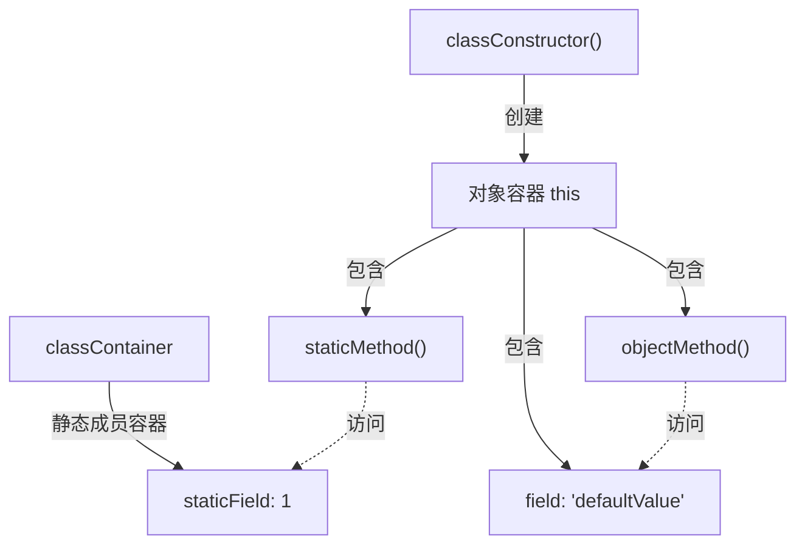

# 第五章：SSA 深水区 - OOP与无类

闭包话题我们在前面进行了非常深入的讨论，在这一章，我们需要重点讨论 OOP 的 SSA 形态。

这个话题非常需要依赖读者对闭包的理解，我们在无类（Classless）系统构建的时候，需要用到闭包的各种概念来辅助理解修改自身成员和不同容器的值。

import TOCInline from '@theme/TOCInline';
import Math, { BlockMath, InlineMath } from '@site/src/components/Math';

<TOCInline toc={toc} />

--- 

## 无类系统


### 无类系统概念

无类系统（Classless System）是一种不依赖传统类（Class）概念的对象系统，它通过组合原语操作（如闭包、委托、原型）来实现对象行为和状态管理。在这种系统中，对象是由一组属性和行为直接组合而成，而不是通过类的实例化来创建。

:::tip 核心特征
无类系统的核心在于：它将对象视为一个独立的实体，而不是某个类的实例。这种设计思想与 SSA 的理念高度契合，因为它们都致力于简化和明确化数据流动。
:::

:::note 引用资料

**核心书籍**

1. **《Prototype-based Programming: Concepts, Languages, and Applications》** (1999)
   - 作者：James Noble, Antero Taivalsaari, Ivan Moore
   - 出版社：Springer
   - 这是一本专门讨论原型编程的重要著作，详细介绍了无类系统的概念、语言实现和应用案例。

**重要论文和研究**

1. **《Self: The Power of Simplicity》** (1987)
   - 作者：David Ungar, Randall B. Smith
   - 发表于：OOPSLA '87
   - 这篇论文介绍了 Self 语言，这是最早的原型编程语言之一，对后续的无类系统研究产生了深远影响。

2. **《Prototypes with Multiple Dispatch: An Expressive and Dynamic Object Model》** (2005)
   - 作者：Craig Chambers
   - 这篇论文探讨了在无类系统中使用多重分派的可能性。

**理论基础**

无类系统的理论基础主要建立在以下几个概念之上：

1. **原型委托（Prototype Delegation）**
   可以用以下数学表达式来表示：

<BlockMath math="O_1 \rightarrow O_2 \rightarrow O_3 \rightarrow \text{null}" />

   其中，<InlineMath math="O_1" /> 委托给 <InlineMath math="O_2" />，以此类推。

2. **对象组合（Object Composition）**
   表示为：

<BlockMath math="O = \{p_1, p_2, ..., p_n\} \cup \{m_1, m_2, ..., m_k\}" />

   其中，<InlineMath math="p_i" /> 是属性，<InlineMath math="m_j" /> 是方法。

:::

### 为什么 SSA 需要无类系统

:::note 无类系统在 SSA 中的必要性

无类系统理论中的原型委托和组合这种概念本质上是行为和关系的描述，并不需要传统 OOP 那样需要引入新的概念来描述。

秉持“Less is More”的理念，使用无类系统表达类似传统 OOP 的程序行为在通用 SSA 编译中的还是很有必要讨论的。

:::

本质上，我们并不是要完全不讨论传统基于类和对象的 OOP 系统，而是要探讨在不引入类和对象这个概念的前提下，如何等效表达传统 OOP 系统中的行为和关系。

为此，我们引入无类系统，并且使用无类中的原型委托和组合关系来表达 OOP 中的类似行为。这个操作的核心思路是 **通过减少概念的数量来增加系统的可理解性和可优化性**。

为了读者能更好的理解我们上述提出的观点。我们使用下面的案例来说明这么做的真正意义。

#### 案例：无类系统表达 OOP 行为

我们使用一个语言（以 JavaScript 为例），他支持完整的闭包系统（见第四章），这门语言中包含一个“容器”，容器可以容纳任何值。

假定在 JavaScript 尤其是我们后续案例中，不包含任何 class 这个概念。

我们编写了如下一段代码：

```javascript
classContainer = {
   staticField: 1,
};
classConstructor = () => {
   this = {
      staticMethod: () => {
         println(classContainer.staticField)
      },
      field: "defaultValue",
      objectMethod: () => {
         println(this.field + " " + "world")
      }
   }
   return this
}

object = classConstructor()
object.objectMethod()
```

这段代码十分的精妙，我们发现，尽管我们在我们不使用 `class` 这个概念情况下，仍然可以表达出，一个类中的静态成员，对象的创建（闭包），对象的方法调用等一系列 OOP 特征。

我们逐步分析上面内容的展示形态：

