# 第五章：SSA 中的 OOP 实现：无类系统与原型委托

闭包话题我们在前面进行了非常深入的讨论，在这一章，本章将探讨如何在 SSA 框架下，通过无类系统和原型委托来建模 OOP 的核心概念，并最终实现 OOP 代码的编译和静态分析。

我们在无类（Classless）系统构建的时候，需要用到闭包来存储生成的对象，并且在案例中也会涉及到闭包核心功能，所以我们把基于无类系统的 OOP 构建放在闭包讨论之后。

import TOCInline from '@theme/TOCInline';
import Math, { BlockMath, InlineMath } from '@site/src/components/Math';

<TOCInline toc={toc} />

--- 

## 无类系统


### 无类系统概念

无类系统（Classless System）是一种不依赖传统类（Class）概念的对象系统，它通过组合原语操作（如闭包、委托、原型）来实现对象行为和状态管理。在这种系统中，对象是由一组属性和行为直接组合而成，而不是通过类的实例化来创建。

:::tip 核心特征
无类系统的核心在于：它将对象视为一个独立的实体，而不是某个类的实例。这种设计思想与 SSA 的理念高度契合，因为它们都致力于简化和明确化数据流动。
:::

:::note 引用资料

**核心书籍**

1. **《Prototype-based Programming: Concepts, Languages, and Applications》** (1999)
   - 作者：James Noble, Antero Taivalsaari, Ivan Moore
   - 出版社：Springer
   - 这是一本专门讨论原型编程的重要著作，详细介绍了无类系统的概念、语言实现和应用案例。

**重要论文和研究**

1. **《Self: The Power of Simplicity》** (1987)
   - 作者：David Ungar, Randall B. Smith
   - 发表于：OOPSLA '87
   - 这篇论文介绍了 Self 语言，这是最早的原型编程语言之一，对后续的无类系统研究产生了深远影响。

2. **《Prototypes with Multiple Dispatch: An Expressive and Dynamic Object Model》** (2005)
   - 作者：Craig Chambers
   - 这篇论文探讨了在无类系统中使用多重分派的可能性。

**理论基础**

无类系统的理论基础主要建立在以下几个概念之上：

1. **原型委托（Prototype Delegation）**
   可以用以下数学表达式来表示：

<BlockMath math="O_1 \rightarrow O_2 \rightarrow O_3 \rightarrow \text{null}" />

   其中，<InlineMath math="O_1" /> 委托给 <InlineMath math="O_2" />，以此类推。

2. **对象组合（Object Composition）**
   表示为：

<BlockMath math="O = \{p_1, p_2, ..., p_n\} \cup \{m_1, m_2, ..., m_k\}" />

   其中，<InlineMath math="p_i" /> 是属性，<InlineMath math="m_j" /> 是方法。

:::

### 为什么 SSA 需要无类系统

:::note 无类系统在 SSA 中的必要性

无类系统理论中的原型委托和组合这种概念本质上是行为和关系的描述，并不需要传统 OOP 那样需要引入新的概念来描述。

秉持“Less is More”的理念，使用无类系统表达类似传统 OOP 的程序行为在通用 SSA 编译中的还是很有必要讨论的。

:::

本质上，我们并不是要完全不讨论传统基于类和对象的 OOP 系统，而是要探讨在不引入类和对象这个概念的前提下，如何等效表达传统 OOP 系统中的行为和关系。

为此，我们引入无类系统，并且使用无类中的原型委托和组合关系来表达 OOP 中的类似行为。这个操作的核心思路是 **通过减少概念的数量来增加系统的可理解性和可优化性**。

为了读者能更好的理解我们上述提出的观点。我们使用下面的案例来说明这么做的真正意义。

#### 案例：无类系统表达 OOP 行为

我们使用一个语言（以 JavaScript 为例），他支持完整的闭包系统（见第四章），这门语言中包含一个“容器”，容器可以容纳任何值。

假定在 JavaScript 尤其是我们后续案例中，不包含任何 class 这个概念。

我们编写了如下一段代码：

```javascript
classContainer = {
   "staticField": 1,
   "staticMethod": () => {
      return "staticField's value is " + sprint(classContainer.staticField)
   }
};

classConstructor = () => {
   this = {
      "staticContainer":  classContainer,
      "field": "defaultValue",
      "objectMethod": () => {
         println(this.field + " " + "world")
         println("objectMethod is called and staticMethod is called in objectMethod: " + classContainer.staticMethod())
      }
   }
   return this
}

object = classConstructor()
object.objectMethod()
```

这段代码十分的精妙，我们发现，尽管我们在我们不使用 `class` 这个概念情况下，仍然可以表达出，一个类中的静态成员，对象的创建（闭包），对象的方法调用等一系列 OOP 特征。

我们可以看到三个核心组件：静态容器、对象工厂和实例对象。让我们通过一个更紧凑的方式来分析它们的关系和实现。上述代码解读如下：

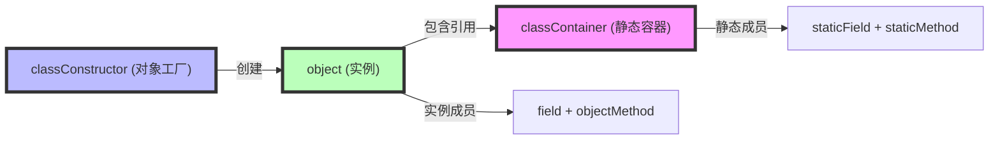

在上述代码中，包含一些重要的机制：

1. **静态成员管理**
<BlockMath math="C_{static} = \{f_s, m_s\} \text{ where } f_s \text{ is staticField, } m_s \text{ is staticMethod}" />

2. **实例结构**
<BlockMath math="O_{instance} = \{C_{static}\} \cup \{f_i, m_i\} \text{ where } f_i \text{ is field, } m_i \text{ is objectMethod}" />

:::tip 设计要点
- 静态容器(`classContainer`)作为单一共享实例，这个设计十分符合类中的静态成员的定义
- 实例对象通过直接引用静态容器实现静态成员访问
- 闭包确保了实例成员的独立性
:::

这种实现方式具有以下优势：
1. 状态共享更加显式（通过 `staticContainer` 引用）
2. 对象结构更加清晰（实例成员与静态成员明确分离）
3. 完全符合 SSA 的单一赋值原则

我们构造的上面无类系统实现提供了传统 OOP 的核心特性，同时保持了代码的简洁性和数据流的清晰性。它展示了如何在不使用类的情况下，通过闭包和对象组合来实现对象系统的核心功能。

接下来我们深入解读一下上面代码中在无类概念中的一些细节：

## 原型委托与继承

### OOP 中的继承是什么？

在传统的面向对象编程中，继承是一种代码重用和建立类型层次结构的机制。它允许一个类（子类）基于另一个类（父类）来定义，继承父类的属性和方法。

:::danger 限定条件

注意，我们在这儿的讨论只认为父类只有一个。在某一些语言（C++）中，父类可以有多个。

:::

:::tip 继承的本质
继承本质上是一种代码复用机制，它建立了两个重要的关系：
1. **结构复用**：子类获得父类的属性和方法
2. **行为替换**：子类可以重写（override）父类的方法
:::

让我们用数学语言来形式化地描述继承关系：

<BlockMath math="C_{child} = C_{parent} \cup \Delta" />

其中：
- <InlineMath math="C_{child}"/> 表示子类
- <InlineMath math="C_{parent}"/> 表示父类
- <InlineMath math="\Delta"/> 表示子类特有的成员

在传统 OOP 中，这种关系通常通过类的继承机制来实现：

```javascript
class Parent {
    parentMethod() { return "parent" }
}

class Child extends Parent {
    childMethod() { return "child" }
}
```

上述案例非常简单，接下来我们在深入讨论一些“多态”问题：


:::tip 继承的两个核心特性
1. **扩展性**：子类可以添加新的属性和方法
2. **多态性**：子类可以重新定义父类的方法行为
:::

让我们用更形式化的方式来描述这种关系：

<BlockMath math="C_{child} = (C_{parent} - O) \cup N \cup R" />

其中：
- <InlineMath math="C_{child}"/> 表示子类的完整定义
- <InlineMath math="C_{parent}"/> 表示父类的所有成员
- <InlineMath math="O"/> 表示被子类覆盖的父类成员集合
- <InlineMath math="N"/> 表示子类新增的成员集合
- <InlineMath math="R"/> 表示子类重写后的成员集合

让我们通过一个具体的例子来说明：

```javascript
class Shape {
    constructor(color) {
        this.color = color;
    }
    
    draw() {
        return "Drawing a shape";
    }
    
    getColor() {
        return this.color;
    }
}

class Circle extends Shape {
    constructor(color, radius) {
        super(color);           // 调用父类构造器
        this.radius = radius;   // 新增属性
    }
    
    draw() {                    // 覆盖父类方法
        return "Drawing a circle";
    }
    
    getArea() {                 // 新增方法
        return Math.PI * this.radius * this.radius;
    }
}
```

在这个例子中：
- <InlineMath math="N"/> = `{radius, getArea}`
- <InlineMath math="O"/> = `{draw}`
- <InlineMath math="R"/> = `{新的draw实现}`

我们可以用类 UML 图来可视化这种关系：

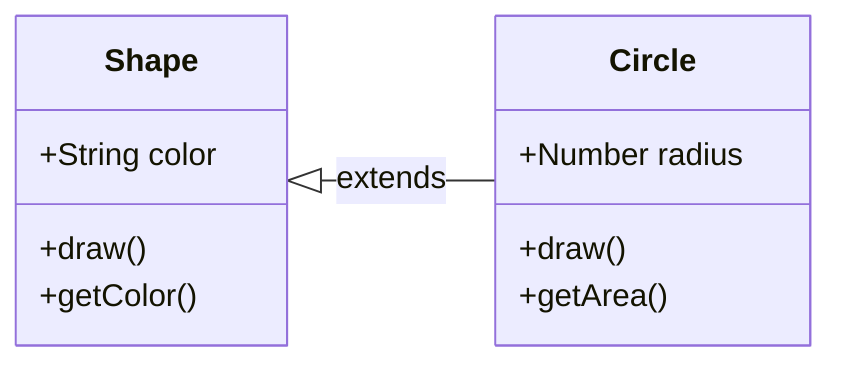

:::warning 继承的注意事项
1. 子类不能删除父类的成员，只能覆盖
2. 子类方法在覆盖父类方法时，需要保持方法签名的一致性
3. 构造函数通常需要显式调用父类的构造函数
:::

### 原型委托指的是什么？

“原型委托”是我们在无类系统中需要使用到的一个概念。

:::tip 原型委托的定义

原型委托是一种对象行为共享的机制，它基于对象之间的委托关系，而不是类之间的继承关系。当一个对象无法响应某个请求时，该请求会被转发给该对象的原型。

:::info 原型委托的核心思想
原型委托的核心是：当一个对象无法处理某个请求时，将该请求转发给它的原型对象。这种机制可以构建出一个委托链，实现类似继承的行为。

:::

#### 工作机制

让我们用数学语言来形式化地描述原型委托：

<BlockMath math="O_{result} = \begin{cases} 
O_{self}[p], & \text{if } p \in O_{self} \\
O_{prototype}[p], & \text{if } p \in O_{prototype} \\
undefined, & \text{otherwise}
\end{cases}" />

其中：
- <InlineMath math="O_{result}"/> 表示属性访问的结果
- <InlineMath math="O_{self}"/> 表示当前对象
- <InlineMath math="O_{prototype}"/> 表示原型对象
- <InlineMath math="p"/> 表示要访问的属性


### 用原型委托来实现“继承”

在无类系统中，我们可以通过原型委托（Prototype Delegation）来实现与传统继承相似的效果。这种方式更加灵活，且概念更加简单。

让我们看一个具体的实现：

```javascript
// 创建父对象工厂
parentConstructor = () => {
    this = {
        "parentField": "parent value",
        "parentMethod": function() {
            return "parent method: " + this.parentField
        }
    }
    return this
}

// 创建子对象工厂
childConstructor = () => {
    // 创建父对象
    const parent = parentConstructor()
    
    // 创建子对象，并设置原型委托
    const child = {
        "childField": "child value",
        "childMethod": function() {
            return "child method: " + this.childField
        }
    }

    // 设置委托关系
    return new Proxy(child, {
        get: function(target, property) {
            return property in target ? 
                   target[property] : 
                   parent[property]
        }
    })
}

// 使用示例
const instance = childConstructor()
console.log(instance.childMethod())    // 访问子对象方法
console.log(instance.parentMethod())   // 通过委托访问父对象方法
```

这种实现可以用以下图示来表示：

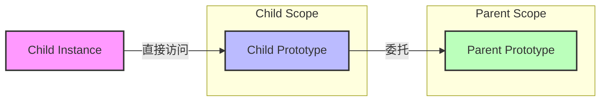

### 对比“继承”和“原型委托”

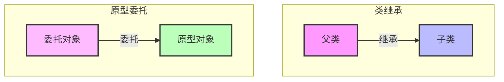

一般的语言中，如果要实现原型委托需要实现一个智能的 `lookup` 或者 `get` 函数，这个函数可以按照委托的算法来寻找真正的成员。在真实的过程中，这都是一个 “动态分派” 的过程。这个和传统 OOP 有很明显的区别。

虽然在 JVM 中，invokevirtual 也是动态分派，但是他是在 JVM 执行中按照具体类型到成员函数的静态表（在编译时确定）实现的，这个和原型委托的实现方式有很大区别。

#### JVM 中的 invokevirtual

我们以一个案例来说明：

```java
public class StaticDispatch {

    static abstract class Human { }
    static class Man extends Human { }
    static class Woman extends Human { }
    static class Child extends Human { }

    public void say(Human human) {
        System.out.println("human");
    }

    public void say(Man man) {
        System.out.println("man");
    }

    public void say(Woman woman) {
        System.out.println("woman");
    }

    public void say(Child child) {
        System.out.println("child");
    }

   public static void main(String[] args) {
      Human man = new Man();
      Human woman = new Woman();
      Human child = new Child();

      StaticDispatch dispatch = new StaticDispatch();
      dispatch.say(man);
      dispatch.say(woman);
      dispatch.say(child);
   }
}
```

上面代码非常好理解，执行 `javac` 和 `javap -v` 后我们可以发现：

```
Classfile /Users/v1ll4n/Projects/java/StaticDispatch.class
  Last modified 2024年12月11日; size 1092 bytes
  SHA-256 checksum 8bd647ebe2d81f43ac15977d9c16ddfc837031fb2438c45aaeb24cfeafcc8a1a
  Compiled from "StaticDispatch.java"
public class StaticDispatch
  minor version: 0
  major version: 65
  flags: (0x0021) ACC_PUBLIC, ACC_SUPER
  this_class: #36                         // StaticDispatch
  super_class: #2                         // java/lang/Object
  interfaces: 0, fields: 0, methods: 6, attributes: 3
Constant pool:
   #1 = Methodref          #2.#3          // java/lang/Object."<init>":()V
   #2 = Class              #4             // java/lang/Object
   #3 = NameAndType        #5:#6          // "<init>":()V
   #4 = Utf8               java/lang/Object
   #5 = Utf8               <init>
   #6 = Utf8               ()V
   #7 = Fieldref           #8.#9          // java/lang/System.out:Ljava/io/PrintStream;
   #8 = Class              #10            // java/lang/System
   #9 = NameAndType        #11:#12        // out:Ljava/io/PrintStream;
  #10 = Utf8               java/lang/System
  #11 = Utf8               out
  #12 = Utf8               Ljava/io/PrintStream;
  #13 = String             #14            // human
  #14 = Utf8               human
  #15 = Methodref          #16.#17        // java/io/PrintStream.println:(Ljava/lang/String;)V
  #16 = Class              #18            // java/io/PrintStream
  #17 = NameAndType        #19:#20        // println:(Ljava/lang/String;)V
  #18 = Utf8               java/io/PrintStream
  #19 = Utf8               println
  #20 = Utf8               (Ljava/lang/String;)V
  #21 = String             #22            // man
  #22 = Utf8               man
  #23 = String             #24            // woman
  #24 = Utf8               woman
  #25 = String             #26            // child
  #26 = Utf8               child
  #27 = Class              #28            // StaticDispatch$Man
  #28 = Utf8               StaticDispatch$Man
  #29 = Methodref          #27.#3         // StaticDispatch$Man."<init>":()V
  #30 = Class              #31            // StaticDispatch$Woman
  #31 = Utf8               StaticDispatch$Woman
  #32 = Methodref          #30.#3         // StaticDispatch$Woman."<init>":()V
  #33 = Class              #34            // StaticDispatch$Child
  #34 = Utf8               StaticDispatch$Child
  #35 = Methodref          #33.#3         // StaticDispatch$Child."<init>":()V
  #36 = Class              #37            // StaticDispatch
  #37 = Utf8               StaticDispatch
  #38 = Methodref          #36.#3         // StaticDispatch."<init>":()V
  #39 = Methodref          #36.#40        // StaticDispatch.say:(LStaticDispatch$Human;)V
  #40 = NameAndType        #41:#42        // say:(LStaticDispatch$Human;)V
  #41 = Utf8               say
  #42 = Utf8               (LStaticDispatch$Human;)V
  #43 = Utf8               Code
  #44 = Utf8               LineNumberTable
  #45 = Utf8               (LStaticDispatch$Man;)V
  #46 = Utf8               (LStaticDispatch$Woman;)V
  #47 = Utf8               (LStaticDispatch$Child;)V
  #48 = Utf8               main
  #49 = Utf8               ([Ljava/lang/String;)V
  #50 = Utf8               SourceFile
  #51 = Utf8               StaticDispatch.java
  #52 = Utf8               NestMembers
  #53 = Class              #54            // StaticDispatch$Human
  #54 = Utf8               StaticDispatch$Human
  #55 = Utf8               InnerClasses
  #56 = Utf8               Man
  #57 = Utf8               Woman
  #58 = Utf8               Child
  #59 = Utf8               Human
{
  public StaticDispatch();
    descriptor: ()V
    flags: (0x0001) ACC_PUBLIC
    Code:
      stack=1, locals=1, args_size=1
         0: aload_0
         1: invokespecial #1                  // Method java/lang/Object."<init>":()V
         4: return
      LineNumberTable:
        line 1: 0

  public void say(StaticDispatch$Human);
    descriptor: (LStaticDispatch$Human;)V
    flags: (0x0001) ACC_PUBLIC
    Code:
      stack=2, locals=2, args_size=2
         0: getstatic     #7                  // Field java/lang/System.out:Ljava/io/PrintStream;
         3: ldc           #13                 // String human
         5: invokevirtual #15                 // Method java/io/PrintStream.println:(Ljava/lang/String;)V
         8: return
      LineNumberTable:
        line 9: 0
        line 10: 8

  public void say(StaticDispatch$Man);
    descriptor: (LStaticDispatch$Man;)V
    flags: (0x0001) ACC_PUBLIC
    Code:
      stack=2, locals=2, args_size=2
         0: getstatic     #7                  // Field java/lang/System.out:Ljava/io/PrintStream;
         3: ldc           #21                 // String man
         5: invokevirtual #15                 // Method java/io/PrintStream.println:(Ljava/lang/String;)V
         8: return
      LineNumberTable:
        line 13: 0
        line 14: 8

  public void say(StaticDispatch$Woman);
    descriptor: (LStaticDispatch$Woman;)V
    flags: (0x0001) ACC_PUBLIC
    Code:
      stack=2, locals=2, args_size=2
         0: getstatic     #7                  // Field java/lang/System.out:Ljava/io/PrintStream;
         3: ldc           #23                 // String woman
         5: invokevirtual #15                 // Method java/io/PrintStream.println:(Ljava/lang/String;)V
         8: return
      LineNumberTable:
        line 17: 0
        line 18: 8

  public void say(StaticDispatch$Child);
    descriptor: (LStaticDispatch$Child;)V
    flags: (0x0001) ACC_PUBLIC
    Code:
      stack=2, locals=2, args_size=2
         0: getstatic     #7                  // Field java/lang/System.out:Ljava/io/PrintStream;
         3: ldc           #25                 // String child
         5: invokevirtual #15                 // Method java/io/PrintStream.println:(Ljava/lang/String;)V
         8: return
      LineNumberTable:
        line 21: 0
        line 22: 8

  public static void main(java.lang.String[]);
    descriptor: ([Ljava/lang/String;)V
    flags: (0x0009) ACC_PUBLIC, ACC_STATIC
    Code:
      stack=2, locals=5, args_size=1
         0: new           #27                 // class StaticDispatch$Man
         3: dup
         4: invokespecial #29                 // Method StaticDispatch$Man."<init>":()V
         7: astore_1
         8: new           #30                 // class StaticDispatch$Woman
        11: dup
        12: invokespecial #32                 // Method StaticDispatch$Woman."<init>":()V
        15: astore_2
        16: new           #33                 // class StaticDispatch$Child
        19: dup
        20: invokespecial #35                 // Method StaticDispatch$Child."<init>":()V
        23: astore_3
        24: new           #36                 // class StaticDispatch
        27: dup
        28: invokespecial #38                 // Method "<init>":()V
        31: astore        4
        33: aload         4
        35: aload_1
        36: invokevirtual #39                 // Method say:(LStaticDispatch$Human;)V
        39: aload         4
        41: aload_2
        42: invokevirtual #39                 // Method say:(LStaticDispatch$Human;)V
        45: aload         4
        47: aload_3
        48: invokevirtual #39                 // Method say:(LStaticDispatch$Human;)V
        51: return
      LineNumberTable:
        line 25: 0
        line 26: 8
        line 27: 16
        line 29: 24
        line 30: 33
        line 31: 39
        line 32: 45
        line 33: 51
}
SourceFile: "StaticDispatch.java"
NestMembers:
  StaticDispatch$Child
  StaticDispatch$Woman
  StaticDispatch$Man
  StaticDispatch$Human
InnerClasses:
  static #56= #27 of #36;                 // Man=class StaticDispatch$Man of class StaticDispatch
  static #57= #30 of #36;                 // Woman=class StaticDispatch$Woman of class StaticDispatch
  static #58= #33 of #36;                 // Child=class StaticDispatch$Child of class StaticDispatch
  static abstract #59= #53 of #36;        // Human=class StaticDispatch$Human of class StaticDispatch
```

在上面的字节码中，我们可以看到几个关键点：

```java
// 编译时期已经确定了方法签名
36: invokevirtual #39                 // Method say:(LStaticDispatch$Human;)V
42: invokevirtual #39                 // Method say:(LStaticDispatch$Human;)V
48: invokevirtual #39                 // Method say:(LStaticDispatch$Human;)V
```

#### 静态分派（编译期）
1. **重载方法的选择**：在编译期间，编译器根据**静态类型**选择方法签名
2. **方法表生成**：编译器为每个类生成一个静态的方法表（vtable）
3. **符号引用解析**：将方法调用解析为具体的方法表索引

#### 动态分派（运行时）
1. **虚方法调用**：`invokevirtual`指令在运行时：
   - 找到对象的实际类型
   - 在该类的方法表中查找对应方法
   - 通过方法表索引直接调用目标方法

在动态分派通过类来找到目标方法，这个只有静态语言可以做到，动态语言中，我们只能通过对象来找到目标方法，这也是原型委派和传统 OOP 不同的一个重要区别。

### 流程对比

上述虽然已经讲的比较清楚了，但是我们看下面两个图就可以很容易找到区别：

#### 原型委派流程图

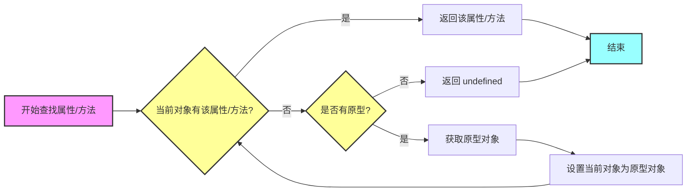

#### 传统 OOP 对象成员调用分发流程

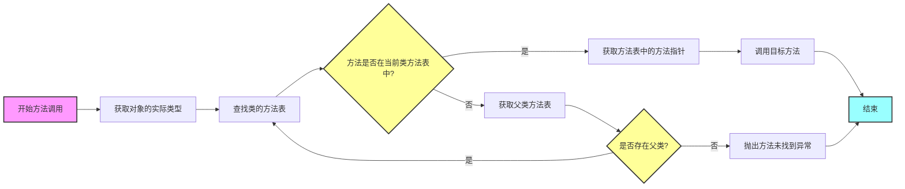

### 形式化算法对比

让我们深入分析这两种不同的成员访问机制，并用形式化的方式来描述它们的算法。

#### 原型委派的形式化算法

:::tip 定义重申

虽然我们在前面已经有过定义，但是为了方便理解，我们再重申一遍：

:::

首先，让我们定义原型委派的核心数据结构：

<BlockMath math={`
\\begin{align*}
& Object = \\{properties, prototype\\} \\\\
& properties = \\{(key_1, value_1), ..., (key_n, value_n)\\} \\\\
& prototype = Object \\cup \\{null\\}
\\end{align*}
`}/>

原型委派的查找算法可以用以下递归函数表示：

<BlockMath math={`
\\begin{align*}
& lookup(obj, key) = \\\\
& \\begin{cases}
obj.properties[key] & \\text{if } key \\in obj.properties \\\\
lookup(obj.prototype, key) & \\text{if } obj.prototype \\neq null \\\\
undefined & \\text{otherwise}
\\end{cases}
\\end{align*}
`}/>

:::tip 算法复杂度
- 时间复杂度：O(d)，其中 d 是原型链的深度
- 空间复杂度：O(1)，不考虑递归调用栈
:::

#### 传统 OOP 的形式化算法

对于传统 OOP，我们首先定义类的方法表结构：

<BlockMath math={`
\\begin{align*}
& Class = \\{methodTable, parentClass\\} \\\\
& methodTable = \\{(name_1, ptr_1), ..., (name_n, ptr_n)\\} \\\\
& Object = \\{type: Class, data\\}
\\end{align*}
`}/>

方法查找算法可以表示为：

<BlockMath math={`
\\begin{align*}
& lookup(obj, methodName) = \\\\
& \\begin{cases}
obj.type.methodTable[methodName] & \\text{if } methodName \\in obj.type.methodTable \\\\
lookup(\\{type: obj.type.parentClass\\}, methodName) & \\text{if } obj.type.parentClass \\neq null \\\\
error & \\text{otherwise}
\\end{cases}
\\end{align*}
`}/>

:::tip 算法复杂度
- 时间复杂度：O(1)，因为方法表通常使用哈希表实现
- 空间复杂度：O(m)，其中 m 是类的方法总数
:::


## SSA 中的无类系统

在 SSA 中，我们需要确保每个变量只被赋值一次，并且数据流动路径清晰可见。原型委托模型在这方面具有天然优势：

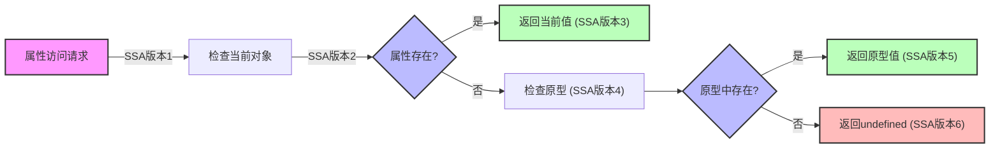

在 SSA 形式中，这种查找过程可以表示为：

<BlockMath math={`
\\begin{align*}
& v_1 = \\text{InitialRequest}(property) \\\\
& v_2 = \\text{CheckCurrentObject}(v_1) \\\\
& v_3 = \\phi(v_2, \\text{CurrentValue}) \\\\
& v_4 = \\text{CheckPrototype}(v_2) \\\\
& v_5 = \\phi(v_4, \\text{PrototypeValue}) \\\\
& v_6 = \\phi(v_3, v_5, \\text{undefined})
\\end{align*}
`}/>

我们观察上述 SSA 格式，发现，每个查找步骤都可能产生新的 SSA 版本，数据流向清晰可追踪，便于进行数据流分析和优化。

具体抽象出的代码如下：

```javascript
// 原型委托在 SSA 中的形式
function lookup(obj, key) {
    // SSA 形式
    let v1 = obj;                    // 初始值
    let v2 = v1[key];               // 直接查找
    let v3 = (v2 !== undefined) ? v2 : null;  // 结果检查
    
    if (v3 === null) {
        let v4 = v1.__proto__;      // 获取原型
        let v5 = v4 ? v4[key] : undefined;  // 原型查找
        return v5;
    }
    return v3;
}
```

### 应用：SSA 无类系统编译 OOP

根据我们在“原型委托”实现“继承”章节展示的内容，我们可以把传统 OOP 代码转换为原型委托模式，然后再编译为 SSA 无类系统，这样就可以在不引入过多新的概念的情况下，实现通用 OOP 代码的编译和静态分析了。

### OOP 到原型委托的转换模型

首先，让我们定义一个形式化的转换模型：

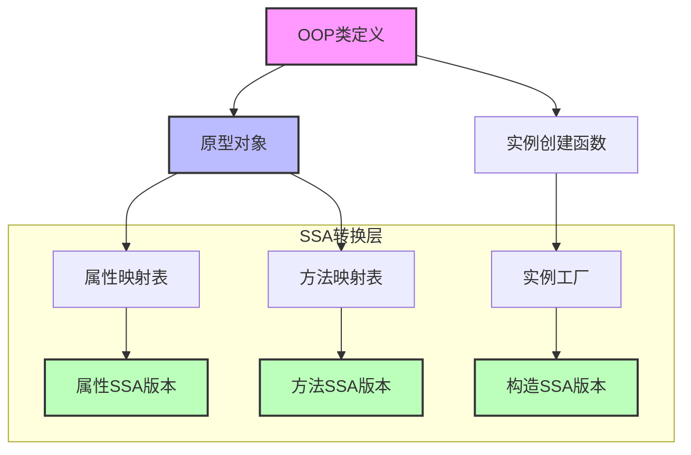

### 编译过程转换算法实现（伪代码）

```javascript
// 扩展的原型链设置算法
function setPrototypeChain(targetObject, parentClass, options = {}) {
    // SSA 版本1：初始验证
    let v1 = validatePrototypeTarget(targetObject);
    
    // SSA 版本2：父类原型获取
    let v2 = getParentPrototype(parentClass);
    
    // SSA 版本3：创建新的原型对象
    let v3 = Object.create(v2, {
        constructor: {
            value: targetObject.constructor,
            writable: true,
            configurable: true
        }
    });
    
    // SSA 版本4：属性合并
    let v4 = mergeProperties(v3, v1, options);
    
    // SSA 版本5：方法继承处理
    let v5 = inheritMethods(v4, v2, options);
    
    // SSA 版本6：优化处理
    let v6 = optimizePrototype(v5, options);
    
    return v6;
}

// 属性合并函数
function mergeProperties(target, source, options) {
    // SSA 版本1：获取所有属性
    let v1 = Object.getOwnPropertyDescriptors(source);
    
    // SSA 版本2：过滤属性
    let v2 = filterProperties(v1, options);
    
    // SSA 版本3：应用属性
    let v3 = Object.defineProperties(target, v2);
    
    return v3;
}

// 方法继承处理
function inheritMethods(target, parentProto, options) {
    // SSA 版本1：获取父类方法
    let v1 = Object.getOwnPropertyNames(parentProto)
        .filter(name => typeof parentProto[name] === 'function');
    
    // SSA 版本2：方法复制
    let v2 = v1.reduce((obj, method) => {
        if (!obj[method]) {
            obj[method] = parentProto[method];
        }
        return obj;
    }, target);
    
    return v2;
}

// 原型优化
function optimizePrototype(proto, options) {
    // SSA 版本1：属性访问优化
    let v1 = optimizePropertyAccess(proto);
    
    // SSA 版本2：方法调用优化
    let v2 = optimizeMethodCalls(v1);
    
    // SSA 版本3：内联缓存设置
    let v3 = setupInlineCaching(v2);
    
    return v3;
}
```

算法流程图：


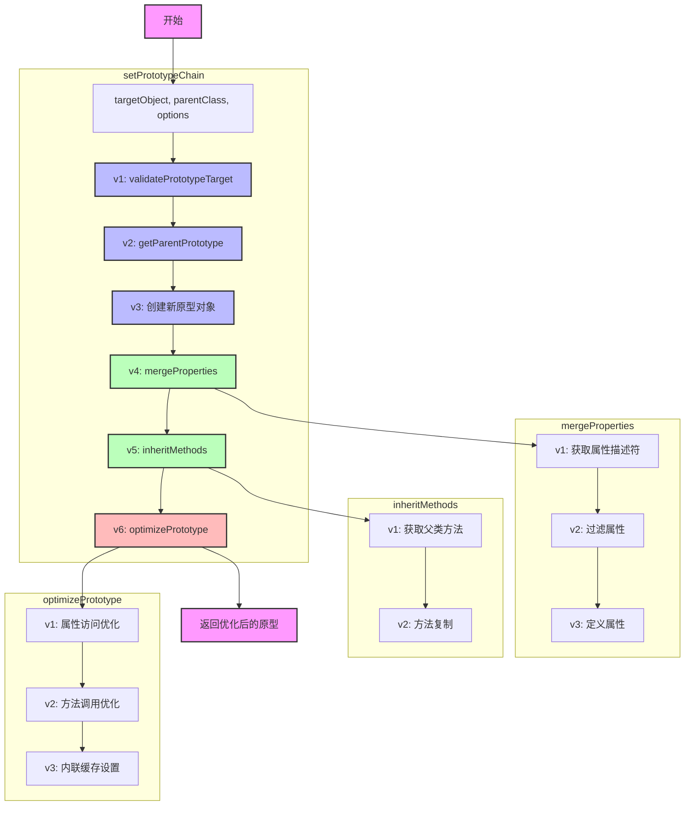

---

:::danger

要注意的是，我们在此仅讨论编译过程中的可能的等价转换，而不是运行时转换，每一个语言的运行时可能都不一样，切勿混淆。

:::

--- 

## SSA 中成员访问的实现

在讨论完上述内容的时候，基本我们可以理解一个类和对象在无类语言最适合的 SSA 形式中应该如何表示，接下来我们将会更加深入讨论成员访问的实现。

:::note

当我们在程序中看到 `a.b` 或 `a[c]` 这样的成员访问表达式时，它们在 SSA 中是如何表示的呢？这就是我们接下来要探讨的问题。

:::

### 成员访问的基本概念

在 SSA 中，成员访问主要分为两种情况：

1. **直接访问**：比如 `person.name`，我们在编译时就知道要访问的是 `name` 这个属性
2. **间接访问**：比如 `person[field]`，要访问的属性要等到运行时才能确定

### SSA 中的成员访问表示

在 SSA 中，我们用特殊的表示方法来处理这些访问：

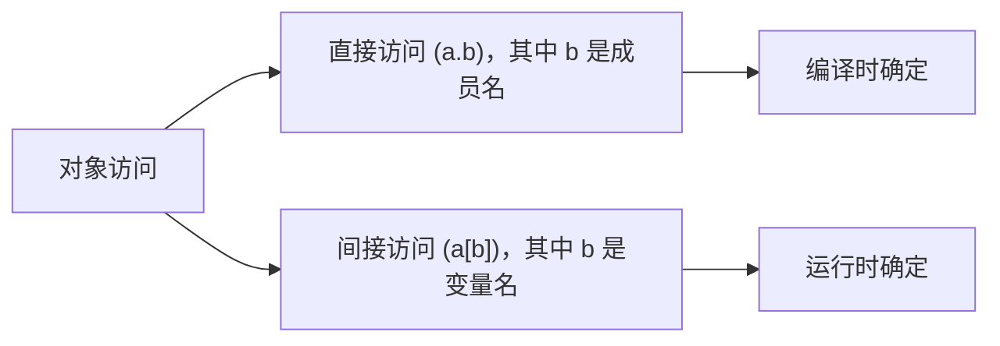

我们将会在后续的概念中，讲解如果表示和简化这些成员变量的访问。


### SSA 形式下的成员表示

:::caution 重要回忆

我们在《第三章》中明确给出了一个 SSA 的重要补丁：指令 ID 全局唯一。这其实算是为本章讨论限定的一个重要前提。

:::

在 SSA 中，我们需要一种明确且无歧义的方式来表示成员访问。通过引入全局唯一 ID 的概念，我们可以精确地表达这种访问关系。接下来我们将会逐步讲解怎么样表示这些成员。知晓如何表示成员能更快加深读者理解。

#### 直接访问成员

直接访问成员表示是最基础的，我们使用 `#n.fieldName` 这样的形式表示。`n` 表示容器的全局 ID ，`fieldName` 表示成员的名称。在这种表示法中，fieldName 在编译时就已经可以确定了。

例如我们可以对下面的内容进行一些表示，假定 `person` 的 SSA 全局 ID 为 `#1` 那么

```
// 示例代码
person.name
person.age
person["email"]

// 都可表示为 SSA 形式
#1.name
#1.age
#1.email
```

其中注意，因为 `[...]` 中 `email` 也是字符串，因此我们可以也使用 `#1.email` 这样的形式表示，这样可以简化我们需要分析和讨论的步骤，并且不会丢失特别多的精度。

#### 间接访问成员

间接访问成员表示是稍微复杂一点的，我们使用 `#n.#n2` 这样的形式表示。`#n` 表示容器的全局 ID ，`#n2` 表示成员变量的名称，需要在具体执行的时候才能知道具体的值。

同样的，我们用一段代码进行表示，在以下代码中，假定 `person` 的全局 SSA ID 为 1， `name` 的全局 SSA ID 为 2：

```
// 间接访问示例代码
person[name];
person.$name;
person[getKey()];

// 都可表示为 SSA 形式
#1.#2
#1.#2
#1.#3   // 假定 #3 为 getKey() 的 SSA ID
```

:::caution  注意

间接访问的字段要在运行时才能确定真正是谁，但是因为我们的 SSA 可以使用 Phi 来表示多个“可能性”，因为成员的具体值完全可能是一个 <InlineMath math="phi(v1, v2, v3, ...)" /> 这样的形式。

:::

#### 核心优势

我们通过上述的表示法，为对象和成员分配全局唯一的 ID，并使用明确的 #n.fieldName 和 #n.#n2 形式来表示直接和间接成员访问，从而彻底消除了传统成员访问的模糊性。

上面的表示法同时可以兼容 SSA 的 phi 函数处理控制流合并，该方案使得每个成员的修改和使用都可以被精确追踪，满足了 SSA 的静态单赋值特性，并简化了静态分析的难度。

### 案例：直接访问成员

考虑如下代码：

```
a = {};
a.b = d;
if c {
	a.b = e;
}
println(a.b)
```

这段代码的特征其实非常明显，就是 `a.b` 的值在运行时会根据 `c` 的值来决定是 `d` 还是 `e`，因此 `a.b` 的值在运行时会有两个可能的值：`d` 和 `e`。这儿一定会生成一个 Phi 值:

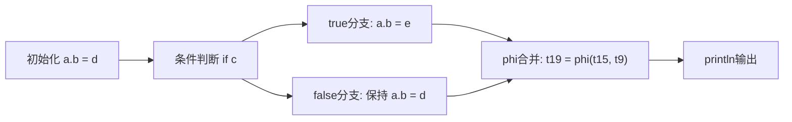

我们按照上面编译成员的方法，编译后的结果应该为：

```
package:  application
main 
type: () -> null
entry-0:
	<any> t9 = undefined-a.b(from:6) (value: d)
	<any> t8 = undefined-a.b(valid)(from:6) (value: #6.b)
	<any> t3 = make any [<nil>, <nil>]
	<map[any]any> t6 = make map[any]any [<number> 0, <number> 0]
	jump -> if-condition-1
if-condition-1: <- entry-0 
	<any> t13 = undefined-c
	If [<any> t13] true -> if.true-2, false -> if.done-3
if.true-2: <- if-condition-1 
	<any> t15 = undefined-a.b(from:6) (value: e)
	jump -> if.done-3
if.done-3: <- if.true-2 if-condition-1 
	<any> t19 = phi [<any> t15, if.true-2] [<any> t9, entry-0] 
	<any> t20 = undefined-println
	<any> t22 = call <any> t20 (<any> t19) binding[] member[]

```

:::tip 重要观察
注意到在 SSA 形式中，我们使用 phi 函数来合并不同路径上的值，这保证了即使在有条件分支的情况下，仍然满足静态单赋值的要求。
:::

### 案例：间接访问成员

接下来我们考虑下面成员变量访问的案例，这个案例看起来比上面的案例复杂一些，但是它包含的含义本质上和直接访问相似：

```
a = {
   1: "Hello",
   2: "World",
};
b = 1;
if c {
	b = 2;
}
println(a[b])
```

这段代码相对来说要考虑的多一些，我们首先需要考虑 `a[b]` 的值在运行时会有两个可能的值：`a[1]` 和 `a[2]`，因此我们需要生成一个 Phi 值来表示这个结果。

这段代码编译后的 SSA 形式为:

```
package:  application
main 
type: () -> null
entry-0:
	<any> t10 = undefined-a.2(valid)(from:4) (value: #4[2])
	<any> t7 = undefined-a.1(valid)(from:4) (value: #4[1])
	<any> t3 = make any [<nil>, <nil>]
	<map[number]string> t4 = make map[number]string [<nil>, <nil>]
	jump -> if-condition-1
if-condition-1: <- entry-0 
	<any> t15 = undefined-c
	If [<any> t15] true -> if.true-2, false -> if.done-3
if.true-2: <- if-condition-1 
	jump -> if.done-3
if.done-3: <- if.true-2 if-condition-1 
	<number> t20 = phi [<number> 2, if.true-2] [<number> 1, entry-0] 
	<any> t21 = undefined-println
	<string> t22 = undefined-a.b(valid)(from:4) (value: #4.#20)
	<any> t23 = call <any> t21 (<string> t22) binding[] member[]

```


#### 关键特征解析

1. **间接访问的处理方式**
   - 索引值在运行时确定
   - 需要通过 phi 函数处理可能的索引值

2. **转换流程**

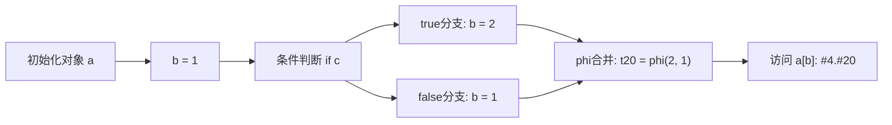

3. **关键指令解释**
```
<number> t20 = phi [<number> 2, if.true-2] [<number> 1, entry-0]  // 合并索引值
<string> t22 = undefined-a.b(valid)(from:4) (value: #4.#20)      // 间接成员访问
```


