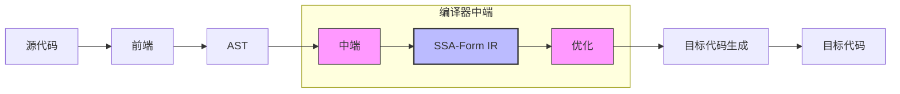
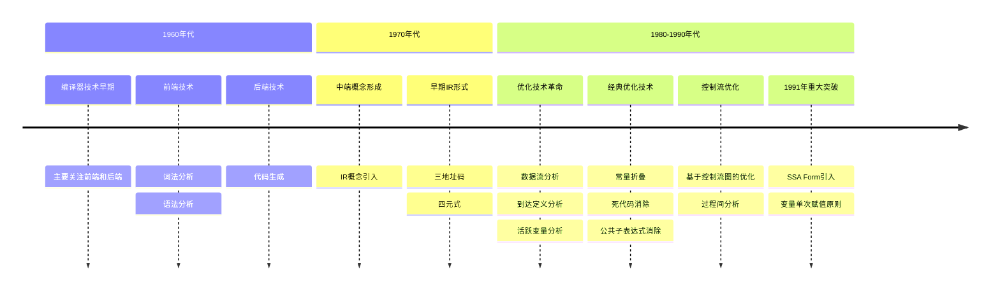
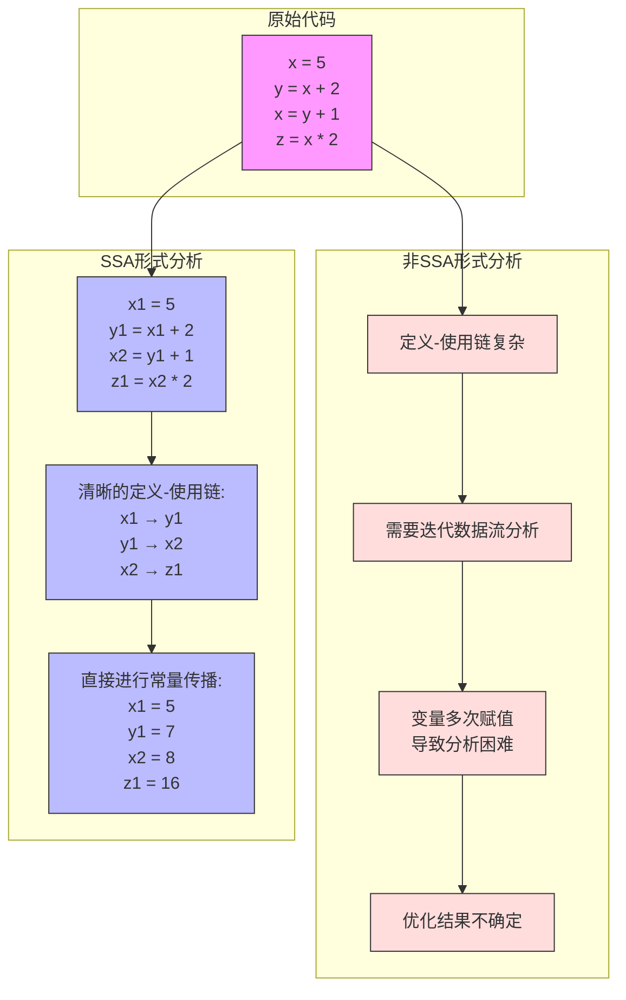

# 第一章：编译与静态代码分析概论

在我们致力于打造一个“有人用”的编程语言和编译器技术体系的过程中，随着逐步进入“编译与静态分析”的深水区，发现了很多缺乏实践导致理论僵化的问题。虽然我们使用“代码和项目”去填补了很多编译与分析深水区的空白，但是我们仍然希望这些僵化的理论可以获得更新，让现代化的静态代码分析重新获得生命力。

-----

import TOCInline from '@theme/TOCInline';
import Math, { BlockMath, InlineMath } from '@site/src/components/Math';


<TOCInline toc={toc} />

## 编译技术

编译技术被誉为计算机科学的"皇后"，其发展历程实际上就是计算机科学发展史的缩影。它不仅是计算机科学专业的必修课程，更是推动整个计算机科学发展的核心技术之一。在比较经典的编译架构中，我们会主要分割为三个部分（也称三段式编译器）：前端，中端（中间代码生成与优化），后端。

严格区分的前中后端，让编译器在编译过程中进行代码优化变得可能，尤其是在1990年左右静态单赋值形式（SSA-Form）的引入，简化了大量的优化算法，极大提升了优化效率，并且现今演变为编译器中端的标准形式。



## 静态代码分析与编译技术历史关系

### 1960年代的编译器前端与后端

20世纪六十年代是编译器技术的早期，在这个阶段，编译器中端并不是一个明确的概念，当时的编译器主要关注前端的语法分析和后端的代码生成。但随着程序优化需求的增加，中端的雏形开始出现。

### 1970年代后中端概念出现

直接通过AST生成目标代码（汇编）变得非常困难，引入一个中间表示层（Intermediate Representation, IR）之后可以很好的解决这个问题。早期的 IR 常见三地址码和四元式的形式。

### 1980年代到1990年代“优化”技术快速发展，SSA 引入

在20世纪80年代到90年代初期，编译器优化技术经历了一次革命性的发展。这个时期出现了一系列重要的优化技术，包括数据流分析（如到达定义分析、活跃变量分析）、经典优化技术（如常量折叠、死代码消除、公共子表达式消除）、基于控制流图的优化，以及过程间分析等。但最具革命性的突破是1991年静态单赋值形式（SSA Form）的引入。SSA形式的核心思想是：程序中的每个变量只能被赋值一次。这个看似简单的约束却带来了深远的影响。




## 静态代码分析技术与 SSA-Form


虽然各种以优化为目的的静态代码分析技术的提出比 SSA-Form 要更早，但是 SSA 技术实际上应该是更底层的理论，SSA 技术的出现对非 SSA 技术的现有算法进行了大幅度的优化。SSA 形式作为一种中间表示（IR）的特殊形式，其核心特点是确保每个变量只被赋值一次，这一特性使得数据流分析变得更加简单和高效。在 SSA 出现之前，传统的数据流分析需要反复迭代才能确定变量的定义和使用关系，而 SSA 形式通过引入 φ（phi）函数，优雅地解决了控制流汇合点上的变量版本选择问题。

虽然 SSA 形式的引入会增加一定的内存开销（主要是由于变量的多个版本和 φ 函数的引入），但其带来的优化效果和算法简化的好处远远超过了这些开销。


### SSA 是何方神圣？

SSA-Form（静态单赋值形式）是一种在编译器设计中广泛使用的中间表示（IR）技术，它通过确保程序中的每个变量在其生命周期内仅被赋值一次，从而显著简化了编译器的优化和分析过程。这种形式最初由 Ron Cytron, Jeanne Ferrante, Barry K. Rosen, Mark N. Wegman 和 F. Kenneth Zadeck 在1991年提出，并迅速成为现代编译器架构中的一个核心组成部分。

在实际应用中，SSA-Form不仅被用于传统的编译器中，如GCC和LLVM，它还被广泛应用于各种现代编程语言的实现和新兴的编译技术中，包括即时编译（JIT）和动态优化。SSA的普及和效果证明了其在提高编译器性能和代码优化方面的关键作用。

### 理解SSA形式在优化算法中的优势（以常量传播优化为例）

我们以常量传播优化为例，来分析对比 SSA 形式下的优化与非 SSA 形式下的优化有何异同。

#### 什么是常量传播优化

> 常量传播(Constant Propagation)是编译器优化中的一项关键技术[1]，它通过在编译时识别和传播程序中的常量值来减少运行时计算开销。这种优化属于数据流分析范畴，主要包括简单常量传播、条件常量传播和稀疏条件常量传播等类型[2]。在实现过程中，编译器首先构建控制流图，然后通过迭代计算来传播常量信息，最终实现代码优化[3]。例如，将 int x = 10; int y = x + 5; 优化为 int x = 10; int y = 15;。常量传播不仅能直接提升程序性能，还能触发其他优化机会，如死代码消除和循环优化[4]。然而，这种优化也面临着一些挑战，如指针别名分析的影响和函数调用的副作用等[5]。在现代编译器中，常量传播已成为优化流水线中不可或缺的一环，对提高程序执行效率具有重要作用。
> 
> 参考文献：
> 
> 1. Wegman, M. N., & Zadeck, F. K. (1991). Constant propagation with conditional branches. ACM Transactions on Programming Languages and Systems (TOPLAS), 13(2), 181-210.
> 2. Muchnick, S. S. (1997). Advanced compiler design and implementation. Morgan Kaufmann. Chapter 12: Data-Flow Analysis.
> 3. Cooper, K. D., & Torczon, L. (2011). Engineering a compiler. Elsevier. pp. 465-475.
> 4. Aho, A. V., Lam, M. S., Sethi, R., & Ullman, J. D. (2006). Compilers: Principles, techniques, and tools (2nd edition). Addison Wesley. Chapter 9: Data-Flow Analysis.
> 5. Click, C., & Cooper, K. D. (1995). Combining analyses, combining optimizations. ACM Transactions on Programming Languages and Systems (TOPLAS), 17(2), 181-196.

#### 非SSA形式下的常量传播

在非SSA（静态单赋值）形式下进行常量传播时，会面临一些处理上的困难。常量传播是一种优化技术，通过用常数值替换已知的常数变量来提高代码效率。但在非SSA形式中，由于变量可以被多次赋予不同的值，这使得追踪变量的值变得更为复杂。

以一个简单的代码示例来说明这一点：

```
1: x = 5
2: y = x + 3  // 使用x的值计算y
3: x = 10     // x被重新赋值
4: z = x + y  // 计算z时，x已经是10，而y是基于x原来的值5计算得到的
```
在这个例子中，变量`x`被赋值了两次，首先是5，然后是10。这种重赋值导致在进行数据流分析时必须非常小心地追踪每个变量在不同点上的值。在第2行，`y`的值根据第1行时`x`的值计算得出。但到了第4行，尽管`y`是基于`x`的旧值计算的，`x`的值已经更新为10。

这种情况下，算法需要正确分析和处理变量值的变化，确保在每个使用点正确理解变量的当前值。非SSA形式下的常量传播要求更细致的数据流分析，以保证优化的准确性和效果。

#### SSA形式下的常量传播

在SSA（静态单赋值）形式中，每个变量在其生命周期内仅被赋值一次，这一特性显著简化了编译器优化过程，如常量传播。在SSA形式下，变量的重命名清晰地标示了每个变量的定义和使用，从而消除了因变量重赋值带来的歧义。

考虑以下代码片段转换为SSA形式：

```
1: x₁ = 5
2: y₁ = x₁ + 3   // 直接计算为8
3: x₂ = 10
4: z₁ = x₂ + y₁  // 直接计算为18
```

在此形式中，每个变量（如x₁、x₂、y₁、z₁）都具有单一的赋值点，使得它们的值在任何使用点都是预先确定的，完全无需迭代运算和进行值的抉择。



#### 针对常量传播算法的优化

SSA形式通过提供清晰的变量赋值和使用框架，极大地提高了编译器进行常量传播等优化的效率和准确性。这种方法不仅优化了程序执行效率，也简化了编译器的设计，使得代码分析和优化过程更加高效和可靠。结合上面的案例，主要优化点体现在下面两个方面：

:::tip 主要优化点
- **显式数据流**：变量的单一赋值明确了数据的流向，使得追踪变量值及其计算变得直接而清晰。
- **计算简化**：由于每个变量的值在定义时即已确定，常量传播可以在编译时直接计算出结果，如`y₁ = 8`和`z₁ = 18`，无需运行时计算。
:::

## 参考文献

1. Aho, A. V., Lam, M. S., Sethi, R., & Ullman, J. D. (2006). Compilers: Principles, Techniques, and Tools. DOI: 10.1145/1538788.1538814

2. Allen, F. E. (1970). Control flow analysis. ACM Sigplan Notices. DOI: 10.1145/390013.808479

3. Cytron, R., Ferrante, J., Rosen, B. K., Wegman, M. N., & Zadeck, F. K. (1991). Efficiently computing static single assignment form and the control dependence graph. DOI: 10.1145/115372.115320

4. Rosen, B. K., Wegman, M. N., & Zadeck, F. K. (1988). Global value numbers and redundant computations. DOI: 10.1145/73560.73562

5. Wegman, M. N., & Zadeck, F. K. (1991). Constant propagation with conditional branches. DOI: 10.1145/103135.103136

## 讨论区

import Giscus from '@site/src/components/Giscus';

<Giscus />