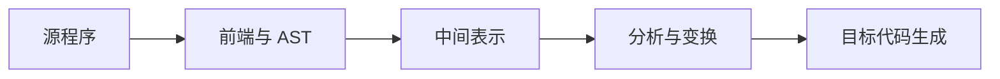

# 编译与静态分析

编译器把源程序转换为能够被计算机执行或被其他工具处理的表示。静态分析则在不执行目标程序的前提下，研究程序的结构、数据依赖与可能的行为。二者共享许多基础技术，其中一个重要连接点就是中间表示。

本教程以 SSA 为线索：先理解单个值的定义，再研究分支、循环、闭包与对象，最后回到数据流和控制流上的分析问题。

## 从语法到中间表示

一个常见的编译流程可以分为前端、中端与后端。前端处理语言的语法与语义，中端在 IR 上进行分析和变换，后端则将表示转换为目标代码。


```mermaid
flowchart LR
  Source[源程序] --> Frontend[前端与 AST]
  Frontend --> IR[中间表示]
  IR --> Analysis[分析与变换]
  Analysis --> Backend[目标代码生成]
```

这是理解分工的一种常见模型，具体编译器可能采用多个 IR 层次。用于安全分析时，也可以保留 IR 与源码的映射，以便把查询结果对应回原始代码。

## 为什么讨论 SSA

静态单赋值形式（Static Single Assignment，SSA）让每个 IR 值只有一个定义。源程序中对同一个变量的多次赋值，转化为不同的值版本；在控制流汇合处，用 Phi 节点表达路径与值之间的对应关系。

SSA 并不使所有值都成为编译期常量。它让定义与使用的关系更加明确，为数据流分析提供一种便于操作的结构。

### 一个常量传播示例

下面的源程序对 `x` 赋值两次：

```text title="源程序"
x = 5
y = x + 3
x = 10
z = x + y
```

改写为教学用的 SSA 表示后：

```text title="SSA 表示"
x₁ = 5
y₁ = x₁ + 3
x₂ = 10
z₁ = x₂ + y₁
```

`y₁` 依赖 `x₁`，`z₁` 依赖 `x₂` 与 `y₁`，不需要依靠变量名 `x` 推测它究竟指哪一次赋值。这个例子中的操作数可以静态确定，因此得到 `y₁ = 8`、`z₁ = 18`。

如果输入来自函数参数、外部调用或不同控制路径，分析仍需要传播和合并信息。单一定义不意味着“无需迭代”，也不意味着“所有程序行为在编译时已知”。

## 从编译优化到安全分析

优化往往关心哪些计算可以简化、哪些结果可以复用；安全分析则常常关心输入影响了哪些操作、关键调用使用了什么值，以及相关防护条件是否成立。

二者都需要研究值与程序结构之间的关系，但分析目标和所需的证据并不相同。不能把一个查询匹配直接等同于完整的漏洞结论。

### Yak SSA 与 SyntaxFlow 的分工

- **Yak SSA** 将源程序编译为用于分析的中间表示，组织值、调用、成员、基本块及相关依赖。
- **SyntaxFlow** 在这一表示上表达查询和分析规则。
- **源码映射与结果展示** 帮助使用者检查规则命中所对应的实际代码。

统一表示减少了查询对具体语法形态的依赖，但不能自动消除不同语言与框架之间的语义差异。讨论具体能力时，应同时考虑编译器对目标语言的建模范围。

## 本教程的阅读顺序

1. [静态单赋值形式](./compile-ssa-form)：变量版本、基本块和 Phi 节点。
2. [高级语言的 SSA 构建](./ssa-for-advanced-language)：从语言结构进入分析表示。
3. [闭包](./deep-dive-into-ssa-closure)与[对象建模](./deep-dive-into-ssa-oop)：环境、成员与副作用。
4. [数据流与跨过程分析](./deep-dive-into-ssa-dataflow-and-cross-procedure)：跨越调用边界理解值的传播。
5. [控制流、支配与 Phi](./deep-dive-cfg)：区分依赖关系、执行路径和支配关系。

想先获得实践反馈，可以并行完成 [SyntaxFlow 快速入门](/syntaxflow-guide/quick-start)。

## 原始资料与参考

1. Cytron, Ferrante, Rosen, Wegman, Zadeck. *Efficiently Computing Static Single Assignment Form and the Control Dependence Graph*, 1991。[Brown 大学技术报告](https://cs.brown.edu/research/pubs/techreports/reports/CS-91-21.html)。该工作系统讨论了 SSA 与控制依赖图的高效构建方法。
2. LLVM. *Language Reference Manual*。[中间表示参考](https://llvm.org/docs/LangRef.html)与 [Phi 指令](https://llvm.org/docs/LangRef.html#phi-instruction)。
3. Yaklang。[项目源码](https://github.com/yaklang/yaklang)。通用编译理论与实际实现应结合阅读。
