# 第三章：高级语言的 SSA 构建（二）

在《第三章：高级语言的 SSA 构建（一）》中，我们讨论了 SSA 的基本概念和基本编译技术，并且详细分析和讨论了分支的 SSA 构建，接下来，我们将会继续未竟的话题，讨论循环的 SSA 构建和函数构建。

---

import TOCInline from '@theme/TOCInline';
import Math, { BlockMath, InlineMath } from '@site/src/components/Math';

<TOCInline toc={toc} />

---

## SSA 构建流程控制：循环

在开始了解 SSA 构建循环之前，我们需要先了解循环本身的基本概念：

### 规约循环与非规约循环

规约循环（Reducible Loop）：规约循环是一个非常好的循环，他的特点是：

1. 入口唯一
2. 所有回边都指向入口（循环头）
3. 循环头支配所有循环体的节点

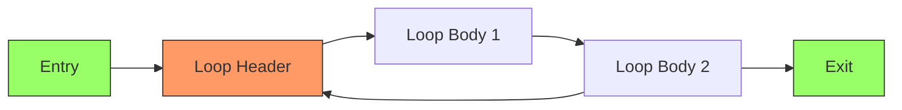

:::tip

规约循环是最常见的循环形式，大多数高级语言不使用 Goto 构成的循环结构（如 for、while）都会生成规约循环。

:::

与之相对的概念是非规约循环（Irreducible Loop），非规约循环的特点是：

1. 入口点可能有多个；
2. 回边可以指向循环内任意节点；
3. 循环头有可能无法支配所有循环体节点；

我们可以举出很多个非规约循环的案例：

#### 多入口循环

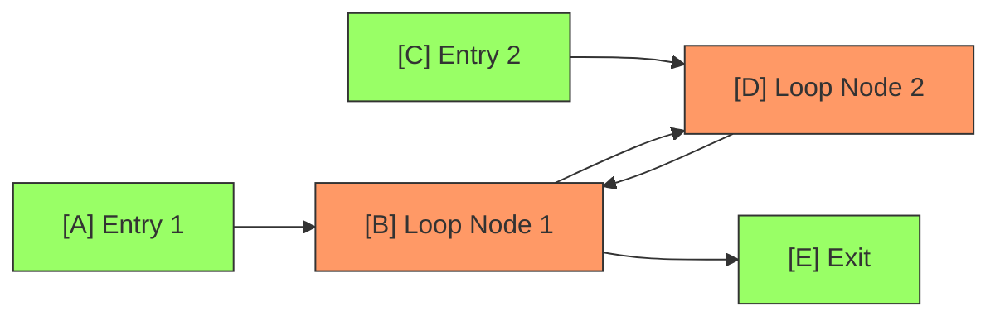

这个循环是非规约的，原因在于：
1. 存在两个入口点（Entry 1 和 Entry 2）可以进入循环
2. 循环没有唯一的循环头（B 和 D 都可以作为入口点）
3. 既不是 B 支配 D，也不是 D 支配 B

#### 交叉循环

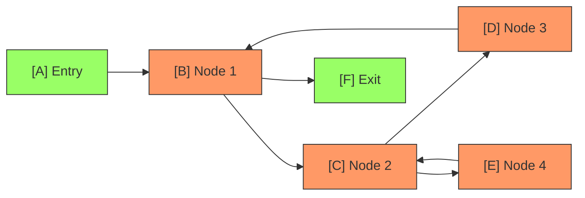

这个例子展示了两个相互交叉的循环：

1. B-C-D 形成一个循环
2. C-E 形成另一个循环
3. 循环 C-E 和循环 B-C-D 共享节点 C
4. 没有唯一的循环头，因为 C 既属于一个循环又属于另一个循环

:::danger

我们现在讨论的循环，都是规约循环。

在后面的内容，会尽量少的讨论非规约循环，因为非规约循环的构建一般需要用到一些 GOTO 之类的控制指令，或者在更低级语言中无条件跳转，过早地接触这些内容会让读者心生恐惧。

非规约循环的处理一般会想办法转移到现有的规约循环中，或者直接使用 GOTO + Label 来组合，优化也会变得更加复杂。

:::

### 三段式循环

:::tip

三段式循环(Three-Address Loop)是一种常见的循环结构模式，我们在这里深入讨论这种经典的循环结构的 SSA 构建。

在读者阅读本节之后，可以尝试阅读 [LLVM 的 SSA 构建文档](https://llvm.org/docs/LangRef.html#three-address-loops) 以获得更多信息。

也可以深入思考对于其他的循环结构应该如何构建 SSA。

:::

C 语言风格的循环一般由三部分组成：初始化、循环体、更新。 考虑如下代码：

```java
package main;

class Main {
	public static void main(String[] args) {
		for (int i = 0; i < 10; i++) {
			System.out.println("Hello, World!");
		}
	}
}
```

上述代码编译后核心 SSA 结构如下：

```typescript
Main_main_e5a8 <string> (11) args
type: () -> null
entry-0:
	jump -> loop.header-1
loop.header-1: <- entry-0 
	jump -> loop.condition-2
loop.condition-2: <- loop.header-1 loop.latch-4 
	<any> t33 = phi [<number> 0, loop.header-1] [<number> t31, loop.latch-4] 
	<boolean> t19 = <any> t33 lt <number> 10
	Loop [<nil>; <boolean> t19; <nil>] body -> loop.body-3, exit -> loop.exit-5
loop.body-3: <- loop.condition-2 
	<#24.println> t26 = undefined-System.out.println(from:24)
	<any> t24 = undefined-System.out(valid)(from:22)
	<any> t22 = undefined-System
	<null> t28 = call <#24.println> t26 (<any> t24, <string> Hello, World!) binding[] member[]
	jump -> loop.latch-4
loop.latch-4: <- loop.body-3 
	<number> t31 = <any> t33 add <number> 1
	jump -> loop.condition-2
loop.exit-5: <- loop.condition-2 

extern type:
```


### 三段式循环的基本块分析

在这个例子中，循环被分解为以下几个基本块：

1. `entry-0`: 程序入口块
2. `loop.header-1`: 循环头部块
3. `loop.condition-2`: 循环条件判断块
4. `loop.body-3`: 循环体块
5. `loop.latch-4`: 循环更新块
6. `loop.exit-5`: 循环出口块

让我们用 mermaid 来可视化这个控制流图：

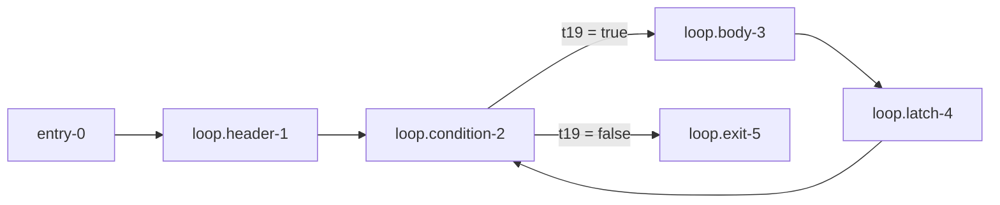

### 循环中的 Phi 生成

根据我们在 "第二章" 中基本块和 Phi 生成的讨论，我们知道 Phi 节点是用来处理多入口基本块的。我们在这里发现，`loop` 的 `loop.condition-2` 中包含了两个前驱块，所以这儿可能会生成 Phi。

那么，我们把上述图再细化一下，得到如下内容：

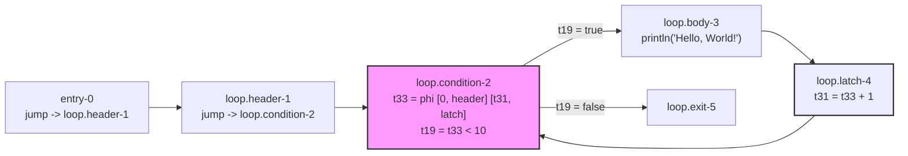

我们会得到一个 phi 节点 `t33`，这个 phi 节点会根据前驱块的不同，选择不同的值。可能的选项为：

1. 如果前驱块是 `loop.header-1`，则 `t33` 的值为 0
2. 如果前驱块是 `loop.latch-4`，则 `t33` 的值为 `t31`

这个情况是一个典型的 For 循环中的 Phi 节点生成的案例。

仔细观察一下，我们发现 t33 依赖（被支配）了 t31，而 t31 又是由 `t33 + 1` 得到的（支配），这陷入了一个循环。我们把这个关系表述成一个更精炼的图

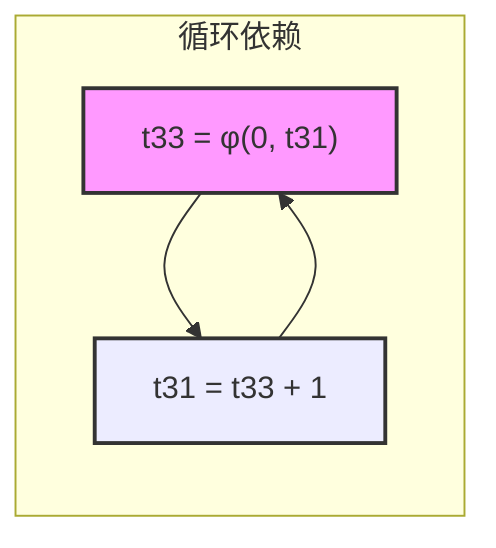

:::tip

虽然从 “空间” 上看，这是一个不健康的支配依赖，但是在 SSA 中，这是完全合法的：

1. 时序关系：`t33` 在 `t31` 之前被定义，每次都是先使用 t33 的值，才需要计算新的 t31.
2. Phi 节点在过程中选择不同路径，导致不同的值，这是执行的时候控制的，并不需要我们来解决。

:::


:::info 额外读物：停机问题 与 图灵完备

图灵完备（Turing Complete）指的是一个计算系统能够模拟通用图灵机的计算能力，换句话说，它能够计算任何可计算的函数。一个系统要达到图灵完备，需要具备基本的控制流（如条件判断和循环）以及任意数量的存储空间。现代的编程语言，包括我们的 SSA 中间表示，都是图灵完备的。

停机问题（Halting Problem）是指：给定一个程序和它的输入，判断这个程序是否会在有限时间内终止运行。这个看似简单的问题，实际上是不可判定的。换句话说，不存在一个通用的算法能够准确判断任意程序是否会停机。

:::

:::tip 为什么图灵完备系统无法证明停机问题？
这是因为存在一个根本性的矛盾：

1. 假设存在一个函数 `willHalt(program, input)`，它能判断任意程序是否会停机
2. 我们可以构造一个新程序 `paradox()`：
   ```python
   def paradox():
       if willHalt(paradox, []):  # 如果 paradox 会停机
           while True: pass        # 就进入死循环
       else:                      # 如果 paradox 不会停机
           return                 # 就立即返回
   ```
3. 这会导致逻辑矛盾：
   - 如果 `willHalt` 判断 `paradox` 会停机，那么 `paradox` 就会进入死循环（不停机）
   - 如果 `willHalt` 判断 `paradox` 不会停机，那么 `paradox` 就会立即返回（停机）

这个矛盾证明了不可能存在这样的 `willHalt` 函数。
:::

### 三段式循环中的 Phi 生成形式化表示

让我们用形式化的方式来表示三段式循环中的 Phi 生成。

三段式循环的基本结构中，分为三个基本部分：

1. **初始化** (Init)：循环开始前的准备工作
2. **条件判断** (Cond)：循环继续的条件检查
3. **更新** (Update)：每次迭代后的状态更新

让我们用形式化的方式来表示：

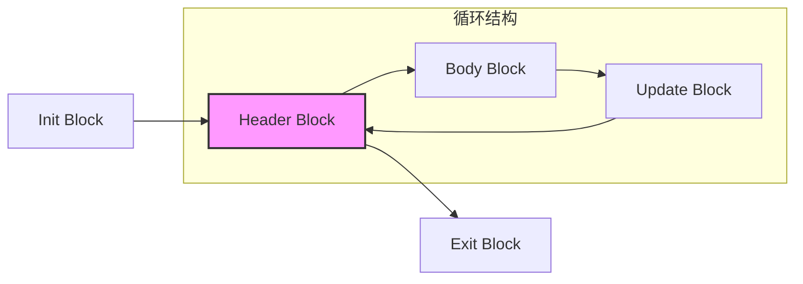

对于循环中的变量，我们可以用以下形式化表示：

<BlockMath math={`
\\begin{aligned}
& \\text{在 Header Block 中：} \\\\
& x_{header} = \\phi(x_{init}, x_{update}) \\\\
& \\text{其中：} \\\\
& x_{init} \\text{ 来自循环初始化} \\\\
& x_{update} \\text{ 来自上一次迭代的更新}
\\end{aligned}
`} />

形式化的 Phi 节点生成规则：

1. **入口 Phi 规则**：

<BlockMath math={`
\\phi_{entry}(v) = \\begin{cases}
v_{init} & \\text{if first iteration} \\\\
v_{update} & \\text{if from loop update}
\\end{cases}
`} />

2. **循环变量集合定义**：

<BlockMath math={`
\\begin{aligned}
& LoopVars = \\{ v \\ | \\ v \\text{ is modified in loop} \\} \\\\
& \\forall v \\in LoopVars: \\text{Generate } \\phi_{entry}(v)
\\end{aligned}
`} />

#### Phi 节点的生成条件

一个变量 v 需要在循环头部生成 Phi 节点，当且仅当：

1. v 在循环中被修改
2. v 在循环中被使用
3. v 的定义到达循环头部的路径不止一条

例如，对于以下代码：

```c
int i = 0;
while (i < 10) {
    sum = sum + i;
    i = i + 1;
}
```

虽然上述代码并不是一个典型的三段式循环，但是我们可以用类似三段式循环的结构来分析它。

其 SSA 形式为：

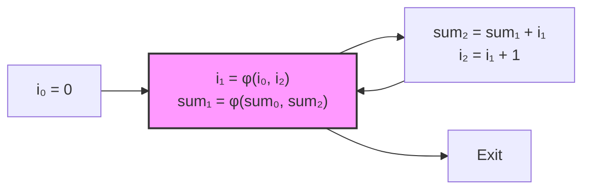

形式化的变量依赖关系：

<BlockMath math={`
\\begin{aligned}
& i_1 = \\phi(i_0, i_2) \\\\
& sum_1 = \\phi(sum_0, sum_2) \\\\
& \\text{where:} \\\\
& i_2 = i_1 + 1 \\\\
& sum_2 = sum_1 + i_1
\\end{aligned}
`} />

:::danger 注意 易错问题与误区

在生成 Phi 节点时，需要注意：

1. 不是所有循环变量都需要 Phi 节点
2. Phi 节点的操作数顺序必须与控制流图中的前驱块顺序一致
3. 需要考虑循环嵌套时的变量版本关系

:::

我们把上述所有内容和易错事项总结成 Phi 生成的公式（算法）如下：

<BlockMath math={`
\\begin{aligned}
& \\textbf{Algorithm: GenerateLoopPhiNodes} \\\\
& \\textbf{Input: } Loop L \\text{ with blocks } \\{Init, Header, Body, Update\\} \\\\
& \\textbf{Output: } \\text{SSA form with proper Phi nodes} \\\\
& \\textbf{Definitions:} \\\\
& Pred(b) : \\text{predecessor blocks of block } b \\\\
& Def(v) : \\text{definition points of variable } v \\\\
& Use(v) : \\text{use points of variable } v \\\\
& \\textbf{Steps:} \\\\
& 1. \\text{ Initialize: } \\\\
& \\quad LoopVars = \\emptyset \\\\
& 2. \\text{ Identify loop variables: } \\\\
& \\quad \\forall v \\in Variables(L): \\\\
& \\quad \\quad \\text{if } (v \\text{ is modified in } L) \\land (v \\text{ is used in } L): \\\\
& \\quad \\quad \\quad LoopVars = LoopVars \\cup \\{v\\} \\\\
& 3. \\text{ Generate Phi nodes: } \\\\
& \\quad \\forall v \\in LoopVars: \\\\
& \\quad \\quad \\text{if } |Paths(Def(v) \\to Header)| > 1: \\\\
& \\quad \\quad \\quad v_{header} = \\phi(v_{init}, v_{update}) \\\\
& 4. \\text{ Update SSA versions: } \\\\
& \\quad \\forall v \\in LoopVars: \\\\
& \\quad \\quad v_i = \\begin{cases} 
& \\quad \\quad \\quad v_{init} & \\text{from Init block} \\\\
& \\quad \\quad \\quad v_{update} & \\text{from Update block} 
& \\quad \\quad \\end{cases} \\\\
& 5. \\text{ Maintain predecessor order: } \\\\
& \\quad \\text{Order}(\\phi_{args}) = \\text{Order}(Pred(Header)) \\\\
& \\textbf{Invariants:} \\\\
& 1. \\forall v \\in LoopVars: \\\\
& \\quad v_{header} \\text{ dominates all uses of } v \\text{ in loop} \\\\
& 2. \\forall \\text{ paths } p \\text{ in loop}: \\\\
& \\quad \\text{SSA property holds on } p \\\\
& 3. \\forall v \\in LoopVars: \\\\
& \\quad \\phi(v) \\text{ appears only if necessary}
\\end{aligned}
`} />

### 举一反三：For-Each 与迭代器

在实际生产中，三段式循环的结构和 For-Each 循环结构在编程中都非常常见。如果想要 For-Each 的循环结构推广到三段式循环中，则需要引入迭代器这一个概念：

一般我们认为迭代器的核心接口有两个:

1. `hasNext()`: 判断是否还有下一个元素
2. `next()`: 获取下一个元素

在不同语言中，迭代器的实现方式不尽相同，但是其核心思想是相同的。


:::tip 迭代器的本质与形式化定义
迭代器是一种设计模式，它提供了一种统一的方式来访问集合中的元素，而无需暴露集合的内部结构。

**核心接口定义(Java 版)：**
```java
interface Iterator<T> {
    boolean hasNext();  // 判断是否还有下一个元素
    T next();          // 获取下一个元素
}
```

**形式化定义：**
<BlockMath math={`
\\begin{aligned}
& \\text{Iterator } I = (S, next, hasNext) \\text{ where:} \\\\
& S : \\text{当前状态空间} \\\\
& next : S \\to T \\cup \\{\\bot\\} \\\\
& hasNext : S \\to \\{true, false\\}
\\end{aligned}
`} />

**基本性质：**
- 如果 hasNext() = false，则 next() = ⊥（表示未定义）
- 每次调用 next() 都会改变迭代器状态
- 迭代器提供了一个单向遍历序列的抽象
:::

```java
for (Element e : collection) {
    // 使用元素 e
    process(e);
}
```

假定我们使用迭代器来遍历列表，则上述代码的 SSA 形式为：

```
for (Iterator<Element> iter = collection.iterator(); // 初始化部分
     iter.hasNext();                                 // 条件判断部分
     /* 空的更新部分 */) {                             // 更新部分
    Element e = iter.next();                         // 循环体
    process(e);
}

```

我们把上述代码编程迭代器的格式之后，就会得到下面的基本块 CFG 来表示：

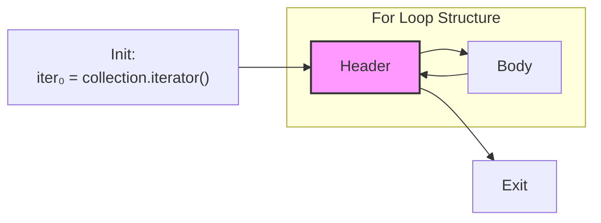

我们在之前的内容中，已经详细讨论了关于这种三段式循环的 Phi 生成问题和应该怎么处理，在此就不需要额外讲了，读者可以自由发挥。

---

## SSA 构建函数

在上述内容中，我们已经基本上完成了一个过程内的 SSA 构建基本研究方法，接下来我们将要简单讲述一下一个函数实体如何构建。当然首先，我们需要解释一下“函数”这个概念本身。

### 函数的基本概念

在编程中，**函数**是一个组织代码的基本单元，它将一组相关的代码片段封装在一起，使其可以被重复调用和执行。函数的目的是提高代码的**可重用性**、**可读性**和**模块化**，从而让程序更加清晰和易于维护。

1. **输入（参数）**：函数可以接收外部传入的值（称为参数），这些值可以用来在函数内部进行计算或操作。
2. **输出（返回值）**：函数通常会返回一个结果（也可以没有返回值），这个结果可以被程序的其他部分使用。
3. **封装**：函数将一组代码逻辑封装在一起，用户只需要知道函数的功能，而不需要关心其内部实现细节。
4. **可重用性**：函数定义好后，可以在程序中多次调用，不需要重复编写相同的代码。

作为一个编译级的项目和教程内容，仅仅了解函数的上述内容是远远不够的，我们还需要了解函数中具体有什么：

1. **函数元信息**：函数名、参数、返回值
2. **函数控制流图**：函数内部的代码结构，包括基本块、边、入口和出口
3. **代码（SSA 形式）**：函数内部的 SSA 形式，包括 Phi 节点、定义、使用
4. **闭包**：函数内部捕获的外部变量
5. **副作用**：函数内部产生的副作用，例如修改某个外部变量

虽然在很多函数或者编程的具体过程中，我们是不感知闭包和副作用的（也有例外，在 PHP 中捕获变量需要显式声明），但是想要深度理解现代编程语言中的函数，理解闭包和副作用是不可或缺的一步。

所以假如我们要设计一个指令专门用来保存函数，那这个指令的结构体设计能长什么样呢？

```typescript
type SSA_Function = {
    opcode: "function";
    meta: {
        name: string;
        params: string[];
        returns: string;
    };
    cfg: {
        blocks: Block[];
        edges: Edge[];
        entry: Block;
        exit: Block;
    };
    ssa: {
        phi: Phi[];
        definitions: Definition[];
        uses: Use[];
    };
    closure: Variable[];
    sideEffects: Variable[];
};
```

他的 UML 类图如下：

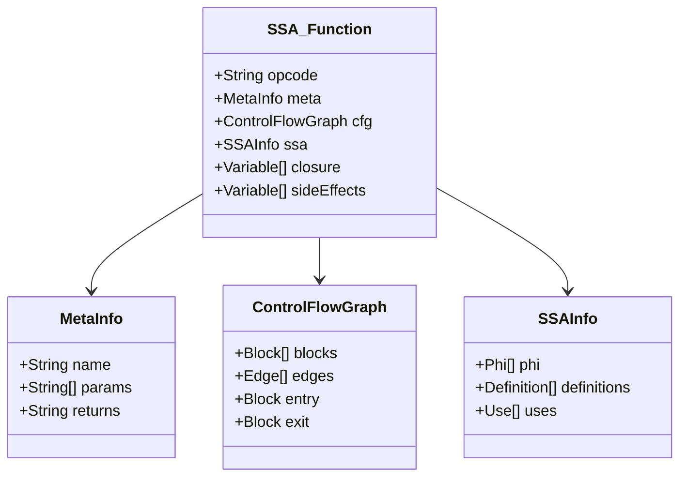

:::tip 注意：

我们尽可能把函数当成一个结构体设计，但是他也需要具备所有的指令的特性。这是为了方便 **一等公民** 的特性。

:::

根据上述的结构体设计，我们可以得到一个函数的形式化定义：

### 通用函数形式化

我们在 SSA 编译器视角下，认为函数是程序执行的基本单元。

在 SSA 的上下文中，函数（Function）是一个自包含的程序执行单元，可以形式化定义为：

<BlockMath math={`
\\begin{aligned}
& Function = (Meta, CFG, SSA\\_Form, Closure, Effects) \\text{ where:} \\\\
& Meta = (Name, Params, Returns) \\\\
& CFG = (V, E, Entry, Exit) \\\\
& SSA\\_Form = \\{\\phi\\_functions, definitions, uses\\} \\\\
& Closure = \\{captured\\_vars\\} \\\\
& Effects = \\{modified\\_vars, side\\_effects\\}
\\end{aligned}
`} />


上述定义的函数具有如下性质：

<BlockMath math={`
\\begin{aligned}
& \\text{Properties:} \\\\
& 1. \\forall v \\in Variables: |Def(v)| \\leq 1 \\\\
& 2. \\forall b \\in CFG: HasDominanceFrontier(b) \\\\
& 3. \\forall \\phi \\in \\phi\\_functions: IsProperlyPlaced(\\phi) \\\\
& 4. Entry \\text{ dominates all blocks} \\\\
& 5. \\text{All blocks reach } Exit
\\end{aligned}
`} />

<BlockMath math={`
\\begin{aligned}
& \\text{Closure Properties:} \\\\
& 1. \\forall v \\in Closure: IsExternalVar(v) \\\\
& 2. \\forall v \\in Closure: HasCapturePoint(v) \\\\
\\\\
& \\text{Effects Properties:} \\\\
& 1. \\forall v \\in Effects: IsTracked(v) \\\\
& 2. Effects \\subseteq \\{Lexical Variables\\}
\\end{aligned}
`} />


这个函数和我们在常见编程语言中的“函数”有相同点，也有不同点。我们在这里定义的函数相对来说更加“通用”，因为我们目的是“通用编译”，而不是“特定语言”。

### 从 AST 到 SSA 识别和切割函数

我们在讨论一个函数编译的过程的时候，假定我们已经有一个函数内的编译过程了，由于函数是一等公民，它可以是任何 SSA 变量，那么这个编译过程一定是递归的，所以我们使用一个流程图来表示函数的编译过程（递归算法）

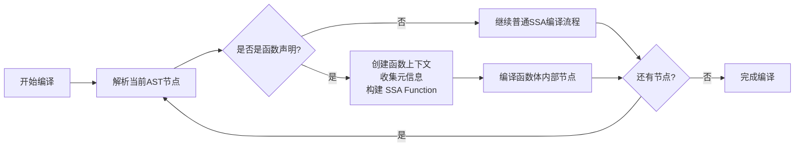

我们把上述结构编写一段伪代码如下：

```typescript
function compileAST(
    ast: Node, 
    context: CompileContext
): SSAResult {
    // 当前节点是函数声明
    if (isFunctionDeclaration(ast)) {
        // 创建函数上下文和SSA Function
        const functionContext = new CompileContext(context);
        const ssaFunction = new SSA_Function({
            meta: extractFunctionMeta(ast),
            context: functionContext
        });
        
        // 递归编译函数体
        const bodyResult = compileAST(ast.body, functionContext);
        ssaFunction.merge(bodyResult);
        
        // 注册为SSA变量
        return context.registerFunction(ssaFunction);
    }
    
    // 普通节点编译
    return compileNormalNode(ast, context);
}
```

形式化表达如下：


<BlockMath math={`
\\begin{aligned}
& \\textbf{Algorithm } \\text{CompileAST}(node, context) \\\\
& \\textbf{Input: } node: \\text{ASTNodes}, context: \\text{CompilerBuilderContext} \\\\
& \\textbf{Output: } \\text{SSA IR Codes} \\\\
& \\textbf{Begin} \\\\
& \\quad \\textbf{if } isFunctionDeclaration(node) \\textbf{ then} \\\\
& \\quad \\quad functionContext \\leftarrow new\\ CompileContext(context) \\\\
& \\quad \\quad meta \\leftarrow extractFunctionMeta(node) \\\\
& \\quad \\quad ssaFunction \\leftarrow new\\ SSA\\_Function(meta, functionContext) \\\\
& \\quad \\quad bodyResult \\leftarrow CompileAST(node.body, functionContext) \\\\
& \\quad \\quad ssaFunction.merge(bodyResult) \\\\
& \\quad \\quad \\textbf{return } context.registerFunction(ssaFunction) \\\\
& \\quad \\textbf{else} \\\\
& \\quad \\quad \\textbf{return } compileNormalNode(node, context) \\\\
& \\quad \\textbf{end if} \\\\
& \\textbf{End}
\\end{aligned}
`} />

:::tip
这个算法描述采用了标准的伪代码格式，其中：
- 使用 <InlineMath math={`\\leftarrow`} /> 表示赋值操作
- 使用缩进表示代码块层级
- 清晰地标注了输入和输出
- 使用 <InlineMath math={`\\text text`} /> 标注关键字
:::

这个算法可以形式化地表达为如下的数学定义：

<BlockMath math={`
CompileAST(node, ctx) = 
\\begin{cases} 
ctx.registerFunction(F) & \\text{if } isFunctionDeclaration(node) \\\\
compileNormalNode(node, ctx) & \\text{otherwise}
\\end{cases}
`} />

其中：
<BlockMath math={`
F = SSA\\_Function(meta, ctx') \\oplus CompileAST(node.body, ctx')
`} />

这里：
- <InlineMath math={`ctx'`} /> 表示新创建的函数上下文
- <InlineMath math={`\\oplus`} /> 表示 merge 操作
- <InlineMath math={`meta`} /> 是从节点提取的函数元信息

:::tip
在这个形式化表达中，我们使用了分段函数的形式来表示条件分支，这样可以更简洁地表达算法的核心逻辑。<InlineMath math={`\\oplus`} /> 操作符表示将编译结果合并到 SSA Function 中的过程。
:::
