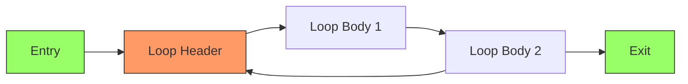
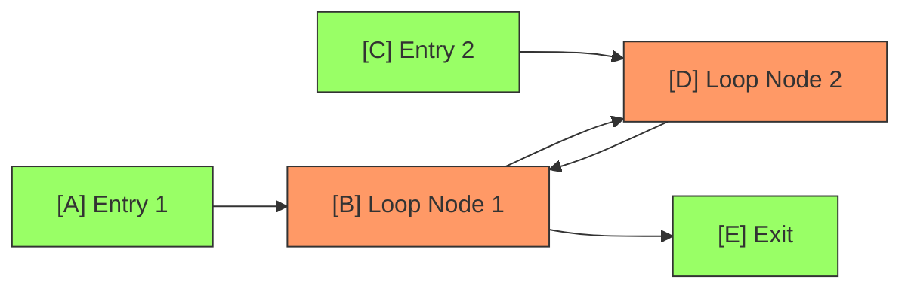
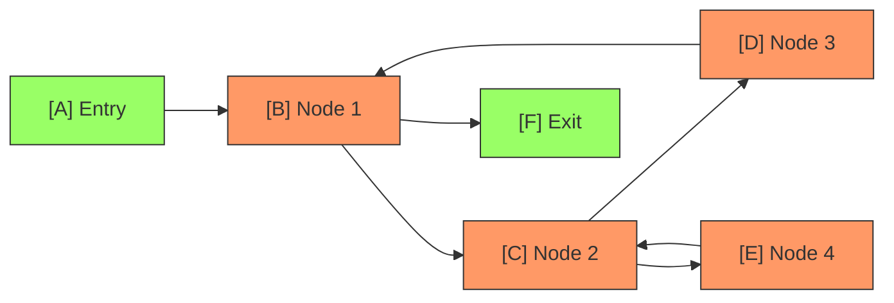

# 第三章：高级语言的 SSA 构建（二）

在《第三章：高级语言的 SSA 构建（一）》中，我们讨论了 SSA 的基本概念和基本编译技术，并且详细分析和讨论了分支的 SSA 构建，接下来，我们将会继续未竟的话题，讨论循环的 SSA 构建和函数构建。

---

import TOCInline from '@theme/TOCInline';
import Math from '@site/src/components/Math';

<TOCInline toc={toc} />

---

## SSA 构建流程控制：循环

在开始了解 SSA 构建循环之前，我们需要先了解循环本身的基本概念：

### 规约循环与非规约循环

规约循环（Reducible Loop）：规约循环是一个非常好的循环，他的特点是：

1. 入口唯一
2. 所有回边都指向入口（循环头）
3. 循环头支配所有循环体的节点

:::tip

规约循环是最常见的循环形式，大多数高级语言不使用 Goto 构成的循环结构（如 for、while）都会生成规约循环。

:::

与之相对的概念是非规约循环（Irreducible Loop），非规约循环的特点是：

1. 入口点可能有多个；
2. 回边可以指向循环内任意节点；
3. 循环头有可能无法支配所有循环体节点；

我们可以举出很多个非规约循环的案例：

#### 多入口循环

这个循环是非规约的，原因在于：
1. 存在两个入口点（Entry 1 和 Entry 2）可以进入循环
2. 循环没有唯一的循环头（B 和 D 都可以作为入口点）
3. 既不是 B 支配 D，也不是 D 支配 B

#### 交叉循环

这个例子展示了两个相互交叉的循环：

1. B-C-D 形成一个循环
2. C-E 形成另一个循环
3. 循环 C-E 和循环 B-C-D 共享节点 C
4. 没有唯一的循环头，因为 C 既属于一个循环又属于另一个循环

:::danger

我们现在讨论的循环，都是规约循环。

在后面的内容，会尽量少的讨论非规约循环，因为非规约循环的构建一般需要用到一些 GOTO 之类的控制指令，或者在更低级语言中无条件跳转，过早地接触这些内容会让读者心生恐惧。

非规约循环的处理一般会想办法转移到现有的规约循环中，或者直接使用 GOTO + Label 来组合，优化也会变得更加复杂。

:::

## SSA 构建：函数与方法

### 函数内（过程内） SSA 构建

### 函数本身的 SSA 构建

## 高级语言特性构建

### 闭包函数中的 SSA 问题

### OOP 中的 SSA 问题
