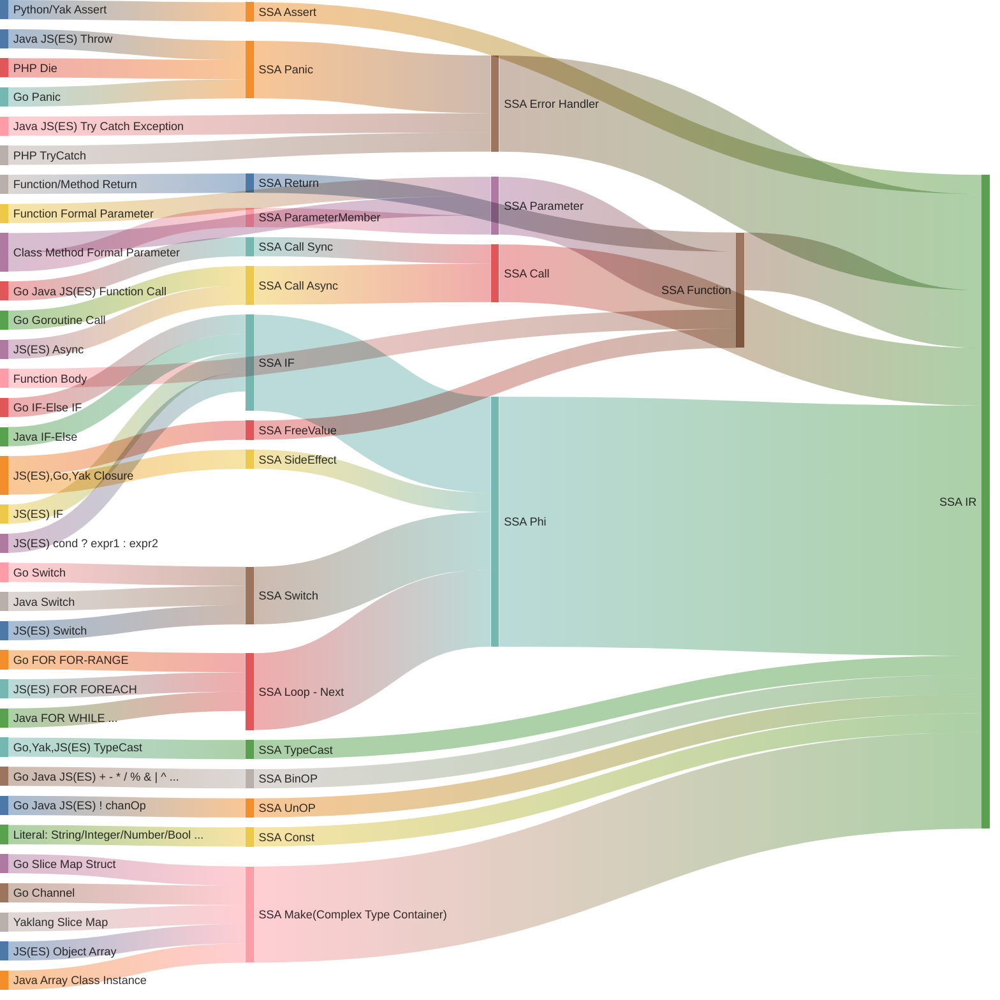
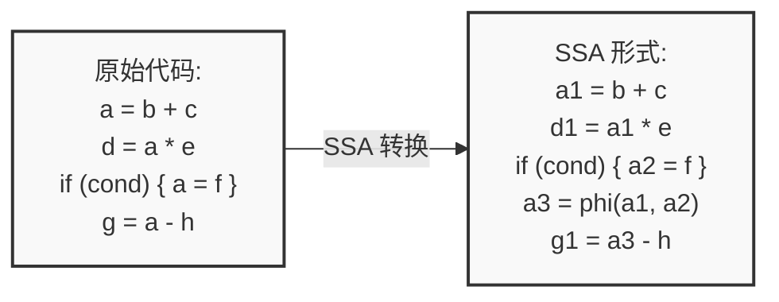
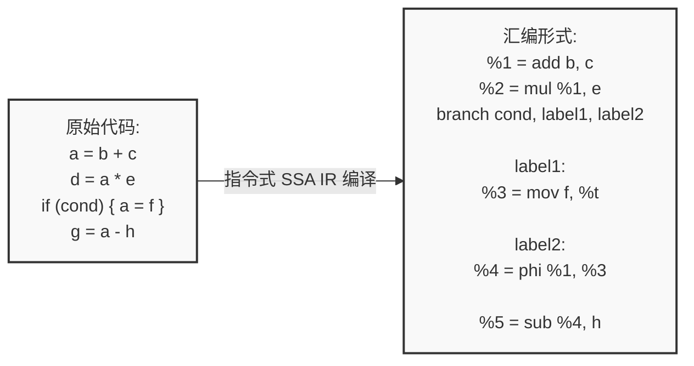
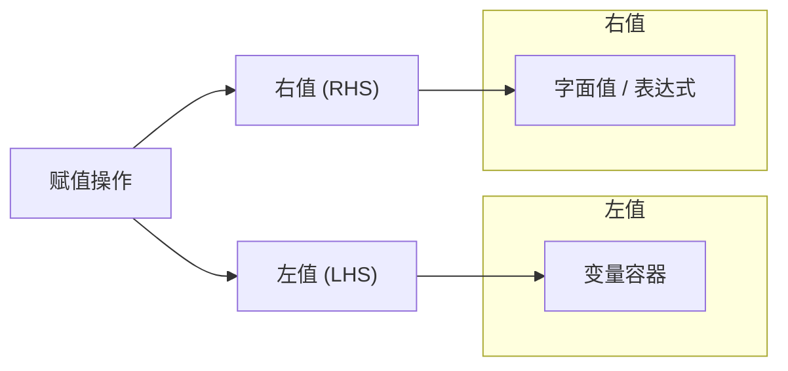
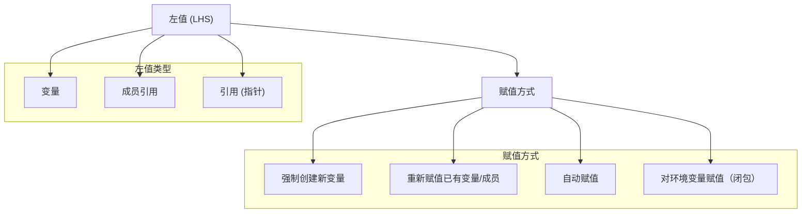
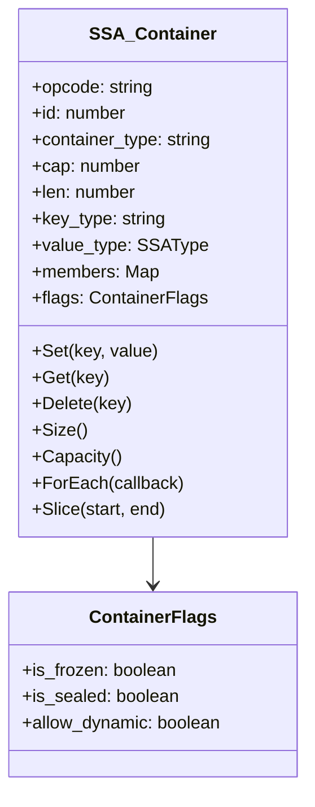
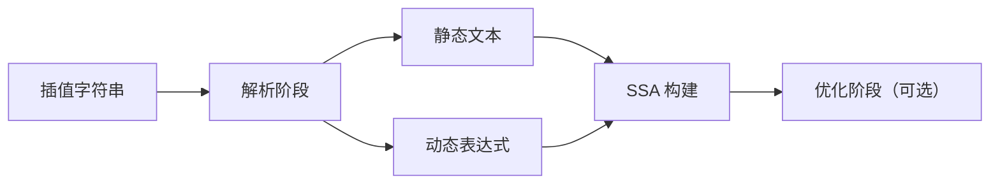
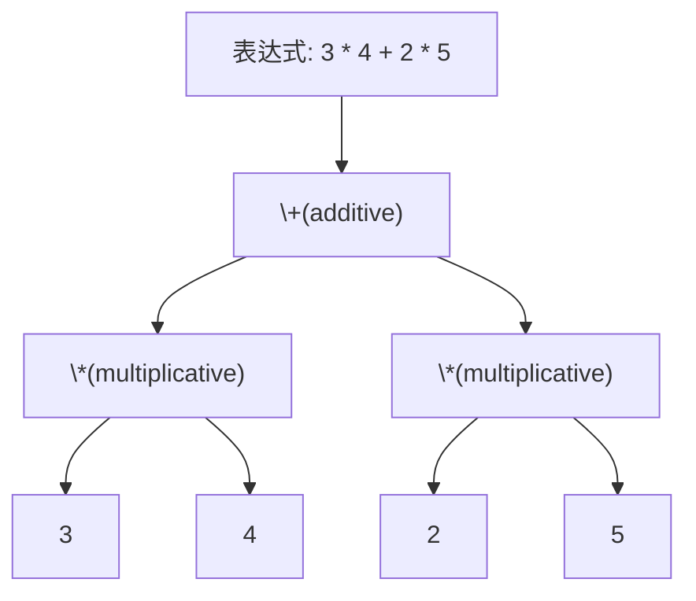
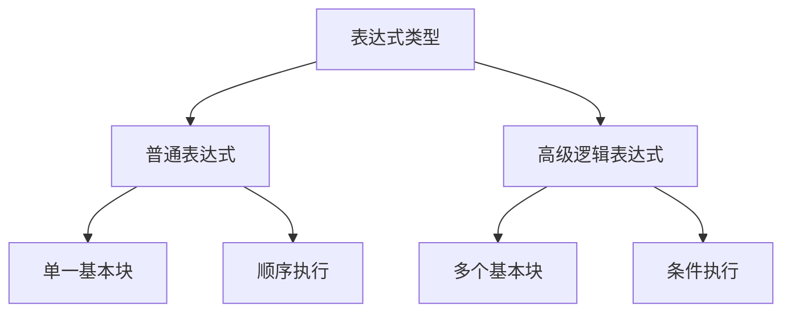
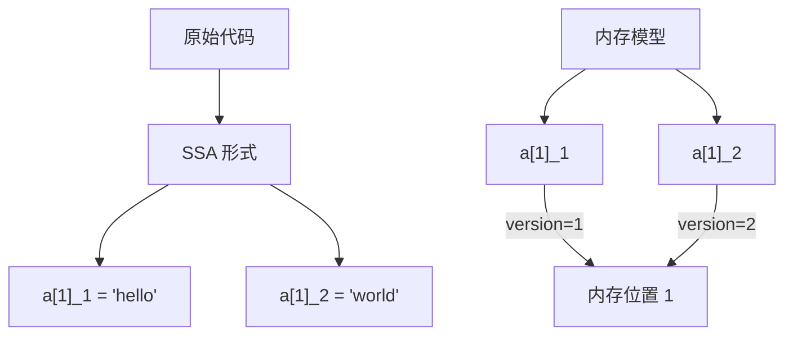

# 第三章：高级语言的 SSA 构建

import TOCInline from '@theme/TOCInline';
import { InlineMath, BlockMath } from 'react-katex';

<TOCInline toc={toc} />

--- 

本文讲介绍高级语言是如何翻译成 SSA 形式的。在开始介绍之前，我们先明确高级语言和相对的低级语言分别有什么样的区别。

## 背景：编程语言的高级与低级

高级编程语言是一类抽象层次高、接近人类思维的计算机语言，它们具有强大的表达能力、自动化的内存管理、丰富的内置数据结构和控制结构。这类语言（如Python、Java、JavaScript等）通常具有良好的可读性和可维护性，能够自动处理垃圾回收、类型推导等底层细节，并且具有出色的跨平台特性。高级语言的这些特性使得开发者能够更专注于业务逻辑的实现，而不必过多关注底层实现细节。

低级编程语言（如汇编语言和机器语言）则直接面向计算机硬件，与CPU架构紧密相关，需要程序员手动管理内存、显式声明类型，并且需要深入理解硬件细节。在编译过程中，高级语言转换为SSA形式时需要处理更复杂的语言特性，如异常处理、面向对象特性（继承、多态）、闭包等，这使得SSA构建过程比低级语言更为复杂。而低级语言由于其简单的语言特性和直接的硬件映射关系，其SSA构建过程相对简单。

| 对比维度 | 高级语言 | 低级语言 |
|---------|---------|---------|
| **内存管理** | • 自动垃圾回收(GC)<br/>• 自动内存分配和释放<br/>• 内存安全保证<br/>• 内存泄漏防护 | • 手动内存管理<br/>• 显式分配/释放<br/>• 指针直接操作<br/>• 需自行处理内存泄漏 |
| **类型系统** | • 动态类型/类型推导<br/>• 强类型安全检查<br/>• 复杂类型系统支持<br/>• 泛型和多态 | • 静态类型声明<br/>• 基本类型系统<br/>• 直接内存类型<br/>• 类型转换显式 |
| **抽象能力** | • 面向对象/函数式<br/>• 高阶函数支持<br/>• 闭包/Lambda<br/>• 模块化系统<br/>• 元编程能力 | • 过程式编程<br/>• 基础控制结构<br/>• 直接调用约定<br/>• 简单作用域<br/>• 宏替换 |
| **运行特性** | • 跨平台运行<br/>• 虚拟机/解释器<br/>• JIT编译优化<br/>• 运行时安全检查 | • 直接机器执行<br/>• 平台相关性强<br/>• AOT编译<br/>• 最小运行时开销 |
| **开发效率** | • 快速开发迭代<br/>• 丰富的生态系统<br/>• 大量第三方库<br/>• 完善的工具链 | • 开发周期长<br/>• 依赖较少<br/>• 工具链简单<br/>• 调试复杂 |
| **性能特点** | • 性能可预测性低<br/>• GC暂停<br/>• 额外运行时开销<br/>• 优化依赖编译器 | • 性能可预测<br/>• 直接硬件控制<br/>• 最小执行开销<br/>• 手动优化空间大 |
| **应用场景** | • Web应用开发<br/>• 企业应用<br/>• 数据分析<br/>• 快速原型<br/>• 应用层开发 | • 系统编程<br/>• 驱动开发<br/>• 嵌入式系统<br/>• 性能密集型<br/>• 底层开发 |
| **典型语言** | • Python/Ruby<br/>• Java/C#<br/>• JavaScript/TypeScript<br/>• Kotlin/Swift<br/>• Go/Rust(部分特性) | • 汇编语言<br/>• C语言<br/>• 机器码<br/>• LLVM IR |
| **编译特性** | • 复杂的编译优化<br/>• 多级中间表示<br/>• 复杂的SSA构建<br/>• 需要处理运行时特性 | • 简单的编译过程<br/>• 直接的代码生成<br/>• 简单的SSA形式<br/>• 静态编译链接 |

--- 

## 高级语言的 SSA 构建

高级编程语言和低级编程语言的 SSA IR 构建存在非常明显的差异。在高级编程语言中，由于其强大的抽象能力，需要处理更多的语言特性，如面向对象特性（继承、多态）、闭包等，这使得SSA构建过程比低级语言更为复杂。

但是实际上用户接触的大部分编程语言都是高级编程语言，直接使用低级语言的场景相对较少。因此，本文将重点介绍高级编程语言的 SSA 构建过程。

实际上基于高级语言构建 SSA 的过程，本质上是把各种高级语言特性编译成更低级的 IR 的过程。我们用一张图生动的描述我们接下来要讨论的内容：



## 目标产物：基于指令的 SSA IR

我们在前面的描述和案例中，讲到的 SSA 基本都是基于变量（Variable）的 SSA 形式。他的形式更接近编程语言的语义，但是这种形式在编译器后端并不常见。

编译器后端通常使用基于指令（Instruction）的 SSA IR 形式。基于指令的 SSA IR 更接近汇编语言，是一种更低级的表示形式。

:::tip

根据其表示粒度和抽象层次的不同，SSA 可以分为基于变量的 SSA 和基于指令的 SSA IR。这两种形式在编程语言语义和编译器后端实现中都有广泛应用。

:::

以下是对这两种 SSA 形式的详细对比。

### 基于变量的 SSA

基于变量的 SSA 更接近编程语言的语义，更符合人类的思维方式。也是我们前面讨论的 SSA 形式。这种 SSA 形式在教学中经常被使用。具体定义为：每个变量在程序中只赋值一次，通过引入新的变量版本来表示不同的赋值点。

#### 特点

- 高级抽象，更贴近高级编程语言的变量使用方式。
- 适用于前端优化和高级语言语义分析。

#### 典型案例




### 基于指令的 SSA IR

基于指令的 SSA IR 更接近汇编语言，是一种更低级的表示形式。可读性并不好，但是计算机和编程处理起来更高效。定义为：每条指令在 SSA 形式中只出现一次，使用 SSA 变量来表示指令的结果。

#### 特点

- 更低级，接近汇编语言或机器指令，更容易被再次深层编译为其他更低级的指令集。
- 适用于后端优化，例如基于数据流的活跃变量判断，常量折叠，分配，过程分析等。

#### 典型案例



### 两种 SSA 形式的对比

| **方面**           | **基于变量的 SSA** | **基于指令的 SSA IR** |
|--------------------|--------------------|-----------------------|
| **粒度**           | 高级变量级别       | 指令级别              |
| **抽象层次**       | 接近高级语言       | 接近汇编/机器指令     |
| **变量表示**       | 变量版本（x1, x2）  | SSA 变量对应指令输出   |
| **Phi 函数**       | 用于变量版本选择   | 用于指令输出选择      |
| **适用阶段**       | 前端优化、语义分析 | 后端优化、代码生成    |
| **优化目标**       | 数据流优化         | 深层数据流优化和指令优化            |
| **复杂性**         | 逻辑简单，计算机处理复杂           | 编译复杂，需处理指令依赖，但是数据流处理简单|
| **与语言结构的映射**| 直接对应语言变量   | 需要映射到具体指令    |

:::tip

在后续的讨论中，如果不特别说明，我们讨论的 SSA 形式都是基于指令的 SSA IR 形式。

后续出现的代码或者 SSA 编译脚手架也大部分都是基于指令的 SSA IR 形式。

:::

### 重要的额外补丁

我们并不推荐使用变量的 SSA 形式，因为其抽象层次较高，不利于计算机处理。因此我们后续的讨论都是基于指令的 SSA IR 形式。

但是实际上，我们在进行指令式 SSA IR 编译时，我们的处理方案细节并不和普通的指令式 SSA IR 编译相同，在很多细节上，我们进行实践性和工程性非常强的优化

#### 额外补丁一：指令ID全局唯一

在传统的静态单赋值（SSA, Static Single Assignment）表示法中，确保每条指令在其所属的基本块内部具有唯一性。然而，这仅满足了最基本的唯一性要求。在我们的编译过程中，我们引入了更为严格的约束，确保指令ID在全局范围内的唯一性。

这一设计使得指令ID不仅可以唯一标识一条指令，还无需关心该指令所在的具体基本块。这一特性在工程实践中具有显著优势，尤其是在与数据库系统集成时表现突出。具体而言，通过采用数据库的自增ID机制作为指令ID，我们能够将SSA的构建过程高效地存储到数据库中。这不仅简化了指令的追踪和管理，还极大地便利了调试和分析工作。

需要特别指出的是，这一全局唯一指令ID的设计在传统的SSA编译器实现中尚未普遍采用。因此，在实际应用中，开发者需明确区分并正确理解这一改进，以充分发挥其在优化和工程实现中的潜力。

#### 额外补丁二：定义域化变量系统辅助

尽管基于指令集的静态单赋值（SSA, Static Single Assignment）中间表示在工程实践中展现出显著优势，但其也存在一定的局限性，其中之一即无法直接将源代码中的变量与具体指令进行关联。为解决这一问题，在编译过程中，我们引入了词法变量辅助系统。该系统在构建指令的同时，维护一个索引结构，用于关联词法变量与相应的指令。

这一辅助系统的引入是必不可少的，原因在于基于指令的 SSA IR 编译过程中，指令的定义域（定义位置）与使用域（使用位置）是相互分离的。特别是在源代码中存在闭包（closure）等高级特性时，需要通过词法变量直接判断闭包所处的环境以及具体变量是否存在词法遮蔽（shadowing）的问题。因此，词法变量辅助系统不仅确保了变量与指令之间的正确映射，也保障了闭包等复杂结构在编译过程中的正确处理。

定义域变量系统辅助在基于指令的 SSA IR 编译中起到了关键作用，既弥补了指令级 SSA 表示在变量关联上的不足，又为处理高级语言特性提供了必要的支持。这一设计在提高编译器的灵活性和准确性方面具有重要意义，尤其在涉及复杂控制流和作用域管理的情况下，能够有效地提升编译过程的健壮性和优化效果。

--- 

## 语言基础特性的 SSA 构建

在对指令式SSA（静态单赋值）中间表示的基本概念有了前述理解之后，我们可以进一步探讨其在编译过程中对编程语言基础特性的处理方法。在高级编程语言中，赋值语句、表达式、语句块、流程控制结构以及函数构成了五个核心特性。这些特性几乎存在于所有主流编程语言中，构成了语言的基本构建模块。

:::tip

探讨语言基础特性的SSA编译是学习SSA编译的理想起点。由于这些基础特性在所有编程语言中普遍存在，其对应的SSA编译过程相对简单，易于理解。

这为后续涉及更复杂或高级语言特性的讨论提供了坚实的基础，帮助我们理解这些复杂特性是如何在基础特性之上构建的。

:::

### 深入理解赋值语句

赋值（Assignment）是编程语言中的基本操作之一，其本质在于将一个特定的值或表达式的计算结果绑定到一个变量上，从而更新该变量的状态。通过赋值，程序能够存储、修改和传递数据，使得程序能够根据不同的输入和条件执行相应的逻辑操作。

在SSA中，每个变量在其赋值时必须唯一，这意味着每个赋值操作都应生成一个新的变量版本。然而，如果一个赋值语句中的值未被后续使用，该赋值操作即为冗余，此时相关的变量实体无需创建（无需生成指令）。这种优化不仅减少了中间表示的冗余，也有助于提升后续优化和生成代码的效率。因此，在SSA构建过程中，识别并消除未使用的赋值语句是提升编译器性能的关键步骤之一。

虽然赋值语句产生的变量不直接生成指令，但是其产生的变量实体（变量容器）是后续指令的载体，因此变量实体是不可或缺的。同时赋值语句是一个非常重要的高级语言特性，我们有必要详细了解它。

有了上述基本概念之后，我们继续深入介绍赋值这个操作：在编程语言中，赋值操作通常涉及两个部分：左值（Left Value，**LHS**）和右值（Right Value，**RHS**）。理解这两者的区别对于编译器设计和代码优化至关重要。

- **左值（LHS）：** 表示赋值操作中的目标位置，即变量或内存位置。左值不一定会生成指令的变量容器，尤其是在优化过程中，某些左值可能会被消除或重用，同时在指令式 SSA IR 中，左值也不一定需要生成指令，通常左值都会只作为辅助构建指令的容器存在。
  
- **右值（RHS）：** 表示赋值操作中的源数据，即字面值、表达式或计算结果。右值通常是一个具体的值或通过表达式计算得到的结果，将被赋给左值。

#### 图示左右值

以下是一个使用 Mermaid 语言绘制的赋值操作中左值和右值的示意图：



#### 左值：不一定生成指令的变量容器

在赋值操作中，左值（Left Value，LHS）代表赋值的目标。理解左值的类型及其赋值方式对于编译器设计和代码优化至关重要。左值不一定会生成指令的变量容器，这取决于优化策略和上下文。下面将详细介绍左值的类型及其赋值方式。

#### 左值的类型

1. **变量**
   
   变量是最常见的左值类型，直接绑定到存储位置，用于存储数据。例如：
   
   ```c
   int x = 10;
   ```
   
   在这个例子中，`x` 是一个变量，作为左值接受值 `10` 的赋值。

2. **成员引用**
   
   成员引用涉及对结构体、类、数组或切片成员的访问和赋值。例如：
   
   ```c
   struct Point {
       int x;
       int y;
   };
   
   Point p;
   p.x = 5;  // p.x 是成员引用的左值
   ```
   
   在这里，`p.x` 是左值，用于赋值 `5`。

3. **引用（指针）**
   
   引用类型允许通过指针间接访问和赋值。例如：
   
   ```c
   int a = 10;
   int *ptr = &a;
   *ptr = 20;  // *ptr 是指针引用的左值
   ```
   
   在这个例子中，`*ptr` 是通过指针 `ptr` 解引用得到的左值，赋值操作将 `20` 赋给 `a`。

---
##### 对左值赋值的方式

赋值方式可以根据不同需求进行分类，主要包括以下几种：

1. **强制创建一个新变量**
   
   在某些上下文中，赋值操作需要强制创建一个新的变量。这通常发生在静态单赋值（SSA）中，每次赋值都会生成一个新的变量实例。例如：
   
   ```plaintext
   a1 = 5
   a2 = 10
   ```
   
   每次赋值都会创建一个新的变量版本，`a1` 和 `a2` 是不同的变量实例。

2. **对已经有的变量（成员）进行重新赋值（更新，传递）**
   
   对已有变量或其成员进行重新赋值，更新其值。例如：
   
   ```python
   x = 5
   x = x + 3  # 对现有变量 x 进行重新赋值
   ```
   
   成员赋值类似：
   
   ```c
   p.x = 15;  // 更新结构体 p 的成员 x
   ```

3. **自动赋值（自动创建变量，并赋值，如果变量已存在就对已有变量赋值）**
   
   自动赋值是指在赋值时，编译器或解释器会自动处理变量的创建和赋值，无需显式创建新的变量实例。例如在某些动态语言中：
   
   ```python
   y = 10  # 自动创建变量 y 并赋值 10
   y = y + 5  # 赋值给已存在的 y
   ```

4. **对环境变量赋值（闭包）**
   
   在闭包（closures）中，赋值操作可能影响环境变量，即在函数外部定义的变量。例如：
   
   ```javascript
   let count = 0;
   function increment() {
       count += 1;  // 修改环境变量 count
   }
   ```
   
   在这个例子中，`count` 是闭包环境中的变量，通过赋值操作更新其值。

##### 概念图示

为了更直观地展示左值的类型及赋值方式，以下是使用 Mermaid 绘制的示意图：



#### 类型赋值

在编程语言中，赋值操作不仅传递值，还涉及类型的传递与推导。理解赋值中类型的传递方式对于类型系统的设计、类型安全性以及代码的可读性和维护性至关重要。本文将详细探讨赋值中类型传递的两种主要情况：

1. 类型在左值中：类型限定
2. 类型在右值中：类型推导

当赋值语句的左侧（左值）明确指定了类型时，赋值操作受该类型的约束。这种情况下，右值必须与左值的类型兼容，或者能够隐式转换为左值的类型。

##### 特点

- 明确性：开发者明确指定了变量的类型，增强了代码的可读性和可维护性。
- 类型安全：编译器能够在编译时检查类型一致性，减少运行时错误。
- 类型限定：限制了右值的类型，确保赋值的正确性。


##### 示例

C语言中的类型限定

```c
int a = 10;       // 左值类型为 int，右值为整型常量 10
double b = 3.14;  // 左值类型为 double，右值为浮点数 3.14

struct Point {
    int x;
    int y;
} p;

p.x = 5;          // 左值 p.x 类型为 int，右值为整型常量 5
```

Go语言中的类型限定

```go
var count int = 100  // 左值类型为 int，右值为整型常量 100

type Person struct {
    Name string
    Age  int
}

var person Person
person.Age = 30      // 左值类型为 int，右值为整型常量 30
```

TypeScript中的类型限定

```typescript
let message: string = "Hello, World!";  // 左值类型为 string，右值为字符串

interface User {
    id: number;
    name: string;
}

let user: User = { id: 1, name: "Alice" };  // 左值类型为 User，右值为符合接口的对象
```

:::tip

当我们了解 “赋值语句” 和 “左值” 的本质之后，就可以开始尝试真正的可以生成指令的编译了。

:::

### 右值编译：字面值与特殊字面值

区别于不会生成指令的“左值（LHS）”，右值（RHS）是会生成指令的。我们可以从最基础的字面量开始。一般我们认为字面量有三大类，分别为：基础类型字面量，复合类型字面量，高级字面量。

在这些字面量中，我们一般只直接讨论和处理基础字面量和复合字面量。高级字面量并不是每一种语言都会存在，并且一般会在编译器中进行特殊处理，转化成已有的基础字面量和复合字面量的组合，或者表达式组合。

#### 基础类型字面量：数字，布尔，字符串

一般情况下，基础类型字面量都会被视为一个整体来处理，不会进行分解，所以我们定义一个基础字面量的时候，包含两个部分：字面量类型，字面量值。

参考如下结构设计，我们可以让 SSA Literal 或者 SSA Const 来表示一个基础类型字面量：

:::tip

为了后面统一表达，我们后面使用 SSA Const 来代表编译字面量值（Literal）的指令。

:::

```typescript
type SSA_Literal = {
  type: "prime_type";
  value: "[literal_value]";
}
```

至少保证上述结构能够表示一个基础类型字面量。我们就可以得到一个例子：

```typescript
const a = 10;
```

可以把 `10` 视为一个字面量值，它的 SSA 指令为：`{ opcode: "ssa-const", type: "literal", value: "10" }`

:::tip

在实际的 SSA 编译中，我们建议把所有的 SSA Const 都认为是一个指令，他的 ID 不同。

即：数字 `10` 和 `100` 的 SSA 指令 ID 不同。但是他们的 opcode 都是 `ssa-const`，type 都是 `number / integer`。

同样的，字符串 `"hello"` 和 `"world"` 的 SSA 指令 ID 不同。但是他们的 opcode 都是 `ssa-const`，type 都是 `string`。

:::

在数据流的角度上来说，他们都是 `ssa-const` 指令，只是 value 不同。据此，我们设计出了第一个 SSA 指令（其结构描述的伪代码如下）：

```typescript
type SSA_Const = {
  opcode: "ssa-const";
  id: number;
  type: "number" | "string" | any;
  value: string;
}
```

:::note

虽然我们上面的结构描述代码使用了 TypeScript 的语法，但是请记住，这只是为了方便理解，在实际的 SSA 编译中，我们的结构会更加复杂，需要存储 SSA 指令之间的关系或者额外信息需要开启大量的额外字段。

:::

#### 复合类型字面量：容器

在掌握了基本类型字面量的形式化表示后，我们可以进一步探讨复合类型字面量系统的构建理论。

在复合类型字面量的形式化定义中，容器类型通常被视为一个固定的抽象接口。这种抽象类似于 EcmaScript 规范中的 Object 原型，它提供了一个统一的对象操作接口，支持多态性引用和动态派发。

:::tip 多语言实现范式
值得注意的是，这种容器抽象在不同语言实现中呈现出不同的特征。例如，PHP 的实现中采用了统一数组（Array）作为基础容器，通过支持任意类型的键值对映射，实现了数组和关联数组（字典）的双重语义。这种设计展现了容器抽象的灵活性。
:::

因此，在设计支持复合类型的高级 SSA（Static Single Assignment）中间表示时，复合类型字面量的形式化表示和操作语义是需要重点考虑的核心问题。

对于采用 classless 范式的动态类型语言（如 PHP 或 EcmaScript），其中间表示可以采用统一的容器抽象，该抽象需要同时满足序列容器（Array）和关联容器（Object）的操作语义。这种设计既简化了类型系统的复杂度，又保持了足够的表达能力。


:::info 无类（Classless）语言的形式化定义

无类（Classless）语言范式是一种去中心化的类型系统设计方法，其形式化定义可表示为：

1. **原型链接机制（Prototype Linkage）**：
   对象间的关系通过原型链接（prototype link）而非类继承建立，可表示为：
   <BlockMath math="O_2 \rightarrow O_1 \rightarrow O_0" />
   其中 <InlineMath math="O_i" /> 表示对象，<InlineMath math="\rightarrow" /> 表示原型链接。

2. **动态分派（Dynamic Dispatch）**：
   方法调用的解析过程可形式化为：
   <BlockMath math="dispatch(obj, method) = lookup(obj, method) \lor lookup(prototype(obj), method)" />

3. **属性访问语义（Property Access Semantics）**：
   对于任意对象 <InlineMath math="o" /> 和属性 <InlineMath math="p" />：
   <BlockMath math="access(o, p) = o[p] \lor access(prototype(o), p)" />

这种范式在编译器实现中具有以下特征：

- **统一存储模型**：对象和数组共享相同的底层存储结构
- **动态类型检查**：类型检查在运行时而非编译时执行
- **属性查找优化**：通常需要实现内联缓存（Inline Caching）等优化技术

相比传统的基于类的语言，无类范式在编译器实现上需要更复杂的运行时系统支持，但提供了更大的动态性和表达灵活性。
:::

在我们的目标产物中，需要讨论复合类型字面量显然不可以用 Const 来表示，所以需要设计一个新的指令来表示复合类型字面量。这个新的指令产生的容器，需要支持各种各样的成员操作以方便后续我们可以实现 classless 的特性。

* 支持成员变量的增删改查
* 支持容器大小，容器容量的配置
* 支持容器的 Key 可自定义（对于数组来说是 Integer，对于 Object 来说是 String 或者 Any 类型）
* 支持成员使用 `[ ]` 的调用方式访问
* 支持成员使用 `.` 的调用方式访问

:::tip

在 SSA 中处理复合类型字面量是一个重要的设计决策，因为它直接影响到后续的代码生成阶段或模拟复杂 OOP 的实现。

:::

根据上面的需求来设计这个新的复合类型字面量容器，会有如下特点：

* 统一性：
    1. 使用同一个指令类型处理数组、对象和映射
    2. 通过 container_type 区分具体类型
    3. 统一的成员访问接口

* 类型安全：
    1. 明确的键类型和值类型定义
    2. 支持类型检查和验证
    3. 与 SSA 类型系统的集成

* 灵活性：
    1. 支持动态扩容
    2. 支持多种访问方式（下标、点号）
    3. 可配置的容器行为（通过 flags）


我们根据上述内容，设计出复合类型字面量的 SSA 指令（伪代码）：

```typescript
type SSA_Container = {
  // 基础 SSA 信息
  opcode: "ssa-container";
  id: number;
  
  // 容器类型信息
  container_type: "array" | "object" | "map";
  
  // 容量相关
  cap: number;  // 当前分配的容量
  len: number;  // 当前使用的长度
  
  // 类型信息
  key_type: "number" | "string" | "any";
  value_type: SSAType;  // 使用统一的类型系统
  
  // 成员存储
  members: {
    [key: string | number]: SSAValue;  // SSAValue 是所有 SSA 值的联合类型
  };
  
  // 元数据
  flags: {
    is_frozen: boolean;     // 是否允许修改
    is_sealed: boolean;     // 是否允许添加/删除属性
    allow_dynamic: boolean; // 是否允许动态添加新类型
  };
}

// 扩展接口定义
interface SSA_Container {
  // 基础操作
  Set(key: any, value: SSAValue): void;
  Get(key: any): SSAValue;
  Delete(key: any): boolean;
  
  // 容量管理
  Size(): number;
  Capacity(): number;
  SetCapacity(newCap: number): void;
  
  // 迭代器支持
  ForEach(callback: (key: any, value: SSAValue) => void): void;
  Keys(): Array<any>;
  Values(): Array<SSAValue>;
  
  // 数组特有操作
  Slice(start: number, end: number): SSA_Container;
  Push(value: SSAValue): number;
  Pop(): SSAValue;
  
  // 访问器支持
  GetMemberByKey(key: any): SSAValue;
  GetMemberByDot(name: string): SSAValue;
  
  // 类型检查
  HasMember(key: any): boolean;
  GetKeyType(): string;
  GetValueType(): SSAType;
  
  // 元数据操作
  Freeze(): void;
  Seal(): void;
  IsSealed(): boolean;
  IsFrozen(): boolean;
}
```

我们使用一个更直观的类图来表示上述内容如下：



---

有了设计指南之后，考虑如下内容：

```
const obj = {"key": "value", "foo": "bar"};

// 编译后
t1 = new(ssa-container)
t1_key = new(ssa-const("value"))   # 通过 t1.Set("key", "value") 生成
t1_foo = new(ssa-const("bar"))     # 通过 t1.Set("foo", "bar") 生成
```

与之相对的，如果要承载一个 `[ ]` 那么我们可以考虑如下代码的抽象翻译：

```
const arr = [1, 2, 3, 4, 5];

// 编译后
t2 = new(ssa-container)
t2[0] = new(ssa-const(1)) # 通过 t2.Set(0, 1) 生成
t2[1] = new(ssa-const(2)) # 通过 t2.Set(1, 2) 生成
t2[2] = new(ssa-const(3)) # 通过 t2.Set(2, 3) 生成
t2[3] = new(ssa-const(4)) # 通过 t2.Set(3, 4) 生成
t2[4] = new(ssa-const(5)) # 通过 t2.Set(4, 5) 生成
```

虽然我们使用了 `[ ]` 的语法，但是实际上我们还是需要使用 `Set` 方法来设置成员，所以这个语法只是为了方便理解。我们在上述编译过程中省略掉了一些类型处理和推断的细节，在实际的编译过程中，我们还需要考虑更多的类型信息或者这个容器的容量问题。


:::info 课外读物：深入考虑更多编译参数

对于对象字面量，完整的编译过程应该是这样的：

```typescript
// 源代码
const obj = {"key": "value", "foo": "bar"};

// 完整的 SSA 形式
t1 = new(ssa-container) {
    container_type: "object",
    key_type: "string",
    value_type: "string",
    cap: 4,        // 预分配合适的容量
    len: 2,        // 当前实际长度
    flags: {
        is_frozen: false,
        is_sealed: false,
        allow_dynamic: true
    }
}

t1_key_val = new(ssa-const("value"))
t1_foo_val = new(ssa-const("bar"))

t1.Set("key", t1_key_val)  // 设置第一个属性
t1.Set("foo", t1_foo_val)  // 设置第二个属性
```


info 数组字面量的编译

对于数组字面量，完整的编译过程如下：

```typescript
// 源代码
const arr = [1, 2, 3, 4, 5];

// 完整的 SSA 形式
t2 = new(ssa-container) {
    container_type: "array",
    key_type: "number",
    value_type: "number",
    cap: 8,        // 预分配略大于实际需求的容量
    len: 5,        // 当前实际长度
    flags: {
        is_frozen: false,
        is_sealed: false,
        allow_dynamic: true
    }
}

// 创建常量值
t2_0_val = new(ssa-const(1))
t2_1_val = new(ssa-const(2))
t2_2_val = new(ssa-const(3))
t2_3_val = new(ssa-const(4))
t2_4_val = new(ssa-const(5))

// 按顺序设置数组元素
t2.Set(0, t2_0_val)
t2.Set(1, t2_1_val)
t2.Set(2, t2_2_val)
t2.Set(3, t2_3_val)
t2.Set(4, t2_4_val)
```

:::


#### 特殊字面量：插值字符串

在介绍完基本的字面量之后，我们接下来介绍特殊字面量：插值字符串。

插值字符串（Template Literals）是一种特殊的字符串字面量形式，它允许在字符串中嵌入表达式和变量。通过特定的语法（如 JavaScript 中的 `${...}` 或 Python 中的 f-strings `{...}`），它能够在字符串中直接引用和计算表达式的值，使字符串构造更加灵活和直观。从编译器的角度看，它是由静态文本片段和动态表达式片段组成的复合字面量，需要在编译时解析这些片段，并在运行时将它们求值和拼接成最终的字符串。

插值字符串的核心特征：

1. 支持字符串中嵌入表达式
2. 允许多行字符串表示
3. 在编译时解析，运行时求值

这种字面量形式大大提升了字符串处理的可读性和维护性，是现代编程语言中常见的特性。

:::tip EcmaScript 的插值字符串

```javascript
// ES6+ 的插值字符串语法
const name = "World";
const greeting = `Hello ${name}!`;  // 输出: Hello World!

// 支持多行
const multiline = `
    line 1
    line 2
    line ${2 + 1}
`;

// 支持表达式
const sum = `The sum is ${10 + 20}`;  // 输出: The sum is 30

// 支持嵌套
const nested = `Value: ${`nested ${name}`}`;
```
:::

:::tip Python 中的插值字符串

```python
# Python 中的插值字符串语法
name = "World"
greeting = f"Hello {name}!"  # 输出: Hello World!
```
:::

更接近本质的说，插件字符串是字符串拼接的语法糖，在编译器中，我们可以将插值字符串编译为字符串拼接的指令。

参考如下思路：



在 SSA 中，插值字符串的处理可以分为以下几个关键步骤：

1. **解析阶段**：将插值字符串拆分为静态文本和动态表达式
2. **SSA 构建**：为每个部分生成相应的 SSA 指令
3. **优化阶段（可选）**：进行常量折叠等优化

#### SSA 中的表示插值字符串编译

```typescript
// 源代码: 定义一个插值字符串
const name = "World";                   // 定义一个变量 name
const greeting = `Hello ${name}!`;      // 使用插值语法构建字符串

// SSA 形式: 将插值字符串拆解为多个基本操作
t1 = new(ssa-const("World"))           // 创建常量指令存储 name 的值 "World"
t2 = new(ssa-const("Hello "))          // 创建常量指令存储第一个文本片段 "Hello "
t3 = new(ssa-const("!"))               // 创建常量指令存储最后的文本片段 "!"

// 字符串拼接操作
t4 = add t2, t1                        // 拼接 "Hello " 和 name 的值
t5 = add t4, t3                        // 拼接前面的结果和 "!"
                                       // 最终 t5 存储完整的字符串 "Hello World!"
```

:::tip
表达式的 SSA 构建是编译器中的一个核心环节。在处理插值字符串时，我们需要：
1. 识别和解析表达式
2. 为表达式生成正确的 SSA 形式
3. 处理表达式求值的副作用
:::

这为我们引入了下一个重要话题：表达式的 SSA 构建。在表达式构建中，我们将详细探讨：

- 表达式的语法树理解
- 表达式的 SSA 转换规则

### 右值编译：低级表达式的 SSA 构建

在进行我们这个章节之前，我们需要读者重新学习一下，AST 的相关概念，特别是表达式的 AST 构建。

参考如下 eBNF 中的表达式语法以及优先级排布（yaklang syntax g4）

```antlr4
expression
    // 单目运算
    : typeLiteral '(' ws* expression? ws* ')'
    | literal
    | anonymousFunctionDecl
    | panicStmt
    | recoverStmt
    | Identifier
    | expression (memberCall | sliceCall | functionCall)
    | parenExpression
    | instanceCode // 闭包，快速执行代码 fn{...}
    | makeExpression // make 特定语法
    | unaryOperator expression

    // 二元运算（位运算全面优先于数字运算，数字运算全面优先于高级逻辑运算）
    | expression bitBinaryOperator ws* expression

    // 普通数学运算
    | expression multiplicativeBinaryOperator ws* expression
    | expression additiveBinaryOperator ws* expression
    | expression comparisonBinaryOperator ws* expression

    // 包含运算仍然是初级逻辑
    | expression 'not'? 'in' expression

    // 高级逻辑
    | expression '&&' ws* expression
    | expression '||' ws* expression
    | expression '?' ws* expression ws* ':' ws* expression

    // 管道操作符
    | expression '<-' expression
    ;
```

在深入 SSA 构建之前，我们需要理解表达式的语法结构。上述 eBNF 语法展示了表达式的优先级和结构关系，这些在 AST 构建阶段就已经被正确处理。

观察如下表达式的 AST 结构，我们就可以轻易发现，我们只需要对每一个节点进行 SSA 编译即可，而不需要考虑优先级（这是编译前端的词法语法需要解决的问题）。



值得一题的是，表达式并不是所有的被 AST 切分的都可以直接编译节点，表达式我们可以分为两大类：

* **基础表达式（普通表达式）**：算术运算，位运算等
* **高级表达式（流程控制）**：逻辑运算，短路运算，三元选择等；

并且高级表达式随着语法演进，也出现了很多 EcmaScript 的稀有案例，比如 `??` 表达式，`?.` 表达式等；

#### 普通表达式与高级逻辑表达式的本质区别

普通表达式（如算术运算、位运算等）和高级逻辑表达式（如 `&&`、`||`、条件表达式 `?:`）有着本质的区别：

:::tip 核心区别
**普通表达式**是纯粹的计算过程，其所有操作数都会被执行求值，且求值顺序不会影响最终结果。而**高级逻辑表达式**实际上是一种隐含的流程控制结构，它可能不会执行所有操作数的求值，其执行路径取决于前序条件的结果。
:::


例如，考虑以下两种表达式：

```typescript
// 普通表达式
let result1 = a + b * c;  // 所有操作数 a、b、c 都会被求值

// 高级逻辑表达式
let result2 = condition && doSomething();  // doSomething() 可能不会被执行
```


这种区别在 SSA 构建时有着重要的影响：



因此，高级逻辑表达式的 SSA 构建需要引入基本块（Basic Block）和控制流图（Control Flow Graph）的概念，这使得它们的处理更接近于流程控制语句（如 if-else、while 等），而不是简单的表达式计算。这个重要的区别将在后续的流程控制章节中详细讨论。

#### 最简单的表达式编译

根据上面的结论，我们需要对每一个 AST 节点进行 SSA 编译，假定操作符号为 `+`，那么我们就可以轻易写出如下代码：

```typescript
// 源代码
let result = a + b;

// SSA 形式
t1 = add a, b
```

这非常简单，同样的规则，我们可以拓展到绝大多数简单的表达式中。

`+`, `-`, `*`, `/`, `%`, `&`, `|`, `^`, `<<`, `>>`, `>>>`, `==`, `!=`, `>`, `>=`, `<`, `<=`

这些符号均有这样的特性，我们设计一个通用的 SSA 指令即可，这个指令包含三个必要元素：

* 操作符
* 操作数1
* 操作数2

参考如下伪代码做设计：

```typescript
interface BinarySSAInstruction {
    operator: string;      // 操作符
    operand1: SSAValue;    // 第一个操作数
    operand2: SSAValue;    // 第二个操作数
}
```

我们可以将所有基本的二元运算符映射到对应的 SSA 指令。

:::tip

除此之外，我们可以类比一元表达式，一元表达式通常是 `!` 和 `-` 操作符，它们只接受一个操作数。

当然，还有管道符等问题，我们在这里不做讨论（我们可以把它当做一个语法糖，实际可以映射到方法调用 / 函数调用上来）。

:::

#### 成员表达式的 SSA 转换

在 SSA 形式中，每个变量只能被赋值一次。对于成员表达式，我们需要特别处理，因为它实际上代表了一个内存位置的访问。我们可以将其设计为：

```typescript
interface MemberAccessInstruction {
    base: SSAValue;        // 基础对象
    member: string | SSAValue; // 成员名称或索引
    version: number;       // SSA 版本号
}
```

让我用 mermaid 来展示这个转换过程：



##### 版本化规则

:::tip
成员表达式的版本化需要遵循以下规则：

1. 每次对同一位置的写入操作都会生成一个新的版本
2. 读取操作总是使用最新的版本
3. 版本号是针对整个成员访问表达式的，而不是基础对象
:::

##### 实现示例

让我们看一个具体的实现示例：

```typescript
interface MemberSSAValue extends SSAValue {
    kind: 'member';
    base: SSAValue;
    member: string | SSAValue;
    version: number;
}

function createMemberAccess(base: SSAValue, member: string | SSAValue): MemberSSAValue {
    return {
        kind: 'member',
        base,
        member,
        version: getNextVersion(base, member) // 获取下一个版本号
    };
}
```

##### 转换过程

对于如下代码：

```typescript
a[1] = "hello";  // 创建 a[1]_1
b = a[1];        // 使用 a[1]_1
a[1] = "world";  // 创建 a[1]_2
c = a[1];        // 使用 a[1]_2
```

转换为 SSA 形式：

```typescript
a[1]_1 = "hello"
b_1 = a[1]_1
a[1]_2 = "world"
c_1 = a[1]_2
```

##### 重要考虑点

:::tip
在实现这种成员访问的 SSA 转换时，需要特别注意：

1. 基础对象（base）的版本管理
2. 索引/成员（member）如果是变量时的版本管理
3. 确保正确追踪每个成员访问的最新版本
4. Phi 函数在控制流汇合点的处理
:::

这种设计方式确保了 SSA 形式的正确性，同时保持了成员访问的语义完整性。每个成员访问都被视为一个独立的 SSA 值，具有自己的版本号，这样就能正确处理赋值和使用的关系。

#### 函数调用表达式

### 流程控制：分支、循环和高级表达式

### 函数内（过程内） SSA 构建

### 函数本身的 SSA 构建

## 高级语言特性构建

### 闭包函数中的 SSA 问题

### OOP 中的 SSA 问题
