# 第三章：高级语言的 SSA 构建（一）

import TOCInline from '@theme/TOCInline';
import Math, { InlineMath, BlockMath } from '@site/src/components/Math';

<TOCInline toc={toc} />

--- 

本文讲介绍高级语言是如何翻译成 SSA 形式的。在开始介绍之前，我们先明确高级语言和相对的低级语言分别有什么样的区别。

## 背景：编程语言的高级与低级

高级编程语言是一类抽象层次高、接近人类思维的计算机语言，它们具有强大的表达能力、自动化的内存管理、丰富的内置数据结构和控制结构。这类语言（如Python、Java、JavaScript等）通常具有良好的可读性和可维护性，能够自动处理垃圾回收、类型推导等底层细节，并且具有出色的跨平台特性。高级语言的这些特性使得开发者能够更专注于业务逻辑的实现，而不必过多关注底层实现细节。

低级编程语言（如汇编语言和机器语言）则直接面向计算机硬件，与CPU架构紧密相关，需要程序员手动管理内存、显式声明类型，并且需要深入理解硬件细节。在编译过程中，高级语言转换为SSA形式时需要处理更复杂的语言特性，如异常处理、面向对象特性（继承、多态）、闭包等，这使得SSA构建过程比低级语言更为复杂。而低级语言由于其简单的语言特性和直接的硬件映射关系，其SSA构建过程相对简单。

| 对比维度 | 高级语言 | 低级语言 |
|---------|---------|---------|
| **内存管理** | • 自动垃圾回收(GC)<br/>• 自动内存分配和释放<br/>• 内存安全保证<br/>• 内存泄漏防护 | • 手动内存管理<br/>• 显式分配/释放<br/>• 指针直接操作<br/>• 需自行处理内存泄漏 |
| **类型系统** | • 动态类型/类型推导<br/>• 强类型安全检查<br/>• 复杂类型系统支持<br/>• 泛型和多态 | • 静态类型声明<br/>• 基本类型系统<br/>• 直接内存类型<br/>• 类型转换显式 |
| **抽象能力** | • 面向对象/函数式<br/>• 高阶函数支持<br/>• 闭包/Lambda<br/>• 模块化系统<br/>• 元编程能力 | • 过程式编程<br/>• 基础控制结构<br/>• 直接调用约定<br/>• 简单作用域<br/>• 宏替换 |
| **运行特性** | • 跨平台运行<br/>• 虚拟机/解释器<br/>• JIT编译优化<br/>• 运行时安全检查 | • 直接机器执行<br/>• 平台相关性强<br/>• AOT编译<br/>• 最小运行时开销 |
| **开发效率** | • 快速开发迭代<br/>• 丰富的生态系统<br/>• 大量第三方库<br/>• 完善的工具链 | • 开发周期长<br/>• 依赖较少<br/>• 工具链简单<br/>• 调试复杂 |
| **性能特点** | • 性能可预测性低<br/>• GC暂停<br/>• 额外运行时开销<br/>• 优化依赖编译器 | • 性能可预测<br/>• 直接硬件控制<br/>• 最小执行开销<br/>• 手动优化空间大 |
| **应用场景** | • Web应用开发<br/>• 企业应用<br/>• 数据分析<br/>• 快速原型<br/>• 应用层开发 | • 系统编程<br/>• 驱动开发<br/>• 嵌入式系统<br/>• 性能密集型<br/>• 底层开发 |
| **典型语言** | • Python/Ruby<br/>• Java/C#<br/>• JavaScript/TypeScript<br/>• Kotlin/Swift<br/>• Go/Rust(部分特性) | • 汇编语言<br/>• C语言<br/>• 机器码<br/>• LLVM IR |
| **编译特性** | • 复杂的编译优化<br/>• 多级中间表示<br/>• 复杂的SSA构建<br/>• 需要处理运行时特性 | • 简单的编译过程<br/>• 直接的代码生成<br/>• 简单的SSA形式<br/>• 静态编译链接 |

--- 

## 高级语言的 SSA 构建

高级编程语言和低级编程语言的 SSA IR 构建存在非常明显的差异。在高级编程语言中，由于其强大的抽象能力，需要处理更多的语言特性，如面向对象特性（继承、多态）、闭包等，这使得SSA构建过程比低级语言更为复杂。

但是实际上用户接触的大部分编程语言都是高级编程语言，直接使用低级语言的场景相对较少。因此，本文将重点介绍高级编程语言的 SSA 构建过程。

实际上基于高级语言构建 SSA 的过程，本质上是把各种高级语言特性编译成更低级的 IR 的过程。我们用一张图生动的描述我们接下来要讨论的内容：

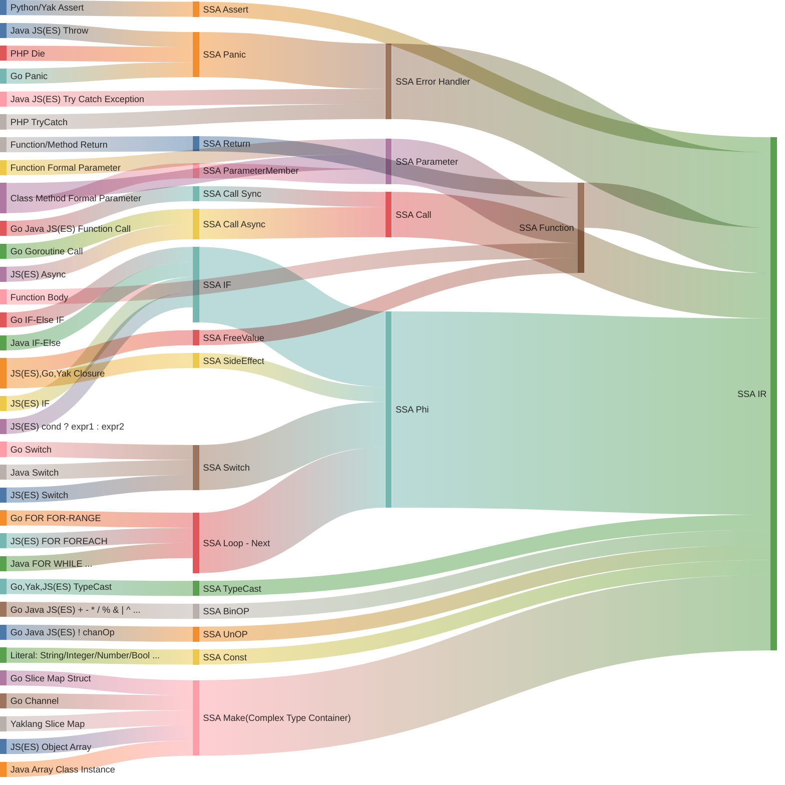

## 目标产物：基于指令的 SSA IR

我们在前面的描述和案例中，讲到的 SSA 基本都是基于变量（Variable）的 SSA 形式。他的形式更接近编程语言的语义，但是这种形式在编译器后端并不常见。

编译器后端通常使用基于指令（Instruction）的 SSA IR 形式。基于指令的 SSA IR 更接近汇编语言，是一种更低级的表示形式。

:::tip

根据其表示粒度和抽象层次的不同，SSA 可以分为基于变量的 SSA 和基于指令的 SSA IR。这两种形式在编程语言语义和编译器后端实现中都有广泛应用。

:::

以下是对这两种 SSA 形式的详细对比。

### 基于变量的 SSA

基于变量的 SSA 更接近编程语言的语义，更符合人类的思维方式。也是我们前面讨论的 SSA 形式。这种 SSA 形式在教学中经常被使用。具体定义为：每个变量在程序中只赋值一次，通过引入新的变量版本来表示不同的赋值点。

#### 特点

- 高级抽象，更贴近高级编程语言的变量使用方式。
- 适用于前端优化和高级语言语义分析。

#### 典型案例

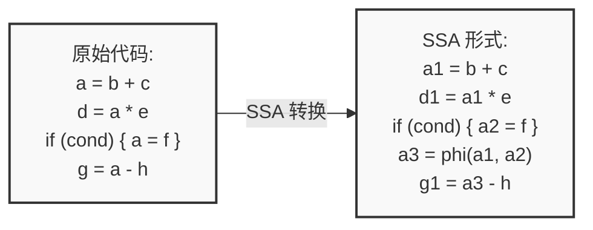


### 基于指令的 SSA IR

基于指令的 SSA IR 更接近汇编语言，是一种更低级的表示形式。可读性并不好，但是计算机和编程处理起来更高效。定义为：每条指令在 SSA 形式中只出现一次，使用 SSA 变量来表示指令的结果。

#### 特点

- 更低级，接近汇编语言或机器指令，更容易被再次深层编译为其他更低级的指令集。
- 适用于后端优化，例如基于数据流的活跃变量判断，常量折叠，分配，过程分析等。

#### 典型案例

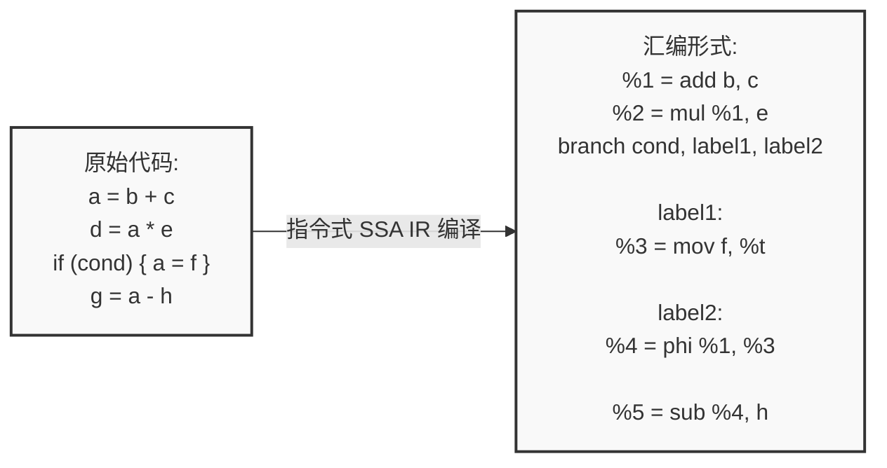

### 两种 SSA 形式的对比

| **方面**           | **基于变量的 SSA** | **基于指令的 SSA IR** |
|--------------------|--------------------|-----------------------|
| **粒度**           | 高级变量级别       | 指令级别              |
| **抽象层次**       | 接近高级语言       | 接近汇编/机器指令     |
| **变量表示**       | 变量版本（x1, x2）  | SSA 变量对应指令输出   |
| **Phi 函数**       | 用于变量版本选择   | 用于指令输出选择      |
| **适用阶段**       | 前端优化、语义分析 | 后端优化、代码生成    |
| **优化目标**       | 数据流优化         | 深层数据流优化和指令优化            |
| **复杂性**         | 逻辑简单，计算机处理复杂           | 编译复杂，需处理指令依赖，但是数据流处理简单|
| **与语言结构的映射**| 直接对应语言变量   | 需要映射到具体指令    |

:::tip

在后续的讨论中，如果不特别说明，我们讨论的 SSA 形式都是基于指令的 SSA IR 形式。

后续出现的代码或者 SSA 编译脚手架也大部分都是基于指令的 SSA IR 形式。

:::

### 重要的额外补丁

我们并不推荐使用变量的 SSA 形式，因为其抽象层次较高，不利于计算机处理。因此我们后续的讨论都是基于指令的 SSA IR 形式。

但是实际上，我们在进行指令式 SSA IR 编译时，我们的处理方案细节并不和普通的指令式 SSA IR 编译相同，在很多细节上，我们进行实践性和工程性非常强的优化

#### 额外补丁一：指令ID全局唯一

在传统的静态单赋值（SSA, Static Single Assignment）表示法中，确保每条指令在其所属的基本块内部具有唯一性。然而，这仅满足了最基本的唯一性要求。在我们的编译过程中，我们引入了更为严格的约束，确保指令ID在全局范围内的唯一性。

这一设计使得指令ID不仅可以唯一标识一条指令，还无需关心该指令所在的具体基本块。这一特性在工程实践中具有显著优势，尤其是在与数据库系统集成时表现突出。具体而言，通过采用数据库的自增ID机制作为指令ID，我们能够将SSA的构建过程高效地存储到数据库中。这不仅简化了指令的追踪和管理，还极大地便利了调试和分析工作。

需要特别指出的是，这一全局唯一指令ID的设计在传统的SSA编译器实现中尚未普遍采用。因此，在实际应用中，开发者需明确区分并正确理解这一改进，以充分发挥其在优化和工程实现中的潜力。

#### 额外补丁二：定义域化变量系统辅助

尽管基于指令集的静态单赋值（SSA, Static Single Assignment）中间表示在工程实践中展现出显著优势，但其也存在一定的局限性，其中之一即无法直接将源代码中的变量与具体指令进行关联。为解决这一问题，在编译过程中，我们引入了词法变量辅助系统。该系统在构建指令的同时，维护一个索引结构，用于关联词法变量与相应的指令。

这一辅助系统的引入是必不可少的，原因在于基于指令的 SSA IR 编译过程中，指令的定义域（定义位置）与使用域（使用位置）是相互分离的。特别是在源代码中存在闭包（closure）等高级特性时，需要通过词法变量直接判断闭包所处的环境以及具体变量是否存在词法遮蔽（shadowing）的问题。因此，词法变量辅助系统不仅确保了变量与指令之间的正确映射，也保障了闭包等复杂结构在编译过程中的正确处理。

定义域变量系统辅助在基于指令的 SSA IR 编译中起到了关键作用，既弥补了指令级 SSA 表示在变量关联上的不足，又为处理高级语言特性提供了必要的支持。这一设计在提高编译器的灵活性和准确性方面具有重要意义，尤其在涉及复杂控制流和作用域管理的情况下，能够有效地提升编译过程的健壮性和优化效果。

--- 

## SSA 构建：值和表达式

在对指令式SSA（静态单赋值）中间表示的基本概念有了前述理解之后，我们可以进一步探讨其在编译过程中对编程语言基础特性的处理方法。在高级编程语言中，赋值语句、表达式、语句块、流程控制结构以及函数构成了五个核心特性。这些特性几乎存在于所有主流编程语言中，构成了语言的基本构建模块。

:::tip

探讨语言基础特性的SSA编译是学习SSA编译的理想起点。由于这些基础特性在所有编程语言中普遍存在，其对应的SSA编译过程相对简单，易于理解。

这为后续涉及更复杂或高级语言特性的讨论提供了坚实的基础，帮助我们理解这些复杂特性是如何在基础特性之上构建的。

:::

### 深入理解赋值语句

赋值（Assignment）是编程语言中的基本操作之一，其本质在于将一个特定的值或表达式的计算结果绑定到一个变量上，从而更新该变量的状态。通过赋值，程序能够存储、修改和传递数据，使得程序能够根据不同的输入和条件执行相应的逻辑操作。

在SSA中，每个变量在其赋值时必须唯一，这意味着每个赋值操作都应生成一个新的变量版本。然而，如果一个赋值语句中的值未被后续使用，该赋值操作即为冗余，此时相关的变量实体无需创建（无需生成指令）。这种优化不仅减少了中间表示的冗余，也有助于提升后续优化和生成代码的效率。因此，在SSA构建过程中，识别并消除未使用的赋值语句是提升编译器性能的关键步骤之一。

虽然赋值语句产生的变量不直接生成指令，但是其产生的变量实体（变量容器）是后续指令的载体，因此变量实体是不可或缺的。同时赋值语句是一个非常重要的高级语言特性，我们有必要详细了解它。

有了上述基本概念之后，我们继续深入介绍赋值这个操作：在编程语言中，赋值操作通常涉及两个部分：左值（Left Value，**LHS**）和右值（Right Value，**RHS**）。理解这两者的区别对于编译器设计和代码优化至关重要。

- **左值（LHS）：** 表示赋值操作中的目标位置，即变量或内存位置。左值不一定会生成指令的变量容器，尤其是在优化过程中，某些左值可能会被消除或重用，同时在指令式 SSA IR 中，左值也不一定需要生成指令，通常左值都会只作为辅助构建指令的容器存在。
  
- **右值（RHS）：** 表示赋值操作中的源数据，即字面值、表达式或计算结果。右值通常是一个具体的值或通过表达式计算得到的结果，将被赋给左值。

#### 图示左右值

以下是一个使用 Mermaid 语言绘制的赋值操作中左值和右值的示意图：

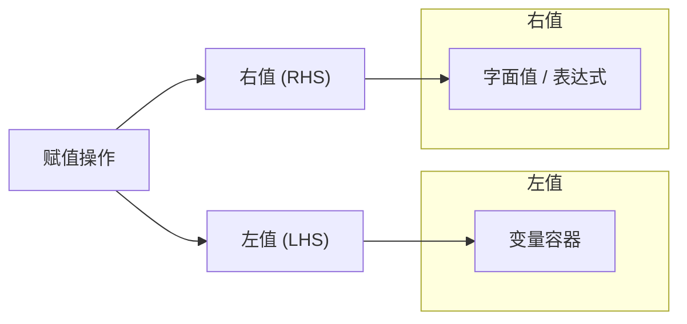

### 左值：不一定生成指令的变量容器

在赋值操作中，左值（Left Value，LHS）代表赋值的目标。理解左值的类型及其赋值方式对于编译器设计和代码优化至关重要。左值不一定会生成指令的变量容器，这取决于优化策略和上下文。下面将详细介绍左值的类型及其赋值方式。

#### 左值的类型

1. **变量**
   
   变量是最常见的左值类型，直接绑定到存储位置，用于存储数据。例如：
   
   ```c
   int x = 10;
   ```
   
   在这个例子中，`x` 是一个变量，作为左值接受值 `10` 的赋值。

2. **成员引用**
   
   成员引用涉及对结构体、类、数组或切片成员的访问和赋值。例如：
   
   ```c
   struct Point {
       int x;
       int y;
   };
   
   Point p;
   p.x = 5;  // p.x 是成员引用的左值
   ```
   
   在这里，`p.x` 是左值，用于赋值 `5`。

3. **引用（指针）**
   
   引用类型允许通过指针间接访问和赋值。例如：
   
   ```c
   int a = 10;
   int *ptr = &a;
   *ptr = 20;  // *ptr 是指针引用的左值
   ```
   
   在这个例子中，`*ptr` 是通过指针 `ptr` 解引用得到的左值，赋值操作将 `20` 赋给 `a`。

---
##### 对左值赋值的方式

赋值方式可以根据不同需求进行分类，主要包括以下几种：

1. **强制创建一个新变量**
   
   在某些上下文中，赋值操作需要强制创建一个新的变量。这通常发生在静态单赋值（SSA）中，每次赋值都会生成一个新的变量实例。例如：
   
   ```plaintext
   a1 = 5
   a2 = 10
   ```
   
   每次赋值都会创建一个新的变量版本，`a1` 和 `a2` 是不同的变量实例。

2. **对已经有的变量（成员）进行重新赋值（更新，传递）**
   
   对已有变量或其成员进行重新赋值，更新其值。例如：
   
   ```python
   x = 5
   x = x + 3  # 对现有变量 x 进行重新赋值
   ```
   
   成员赋值类似：
   
   ```c
   p.x = 15;  // 更新结构体 p 的成员 x
   ```

3. **自动赋值（自动创建变量，并赋值，如果变量已存在就对已有变量赋值）**
   
   自动赋值是指在赋值时，编译器或解释器会自动处理变量的创建和赋值，无需显式创建新的变量实例。例如在某些动态语言中：
   
   ```python
   y = 10  # 自动创建变量 y 并赋值 10
   y = y + 5  # 赋值给已存在的 y
   ```

4. **对环境变量赋值（闭包）**
   
   在闭包（closures）中，赋值操作可能影响环境变量，即在函数外部定义的变量。例如：
   
   ```javascript
   let count = 0;
   function increment() {
       count += 1;  // 修改环境变量 count
   }
   ```
   
   在这个例子中，`count` 是闭包环境中的变量，通过赋值操作更新其值。

##### 概念图示

为了更直观地展示左值的类型及赋值方式，以下是使用 Mermaid 绘制的示意图：

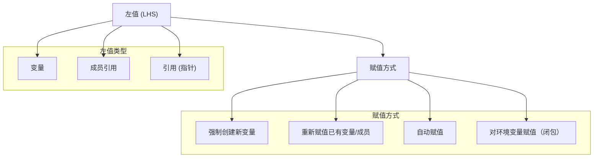

#### 类型赋值

在编程语言中，赋值操作不仅传递值，还涉及类型的传递与推导。理解赋值中类型的传递方式对于类型系统的设计、类型安全性以及代码的可读性和维护性至关重要。本文将详细探讨赋值中类型传递的两种主要情况：

1. 类型在左值中：类型限定
2. 类型在右值中：类型推导

当赋值语句的左侧（左值）明确指定了类型时，赋值操作受该类型的约束。这种情况下，右值必须与左值的类型兼容，或者能够隐式转换为左值的类型。

##### 特点

- 明确性：开发者明确指定了变量的类型，增强了代码的可读性和可维护性。
- 类型安全：编译器能够在编译时检查类型一致性，减少运行时错误。
- 类型限定：限制了右值的类型，确保赋值的正确性。


##### 示例

C语言中的类型限定

```c
int a = 10;       // 左值类型为 int，右值为整型常量 10
double b = 3.14;  // 左值类型为 double，右值为浮点数 3.14

struct Point {
    int x;
    int y;
} p;

p.x = 5;          // 左值 p.x 类型为 int，右值为整型常量 5
```

Go语言中的类型限定

```go
var count int = 100  // 左值类型为 int，右值为整型常量 100

type Person struct {
    Name string
    Age  int
}

var person Person
person.Age = 30      // 左值类型为 int，右值为整型常量 30
```

TypeScript中的类型限定

```typescript
let message: string = "Hello, World!";  // 左值类型为 string，右值为字符串

interface User {
    id: number;
    name: string;
}

let user: User = { id: 1, name: "Alice" };  // 左值类型为 User，右值为符合接口的对象
```

:::tip

当我们了解 “赋值语句” 和 “左值” 的本质之后，就可以开始尝试真正的可以生成指令的编译了。

:::

### 右值编译：字面值与特殊字面值

区别于不会生成指令的“左值（LHS）”，右值（RHS）是会生成指令的。我们可以从最基础的字面量开始。一般我们认为字面量有三大类，分别为：基础类型字面量，复合类型字面量，高级字面量。

在这些字面量中，我们一般只直接讨论和处理基础字面量和复合字面量。高级字面量并不是每一种语言都会存在，并且一般会在编译器中进行特殊处理，转化成已有的基础字面量和复合字面量的组合，或者表达式组合。

#### 基础类型字面量：数字，布尔，字符串

一般情况下，基础类型字面量都会被视为一个整体来处理，不会进行分解，所以我们定义一个基础字面量的时候，包含两个部分：字面量类型，字面量值。

参考如下结构设计，我们可以让 SSA Literal 或者 SSA Const 来表示一个基础类型字面量：

:::tip

为了后面统一表达，我们后面使用 SSA Const 来代表编译字面量值（Literal）的指令。

:::

```typescript
type SSA_Literal = {
  type: "prime_type";
  value: "[literal_value]";
}
```

至少保证上述结构能够表示一个基础类型字面量。我们就可以得到一个例子：

```typescript
const a = 10;
```

可以把 `10` 视为一个字面量值，它的 SSA 指令为：`{ opcode: "ssa-const", type: "literal", value: "10" }`

:::tip

在实际的 SSA 编译中，我们建议把所有的 SSA Const 都认为是一个指令，他的 ID 不同。

即：数字 `10` 和 `100` 的 SSA 指令 ID 不同。但是他们的 opcode 都是 `ssa-const`，type 都是 `number / integer`。

同样的，字符串 `"hello"` 和 `"world"` 的 SSA 指令 ID 不同。但是他们的 opcode 都是 `ssa-const`，type 都是 `string`。

:::

在数据流的角度上来说，他们都是 `ssa-const` 指令，只是 value 不同。据此，我们设计出了第一个 SSA 指令（其结构描述的伪代码如下）：

```typescript
type SSA_Const = {
  opcode: "ssa-const";
  id: number;
  type: "number" | "string" | any;
  value: string;
}
```

:::note

虽然我们上面的结构描述代码使用了 TypeScript 的语法，但是请记住，这只是为了方便理解，在实际的 SSA 编译中，我们的结构会更加复杂，需要存储 SSA 指令之间的关系或者额外信息需要开启大量的额外字段。

:::

#### 复合类型字面量：容器

在掌握了基本类型字面量的形式化表示后，我们可以进一步探讨复合类型字面量系统的构建理论。

在复合类型字面量的形式化定义中，容器类型通常被视为一个固定的抽象接口。这种抽象类似于 EcmaScript 规范中的 Object 原型，它提供了一个统一的对象操作接口，支持多态性引用和动态派发。

:::tip 多语言实现范式
值得注意的是，这种容器抽象在不同语言实现中呈现出不同的特征。例如，PHP 的实现中采用了统一数组（Array）作为基础容器，通过支持任意类型的键值对映射，实现了数组和关联数组（字典）的双重语义。这种设计展现了容器抽象的灵活性。
:::

因此，在设计支持复合类型的高级 SSA（Static Single Assignment）中间表示时，复合类型字面量的形式化表示和操作语义是需要重点考虑的核心问题。

对于采用 classless 范式的动态类型语言（如 PHP 或 EcmaScript），其中间表示可以采用统一的容器抽象，该抽象需要同时满足序列容器（Array）和关联容器（Object）的操作语义。这种设计既简化了类型系统的复杂度，又保持了足够的表达能力。


:::info 无类（Classless）语言的形式化定义

无类（Classless）语言范式是一种去中心化的类型系统设计方法，其形式化定义可表示为：

1. **原型链接机制（Prototype Linkage）**：
   对象间的关系通过原型链接（prototype link）而非类继承建立，可表示为：
   <Math inline="false" math="O_2 \rightarrow O_1 \rightarrow O_0" />
   其中 <Math inline="true" math="O_i" /> 表示对象，<Math inline="true" math="\rightarrow" /> 表示原型链接。

2. **动态分派（Dynamic Dispatch）**：
   方法调用的解析过程可形式化为：
   <Math inline="false"  math="dispatch(obj, method) = lookup(obj, method) \lor lookup(prototype(obj), method)" />

3. **属性访问语义（Property Access Semantics）**：
   对于任意对象 <InlineMath math="o" /> 和属性 <InlineMath math="p" />：
   <Math inline="false"  math="access(o, p) = o[p] \lor access(prototype(o), p)" />

这种范式在编译器实现中具有以下特征：

- **统一存储模型**：对象和数组共享相同的底层存储结构
- **动态类型检查**：类型检查在运行时而非编译时执行
- **属性查找优化**：通常需要实现内联缓存（Inline Caching）等优化技术

相比传统的基于类的语言，无类范式在编译器实现上需要更复杂的运行时系统支持，但提供了更大的动态性和表达灵活性。
:::

在我们的目标产物中，需要讨论复合类型字面量显然不可以用 Const 来表示，所以需要设计一个新的指令来表示复合类型字面量。这个新的指令产生的容器，需要支持各种各样的成员操作以方便后续我们可以实现 classless 的特性。

* 支持成员变量的增删改查
* 支持容器大小，容器容量的配置
* 支持容器的 Key 可自定义（对于数组来说是 Integer，对于 Object 来说是 String 或者 Any 类型）
* 支持成员使用 `[ ]` 的调用方式访问
* 支持成员使用 `.` 的调用方式访问

:::tip

在 SSA 中处理复合类型字面量是一个重要的设计决策，因为它直接影响到后续的代码生成阶段或模拟复杂 OOP 的实现。

:::

根据上面的需求来设计这个新的复合类型字面量容器，会有如下特点：

* 统一性：
    1. 使用同一个指令类型处理数组、对象和映射
    2. 通过 container_type 区分具体类型
    3. 统一的成员访问接口

* 类型安全：
    1. 明确的键类型和值类型定义
    2. 支持类型检查和验证
    3. 与 SSA 类型系统的集成

* 灵活性：
    1. 支持动态扩容
    2. 支持多种访问方式（下标、点号）
    3. 可配置的容器行为（通过 flags）


我们根据上述内容，设计出复合类型字面量的 SSA 指令（伪代码）：

```typescript
type SSA_Container = {
  // 基础 SSA 信息
  opcode: "ssa-container";
  id: number;
  
  // 容器类型信息
  container_type: "array" | "object" | "map";
  
  // 容量相关
  cap: number;  // 当前分配的容量
  len: number;  // 当前使用的长度
  
  // 类型信息
  key_type: "number" | "string" | "any";
  value_type: SSAType;  // 使用统一的类型系统
  
  // 成员存储
  members: {
    [key: string | number]: SSAValue;  // SSAValue 是所有 SSA 值的联合类型
  };
  
  // 元数据
  flags: {
    is_frozen: boolean;     // 是否允许修改
    is_sealed: boolean;     // 是否允许添加/删除属性
    allow_dynamic: boolean; // 是否允许动态添加新类型
  };
}

// 扩展接口定义
interface SSA_Container {
  // 基础操作
  Set(key: any, value: SSAValue): void;
  Get(key: any): SSAValue;
  Delete(key: any): boolean;
  
  // 容量管理
  Size(): number;
  Capacity(): number;
  SetCapacity(newCap: number): void;
  
  // 迭代器支持
  ForEach(callback: (key: any, value: SSAValue) => void): void;
  Keys(): Array<any>;
  Values(): Array<SSAValue>;
  
  // 数组特有操作
  Slice(start: number, end: number): SSA_Container;
  Push(value: SSAValue): number;
  Pop(): SSAValue;
  
  // 访问器支持
  GetMemberByKey(key: any): SSAValue;
  GetMemberByDot(name: string): SSAValue;
  
  // 类型检查
  HasMember(key: any): boolean;
  GetKeyType(): string;
  GetValueType(): SSAType;
  
  // 元数据操作
  Freeze(): void;
  Seal(): void;
  IsSealed(): boolean;
  IsFrozen(): boolean;
}
```

我们使用一个更直观的类图来表示上述内容如下：

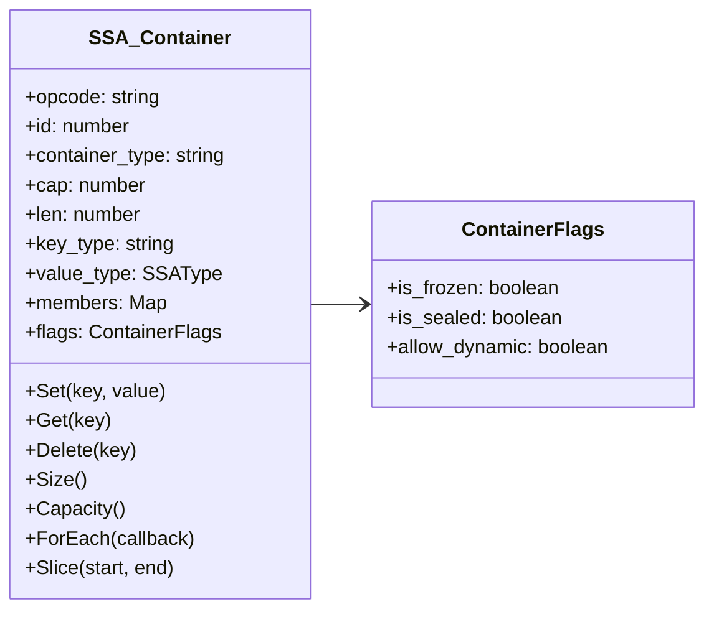

---

有了设计指南之后，考虑如下内容：

```
const obj = {"key": "value", "foo": "bar"};

// 编译后
t1 = new(ssa-container)
t1_key = new(ssa-const("value"))   # 通过 t1.Set("key", "value") 生成
t1_foo = new(ssa-const("bar"))     # 通过 t1.Set("foo", "bar") 生成
```

与之相对的，如果要承载一个 `[ ]` 那么我们可以考虑如下代码的抽象翻译：

```
const arr = [1, 2, 3, 4, 5];

// 编译后
t2 = new(ssa-container)
t2[0] = new(ssa-const(1)) # 通过 t2.Set(0, 1) 生成
t2[1] = new(ssa-const(2)) # 通过 t2.Set(1, 2) 生成
t2[2] = new(ssa-const(3)) # 通过 t2.Set(2, 3) 生成
t2[3] = new(ssa-const(4)) # 通过 t2.Set(3, 4) 生成
t2[4] = new(ssa-const(5)) # 通过 t2.Set(4, 5) 生成
```

虽然我们使用了 `[ ]` 的语法，但是实际上我们还是需要使用 `Set` 方法来设置成员，所以这个语法只是为了方便理解。我们在上述编译过程中省略掉了一些类型处理和推断的细节，在实际的编译过程中，我们还需要考虑更多的类型信息或者这个容器的容量问题。


:::info 课外读物：深入考虑更多编译参数

对于对象字面量，完整的编译过程应该是这样的：

```typescript
// 源代码
const obj = {"key": "value", "foo": "bar"};

// 完整的 SSA 形式
t1 = new(ssa-container) {
    container_type: "object",
    key_type: "string",
    value_type: "string",
    cap: 4,        // 预分配合适的容量
    len: 2,        // 当前实际长度
    flags: {
        is_frozen: false,
        is_sealed: false,
        allow_dynamic: true
    }
}

t1_key_val = new(ssa-const("value"))
t1_foo_val = new(ssa-const("bar"))

t1.Set("key", t1_key_val)  // 设置第一个属性
t1.Set("foo", t1_foo_val)  // 设置第二个属性
```


info 数组字面量的编译

对于数组字面量，完整的编译过程如下：

```typescript
// 源代码
const arr = [1, 2, 3, 4, 5];

// 完整的 SSA 形式
t2 = new(ssa-container) {
    container_type: "array",
    key_type: "number",
    value_type: "number",
    cap: 8,        // 预分配略大于实际需求的容量
    len: 5,        // 当前实际长度
    flags: {
        is_frozen: false,
        is_sealed: false,
        allow_dynamic: true
    }
}

// 创建常量值
t2_0_val = new(ssa-const(1))
t2_1_val = new(ssa-const(2))
t2_2_val = new(ssa-const(3))
t2_3_val = new(ssa-const(4))
t2_4_val = new(ssa-const(5))

// 按顺序设置数组元素
t2.Set(0, t2_0_val)
t2.Set(1, t2_1_val)
t2.Set(2, t2_2_val)
t2.Set(3, t2_3_val)
t2.Set(4, t2_4_val)
```

:::


#### 特殊字面量：插值字符串

在介绍完基本的字面量之后，我们接下来介绍特殊字面量：插值字符串。

插值字符串（Template Literals）是一种特殊的字符串字面量形式，它允许在字符串中嵌入表达式和变量。通过特定的语法（如 JavaScript 中的 `${...}` 或 Python 中的 f-strings `{...}`），它能够在字符串中直接引用和计算表达式的值，使字符串构造更加灵活和直观。从编译器的角度看，它是由静态文本片段和动态表达式片段组成的复合字面量，需要在编译时解析这些片段，并在运行时将它们求值和拼接成最终的字符串。

插值字符串的核心特征：

1. 支持字符串中嵌入表达式
2. 允许多行字符串表示
3. 在编译时解析，运行时求值

这种字面量形式大大提升了字符串处理的可读性和维护性，是现代编程语言中常见的特性。

:::tip EcmaScript 的插值字符串

```javascript
// ES6+ 的插值字符串语法
const name = "World";
const greeting = `Hello ${name}!`;  // 输出: Hello World!

// 支持多行
const multiline = `
    line 1
    line 2
    line ${2 + 1}
`;

// 支持表达式
const sum = `The sum is ${10 + 20}`;  // 输出: The sum is 30

// 支持嵌套
const nested = `Value: ${`nested ${name}`}`;
```
:::

:::tip Python 中的插值字符串

```python
# Python 中的插值字符串语法
name = "World"
greeting = f"Hello {name}!"  # 输出: Hello World!
```
:::

更接近本质的说，插件字符串是字符串拼接的语法糖，在编译器中，我们可以将插值字符串编译为字符串拼接的指令。

参考如下思路：

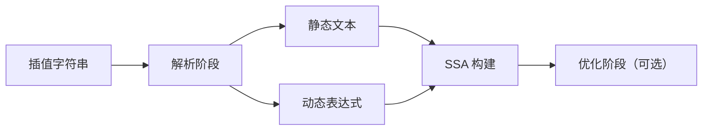

在 SSA 中，插值字符串的处理可以分为以下几个关键步骤：

1. **解析阶段**：将插值字符串拆分为静态文本和动态表达式
2. **SSA 构建**：为每个部分生成相应的 SSA 指令
3. **优化阶段（可选）**：进行常量折叠等优化

#### SSA 中的表示插值字符串编译

```typescript
// 源代码: 定义一个插值字符串
const name = "World";                   // 定义一个变量 name
const greeting = `Hello ${name}!`;      // 使用插值语法构建字符串

// SSA 形式: 将插值字符串拆解为多个基本操作
t1 = new(ssa-const("World"))           // 创建常量指令存储 name 的值 "World"
t2 = new(ssa-const("Hello "))          // 创建常量指令存储第一个文本片段 "Hello "
t3 = new(ssa-const("!"))               // 创建常量指令存储最后的文本片段 "!"

// 字符串拼接操作
t4 = add t2, t1                        // 拼接 "Hello " 和 name 的值
t5 = add t4, t3                        // 拼接前面的结果和 "!"
                                       // 最终 t5 存储完整的字符串 "Hello World!"
```

:::tip
表达式的 SSA 构建是编译器中的一个核心环节。在处理插值字符串时，我们需要：
1. 识别和解析表达式
2. 为表达式生成正确的 SSA 形式
3. 处理表达式求值的副作用
:::

这为我们引入了下一个重要话题：表达式的 SSA 构建。在表达式构建中，我们将详细探讨：

- 表达式的语法树理解
- 表达式的 SSA 转换规则

### 右值编译：低级表达式的 SSA 构建

在进行我们这个章节之前，我们需要读者重新学习一下，AST 的相关概念，特别是表达式的 AST 构建。

参考如下 eBNF 中的表达式语法以及优先级排布（yaklang syntax g4）

```antlr4
expression
    // 单目运算
    : typeLiteral '(' ws* expression? ws* ')'
    | literal
    | anonymousFunctionDecl
    | panicStmt
    | recoverStmt
    | Identifier
    | expression (memberCall | sliceCall | functionCall)
    | parenExpression
    | instanceCode // 闭包，快速执行代码 fn{...}
    | makeExpression // make 特定语法
    | unaryOperator expression

    // 二元运算（位运算全面优先于数字运算，数字运算全面优先于高级逻辑运算）
    | expression bitBinaryOperator ws* expression

    // 普通数学运算
    | expression multiplicativeBinaryOperator ws* expression
    | expression additiveBinaryOperator ws* expression
    | expression comparisonBinaryOperator ws* expression

    // 包含运算仍然是初级逻辑
    | expression 'not'? 'in' expression

    // 高级逻辑
    | expression '&&' ws* expression
    | expression '||' ws* expression
    | expression '?' ws* expression ws* ':' ws* expression

    // 管道操作符
    | expression '<-' expression
    ;
```

在深入 SSA 构建之前，我们需要理解表达式的语法结构。上述 eBNF 语法展示了表达式的优先级和结构关系，这些在 AST 构建阶段就已经被正确处理。

观察如下表达式的 AST 结构，我们就可以轻易发现，我们只需要对每一个节点进行 SSA 编译即可，而不需要考虑优先级（这是编译前端的词法语法需要解决的问题）。

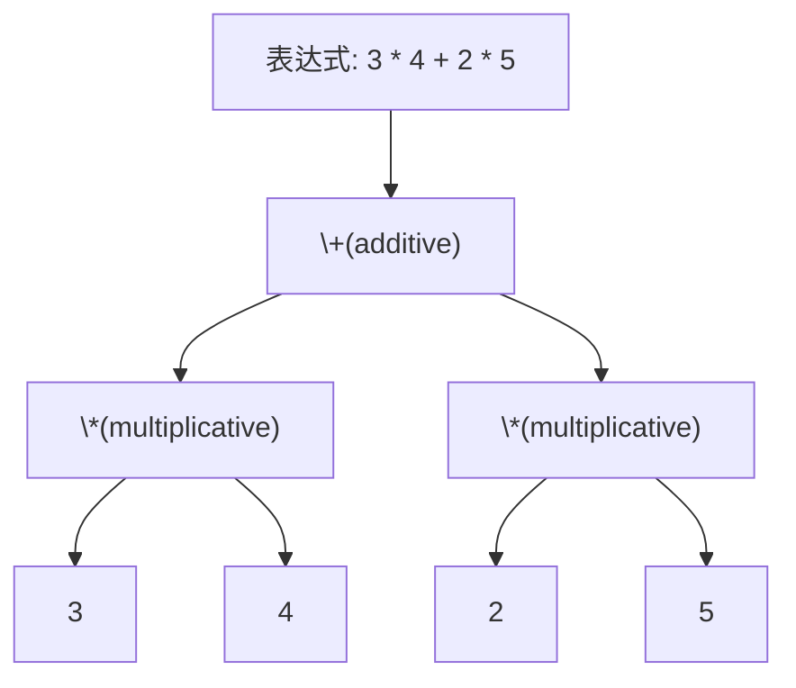

值得一题的是，表达式并不是所有的被 AST 切分的都可以直接编译节点，表达式我们可以分为两大类：

* **基础表达式（普通表达式）**：算术运算，位运算等
* **高级表达式（流程控制）**：逻辑运算，短路运算，三元选择等；

并且高级表达式随着语法演进，也出现了很多 EcmaScript 的稀有案例，比如 `??` 表达式，`?.` 表达式等；

#### 普通表达式与高级逻辑表达式的本质区别

普通表达式（如算术运算、位运算等）和高级逻辑表达式（如 `&&`、`||`、条件表达式 `?:`）有着本质的区别：

:::tip 核心区别
**普通表达式**是纯粹的计算过程，其所有操作数都会被执行求值，且求值顺序不会影响最终结果。而**高级逻辑表达式**实际上是一种隐含的流程控制结构，它可能不会执行所有操作数的求值，其执行路径取决于前序条件的结果。
:::


例如，考虑以下两种表达式：

```typescript
// 普通表达式
let result1 = a + b * c;  // 所有操作数 a、b、c 都会被求值

// 高级逻辑表达式
let result2 = condition && doSomething();  // doSomething() 可能不会被执行
```


这种区别在 SSA 构建时有着重要的影响：

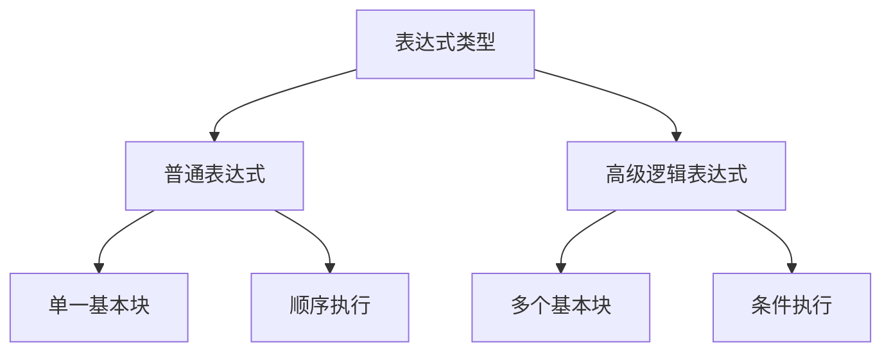

因此，高级逻辑表达式的 SSA 构建需要引入基本块（Basic Block）和控制流图（Control Flow Graph）的概念，这使得它们的处理更接近于流程控制语句（如 if-else、while 等），而不是简单的表达式计算。这个重要的区别将在后续的流程控制章节中详细讨论。

#### 最简单的表达式编译

根据上面的结论，我们需要对每一个 AST 节点进行 SSA 编译，假定操作符号为 `+`，那么我们就可以轻易写出如下代码：

```typescript
// 源代码
let result = a + b;

// SSA 形式
t1 = add a, b
```

这非常简单，同样的规则，我们可以拓展到绝大多数简单的表达式中。

`+`, `-`, `*`, `/`, `%`, `&`, `|`, `^`, `<<`, `>>`, `>>>`, `==`, `!=`, `>`, `>=`, `<`, `<=`

这些符号均有这样的特性，我们设计一个通用的 SSA 指令即可，这个指令包含三个必要元素：

* 操作符
* 操作数1
* 操作数2

参考如下伪代码做设计：

```typescript
interface BinarySSAInstruction {
    operator: string;      // 操作符
    operand1: SSAValue;    // 第一个操作数
    operand2: SSAValue;    // 第二个操作数
}
```

我们可以将所有基本的二元运算符映射到对应的 SSA 指令。

:::tip

除此之外，我们可以类比一元表达式，一元表达式通常是 `!` 和 `-` 操作符，它们只接受一个操作数。

当然，还有管道符等问题，我们在这里不做讨论（我们可以把它当做一个语法糖，实际可以映射到方法调用 / 函数调用上来）。

:::

#### 成员表达式的 SSA 转换

在 SSA 形式中，每个变量只能被赋值一次。对于成员表达式，我们需要特别处理，因为它实际上代表了一个内存位置的访问。我们可以将其设计为：

```typescript
interface MemberAccessInstruction {
    base: SSAValue;        // 基础对象
    member: string | SSAValue; // 成员名称或索引
    version: number;       // SSA 版本号
}
```

让我用 mermaid 来展示这个转换过程：

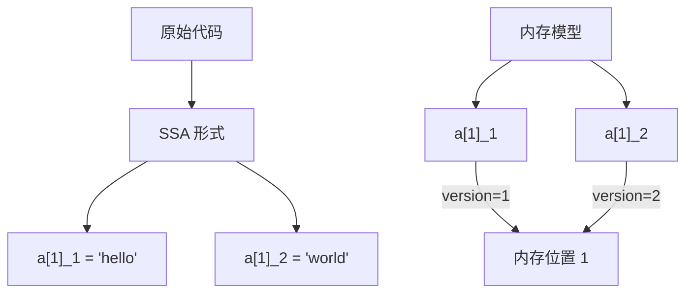

##### 版本化规则

:::tip
成员表达式的版本化需要遵循以下规则：

1. 每次对同一位置的写入操作都会生成一个新的版本
2. 读取操作总是使用最新的版本
3. 版本号是针对整个成员访问表达式的，而不是基础对象
:::

##### 实现示例

让我们看一个具体的实现示例：

```typescript
interface MemberSSAValue extends SSAValue {
    kind: 'member';
    base: SSAValue;
    member: string | SSAValue;
    version: number;
}

function createMemberAccess(base: SSAValue, member: string | SSAValue): MemberSSAValue {
    return {
        kind: 'member',
        base,
        member,
        version: getNextVersion(base, member) // 获取下一个版本号
    };
}
```

##### 转换过程

对于如下代码：

```typescript
a[1] = "hello";  // 创建 a[1]_1
b = a[1];        // 使用 a[1]_1
a[1] = "world";  // 创建 a[1]_2
c = a[1];        // 使用 a[1]_2
```

转换为 SSA 形式：

```typescript
a[1]_1 = "hello"
b_1 = a[1]_1
a[1]_2 = "world"
c_1 = a[1]_2
```

##### 重要考虑点

:::tip
在实现这种成员访问的 SSA 转换时，需要特别注意：

1. 基础对象（base）的版本管理
2. 索引/成员（member）如果是变量时的版本管理
3. 确保正确追踪每个成员访问的最新版本
4. Phi 函数在控制流汇合点的处理
:::

这种设计方式确保了 SSA 形式的正确性，同时保持了成员访问的语义完整性。每个成员访问都被视为一个独立的 SSA 值，具有自己的版本号，这样就能正确处理赋值和使用的关系。

#### 函数调用表达式

:::note

相对于其他的表达式编译过程，函数调用的编译相对来说需要考虑的更多：

1. 函数本身是不是一个确定的函数？而是一个表达式？或者任意值？
2. 实参转形参的时候，是通过位置索引区分的，还是通过名称区分的？
3. 函数调用产生的时候，是否会产生副作用（闭包或者成员赋值修改了外部值）？
4. 这个函数有没有类似 Golang 中的 Receiver 的概念要求？

虽然上述的问题大部分都是在函数部分才需要考虑的，但是单纯调用来说，我们需要设计一个 SSA 指令，他至少包含如下内容：

1. 这个调用的目标是一个任意值（因为在现代语言中，函数本身也是一个值（我们可以把他认为是一等公民））
2. 实际参数的指令（当然也可以是任意值）
3. 自由变量（通过闭包捕获到的值）
4. 这个函数调用需要传递的副作用

关于 3 和 4 我们在后续的闭包章节中再做讨论。在这里只需要记住有这两个东西就好了，在表达式本身的位置展开讨论会造成复杂度过高，读者无法理解其真正的设计原理和含义。

:::

让我来系统地分析函数调用表达式在 SSA 形式中的设计和实现。

#### 基本结构设计

首先，让我们定义一个基本的函数调用 SSA 指令的结构：

```typescript
interface CallSSAInstruction {
    callee: SSAValue;          // 被调用的目标（函数值）
    arguments: SSAValue[];     // 实际参数列表
    // 以下是预留的扩展字段，在闭包章节详细讨论
    capturedVars?: SSAValue[]; // 捕获的自由变量
    sideEffects?: Effect[];    // 副作用描述
}
```
#### 调用模型

让我用 mermaid 图来展示函数调用的基本模型：

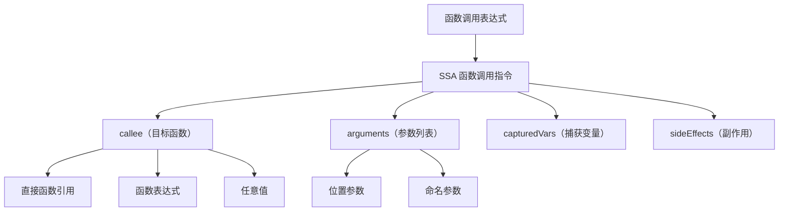

#### 函数调用的类型归一处理

:::tip
函数调用可以分为以下几种主要类型：

1. 静态函数调用：编译时就能确定的函数（Callee 是一个 Function 结构体）
2. 动态函数调用：运行时才能确定的函数值（Callee 是一个任意值）
3. 方法调用：带有接收者（receiver）的调用（Callee 是一个 Function 结构体，内置第一个参数，第一个参数通常为 Receiver 本身的 SSA Value）

:::

我们回顾上述内容，在我们的 Call 的设计中，出现了两个关键点：

1. Call 指令调用的对象不一定是静态函数，可以是任意值，这个确保了函数是一等公民。
2. 调用指令需要预留副作用和捕获变量两个字段，这个为后续的闭包和副作用处理提供了足够的扩展空间。

这种设计基本保证了这种函数调用可以同时保持对大部分函数调用情况的兼容性，保证基本调用语义的清晰性。

在实际实现中，我们可以根据具体语言的特性选择性地使用这些扩展字段。（没有闭包特性的语言几乎不会使用 FreeValue 和 SideEffect）

## 定义域对 SSA 构建影响

在我们开始后续的讨论之前，我们需要补充一个概念：

### 定义域（Definition Domain）

定义域是指变量的可见性范围，它决定了变量在程序中的生命周期和访问范围。在 SSA 构建中，定义域直接影响变量的版本管理和 <InlineMath math="\phi" /> 节点的放置。

不同语言的定义域处理是不一样的，他们的变量的可见范围也略有不同，不可以一概而论，但是我们可以分别讨论常见的定义域出现的情况，并讨论他们的变量的 SSA 版本。

:::tip 注意定义域不是基本块

注意，定义域和基本块只在某些特殊的位置上有重叠，定义域是变量的可见范围，基本块是控制流的基本单位，这两个不能混为一谈。两个不同的基本块可能是用的定义域是同一个。

:::

### 不同定义域内的变量的 SSA 版本

我们用一个简单的例子来说明不同定义域内的变量的 SSA 版本：

```typescript
let x = 1;           // 全局作用域 x_1
{
    let x = 2;       // 块级作用域 x_2
    if (condition) {
        let x = 3;   // 嵌套块级作用域 x_3
        print(x);    // 使用 x_3
    }
    print(x);        // 使用 x_2
}
print(x);            // 使用 x_1
```

把上述内容转换成 SSA 形式之后：

```typescript
// 全局作用域
x_1 = 1

// 块级作用域
B1:
    x_2 = 2
    Branch condition, B2, B3

B2: // if 块
    x_3 = 3
    print(x_3)
    Jump B3

B3: // 块级作用域续
    print(x_2)
    Jump B4

B4: // 全局作用域续
    print(x_1)
```

### 版本与定义域的关系

在 SSA 构建过程中，变量的版本号与其定义域有着密切的关系。让我们通过具体示例来说明：

#### 1. 同一定义域内的版本更新

```typescript
// 在同一定义域内
let x = 1;     // x_1
x = x + 1;     // x_2 = add x_1, 1
x = x * 2;     // x_3 = mul x_2, 2
print(x);      // 使用 x_3
```

:::tip
在同一定义域内，每次对变量的重新赋值都会产生一个新的 SSA 版本。后续使用时总是引用最新的版本。
:::

#### 2. 子定义域中的变量覆盖

```typescript
let x = 1;         // x_1
{
    x = x + 1;     // x_2 = add x_1, 1
    print(x);      // 使用 x_2
}
print(x);          // 使用 x_2，因为是覆盖操作
```

转换为 SSA 形式：

```typescript
B1:
    x_1 = 1
    
B2: // 子定义域
    x_2 = add x_1, 1
    print(x_2)
    Jump B3
    
B3: // 回到父定义域
    print(x_2)     // 注意：使用 x_2 而不是 x_1
```

#### 3. 子定义域中的变量遮蔽

```typescript
let x = 1;         // x_1
{
    let x = 2;     // 新的 x_2（遮蔽）
    print(x);      // 使用 x_2
}
print(x);          // 使用 x_1，因为子域的 x 是新变量
```

转换为 SSA 形式：

```typescript
B1:
    x_1 = 1
    
B2: // 子定义域
    x_2 = 2        // 新变量，不影响外层 x_1
    print(x_2)
    Jump B3
    
B3: // 回到父定义域
    print(x_1)     // 使用原始的 x_1
```

### 定义域的版本管理规则

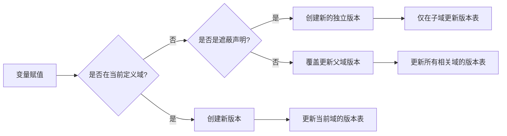


:::note
这就要求，我们一定要看清楚，在使用或者声明一个变量的时候，版本号是多少，他对应的定义域是什么，一般来说我们认为在一个定义域内，对一个变量重新赋值，就会产生一个新的版本，在后续使用的时候，都应该读取这个最新的版本的变量。

如果在一个定义域的子定义域，对一个变量如果是“覆盖”的情况，那么也应该产生新的版本，并且后续在父作用域中使用，也是新的版本。如果在子作用域强制创建了新的同名变量，那么他就不应该影响父作用的值，在父作用域使用的时候，他应该是用的是父作用域的版本。
:::


### 关键规则总结

1. 同一定义域内的重新赋值产生新版本
2. 子定义域中的覆盖操作会影响父定义域
3. 子定义域中的新变量声明（遮蔽）不影响父定义域
4. 变量查找时总是使用最近定义域中的最新版本


这种设计确保了变量版本的正确性和作用域的隔离性，同时保持了 SSA 形式的简洁性和可分析性。通过明确的版本管理规则，我们可以准确地追踪变量在不同定义域中的值变化。

## SSA 构建流程控制：分支与高级逻辑

:::tip

逻辑控制涉及到基本块和定义域的问题，请你确保已经阅读过《第二章》的内容，并且同时了解上一节《定义域对SSA构建的影响》，并且重点关注过“基本块”划分。

:::

从本小节开始，我们将会遇到一些比较复杂的 SSA 构建问题，这些问题涉及到了我们《第二章》中讲到的基本块的划分问题。

一般来说，我们认为的分支一般有两种，我们在 IF 语句和 SWITCH 语句。在本章中，我们除了讨论传统的 IF 和 SWTICH 的情况，还需要对高级逻辑表达式的等价形式进行讨论。


### 基本 IF 语句的 SSA 构建

虽然我们之前以基本块儿的概念讲解了 IF 的划分，但是还是做一个简单的回顾。

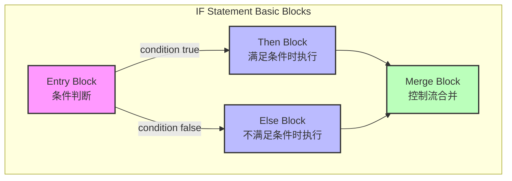

根据定义域和我们一般的经验，IF 中一般会有 TRUE 和 FALSE 两个分支，在一般的块作用域系统中，TRUE 基本块和 FALSE 基本块分别对应了两个不同的作用域。

以 `{ }` 分割的代码块，在我们这次的 IF 语句 SSA 构建中，也会被认为是两个不同的定义域。

根据我们之前讲到的所有内容，我们很容易得到如下 SSA 形式的编译结果：

考虑如下代码(Yak语言)：

```typescript
x = 1
if cond {
	x = 2
} else {
	x = 3
}
dump(x)
```

对应的 SSA 指令如下：

```typescript
package:  application
main 
type: () -> null
entry-0:
	<any> t3 = make any [<nil>, <nil>]
	jump -> if-condition-1
if-condition-1: <- entry-0 
	<any> t8 = undefined-cond
	If [<any> t8] true -> if.true-2, false -> if.false-3
if.true-2: <- if-condition-1 
	jump -> if.done-4
if.false-3: <- if-condition-1 
	jump -> if.done-4
if.done-4: <- if.true-2 if.false-3 
	<number> t16 = phi [<number> 2, if.true-2] [<number> 3, if.false-3] 
	<any> t17 = undefined-dump
	<any> t18 = call <any> t17 (<number> t16) binding[] member[]
```

:::tip 新概念

上述内容和格式我们展示了一种全新的 SSA 指令样貌，已经不再是伪代码了，而是真正的用于生产的 SSA 指令。

这种指令格式是 Yak 的通用 SSA 格式，我们在后续的内容都会尽量使用这种格式来表达。

这种格式的主要特点：
1. **包和函数声明**：使用 `package:` 和函数名声明，并标注函数类型
2. **基本块标识**：使用 `block-name: <- predecessor1 predecessor2` 格式
3. **类型标注**：使用 `<type>` 格式明确标注类型
4. **指令格式**：每条指令都包含目标变量、操作类型和操作数
5. **跳转指令**：使用 `jump ->` 和 `If [...] true ->, false ->` 格式
6. **PHI 节点**：使用 `phi [value, block]` 格式表示来自不同路径的值

:::

在生成上述代码之后，我们再详细讲解这段代码的基本块结构：

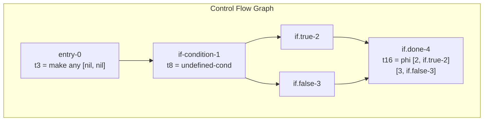

对比一开始的基本块儿图，我们发现在只有一个 IF ELSE 的情况下，四个核心基本块基本可以一一对应到下面的编译结果上，实际上在 phi 的节点上，我们更能体现出汇聚基本块产生 Phi 的概念。

### 多分支的 IF 语句

有了最基本的单个 IF 语句的 SSA 构建，我们就可以开始讨论多分支的 IF 语句的 SSA 构建了。

考虑如下代码(Yak语言):

```typescript
x = 1
if cond {
	x = 2
} else if cond2 {
	x = 3
} else if cond3 {
	x = 4
} else {
	x = 5
}
dump(x)
```

:::tip

虽然 ELSE IF 是一个新的语法，但是从语义上来说，他其实就是一个 IF ELSE 的嵌套，所以我们可以把 ELSE IF 转换成 IF ELSE 的嵌套来处理。

:::

那么我们如何形式化表示 IF ELSE 多分支（嵌套）的情况呢？考虑如下递归公式：

<BlockMath math={`\\begin{align*}
& \\text{Process}(\\text{If}(cond, then, else)) = \\\\
& \\quad \\begin{cases}
& \\text{BasicBlock}_{entry} \\rightarrow \\text{cond} \\\\
& \\text{If}\\ cond\\ \\text{then} \\\\
& \\quad \\text{Process}(then) \\\\
& \\text{else} \\\\
& \\quad \\begin{cases}
& \\quad \\text{if}\\ else\\ \\text{is}\\ \\text{ElseIf} \\\\
& \\quad \\quad \\text{Process}(\\text{If}(else.cond, else.then, else.else)) \\\\
& \\quad \\text{else} \\\\
& \\quad \\quad \\text{Process}(else)
& \\end{cases} \\\\
& \\text{BasicBlock}_{merge} \\rightarrow \\phi(results)
\\end{cases}
\\end{align*}`} />

这个递归公式表达了：

1. **基本结构**：
   - 每个 IF 语句都会生成入口基本块（条件判断）
   - 然后处理 THEN 分支
   - 接着处理 ELSE 分支
   - 最后生成合并基本块，包含 PHI 节点

2. **递归处理**：
   - 如果 ELSE 分支是一个 ELSE-IF，则递归处理这个新的 IF 语句
   - 如果是普通 ELSE，则直接处理其中的语句

3. **PHI 节点生成**：
   - 在合并点收集所有分支的结果
   - 生成相应的 PHI 指令

:::tip
这个递归处理过程清晰地展示了如何将复杂的 IF-ELSE IF 链转换为基本的 IF-ELSE 嵌套结构。每个 ELSE IF 实际上都变成了一个新的 IF 语句，嵌套在上一个 IF 的 ELSE 分支中。
:::


我们把上述代码变成了 IF ELSE 之后，其实相当于 IF ELSE 嵌套：

```typescript
package:  application
main 
type: () -> null
entry-0:
	<any> t3 = make any [<nil>, <nil>]
	jump -> if-condition-1
if-condition-1: <- entry-0 
	<any> t8 = undefined-cond
	If [<any> t8] true -> if.true-2, false -> if.false-3
if.true-2: <- if-condition-1 
	jump -> if.done-8
if.false-3: <- if-condition-1 
	<any> t14 = undefined-cond2
	If [<any> t14] true -> if.true-4, false -> if.false-5
if.true-4: <- if.false-3 
	jump -> if.done-8
if.false-5: <- if.false-3 
	<any> t20 = undefined-cond3
	If [<any> t20] true -> if.true-6, false -> if.false-7
if.true-6: <- if.false-5 
	jump -> if.done-8
if.false-7: <- if.false-5 
	jump -> if.done-8
if.done-8: <- if.true-2 if.true-4 if.true-6 if.false-7 
	<number> t28 = phi [<number> 2, if.true-2] [<number> 3, if.true-4] [<number> 4, if.true-6] [<number> 5, if.false-7] 
	<any> t29 = undefined-dump
	<any> t30 = call <any> t29 (<number> t28) binding[] member[]
```

上述 SSA 难以阅读的话，我们考虑使用基本块图来展示：

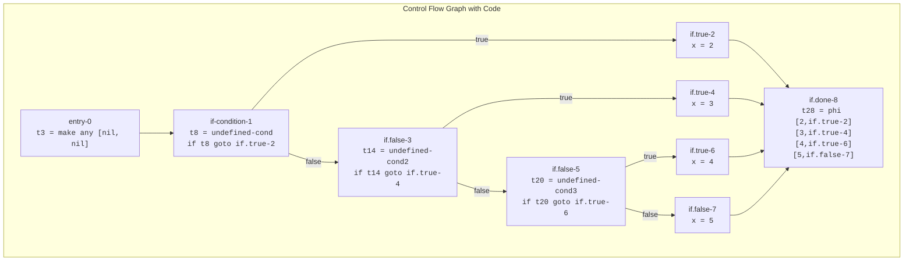

按照这种思路，我们可以把任何复杂的 IF ELSE 都进行切割，并且得到正确的 CFG 结构和 SSA 指令。

### SWITCH 语句：特殊分支循环

SWITCH 语句是一种多分支控制流结构，其 SSA 构建过程涉及复杂的控制流图（Control Flow Graph, CFG）生成和数据流分析。本节将详细讨论 SWITCH 语句在不同语言范式下的 SSA 构建策略。

#### 基本语义

SWITCH 语句在不同编程语言中具有不同的执行语义。我们可以将其分为两种主要模型：

1. **连续执行模型（Sequential Execution Model）**：
   - 代表语言：C/C++
   - 特征：默认 fallthrough 行为，需要显式 break 终止

2. **离散执行模型（Discrete Execution Model）**：
   - 代表语言：Go
   - 特征：默认 break 行为，需要显式 fallthrough 继续

#### 控制流形式化

对于 SWITCH 语句，我们可以形式化定义其控制流转换函数：

<BlockMath math={`
\\text{SwitchCFG} = (V, E, \\text{entry}, \\text{exit})
`} />

其中：
- <InlineMath math="V"/> 表示基本块集合
- <InlineMath math="E"/> 表示边集合
- <InlineMath math="\text{entry}"/> 为入口节点
- <InlineMath math="\text{exit}"/> 为出口节点

基本块之间的转换关系可以表示为：

<BlockMath math={`
\\text{Transform}(\\\text{case}_i) = \\begin{cases}
\\text{case}_{i+1}, & \\text{if}\\ \\text{fallthrough} \\\\
\\text{exit}, & \\text{if}\\ \\text{break} \\\\
\\text{default}, & \\text{if}\\ \\text{no match}
\\end{cases}
`} />

#### 两种模式的 SWTICH 结构体

##### 连续执行模型（C-style）

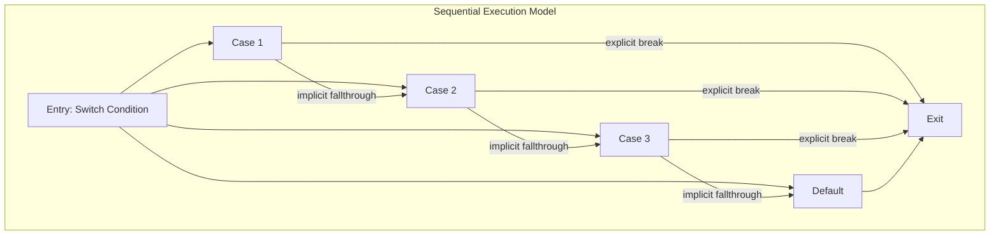

SWITCH 连续执行模型，默认会 fallthrough，除非显式使用 break。幸运的是现有很多的语言都遵循着一个规则，我们可以直接使用 JS 的一个案例来表示对比：

```typescript
let x = 1
switch (x) {
case 1:
	x = 2
case 2:
	x = 3
default:
	x = 4
}
console.info(x)
```

上述代码编译后的 SSA 指令如下：

```typescript
package:  application
main 
type: () -> null
entry-0:
	<any> t3 = make any [<nil>, <nil>]
switch-condition-1: <- entry-0 
	switch <number> 1 default:[switch.default-6] {<number> 1:switch.handler-2, <number> 2:switch.handler-4}
switch.handler-2: <- switch-condition-1 
	jump -> switch.block-3
switch.block-3: <- switch.handler-2 
	jump -> switch.handler-4
switch.handler-4: <- switch.block-3 switch-condition-1 
	jump -> switch.block-5
switch.block-5: <- switch.handler-4 
	<number> t12 = phi [<number> 2, switch.block-3] [<number> 1, entry-0] 
	jump -> switch.default-6
switch.default-6: <- switch-condition-1 switch.block-5 switch-condition-1 
	<number> t20 = phi [<number> 3, switch.block-5] [<number> 1, entry-0] 
	jump -> switch.done-7
switch.done-7: <- switch.default-6 
	<any> t27 = undefined-console.info(valid)(from:25)
	<any> t25 = undefined-console
	<any> t28 = call <any> t27 (<number> 4) binding[] member[]
```

上述指令比 IF 语句要复杂得多，我们还是需要借助 CFG 来理解 SSA 的基本块如何切合和他们最终的展示形式：

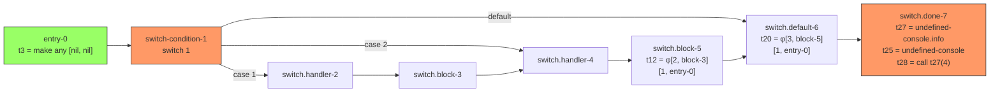


这段代码的特点是：

1. **Fall-through 结构**：
   - case 1 会 fall-through 到 case 2
   - case 2 会 fall-through 到 default

2. **φ 函数的使用**：
   - 在 block-5 中：`t12 = φ[2, block-3][1, entry-0]`
   - 在 default-6 中：`t20 = φ[3, block-5][1, entry-0]`

对应的 JavaScript 代码等价于如下的内容：

```javascript
switch (1) {
    case 1:
    case 2:
    default:
        console.info(4);
}
```

:::tip
这个控制流图展示了一个有趣的特点：
1. 所有的分支最终都会执行到 default 块
2. φ 函数在这里用于合并不同路径的值
3. 最终在 done 节点中调用 console.info(4)
:::

:::warning
在 SSA 中，φ 函数的位置很重要：
- `t12` 在 block-5 中合并了来自 block-3 的值 2 和来自 entry-0 的值 1
- `t20` 在 default-6 中合并了来自 block-5 的值 3 和来自 entry-0 的值 1
:::

这个连续执行的 SWITCH 例子展示了 SSA 如何处理带有 fall-through 的 switch 语句，以及如何使用 φ 函数来处理不同路径上的值合并。每个基本块都清晰地标示了其前驱和后继关系，这对于理解控制流非常重要。

作为对比，我们再看其带 break 的连续执行模型（我们在 case 结束的时候，手动加上了 break 来避免连续执行）：

```typescript
let x = 1
switch (x) {
case 1:
	x = 2
	break
case 2:
	x = 3
	break
default:
	x = 4
}
console.info(x)
```

上述代码编译后的 SSA 指令和基本块结构和我们刚才看到的有明显的区别：

```typescript
package:  application
main 
type: () -> null
entry-0:
	<any> t3 = make any [<nil>, <nil>]
switch-condition-1: <- entry-0 
	switch <number> 1 default:[switch.default-6] {<number> 1:switch.handler-2, <number> 2:switch.handler-4}
switch.handler-2: <- switch-condition-1 
	jump -> switch.block-3
switch.block-3: <- switch.handler-2 
	jump -> switch.done-7
switch.handler-4: <- switch-condition-1 
	jump -> switch.block-5
switch.block-5: <- switch.handler-4 
	jump -> switch.done-7
switch.default-6: <- switch-condition-1 switch-condition-1 
	jump -> switch.done-7
switch.done-7: <- switch.block-3 switch.block-5 switch.default-6 
	<number> t23 = phi [<number> 2, switch.block-3] [<number> 3, switch.block-5] [<number> 4, switch.default-6] 
	<any> t26 = undefined-console.info(valid)(from:24)
	<any> t24 = undefined-console
	<any> t27 = call <any> t26 (<number> t23) binding[] member[]

```

我们把上述基本块 CFG 进行可视化：


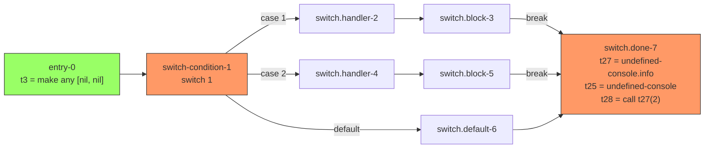


与之前的连续执行模型相比，这个带 break 的版本有以下明显区别：

1. **控制流结构**：
   - 每个 case 块直接跳转到 done 块，而不是 fall-through 到下一个 case
   - 没有了复杂的 φ 函数，因为各个分支是互斥的

2. **基本块的简化**：
   - 每个 handler 块都有自己独立的 block
   - 所有块都直接跳转到 done 块
   - 不需要在中间块中使用 φ 函数来合并值

3. **执行路径**：
   - case 1 路径：entry → condition → handler-2 → block-3 → done
   - case 2 路径：entry → condition → handler-4 → block-5 → done
   - default 路径：entry → condition → default-6 → done

:::tip
带 break 的 switch 结构的优点：
1. 控制流更清晰，每个 case 的执行是独立的
2. 不会出现意外的 fall-through
3. SSA 形式更简单，没有复杂的 φ 函数
:::

:::warning
虽然带 break 的版本更清晰，但在某些场景下，fall-through 也是有用的：
1. 多个 case 共享相同的处理逻辑时
2. 需要累积处理的场景
3. 特定的状态机实现
:::

这个对比很好地展示了为什么现代编程语言倾向于默认不使用 fall-through：
1. 代码意图更明确
2. 减少了意外的执行路径
3. 生成的 SSA 代码更简单，更容易优化
4. 降低了维护成本和出错可能

在编译器实现中，这种带 break 的结构也更容易进行优化，因为控制流更加清晰和可预测。

--- 
##### 离散执行模型（Go-style）
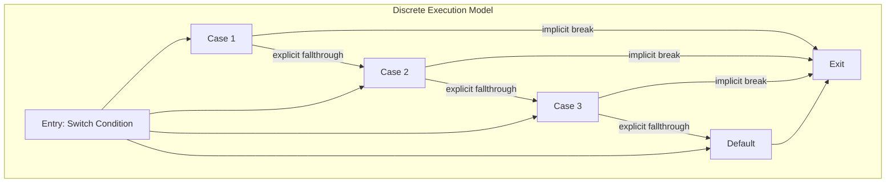

对于离散执行模型，我们可以用下面这个案例来说明，考虑以下代码：

```go
x = 1
switch x {
case 1:
	x = 2
case 2:
	x = 3
default:
	x = 4
}
dump(x)
```

:::tip

要注意，上述代码的 SWITCH 语句是离散执行模型，也就是说，他默认会 break，除非显式使用 fallthrough。

:::

上述代码编译后的 SSA 指令如下：

```typescript
package:  application
main 
type: () -> null
entry-0:
	<any> t3 = make any [<nil>, <nil>]
switch-condition-1: <- entry-0 
	switch <number> 1 default:[switch.default-6] {<number> 1:switch.handler-2, <number> 2:switch.handler-4}
switch.handler-2: <- switch-condition-1 
	jump -> switch.block-3
switch.block-3: <- switch.handler-2 
	jump -> switch.done-7
switch.handler-4: <- switch-condition-1 
	jump -> switch.block-5
switch.block-5: <- switch.handler-4 
	jump -> switch.done-7
switch.default-6: <- switch-condition-1 switch-condition-1 
	jump -> switch.done-7
switch.done-7: <- switch.block-3 switch.block-5 switch.default-6 
	<number> t23 = phi [<number> 2, switch.block-3] [<number> 3, switch.block-5] [<number> 4, switch.default-6] 
	<any> t24 = undefined-dump
	<any> t25 = call <any> t24 (<number> t23) binding[] member[]

```

上述代码切割成 handler 和 block 和 dome 的多个基本块，可以参考如下可视化 CFG 来表示一个基础类型字面量：

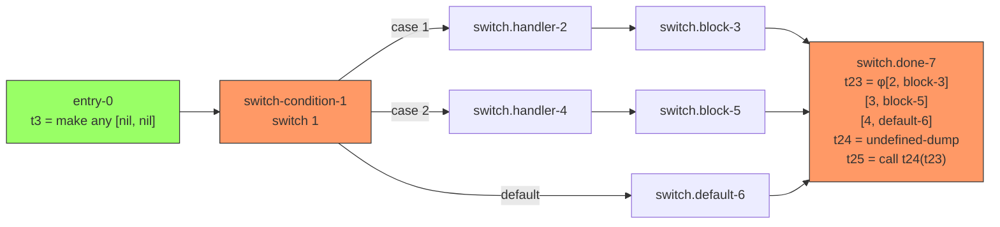


:::tip

我们在考虑 SSA 的构建的时候，需要考虑 Golang 的这种特性，让这个编译特性直接成为一个选项。

:::


### 非顺序 SWTICH CASE（Go-Style）

:::note
在 Golang 中，SWITCH 语句的 CASE 可以乱序，而且不需要连续，这一点在 C 语言中是不允许的。但是 Golang 的 SWTICH 在出现 fallthrough 的时候，却又可以保证 fallthrough 的顺序性。
:::

在支持非顺序 CASE 语句的语言中（如 Go），编译器需要：

1. 构建有序的跳转表
2. 维护原始代码顺序与优化后顺序的映射
3. 确保 fallthrough 语义的正确性

这种处理可以形式化为：

<BlockMath math={`
\\begin{align*}
\\text{Cases} &= \\{(v_i, \\text{BB}_i, p_i) | i \\in [1,n]\\} \\\\
\\text{where:} & \\\\
& v_i \\text{ is the case value} \\\\
& \\text{BB}_i \\text{ is the basic block} \\\\
& p_i \\text{ is the source position}
\\end{align*}
`} />

考虑到 fallthrough 语义，我们需要维护两个重要的映射关系：

<BlockMath math={`
\\begin{align*}
\\text{OrderedCases} &= \\text{Sort}(\\text{Cases}) \\\\
\\text{FallthroughMap} &= \\{(\\text{BB}_i, \\text{BB}_j) | \\text{BB}_i \\xrightarrow{\\text{fallthrough}} \\text{BB}_j\\}
\\end{align*}
`} />

最后需要构建的 CFG 图如下：

```mermaid
graph TB
    subgraph "Non-sequential Switch with Fallthrough"
        A["Switch Entry"] --> B["Value Table"]
        B --> C["Jump Table"]
        
        C --> D["Case 5"]
        C --> E["Case 2"]
        C --> F["Case 8"]
        C --> G["Default"]
        
        D -->|"fallthrough"| H["Next in Source"]
        E -->|"implicit break"| I["Exit"]
        F -->|"fallthrough"| J["Next in Source"]
        
        H --> I
        J --> I
        G --> I
    end
```

### 高级逻辑运算符 `&&` 和 `||`

:::note

高级逻辑运算符 `&&` 和 `||` 的短路特性，在 SSA 构建中需要特别注意。

这是套着表达式外衣的控制流结构，再编译的时候万万不可直接编译成表达式。

:::


对于 `&&` 和 `||` 这样的短路运算符，我们需要将其转换为基本块的跳转结构（我们讨论的通用 SSA 构建，当然希望同时讨论多种语言的情况啦）。

考虑如下 PHP 代码：

```typescript
<?php

$x = check1() && check2();
dump($x);
```

通过 SSA 编译器后，我们会得到一个结果为：

```typescript
package: c2623de844e06698629ca1afc24b9ecb1c6597abd0bbee6b559c73722872d3c5 library
main 
type: () -> null
entry-0:
	<any> t14 = undefined-89b7a239-22b6-4e0c-bf42-da4ee2d8efd9
	<any> t12 = undefined-check1
	<any> t13 = call <any> t12 () binding[] member[]
	jump -> if-condition-1
if-condition-1: <- entry-0 
	<boolean> t19 = <any> t13 eq <boolean> true
	If [<boolean> t19] true -> if.true-2, false -> if.false-3
if.true-2: <- if-condition-1 
	<any> t20 = undefined-check2
	<any> t21 = call <any> t20 () binding[] member[]
	<boolean> t23 = <any> t21 eq <boolean> true
	jump -> if.done-4
if.false-3: <- if-condition-1 
	jump -> if.done-4
if.done-4: <- if.true-2 if.false-3 
	<boolean> t30 = phi [<boolean> t23, if.true-2] [<boolean> false, if.false-3] 
	<any> t31 = undefined-dump
	<any> t32 = call <any> t31 (<boolean> t30) binding[] member[]

```

我们发现源代码虽然只有短短两行，但是编译后的内容包含了多个基本块，这个结果就是因为 `&&` 和 `||` 的短路特性导致的。

:::tip 短路特性

短路特性（Short-circuit Evaluation）是逻辑运算符的一个重要特性，指的是在进行逻辑运算时，如果第一个操作数的值已经能够确定整个表达式的结果，那么第二个操作数就不会被求值。

具体来说：
1. 对于 `&&` (与运算)：
   - 如果第一个操作数为 `false`，整个表达式必定为 `false`，无需计算第二个操作数
   - 只有当第一个操作数为 `true` 时，才需要计算第二个操作数

2. 对于 `||` (或运算)：
   - 如果第一个操作数为 `true`，整个表达式必定为 `true`，无需计算第二个操作数
   - 只有当第一个操作数为 `false` 时，才需要计算第二个操作数


:::

我们把上述基本块 CFG 进行可视化：

```mermaid
graph LR
    Entry["entry-0<br/>t14 = undefined-id<br/>t12 = undefined-check1<br/>t13 = call t12()"] --> Condition["if-condition-1<br/>t19 = t13 eq true"]
    
    Condition -->|"t19 == true"| True["if.true-2<br/>t20 = undefined-check2<br/>t21 = call t20()<br/>t23 = t21 eq true"]
    Condition -->|"t19 == false"| False["if.false-3"]
    
    True --> Done["if.done-4<br/>t30 = φ[t23, if.true-2][false, if.false-3]<br/>t31 = undefined-dump<br/>t32 = call t31(t30)"]
    False --> Done
    
    style Entry fill:#9f6,stroke:#333
    style Done fill:#f96,stroke:#333

```


让我们分析这个 CFG 中体现的短路特性：

1. **入口块（entry-0）**：
   ```typescript
   t14 = undefined-id
   t12 = undefined-check1
   t13 = call t12()  // 调用第一个函数 check1()
   ```

2. **条件判断块（if-condition-1）**：
   ```typescript
   t19 = t13 eq true  // 检查 check1() 的返回值
   ```
   - 这里是短路逻辑的关键判断点
   - 基于 `check1()` 的结果决定是否需要执行 `check2()`

3. **真值块（if.true-2）**：
   ```typescript
   t20 = undefined-check2
   t21 = call t20()   // 只有在 check1() 为 true 时才会执行
   t23 = t21 eq true
   ```
   - 只有当 `check1()` 返回 `true` 时才会进入此块
   - 体现了 `&&` 运算符的短路特性

4. **合并块（if.done-4）**：
   ```typescript
   t30 = phi [t23, if.true-2] [false, if.false-3]
   ```
   - 使用 φ 函数合并不同路径的结果
   - 如果来自 if.true-2，使用 `check2()` 的结果
   - 如果来自 if.false-3，直接使用 `false`

:::tip 短路优化
这个 SSA 实现展示了几个重要的优化特点：
1. **避免不必要的计算**：当 `check1()` 返回 `false` 时，完全跳过了 `check2()` 的调用
2. **控制流优化**：使用基本块的跳转而不是表达式计算来实现短路逻辑
3. **结果合并**：通过 φ 函数处理不同执行路径的结果
:::

:::tip 关于 `||` 运算符的实现
`||` 运算符的 SSA 实现思路与 `&&` 非常相似，只需要调整条件判断的逻辑和跳转方向即可：
- 当第一个操作数为 `true` 时直接返回 `true`（短路）
- 当第一个操作数为 `false` 时才需要计算第二个操作数

基本块的划分结构基本保持一致，主要区别在于条件判断的布尔逻辑和 φ 函数中的值选择。由于实现逻辑如此相似，这里就不再展开详细讨论了。
:::

这样的实现同样遵循了清晰的控制流结构，为后续的代码优化提供了良好的基础。

## 后续循环与函数的讨论见下一节

在[《第三章：高级语言的 SSA 构建（二）》](./ssa-for-advanced-language-2)中，我们将继续讨论循环和函数的 SSA 构建。

## 讨论区

import Giscus from '@site/src/components/Giscus';

<Giscus />