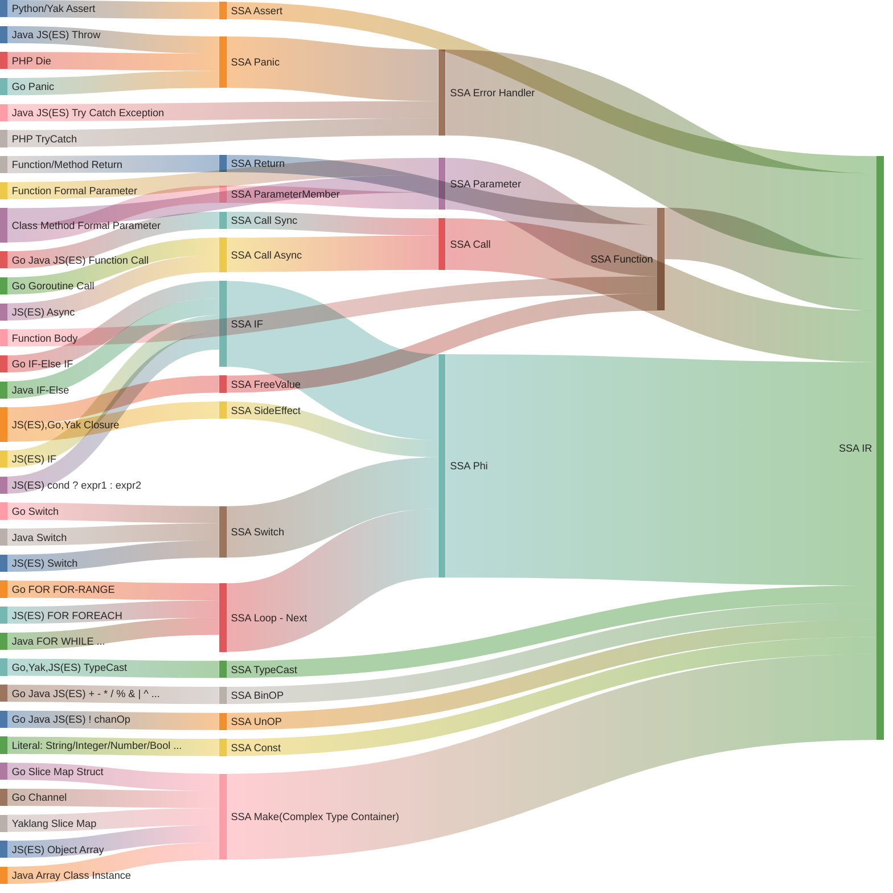
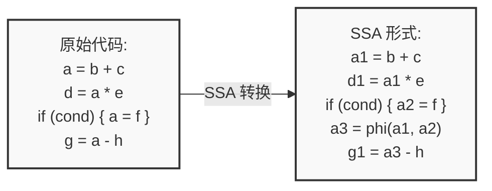
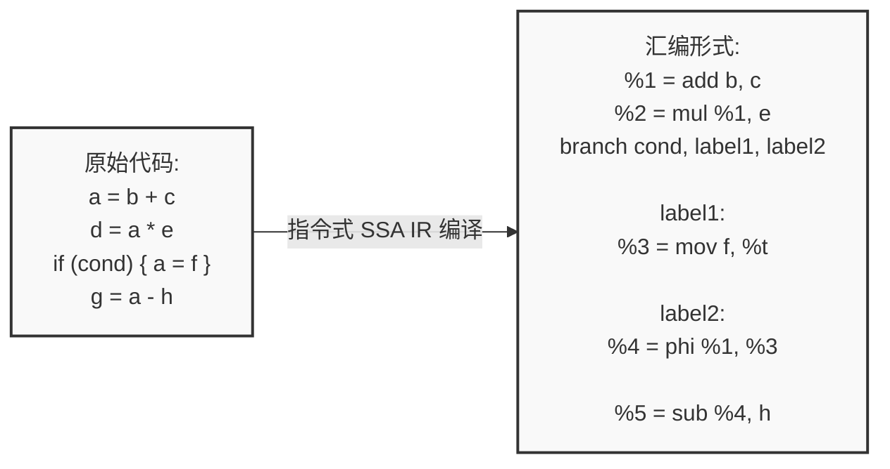
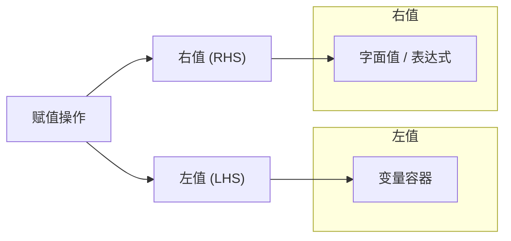
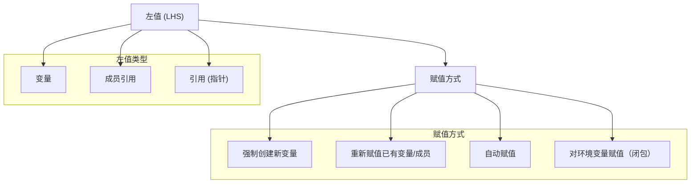

# 第三章：高级语言的 SSA 构建

import TOCInline from '@theme/TOCInline';

<TOCInline toc={toc} />

--- 

本文讲介绍高级语言是如何翻译成 SSA 形式的。在开始介绍之前，我们先明确高级语言和相对的低级语言分别有什么样的区别。

## 背景：编程语言的高级与低级

高级编程语言是一类抽象层次高、接近人类思维的计算机语言，它们具有强大的表达能力、自动化的内存管理、丰富的内置数据结构和控制结构。这类语言（如Python、Java、JavaScript等）通常具有良好的可读性和可维护性，能够自动处理垃圾回收、类型推导等底层细节，并且具有出色的跨平台特性。高级语言的这些特性使得开发者能够更专注于业务逻辑的实现，而不必过多关注底层实现细节。

低级编程语言（如汇编语言和机器语言）则直接面向计算机硬件，与CPU架构紧密相关，需要程序员手动管理内存、显式声明类型，并且需要深入理解硬件细节。在编译过程中，高级语言转换为SSA形式时需要处理更复杂的语言特性，如异常处理、面向对象特性（继承、多态）、闭包等，这使得SSA构建过程比低级语言更为复杂。而低级语言由于其简单的语言特性和直接的硬件映射关系，其SSA构建过程相对简单。

| 对比维度 | 高级语言 | 低级语言 |
|---------|---------|---------|
| **内存管理** | • 自动垃圾回收(GC)<br/>• 自动内存分配和释放<br/>• 内存安全保证<br/>• 内存泄漏防护 | • 手动内存管理<br/>• 显式分配/释放<br/>• 指针直接操作<br/>• 需自行处理内存泄漏 |
| **类型系统** | • 动态类型/类型推导<br/>• 强类型安全检查<br/>• 复杂类型系统支持<br/>• 泛型和多态 | • 静态类型声明<br/>• 基本类型系统<br/>• 直接内存类型<br/>• 类型转换显式 |
| **抽象能力** | • 面向对象/函数式<br/>• 高阶函数支持<br/>• 闭包/Lambda<br/>• 模块化系统<br/>• 元编程能力 | • 过程式编程<br/>• 基础控制结构<br/>• 直接调用约定<br/>• 简单作用域<br/>• 宏替换 |
| **运行特性** | • 跨平台运行<br/>• 虚拟机/解释器<br/>• JIT编译优化<br/>• 运行时安全检查 | • 直接机器执行<br/>• 平台相关性强<br/>• AOT编译<br/>• 最小运行时开销 |
| **开发效率** | • 快速开发迭代<br/>• 丰富的生态系统<br/>• 大量第三方库<br/>• 完善的工具链 | • 开发周期长<br/>• 依赖较少<br/>• 工具链简单<br/>• 调试复杂 |
| **性能特点** | • 性能可预测性低<br/>• GC暂停<br/>• 额外运行时开销<br/>• 优化依赖编译器 | • 性能可预测<br/>• 直接硬件控制<br/>• 最小执行开销<br/>• 手动优化空间大 |
| **应用场景** | • Web应用开发<br/>• 企业应用<br/>• 数据分析<br/>• 快速原型<br/>• 应用层开发 | • 系统编程<br/>• 驱动开发<br/>• 嵌入式系统<br/>• 性能密集型<br/>• 底层开发 |
| **典型语言** | • Python/Ruby<br/>• Java/C#<br/>• JavaScript/TypeScript<br/>• Kotlin/Swift<br/>• Go/Rust(部分特性) | • 汇编语言<br/>• C语言<br/>• 机器码<br/>• LLVM IR |
| **编译特性** | • 复杂的编译优化<br/>• 多级中间表示<br/>• 复杂的SSA构建<br/>• 需要处理运行时特性 | • 简单的编译过程<br/>• 直接的代码生成<br/>• 简单的SSA形式<br/>• 静态编译链接 |

--- 

## 高级语言的 SSA 构建

高级编程语言和低级编程语言的 SSA IR 构建存在非常明显的差异。在高级编程语言中，由于其强大的抽象能力，需要处理更多的语言特性，如面向对象特性（继承、多态）、闭包等，这使得SSA构建过程比低级语言更为复杂。

但是实际上用户接触的大部分编程语言都是高级编程语言，直接使用低级语言的场景相对较少。因此，本文将重点介绍高级编程语言的 SSA 构建过程。

实际上基于高级语言构建 SSA 的过程，本质上是把各种高级语言特性编译成更低级的 IR 的过程。我们用一张图生动的描述我们接下来要讨论的内容：



## 目标产物：基于指令的 SSA IR

我们在前面的描述和案例中，讲到的 SSA 基本都是基于变量（Variable）的 SSA 形式。他的形式更接近编程语言的语义，但是这种形式在编译器后端并不常见。

编译器后端通常使用基于指令（Instruction）的 SSA IR 形式。基于指令的 SSA IR 更接近汇编语言，是一种更低级的表示形式。

:::tip

根据其表示粒度和抽象层次的不同，SSA 可以分为基于变量的 SSA 和基于指令的 SSA IR。这两种形式在编程语言语义和编译器后端实现中都有广泛应用。

:::

以下是对这两种 SSA 形式的详细对比。

### 基于变量的 SSA

基于变量的 SSA 更接近编程语言的语义，更符合人类的思维方式。也是我们前面讨论的 SSA 形式。这种 SSA 形式在教学中经常被使用。具体定义为：每个变量在程序中只赋值一次，通过引入新的变量版本来表示不同的赋值点。

#### 特点

- 高级抽象，更贴近高级编程语言的变量使用方式。
- 适用于前端优化和高级语言语义分析。

#### 典型案例




### 基于指令的 SSA IR

基于指令的 SSA IR 更接近汇编语言，是一种更低级的表示形式。可读性并不好，但是计算机和编程处理起来更高效。定义为：每条指令在 SSA 形式中只出现一次，使用 SSA 变量来表示指令的结果。

#### 特点

- 更低级，接近汇编语言或机器指令，更容易被再次深层编译为其他更低级的指令集。
- 适用于后端优化，例如基于数据流的活跃变量判断，常量折叠，分配，过程分析等。

#### 典型案例



### 两种 SSA 形式的对比

| **方面**           | **基于变量的 SSA** | **基于指令的 SSA IR** |
|--------------------|--------------------|-----------------------|
| **粒度**           | 高级变量级别       | 指令级别              |
| **抽象层次**       | 接近高级语言       | 接近汇编/机器指令     |
| **变量表示**       | 变量版本（x1, x2）  | SSA 变量对应指令输出   |
| **Phi 函数**       | 用于变量版本选择   | 用于指令输出选择      |
| **适用阶段**       | 前端优化、语义分析 | 后端优化、代码生成    |
| **优化目标**       | 数据流优化         | 深层数据流优化和指令优化            |
| **复杂性**         | 逻辑简单，计算机处理复杂           | 编译复杂，需处理指令依赖，但是数据流处理简单|
| **与语言结构的映射**| 直接对应语言变量   | 需要映射到具体指令    |

:::tip

在后续的讨论中，如果不特别说明，我们讨论的 SSA 形式都是基于指令的 SSA IR 形式。

后续出现的代码或者 SSA 编译脚手架也大部分都是基于指令的 SSA IR 形式。

:::

### 重要的额外补丁

我们并不推荐使用变量的 SSA 形式，因为其抽象层次较高，不利于计算机处理。因此我们后续的讨论都是基于指令的 SSA IR 形式。

但是实际上，我们在进行指令式 SSA IR 编译时，我们的处理方案细节并不和普通的指令式 SSA IR 编译相同，在很多细节上，我们进行实践性和工程性非常强的优化

#### 额外补丁一：指令ID全局唯一

在传统的静态单赋值（SSA, Static Single Assignment）表示法中，确保每条指令在其所属的基本块内部具有唯一性。然而，这仅满足了最基本的唯一性要求。在我们的编译过程中，我们引入了更为严格的约束，确保指令ID在全局范围内的唯一性。

这一设计使得指令ID不仅可以唯一标识一条指令，还无需关心该指令所在的具体基本块。这一特性在工程实践中具有显著优势，尤其是在与数据库系统集成时表现突出。具体而言，通过采用数据库的自增ID机制作为指令ID，我们能够将SSA的构建过程高效地存储到数据库中。这不仅简化了指令的追踪和管理，还极大地便利了调试和分析工作。

需要特别指出的是，这一全局唯一指令ID的设计在传统的SSA编译器实现中尚未普遍采用。因此，在实际应用中，开发者需明确区分并正确理解这一改进，以充分发挥其在优化和工程实现中的潜力。

#### 额外补丁二：定义域化变量系统辅助

尽管基于指令集的静态单赋值（SSA, Static Single Assignment）中间表示在工程实践中展现出显著优势，但其也存在一定的局限性，其中之一即无法直接将源代码中的变量与具体指令进行关联。为解决这一问题，在编译过程中，我们引入了词法变量辅助系统。该系统在构建指令的同时，维护一个索引结构，用于关联词法变量与相应的指令。

这一辅助系统的引入是必不可少的，原因在于基于指令的 SSA IR 编译过程中，指令的定义域（定义位置）与使用域（使用位置）是相互分离的。特别是在源代码中存在闭包（closure）等高级特性时，需要通过词法变量直接判断闭包所处的环境以及具体变量是否存在词法遮蔽（shadowing）的问题。因此，词法变量辅助系统不仅确保了变量与指令之间的正确映射，也保障了闭包等复杂结构在编译过程中的正确处理。

定义域变量系统辅助在基于指令的 SSA IR 编译中起到了关键作用，既弥补了指令级 SSA 表示在变量关联上的不足，又为处理高级语言特性提供了必要的支持。这一设计在提高编译器的灵活性和准确性方面具有重要意义，尤其在涉及复杂控制流和作用域管理的情况下，能够有效地提升编译过程的健壮性和优化效果。

--- 

## 语言基础特性的 SSA 构建

在对指令式SSA（静态单赋值）中间表示的基本概念有了前述理解之后，我们可以进一步探讨其在编译过程中对编程语言基础特性的处理方法。在高级编程语言中，赋值语句、表达式、语句块、流程控制结构以及函数构成了五个核心特性。这些特性几乎存在于所有主流编程语言中，构成了语言的基本构建模块。

:::tip

探讨语言基础特性的SSA编译是学习SSA编译的理想起点。由于这些基础特性在所有编程语言中普遍存在，其对应的SSA编译过程相对简单，易于理解。

这为后续涉及更复杂或高级语言特性的讨论提供了坚实的基础，帮助我们理解这些复杂特性是如何在基础特性之上构建的。

:::

### 深入理解赋值语句

赋值（Assignment）是编程语言中的基本操作之一，其本质在于将一个特定的值或表达式的计算结果绑定到一个变量上，从而更新该变量的状态。通过赋值，程序能够存储、修改和传递数据，使得程序能够根据不同的输入和条件执行相应的逻辑操作。

在SSA中，每个变量在其赋值时必须唯一，这意味着每个赋值操作都应生成一个新的变量版本。然而，如果一个赋值语句中的值未被后续使用，该赋值操作即为冗余，此时相关的变量实体无需创建（无需生成指令）。这种优化不仅减少了中间表示的冗余，也有助于提升后续优化和生成代码的效率。因此，在SSA构建过程中，识别并消除未使用的赋值语句是提升编译器性能的关键步骤之一。

虽然赋值语句产生的变量不直接生成指令，但是其产生的变量实体（变量容器）是后续指令的载体，因此变量实体是不可或缺的。同时赋值语句是一个非常重要的高级语言特性，我们有必要详细了解它。

有了上述基本概念之后，我们继续深入介绍赋值这个操作：在编程语言中，赋值操作通常涉及两个部分：左值（Left Value，**LHS**）和右值（Right Value，**RHS**）。理解这两者的区别对于编译器设计和代码优化至关重要。

- **左值（LHS）：** 表示赋值操作中的目标位置，即变量或内存位置。左值不一定会生成指令的变量容器，尤其是在优化过程中，某些左值可能会被消除或重用，同时在指令式 SSA IR 中，左值也不一定需要生成指令，通常左值都会只作为辅助构建指令的容器存在。
  
- **右值（RHS）：** 表示赋值操作中的源数据，即字面值、表达式或计算结果。右值通常是一个具体的值或通过表达式计算得到的结果，将被赋给左值。

#### 图示左右值

以下是一个使用 Mermaid 语言绘制的赋值操作中左值和右值的示意图：



#### 左值：不一定生成指令的变量容器

在赋值操作中，左值（Left Value，LHS）代表赋值的目标。理解左值的类型及其赋值方式对于编译器设计和代码优化至关重要。左值不一定会生成指令的变量容器，这取决于优化策略和上下文。下面将详细介绍左值的类型及其赋值方式。

#### 左值的类型

1. **变量**
   
   变量是最常见的左值类型，直接绑定到存储位置，用于存储数据。例如：
   
   ```c
   int x = 10;
   ```
   
   在这个例子中，`x` 是一个变量，作为左值接受值 `10` 的赋值。

2. **成员引用**
   
   成员引用涉及对结构体、类、数组或切片成员的访问和赋值。例如：
   
   ```c
   struct Point {
       int x;
       int y;
   };
   
   Point p;
   p.x = 5;  // p.x 是成员引用的左值
   ```
   
   在这里，`p.x` 是左值，用于赋值 `5`。

3. **引用（指针）**
   
   引用类型允许通过指针间接访问和赋值。例如：
   
   ```c
   int a = 10;
   int *ptr = &a;
   *ptr = 20;  // *ptr 是指针引用的左值
   ```
   
   在这个例子中，`*ptr` 是通过指针 `ptr` 解引用得到的左值，赋值操作将 `20` 赋给 `a`。

---
##### 对左值赋值的方式

赋值方式可以根据不同需求进行分类，主要包括以下几种：

1. **强制创建一个新变量**
   
   在某些上下文中，赋值操作需要强制创建一个新的变量。这通常发生在静态单赋值（SSA）中，每次赋值都会生成一个新的变量实例。例如：
   
   ```plaintext
   a1 = 5
   a2 = 10
   ```
   
   每次赋值都会创建一个新的变量版本，`a1` 和 `a2` 是不同的变量实例。

2. **对已经有的变量（成员）进行重新赋值（更新，传递）**
   
   对已有变量或其成员进行重新赋值，更新其值。例如：
   
   ```python
   x = 5
   x = x + 3  # 对现有变量 x 进行重新赋值
   ```
   
   成员赋值类似：
   
   ```c
   p.x = 15;  // 更新结构体 p 的成员 x
   ```

3. **自动赋值（自动创建变量，并赋值，如果变量已存在就对已有变量赋值）**
   
   自动赋值是指在赋值时，编译器或解释器会自动处理变量的创建和赋值，无需显式创建新的变量实例。例如在某些动态语言中：
   
   ```python
   y = 10  # 自动创建变量 y 并赋值 10
   y = y + 5  # 赋值给已存在的 y
   ```

4. **对环境变量赋值（闭包）**
   
   在闭包（closures）中，赋值操作可能影响环境变量，即在函数外部定义的变量。例如：
   
   ```javascript
   let count = 0;
   function increment() {
       count += 1;  // 修改环境变量 count
   }
   ```
   
   在这个例子中，`count` 是闭包环境中的变量，通过赋值操作更新其值。

##### 概念图示

为了更直观地展示左值的类型及赋值方式，以下是使用 Mermaid 绘制的示意图：



#### 类型赋值

在编程语言中，赋值操作不仅传递值，还涉及类型的传递与推导。理解赋值中类型的传递方式对于类型系统的设计、类型安全性以及代码的可读性和维护性至关重要。本文将详细探讨赋值中类型传递的两种主要情况：

1. 类型在左值中：类型限定
2. 类型在右值中：类型推导

当赋值语句的左侧（左值）明确指定了类型时，赋值操作受该类型的约束。这种情况下，右值必须与左值的类型兼容，或者能够隐式转换为左值的类型。

##### 特点

- 明确性：开发者明确指定了变量的类型，增强了代码的可读性和可维护性。
- 类型安全：编译器能够在编译时检查类型一致性，减少运行时错误。
- 类型限定：限制了右值的类型，确保赋值的正确性。


##### 示例

C语言中的类型限定

```c
int a = 10;       // 左值类型为 int，右值为整型常量 10
double b = 3.14;  // 左值类型为 double，右值为浮点数 3.14

struct Point {
    int x;
    int y;
} p;

p.x = 5;          // 左值 p.x 类型为 int，右值为整型常量 5
```

Go语言中的类型限定

```go
var count int = 100  // 左值类型为 int，右值为整型常量 100

type Person struct {
    Name string
    Age  int
}

var person Person
person.Age = 30      // 左值类型为 int，右值为整型常量 30
```

TypeScript中的类型限定

```typescript
let message: string = "Hello, World!";  // 左值类型为 string，右值为字符串

interface User {
    id: number;
    name: string;
}

let user: User = { id: 1, name: "Alice" };  // 左值类型为 User，右值为符合接口的对象
```


#### 右值：字面值或表达式

### 表达式的 SSA 构建

### 函数内（过程内） SSA 构建

### 函数本身的 SSA 构建

## 高级语言特性构建

### 闭包函数中的 SSA 问题

### OOP 中的 SSA 问题
