# 议题：编译技术驱动静态分析革新

:::note

本议题探讨编译技术驱动的静态代码分析革新。聚焦于两方面：一是 SSA（静态单赋值形式）如何通过精确的 Use-Def 链和 Phi 指令，为静态分析提供更坚实的理论基础，并应对闭包带来的跨过程分析挑战；二是探讨如何将代码表示持久化到数据库中，利用 DSL（领域特定语言）实现高效查询和分析，从而构建基于数据库的新分析范式。议题旨在强调，静态代码分析的进步离不开底层编译技术的支撑，并将理论创新与实际应用紧密结合。

:::


import TOCInline from '@theme/TOCInline';
import Math, { BlockMath, InlineMath } from '@site/src/components/Math';

<TOCInline toc={toc} />

## 高级编译技术与静态分析

### 编译技术重要里程碑

:::tip

在 ssa.to 的理论章节中，我们在概论中简单介绍了编译技术以及 SSA 的诞生历程：

:::

在20世纪80年代到90年代初期，编译器优化技术经历了一次革命性的发展。这个时期出现了一系列重要的优化技术，包括数据流分析（如到达定义分析、活跃变量分析）、经典优化技术（如常量折叠、死代码消除、公共子表达式消除）、基于控制流图的优化，以及过程间分析等。但最具革命性的突破是1991年静态单赋值形式（SSA Form）的引入。SSA形式的核心思想是：程序中的每个变量只能被赋值一次。这个看似简单的约束却带来了深远的影响。

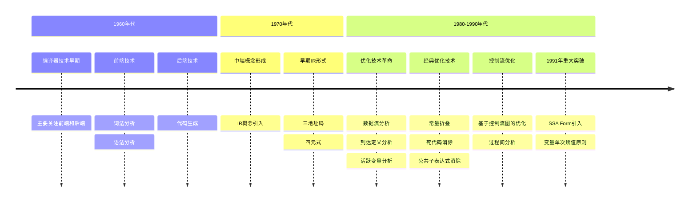


### SSA 基本概念

<BlockMath math={`
\\begin{align*}
& \\text{Program}_{\\text{ssa}} = (V, S, \\phi) \\text{ where:} \\\\
& V: \\text{变量集合，每个变量都有唯一的版本号} \\\\
& S: \\text{语句集合} \\\\
& \\phi: \\text{在控制流汇聚点的特殊函数}
\\end{align*}
`} />

SSA 的基本性质：

1. 单一赋值规则：<InlineMath math={`
\\forall v \\in V: |\\text{def}(v)| = 1
`} />

2. φ 函数定义：<InlineMath math={`
v_i := \\phi(v_{1}, v_{2}, ..., v_{k})
`} />

其中：
- <InlineMath math={"v_i"} /> 是新的变量版本
- <InlineMath math={"v_{1}, v_{2}, ..., v_{k}"} /> 是来自 k 个前驱基本块的变量版本

3. 支配性质：<InlineMath math={`
\\forall \\text{ use}(v) \\in S: \\text{def}(v) \\text{ dominates } \\text{use}(v)
`} />

:::caution

在 SSA 中，支配（dominance）是指控制流图（CFG）中基本块之间的关系，而不是数据依赖关系。

:::

这就是 SSA 形式最核心的定义，包含了单一赋值、φ 函数和支配关系三个关键要素。

#### SSA 编译器的编译过程

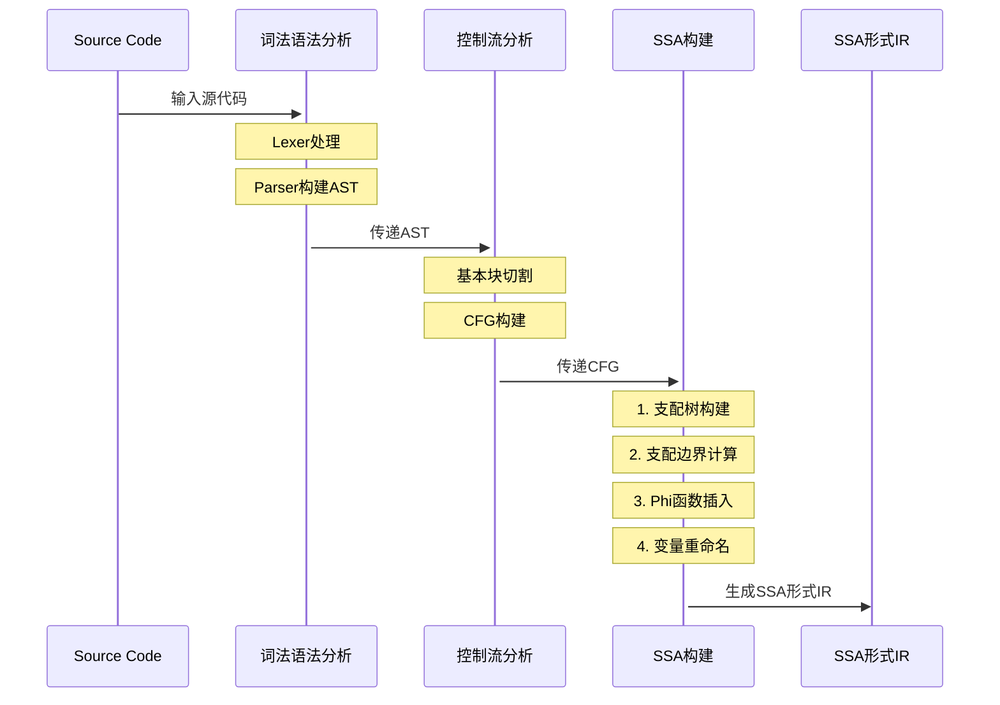

### SSA 引发数据流关系革新

根据定义我们知道，SSA 主要描述的其实是数据流关系，我们在 SSA 中描述数据流关系一般使用 Use-Def 链来表达。

在不抽象出 SSA 之前，我们对数据流的描述非常模糊，考虑如下代码，不使用 SSA 我们几乎无法分析变量究竟是怎么回事儿：

```
x = 1;
y = 2;
if c1 {
	x = 3;
	if c2 {
		y = 4;
	} else {
		y = 5;
	}
} else {
	x = 6;
}
e = x + y;
println(e);
```

没有 SSA 的 CFG + 数据流如下：

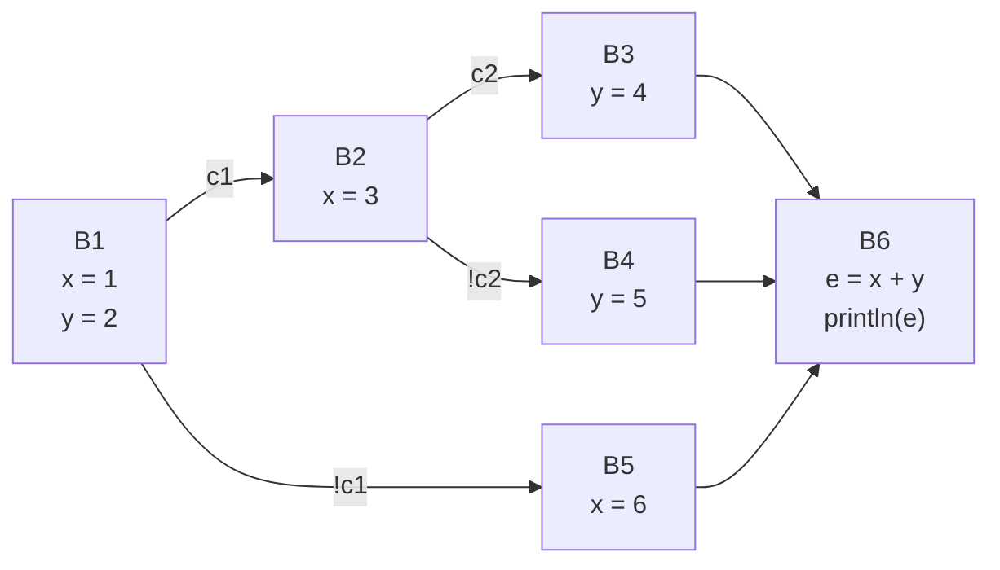

在 SSA 化后，我们得到代码如下：

```
x1 = 1;
y1 = 2;
if c1 {
	x2 = 3;
	if c2 {
		y2 = 4;
	} else {
		y3 = 5;
	}
    y4 = φ(y2, y3)
} else {
	x3 = 6;
}
x4 = φ(x2, x3)
y5 = φ(y1, y4)
e1 = x4 + y5
println(e1)
```

他的数据流图如下:

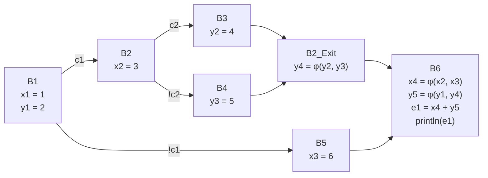

抽象出 Use-Def 链，如下：

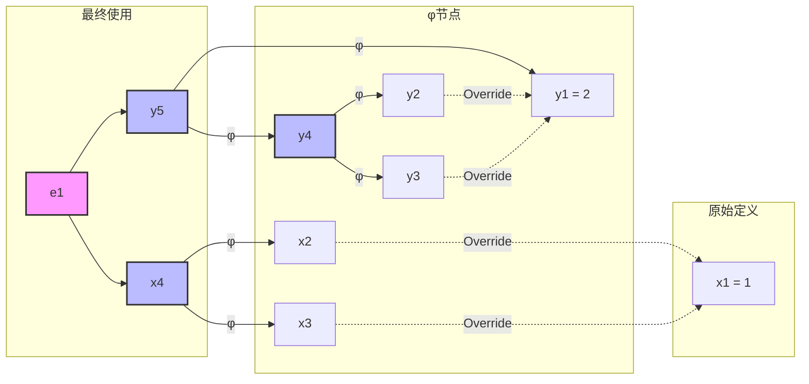

我们通过 SSA 构建上述的 Use-Def 关系，可以直接发现如下现象：

- e1 直接依赖于 x4 和 y5
- 所有变量的定义点都是唯一的
- φ 函数清晰地表示了变量的多个可能来源

:::tip 数据流分析优势

1. 变量追踪：可以精确追踪任何变量的定义来源，并且可以清晰地分析变量在不同控制流路径上的值

2. 优化机会：容易识别常量传播的机会，并且几乎可以直接消除死代码，可以准确判断变量的活跃范围，

3. 分析效率：直接的前向/后向分析，无需迭代计算到达定值，版本号简化别名分析

:::

### SSA 解决难点：闭包问题

#### 什么是闭包

闭包（Closure）是一个函数与其相关的引用环境的组合体。从技术角度来说，闭包是一个记录结构（record），它包含了一个函数和一个关联的环境组件。

这个环境组件中包含了函数体内引用的、但是既不是函数参数也不是函数局部变量的所有变量的绑定。

#### 闭包的核心特性

1. **变量捕获**：闭包可以捕获其定义时所在作用域的变量，我们再补充一点，这个变量必须被使用的时候才算是“捕获”，如果不被使用，就不需要考虑这个事情了。

<BlockMath math={`
CapturedVars(closure) = \\{ v \\mid v \\in Scope(F) \\land v \\notin (Params(F) \\cup Locals(F)) \\}
`} />


2. **生命周期延展**：被捕获的变量的生命周期会被延长至闭包函数的生命周期。

3. **状态保持**：每个闭包实例都维护着其自己的变量状态。

#### SSA 对闭包的处理

我们把闭包中，可能对外部的修改，称之为副作用（SideEffect）。

用更接地气的话讲，一个函数修改了外部定义域的一个变量，这个就说这个函数有一个副作用。

但是因为这个函数不调用，这个副作用就不生效，因此这个副作用可以理解为是一个 “静态” 的属性。

所以我们如果把副作用也当成一个 SSA 变量的话，并且这个副作用在闭包函数调用后自动插入 SSA 中，那么我们就可以直接分析一些动态语言的闭包问题了。

接下来我们看一个例子：

```
x = 1

func myFunc() {
    x = x + 1
}
myFunc()
```

普通的静态代码分析构建系统中，我们会构建出如下 CFG：

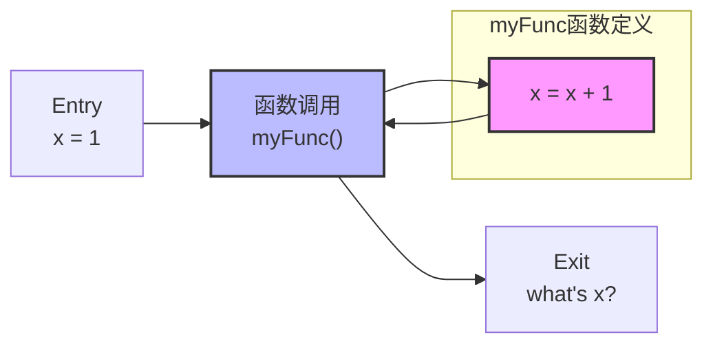

在这里我们无法分辨最后的 x 到底是谁，那么，我们把上面的代码使用 SSA 编译后再看：

```
x1 = 1

func myFunc() [x_freevalue] {
    x2 = x_freevalue + 1
}
myFunc() [x1]
x3 = side_effect(x2) (x1)
```

在改造完后，我们构建的图如下：

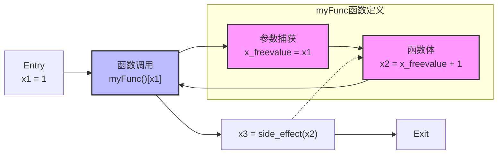


:::info 核心价值
1. **静态分析能力增强**：闭包不再是"黑盒"，其对外部变量的影响可以被静态分析，副作用被显式建模为 SSA 变量，使得闭包的行为可预测
2. **优化机会**：可以识别闭包的纯函数性质（是否有真实的副作用），能够进行闭包内联等优化，因为副作用是显式的
3. **正确性保证**：通过 SSA 变量版本和副作用的显式表示，保证了闭包修改外部变量的正确顺序和值
:::

这种方式的最大优势在于：它把闭包中常常被视为"动态"和"不可预测"的副作用，转化为了可以静态分析的 SSA 形式，使得我们能够在编译时就准确理解和优化闭包的行为。

## 使用建模方法构建可扩展静态代码分析引擎

### 技术现状

CodeQL 可以说是一个非常典型的使用建模方法构建的静态代码分析引擎。在 CodeQL 中，用户可以把自己的程序编译到 CodeQL 数据库，我们把这个过程称为建模，然后在使用 CodeQL 的查询语言对建模后的程序进行查询。

值得一体的细节是说，CodeQL 的建模存储的数据一般更接近于构建 AST 建立索引，而本身不会再编译过程中进行一些高级的数据流分析优化。

如果我们把 SSA 技术和代码建模结合起来，那么我们就可以构建一个更强大的可以进行深度分析的静态代码分析引擎。

这就是我们 SSA IR + SyntaxFlow 要做的事儿。

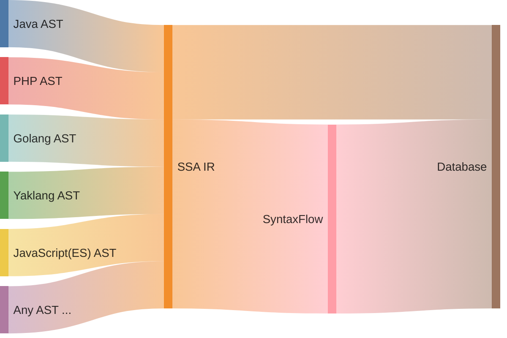

### 多种高级语言统一构建 SSA IR

高级编程语言和低级编程语言的 SSA IR 构建存在非常明显的差异。在高级编程语言中，由于其强大的抽象能力，需要处理更多的语言特性，如面向对象特性（继承、多态）、闭包等，这使得SSA构建过程比低级语言更为复杂。

但是就静态代码分析要讨论的内容来说，实际上用户接触的大部分编程语言都是高级编程语言，直接使用低级语言的场景相对较少。

基于高级语言构建 SSA 的过程，本质上是把各种高级语言特性编译成更低级的 IR 的过程。我们用一张图生动的描述我们接下来要讨论的内容：

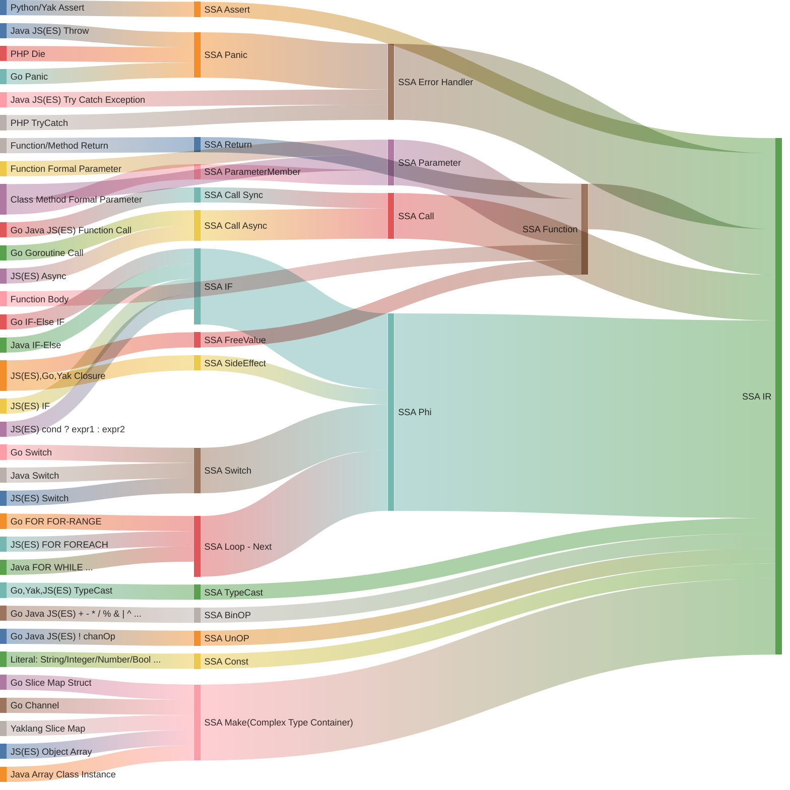

### 构建多前端的 SSA 编译器

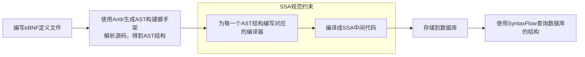

### SSA 指令集设计

| 操作码 | 类别 | 说明 |
|--------|------|------|
| SSAOpcodeAssert | 调试 | 用于在代码中插入断言，检查某个条件是否为真 |
| SSAOpcodeBasicBlock | 控制流 | 用于表示基本的代码块，通常包含一系列的指令，没有内部的控制流 |
| SSAOpcodeBinOp | 计算 | 用于执行二元操作，如加、减、乘、除等 |
| SSAOpcodeCall | 函数调用 | 用于调用函数或方法 |
| SSAOpcodeConstInst | 常量 | 用于表示常量值 |
| SSAOpcodeErrorHandler | 错误处理 | 用于处理异常或错误 |
| SSAOpcodeExternLib | 外部库调用 | 用于调用外部库的函数或方法 |
| SSAOpcodeIf | 控制流 | 用于执行条件判断 |
| SSAOpcodeJump | 控制流 | 用于执行无条件跳转 |
| SSAOpcodeLoop | 控制流 | 用于执行循环操作 |
| SSAOpcodeMake | 对象创建 | 用于创建新的对象或数据结构 |
| SSAOpcodeNext | 控制流 | 用于跳转到下一个指令 |
| SSAOpcodePanic | 错误处理 | 用于处理不可恢复的错误情况 |
| SSAOpcodeParameter | 函数参数 | 用于表示函数或方法的参数 |
| SSAOpcodeFreeValue | 闭包支持 | 用于表示闭包中捕获的外部变量（非形式参数） |
| SSAOpcodeParameterMember | 对象访问 | 用于访问形参的某个成员 |
| SSAOpcodePhi | 控制流 | 用于合并来自不同基本块的值 |
| SSAOpcodeRecover | 错误处理 | 用于从错误或异常中恢复 |
| SSAOpcodeReturn | 函数返回 | 用于从函数或方法中返回值 |
| SSAOpcodeSideEffect | 副作用 | 用于表示可能有副作用的操作 |
| SSAOpcodeSwitch | 控制流 | 用于执行多路分支 |
| SSAOpcodeTypeCast | 类型转换 | 用于执行类型转换 |
| SSAOpcodeTypeValue | 类型值 | 用于表示类型值 |
| SSAOpcodeUnOp | 计算 | 用于执行一元操作，如取反、递增、递减等 |
| SSAOpcodeUndefined | 未定义 | 用于表示未定义的值或状态 |
| SSAOpcodeFunction | 函数定义 | 用于定义函数或方法 |

#### 设计思想与特色

这个 SSA 指令集的设计体现了几个重要的特点和优势：

##### 1. 完整的控制流支持

:::info 控制流指令
指令集提供了完整的控制流支持，包括：
- 基本块（SSAOpcodeBasicBlock）
- 条件分支（SSAOpcodeIf）
- 循环结构（SSAOpcodeLoop）
- 多路分支（SSAOpcodeSwitch）
- Phi 节点（SSAOpcodePhi）

这些指令使得控制流图的构建和优化变得更加直观和高效。
:::

##### 2. 强大的错误处理机制

:::info 错误处理
设计了三层错误处理机制：
- 断言检查（SSAOpcodeAssert）：用于开发期调试
- 错误处理（SSAOpcodeErrorHandler）：用于可恢复错误
- 严重错误（SSAOpcodePanic）：用于不可恢复的错误

这种分层的错误处理机制使得程序的健壮性和可维护性大大提高。
:::

##### 3. 函数式编程支持

:::info 函数式特性
指令集对函数式编程提供了良好支持：
- 闭包支持（SSAOpcodeFreeValue）
- 完整的函数调用约定（SSAOpcodeCall, SSAOpcodeParameter）
- 副作用追踪（SSAOpcodeSideEffect）
:::

##### 4. 面向对象特性

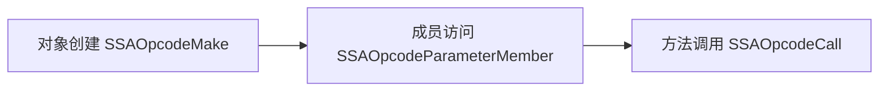

##### 5. 类型系统集成

:::note 类型系统特性
- 内置类型值表示（SSAOpcodeTypeValue）
- 类型转换支持（SSAOpcodeTypeCast）
- 类型安全检查机制
:::

#### 优势

1. **完整性**：覆盖了从基本运算到高级语言特性的所有必要操作

2. **模块化**：指令按功能清晰分类，便于实现和维护
   - 控制流指令
   - 运算指令
   - 错误处理指令
   - 对象操作指令

3. **可扩展性**：
   - 预留了外部库调用接口（SSAOpcodeExternLib）
   - 支持自定义类型和操作
   - 便于添加新的优化pass

4. **安全性**：
   - 内置错误处理机制
   - 类型安全保证
   - 副作用追踪

5. **优化友好**：
   - SSA 形式天然支持多种编译优化
   - Phi 节点支持数据流分析
   - 基本块结构便于控制流优化

:::tip
这个指令集的设计特别适合现代编程语言的编译优化，尤其是在需要同时支持函数式编程和面向对象编程范式的场景下。通过合理的指令分类和完善的错误处理机制，既保证了代码的正确性，又提供了充分的优化空间。
:::

### 线性数据库建模

在编译器中，中间表示(IR)通常是一个复杂的图结构，特别是 SSA 形式的 IR 包含了大量的相互引用和嵌套关系。为了有效地持久化和查询这些数据，我们需要将这种复杂的图结构转换为线性的关系模型。


| 字段分类 | 字段名 | 类型 | 说明 | 索引建议 |
|---------|--------|------|------|----------|
| **基础信息** | id | integer | 主键，自动递增 | 主键索引 |
| | program_name | varchar(255) | 程序名称 | 复合索引 |
| | version | varchar(255) | 版本信息 | 复合索引 |
| | source_code_hash | varchar(255) | 源代码哈希值 | 普通索引 |
| **时态信息** | created_at | datetime | 创建时间 | - |
| | updated_at | datetime | 更新时间 | - |
| | deleted_at | datetime | 删除时间（软删除） | - |
| **源码位置** | source_code_start_offset | bigint | 源代码开始偏移量 | - |
| | source_code_end_offset | bigint | 源代码结束偏移量 | - |
| **操作信息** | opcode | bigint | SSA 操作码 | - |
| | opcode_name | varchar(255) | SSA 操作码名称 | - |
| | opcode_operator | varchar(255) | 操作符 | - |
| **命名信息** | name | varchar(255) | 名称 | - |
| | verbose_name | varchar(255) | 详细名称 | - |
| | short_verbose_name | varchar(255) | 简短详细名称 | - |
| | string | varchar(255) | 字符串值 | - |
| **结构信息** | current_block | bigint | 当前块 | 外键索引 |
| | current_function | bigint | 当前函数 | 外键索引 |
| **函数特性** | is_function | bool | 是否是函数 | - |
| | formal_args | text | 形式参数 | - |
| | free_values | text | 自由变量值 | - |
| | member_call_args | text | 成员调用参数 | - |
| | side_effects | text | 函数包含的副作用 | - |
| | is_variadic | bool | 是否是可变参数函数 | - |
| | return_codes | text | 返回代码 | - |
| | is_external | bool | 是否是外部的 | - |
| **控制流信息** | code_blocks | text | 代码块 | - |
| | enter_block | bigint | 进入块 | - |
| | exit_block | bigint | 退出块 | - |
| | defer_block | bigint | 延迟执行代码块 | - |
| **函数层次** | children_function | text | 子函数 | - |
| | parent_function | bigint | 父函数 | - |
| **基本块信息** | is_block | bool | 是否是块 | - |
| | pred_block | text | 前驱块 | - |
| | succ_block | text | 后继块 | - |
| | phis | text | 块中直接包含的 Phi 指令 | - |
| **数据流信息** | defs | text | 数据流定义 | - |
| | users | text | 数据流中的使用者 | - |
| | called_by | text | 调用者 | - |
| **对象系统** | is_object | bool | 是否是对象 | - |
| | object_members | text | 对象成员 | - |
| | is_object_member | bool | 是否是对象成员 | - |
| | object_parent | bigint | 对象父级 | - |
| | object_key | bigint | 对象键 | - |
| **其他信息** | masked_codes | text | 掩码代码 | - |
| | is_masked | bool | 是否被掩码 | - |
| | variable | text | 变量 | - |
| | program_compile_hash | varchar(255) | 程序编译哈希值 | - |
| | type_id | integer | 类型 ID | - |
| | point | text | 点 | - |
| | pointer | text | 指针 | - |
| | extra_information | varchar(255) | 额外信息 | - |


#### 字段说明

1. **基础信息字段**
   :::info
   这些字段构成了 IR 节点的基本身份标识：
   - `id`: 作为主键，确保每个 IR 指令的唯一性
   - `program_name` 和 `version`: 用于版本控制和程序标识
   - `source_code_hash`: 用于源代码追踪
   :::

2. **时态信息字段**
   :::note
   支持完整的时间管理：
   - `created_at`: 记录创建时间
   - `updated_at`: 记录更新时间
   - `deleted_at`: 支持软删除功能
   :::

3. **操作相关字段**
   :::tip
   描述 SSA 指令的核心操作信息：
   - `opcode`: 操作的数字编码
   - `opcode_name`: 操作的符号名称
   - `opcode_operator`: 具体操作符
   :::

4. **结构化字段**
   这些字段维护了 IR 的结构关系：
   - 控制流信息（`current_block`, `enter_block`, `exit_block`）
   - 函数层次（`current_function`, `parent_function`）
   - 基本块关系（`pred_block`, `succ_block`）

5. **数据流字段**
   <BlockMath math={`
   \\begin{aligned}
   & \\text{defs}: \\text{定义点集合} \\\\
   & \\text{users}: \\text{使用点集合} \\\\
   & \\text{variable}: \\text{相关变量信息}
   \\end{aligned}
   `} />

6. **对象系统字段**
   用于表示面向对象特性：
   - 对象标识（`is_object`）
   - 成员关系（`object_members`, `is_object_member`）
   - 继承关系（`object_parent`）

#### 存储考虑

:::caution
1. **序列化策略**
   - `text` 类型字段（如 `formal_args`, `free_values`）建议使用 JSON 格式序列化
   - 需要考虑序列化/反序列化的性能开销

2. **索引优化**
   - 主键索引：`id`
   - 外键索引：`current_block`, `current_function`
   - 复合索引：`(program_name, version)`
   - 查询索引：`source_code_hash`

3. **存储优化**
   - 对于较大的 `text` 字段，考虑使用压缩存储
   - 频繁访问的字段应该放在表的前面
:::

这种表格化的展示方式清晰地展示了每个字段的用途和关系，便于理解和实现。同时，配合的文字说明提供了更深入的设计考虑和实现建议。