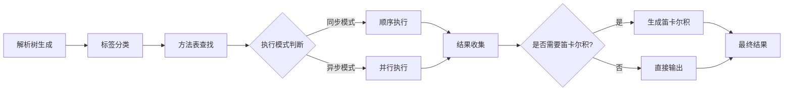
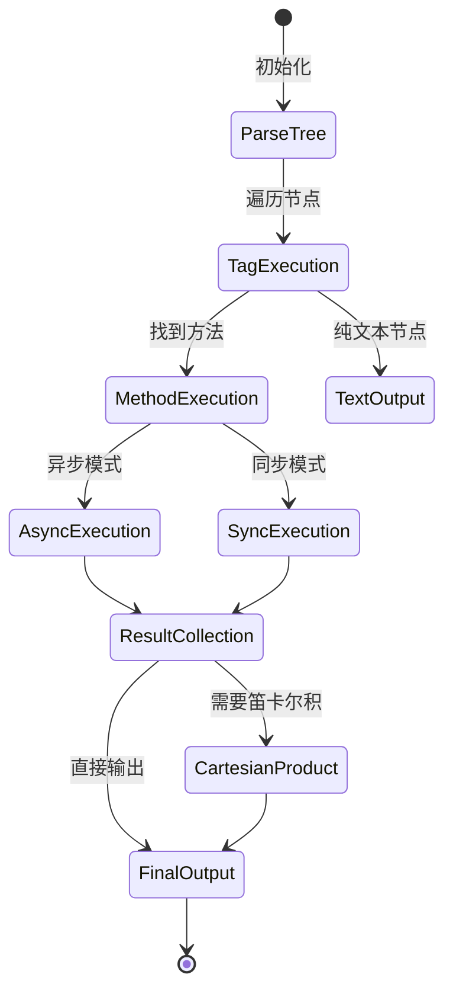
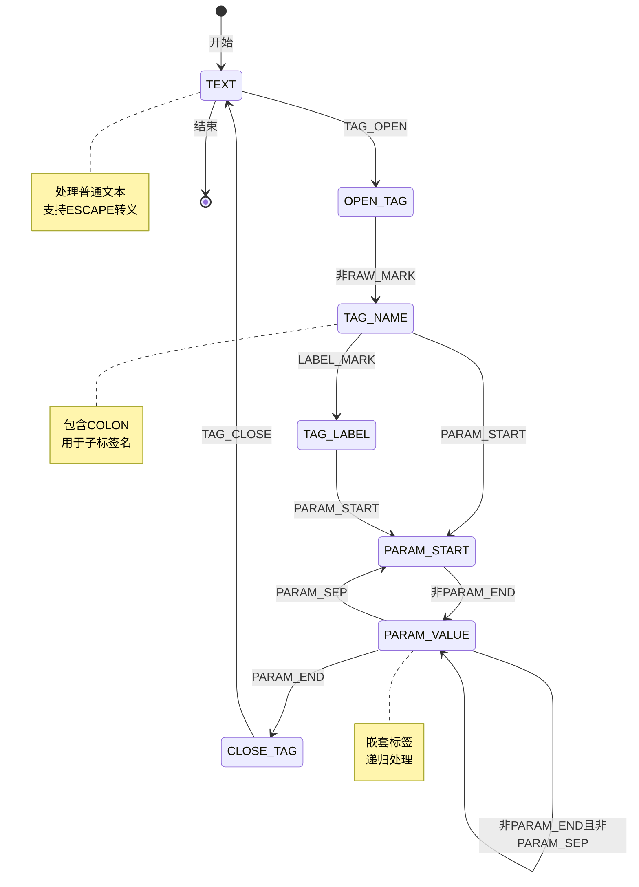

# 测试

import Math, { InlineMath, BlockMath } from '@site/src/components/Math';

## fuzztag

<BlockMath math={`
\\begin{align*}
& \\text{Let } \\mathcal{T} = (N, \\Sigma, P, S) \\text{ be the template grammar where:} \\\\
& N: \\text{Non-terminal symbols (Tags, Parameters)} \\\\
& \\Sigma: \\text{Terminal symbols (Text, Operators)} \\\\
& P: \\text{Production rules} \\\\
& S: \\text{Start symbol} \\\\
\\end{align*}
`} />

形式化定义中的符号解释：

1. <InlineMath math={"\\mathcal{T} = (N, \\Sigma, P, S)"} /> 这定义了模板语法的形式文法四元组，表示模板语法系统是由非终结符集合、终结符集合、产生式规则和起始符号组成。

2. <InlineMath math={"N"} />：非终结符集合，包含了所有需要进一步展开的语法单元，例如：Tag、Parameter、TagName、TagContent 等，这些符号在解析过程中会被进一步替换为更基本的符号。

3. <InlineMath math={"\\Sigma"} />：终结符集合，包含了所有最基本的、不可再分的符号，例如：`{{`、`}}`、`(`、`)`、`,` 等操作符，以及普通文本字符等最终会出现在结果中的符号。

4. <InlineMath math={"P"} />：产生式规则集合，定义了如何从非终结符推导出其他符号的规则，例如：Tag → `"{{" TagContent "}}"` 这样的规则，指导了整个模板的解析和转换过程。

5. <InlineMath math={"S"} />：起始符号，语法的起点，表示整个模板，在我们的系统中，这通常是 Template 符号，所有的解析都从这个符号开始，逐步展开。

这个模版执行引擎的执行的核心数学原理如下：

<BlockMath math={`
\\begin{align*}
& R: \\mathcal{T} \\times M \\rightarrow \\mathcal{P}(\\Sigma^*) \\\\
& \\text{where } M \\text{ is the method table and } \\mathcal{P}(\\Sigma^*) \\text{ is the power set of results}
\\end{align*}
`} />

这个数学表达式定义了渲染函数 R，它接受模板语法 <InlineMath math={"\\mathcal{T}"} /> 和方法表 <InlineMath math={"M"} /> 作为输入，输出结果的幂集 <InlineMath math={"\\mathcal{P}(\\Sigma^*)"} />。这里使用幂集是因为在模板渲染过程中，每个标签可能产生多个结果，这些结果通过笛卡尔积的方式组合，形成最终的所有可能结果集合。例如，如果一个标签产生结果 [a, b]，另一个产生 [1, 2]，那么它们的笛卡尔积就是 [(a,1), (a,2), (b,1), (b,2)]。

### 2. 执行流程图

### 4. 执行状态转换图

--- 

