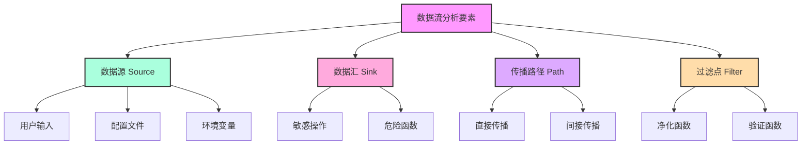
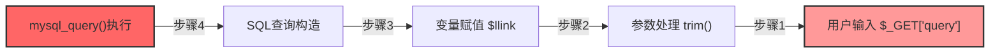
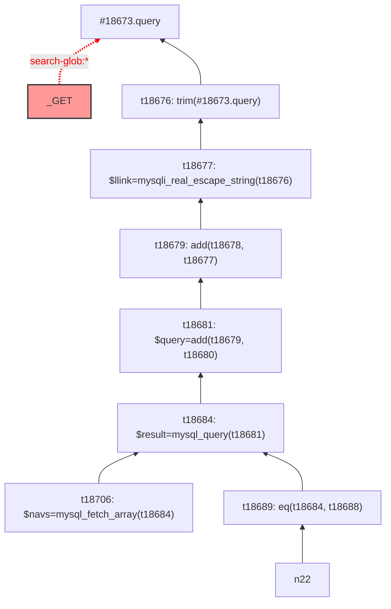
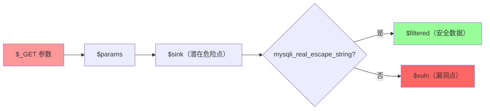

# 数据流敏感的代码漏洞检测

当读者读完前置的内容，已经基本对 SyntaxFlow 的使用风格有了入门印象了，SyntaxFlow 实际上是一个非常具有深度的技术，我们将在本章节为大家讲解 SyntaxFlow 的高级用法和高级特性，以便帮助用户解决非常难的技术问题。

import TOCInline from '@theme/TOCInline';

<TOCInline toc={toc} />

## 什么是数据流路径敏感分析？ 

:::info 简要背景

在静态代码分析领域，我们经常遇到一系列复杂的概念，如指针敏感性（pointer sensitivity）、数据流敏感性（data flow sensitivity）和路径敏感性（path sensitivity）等。大多数相关文献充斥着晦涩难懂的数学公式和LaTeX算法，这些表述方式往往给人以高深莫测的印象。令人遗憾的是，这些所谓的"高级技术"在实际工程实践和漏洞挖掘中的应用效果往往难以体现。更有甚者，相关的实现代码常常被刻意或无意地隐藏在文献的角落，使得这些技术与实际应用之间产生了巨大的鸿沟。

过分依赖理论推导和数学模型，而忽视了实际应用的重要性。这种做法不仅使得相关知识难以被广大工程师所理解和应用，更是阻碍了整个领域的发展。我们需要的是更加实用、直观、易于理解的教学和研究方法。

:::

### 定义

在程序分析领域中，数据流分析（Data Flow Analysis）是一种静态分析技术，用于收集程序中数据在执行过程中如何流动和变化的信息。我们需要理解几个核心概念：

:::tip 核心概念
1. **数据流（Data Flow）**：描述数据在程序中的传播路径和变化过程
2. **控制流（Control Flow）**：描述程序执行的可能路径
3. **路径敏感性（Path Sensitivity）**：分析时是否考虑程序的条件分支
:::

数据流分析通常涉及以下要素：



### 数据流方向：自顶向下和自底向上

在进行数据流方向讨论的时候，我们考虑如下代码，可以加速用户理解这两个概念：

```php
<?php
    $llink=trim($_GET['query']);
    $query = "SELECT * FROM nav WHERE link='$llink'";
    $result = mysql_query($query) or die('SQL语句有误：'.mysql_error());
    $navs = mysql_fetch_array($result);
```

我们下面的案例多数基于这一段 PHP 代码进行讨论

数据流分析可以从两个方向进行，每种方向都有其特定的应用场景和优势：

#### 1. 自顶向下（Top-Down）


**特点：**
- 从数据源开始追踪
- 适合发现数据污染范围
- 可以识别多个受影响的汇点
- 计算开销较大

:::tip 应用场景
1. 污点分析（Taint Analysis）
2. 变量影响范围分析
3. 数据依赖分析
:::

#### 2. 自底向上（Bottom-Up）



**特点：**
- 从敏感操作点开始反向追踪
- 直接定位潜在问题
- 分析效率较高
- 适合特定漏洞检测

:::tip 优势
1. 更快地定位潜在漏洞
2. 减少不必要的路径分析
3. 聚焦于特定安全问题
:::

#### 比较分析

| 特性 | 自顶向下 | 自底向上 |
|------|----------|----------|
| 起点 | 数据源（Source） | 数据汇（Sink） |
| 分析范围 | 全面 | 针对性强 |
| 性能 | 较慢 | 较快 |
| 适用场景 | 全局数据流分析 | 特定漏洞检测 |
| 资源消耗 | 较高 | 较低 |

:::warning 注意事项
1. 选择合适的分析方向要考虑具体的应用场景
2. 两种方向可以结合使用以获得更好的分析效果
3. 需要权衡分析精度和性能开销
:::

### 形式化表述


#### 1. 自顶向下分析的形式化定义

在自顶向下分析中，我们从源点开始追踪数据流向所有可能的汇点。形式化定义如下：

<BlockMath math={`
\\begin{align}
& \\text{Let } Source = \\{s_1, s_2, ..., s_n\\} \\text{ be the set of source points} \\\\
& \\text{Let } Sink = \\{t_1, t_2, ..., t_m\\} \\text{ be the set of sink points} \\\\
& \\text{Let } Path(s_i, t_j) \\text{ be the data flow path from } s_i \\text{ to } t_j \\\\
& TopDown(s) = \\bigcup_{t \\in Sink} \\{Path(s, t) | \\exists \\text{ data flow from } s \\text{ to } t\\}
\\end{align}
`}/>

其中数据流传播函数可以定义为：

<BlockMath math={`
\\begin{align}
& F_{top}(n) = \\begin{cases}
    gen(n) \\cup (in(n) - kill(n)) & \\text{if } n \\text{ is a node} \\\\
    \\emptyset & \\text{otherwise}
\\end{cases} \\\\
& in(n) = \\bigcup_{p \\in pred(n)} out(p) \\\\
& out(n) = F_{top}(n)
\\end{align}
`}/>

#### 2. 自底向上分析的形式化定义

import Math, { InlineMath, BlockMath } from '@site/src/components/Math';

自底向上分析从汇点开始反向追踪到可能的源点。形式化定义如下：

<BlockMath math={`
\\begin{align}
& \\text{Let } t \\in Sink \\text{ be a sink point} \\\\
& BottomUp(t) = \\{s \\in Source | \\exists \\text{ data flow from } s \\text{ to } t\\} \\\\
& ReachDef(t) = \\{s | Path(s, t) \\neq \\emptyset\\}
\\end{align}
`}/>

反向传播函数定义为：

<BlockMath math={`
\\begin{align}
& F_{bottom}(n) = \\begin{cases}
    gen^{-1}(n) \\cup (out(n) - kill^{-1}(n)) & \\text{if } n \\text{ is a node} \\\\
    \\emptyset & \\text{otherwise}
\\end{cases} \\\\
& out(n) = \\bigcup_{s \\in succ(n)} in(s) \\\\
& in(n) = F_{bottom}(n)
\\end{align}
`}/>

#### 3. 路径敏感性分析

在考虑路径敏感性时，我们需要引入路径条件：

<BlockMath math={`
\\begin{align}
& \\text{Let } \\pi = \\{c_1, c_2, ..., c_k\\} \\text{ be the path conditions} \\\\
& PathSensitive(s, t) = \\{(p, \\pi) | p \\in Path(s, t) \\land \\pi \\text{ is satisfiable}\\}
\\end{align}
`}/>

:::tip 形式化说明
- <InlineMath math="gen(n)"/>: 节点n生成的数据流信息
- <InlineMath math="kill(n)"/>: 节点n终止的数据流信息
- <InlineMath math="pred(n)"/>: 节点n的前驱节点集合
- <InlineMath math="succ(n)"/>: 节点n的后继节点集合
- <InlineMath math="gen^{-1}(n)"/>: 反向分析中节点n生成的数据流信息
- <InlineMath math="kill^{-1}(n)"/>: 反向分析中节点n终止的数据流信息
:::

:::warning 实践注意
虽然形式化定义看起来复杂，但在实际实现中，我们通常会根据具体场景进行简化和优化。关键是要理解核心概念和传播规则。
:::

## 开始实战：SyntaxFlow 数据流分析

### 1. 生成数据流

还是考虑上面的那一段代码：

```php
<?php
    $llink=mysqli_real_escape_string(trim($_GET['query']));
    $query = "SELECT * FROM nav WHERE link='$llink'";
    $result = mysql_query($query) or die('SQL语句有误：'.mysql_error());
    $navs = mysql_fetch_array($result);
```

保存为 `code.php` 之后，执行 `yak ssa -l php -t . -p dataflow` 命令进行编译，编译后我们就可以对 `dataflow` 这个程序名对应的程序进行测试并且，编写 SyntaxFlow 规则。在编译过程中会有日志输出，当你看到:

```bash
...
...
...
...
[INFO] 2024-09-26 13:43:54 [language_parser:72] parsed file: [code.php]
[INFO] 2024-09-26 13:43:54 [language_parser:77] program dataflow finish
[INFO] 2024-09-26 13:43:54 [ssacli:189] finished compiling..., results: 1
[INFO] 2024-09-26 13:43:54 [database_profile:26] SSA Database SaveIrCode Cost: 23.121462ms
[INFO] 2024-09-26 13:43:54 [database_profile:27] SSA Database SaveIndex Cost: 5.212542ms
[INFO] 2024-09-26 13:43:54 [database_profile:28] SSA Database SaveSourceCode Cost: 359.583µs
[INFO] 2024-09-26 13:43:54 [database_profile:29] SSA Database SaveType Cost: 4.127001ms
[INFO] 2024-09-26 13:43:54 [database_profile:30] SSA Database CacheToDatabase Cost: 23.195708ms
```

之类的内容输出的时候意味着编译完成了。

随后创建扫描规则文件内容：

```bash
_GET.* as $params; 
$params --> * as $sink; 
alert $sink;
```

把上述规则保存为： `rule.sf` 然后再命令行中执行 `yak sf rule.sf -p dataflow` 将会看到输出为：

```bash
[INFO] 2024-09-26 13:48:03 [ssacli:539] start to use SyntaxFlow rule: rule.sf
...
...
...
[INFO] 2024-09-26 13:48:03 [ssacli:688] syntax flow query result:
rule md5 hash: 468a9fc888219cc95c0771b76b4ee88a
rule preview: _GET.* as $params;  $params --> * as $sink;  alert $sink;
description: {"desc":"","lang":"","level":"","title":"","title_zh":"","type":""}
Result Vars: 
  $sink:
    t190614: eq(Undefined-mysql_query(add(add...ET.query(valid)))), "'")), true)
        code.php:4:5 - 4:67
    t190631: Undefined-mysql_fetch_array(Unde...ned-_GET.query(valid)))), "'")))
        code.php:5:13 - 5:39
```

看到上述数据，基本说明我们获取到了数据流的两个关键最终点，一个是 `mysql_fetch_array` 的调用结果，另一个是 `mysql_query` 执行结果和 `true` 的比较函数（这是由 `or` 运算来产生的，不要惊慌）。

我们在这里已经成功获取到了数据流最终终结的位置，在这里看他还是相当准确的，把上述结果整理起来就可以看到真正的结果所有数据流相关的结果：



在途中我们可以很清楚的发现，最终的结果其实是 `eq` 和一个 `$navs` 变量。那么光得到这一步，我们还不能说可以过滤出想要的结果，那么如何在规则中编写过滤语句呢？

:::tip

事实上，我们发现，mysqli_real_escape_string 这个函数存在的话，漏洞发生就会变的困难。

:::

### 2. 编写过滤语句

我们经过上述操作可以得到数据流最终的点，但是需要检查过滤的步骤，这个时候应该怎么做呢？我们在 SyntaxFlow 中可以通过 `<dataflow()>` 这个功能来实现：

我们把这个复杂的数据流捋清的过程封装成了一个叫 `<dataflow>` 的 NativeCall。用户可以调用这个指令，把数据流的所有路径整理成在一起，一起进行检查，直到过滤出自己想要的数据。

:::tip NativeCall 是什么？

如果用户对这个东西有点陌生，可以参考 “基础” 章节的内容。

NativeCall 是 SyntaxFlow 提供的一种机制，允许用户在规则中调用一些内置的函数，这些函数通常是一些复杂的操作，例如数据流分析、污点分析等。通过 NativeCall，用户可以更方便地实现一些高级的分析功能，而无需手动编写复杂的逻辑。

:::

继续案例中 PHP 的程序规则：

```bash
_GET.* as $params; 
$params --> * as $sink;

$sink<dataflow(<<<CODE
*?{opcode: call && <getCaller><name>?{have: mysqli_real_escape_string }} as $__next__
CODE)> as $filtered;
$sink - $filtered as $vuln;

alert $vuln;
```

这段审计代码看起来就复杂了不少，我们直接把这段代码执行一下： `yak sf -p dataflow rule.sf` 发现他无法输出原来的信息了，因为我们过滤了 `mysqli_real_escape_string` 这个函数。

我们基于之前的案例创建一个有漏洞的代码（删除一些函数）：

```php
<?php
    $llink=trim($_GET['query']);
    $query = "SELECT * FROM nav WHERE link='$llink'";
    $result = mysql_query($query) or die('SQL语句有误：'.mysql_error());
    $navs = mysql_fetch_array($result);
```

在上述代码中移除了 mysqli_real_escape_string 函数，发现重新执行规则将会检查出来，那就发生了什么？接下来我们将解释一下这段代码究竟怎么回事儿：

#### SyntaxFlow 检测 SQL 注入的规则解释


##### 1. 输入数据收集 `_GET.* as $params;`

:::tip 数据源获取
这行代码从 PHP 的全局 `$_GET` 数组中获取所有参数，并将这些参数存储到变量 `$params` 中。这是对用户输入数据的初始收集阶段。
:::

##### 2. 数据流追踪 `$params --> * as $sink;`

这条指令建立了数据流追踪路径：
- 从 `$params` 开始追踪数据流向
- `*` 表示追踪所有可能的目标位置
- 结果存储在 `$sink` 变量中，代表所有潜在的危险使用点

##### 3. 过滤器定义和使用 `$sink<dataflow(...)>...`

```php
$sink<dataflow(<<<CODE
*?{opcode: call && <getCaller><name>?{have: mysqli_real_escape_string }} as $__next__
CODE)> as $filtered;
```

:::info 过滤器说明
这段代码定义了数据流分析的核心过滤逻辑：
- 检测所有函数调用（`opcode: call`）
- 特别关注调用 `mysqli_real_escape_string` 的情况
- 将经过安全处理的数据点标记为 `$filtered`
:::

##### 4. 移除黑名单路径 `$sink - $filtered as $vuln`

这一步执行漏洞检测：
- 从所有潜在危险点 (`$sink`) 中
- 移除已经过滤的数据点 (`$filtered`)
- 剩余的点即为潜在漏洞点 (`$vuln`)

##### 5. 警告生成 `alert $vuln;`

最后一步是生成警告，报告所有发现的潜在漏洞点。

### 3. 规则解释与总结



:::tip 最佳实践
在实际开发中，建议：
1. 对所有用户输入进行适当的过滤和转义
2. 使用预处理语句而不是直接拼接 SQL
3. 定期进行类似的静态代码分析
:::

## NativeCall `<dataflow>` 的详细解释

`<dataflow>` 是一个高级的 NativeCall 函数，用于在代码中进行数据流分析。它的参数是一段专门用于检查特定变量的数据流路径的代码。这段代码帮助识别和过滤数据流路径，从而发现潜在的安全漏洞。为了确保分析的准确性，进入 `<dataflow>` 的变量必须至少经过 Use-Def 运算符的处理，这样可以确保变量的来源和使用都被妥善追踪和记录。

### 实例代码解释

```
_GET.* as $params;
$params --> * as $sink;

$sink<dataflow(<<<CODE
*?{opcode: call && <getCaller><name>?{have: mysqli_real_escape_string }} as $__next__
CODE)> as $filtered;
$sink - $filtered as $vuln;

alert $vuln;
```

### `<<<CODE` 与 `CODE` 语法：Heredoc

`<<<CODE` 到 `CODE` 的语法类似于 PHP 中的 `HereDoc` 语法。它用于定义一个多行的字符串或代码块，在 `<dataflow>` 的上下文中，这种语法用于编写复杂的查询逻辑。`<<<CODE` 标记代码块的开始，而 `CODE` 标记代码块的结束。这允许开发者在 NativeCall 函数中嵌入较长或较复杂的代码片段。

:::tip Heredoc 简介

Heredoc 是一种在多种编程语言中都存在的字符串定义语法，允许开发者以一种清晰、直观的方式处理多行文本。它的特点是保留文本的原始格式，包括换行和空格。

**PHP 中的 Heredoc**

```php
$heredoc = <<<CODE
    <html>
        <body>
            <h1>Hello, World!</h1>
        </body>
    </html>
CODE;
```

特性    

- 使用 `<<<` 后跟标识符（如上例中的 `SQL`）开始
- 结束标识符必须独占一行    
- 结束标识符前不能有任何空格
- 支持变量解析（默认情况下）
- 可以用于类的属性默认值

:::


### `$__next__` 变量的作用

在 `<<<CODE` 块中定义的查询逻辑中，`$__next__` 是一个特殊的变量，用于存储满足查询条件的代码点。在上述示例中，任何调用 `mysqli_real_escape_string` 函数的地方都会被捕获并赋值给 `$__next__`。如果 `$__next__` 不为空，即存在至少一个满足条件的点，那么当前路径对应的点将会被保留。这种机制允许 `<dataflow>` 分析函数细致地筛选和确定哪些数据流路径是安全的，哪些可能包含潜在的安全风险。 