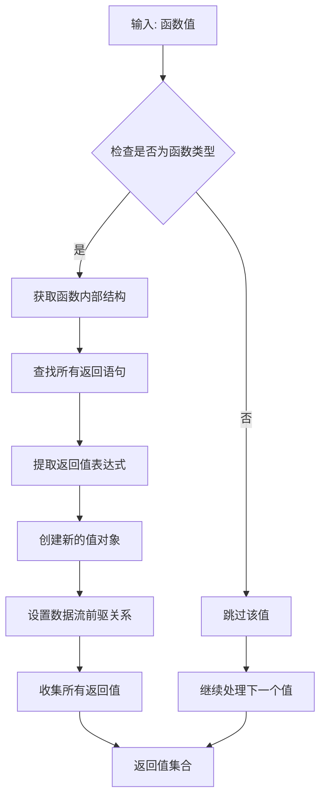
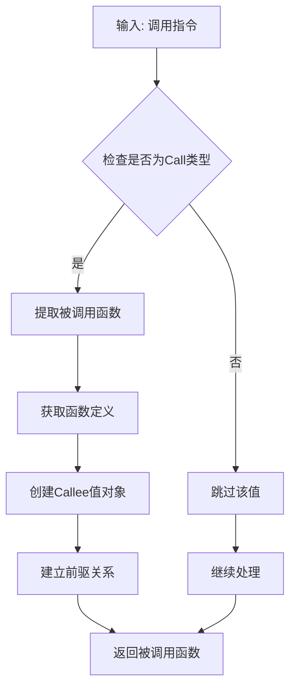
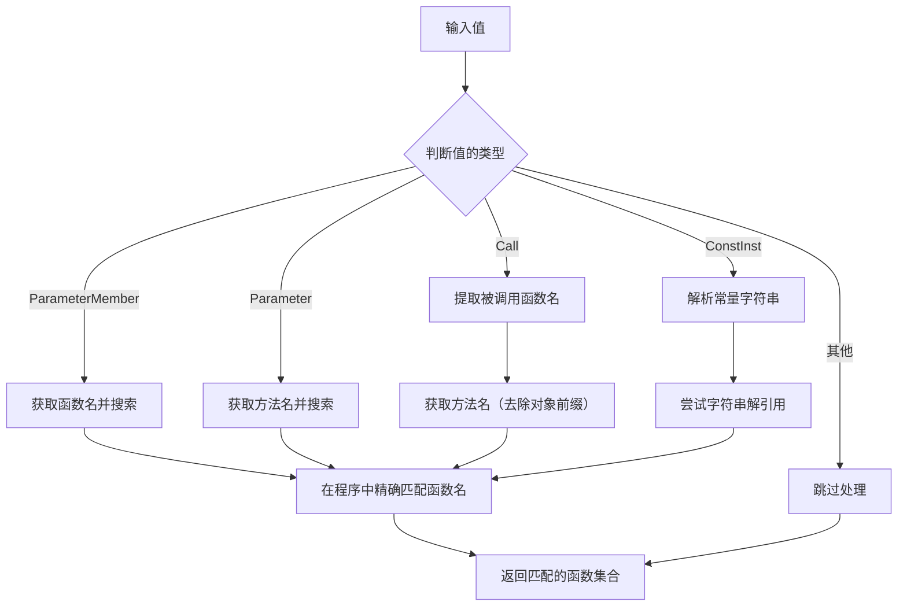

# 常见 NativeCall 以及用例

在 SyntaxFlow 中，NativeCall 是一种强大的机制，允许用户在规则中调用内置函数来实现复杂的分析功能。本章节将详细介绍一些常用的 NativeCall 及其实际应用场景。

import TOCInline from '@theme/TOCInline';

<TOCInline toc={toc} />

## 什么是 NativeCall？

NativeCall 是 SyntaxFlow 提供的一种特殊机制，它允许用户在规则中直接调用一些内置的高级分析函数。这些函数通常封装了复杂的分析逻辑，使得用户可以更方便地实现高级分析功能，而无需手动编写复杂的逻辑。

:::tip 为什么需要 NativeCall？
- 简化复杂分析逻辑的实现
- 提供标准化的分析接口
- 提高规则的可维护性
- 确保分析的一致性和准确性
:::

## 常用 NativeCall 详解

SyntaxFlow 提供了丰富的 NativeCall 功能，极大地扩展了规则编写的灵活性。在使用 IRify 编写规则时，输入 `<` 符号会自动提示可用的 NativeCall，无需记忆具体的函数名称。


### include

include 是一个高频使用的 NativeCall，它允许在本规则中引用其他的规则，实现规则的复用与解耦。

比如，在编写 SpringBoot 的数据流分析规则时，通常会遇到用户可控输入点（Source）都是控制层的可控参数，而污染汇聚点（Sink）则是不固定的。为了复用 Source 的规则，我们可以将其单独写成一个规则，并在 `desc` 声明的时候添加 `lib` 字段，以便被其他规则调用。

以下为内置规则中，查找 Java Spring Boot 的用户可控输入的规则:

```syntaxflow
desc(
    title: 'checking [spring controller source parameter]',
    type: audit,
    lib: 'java-spring-param',
    desc: <<<TEXT
此规则旨在审计Spring框架中控制器方法的参数来源安全性。确保控制器方法中的参数来源清晰且安全至关重要，因为不当的参数处理可能导致安全漏洞，如SQL注入、跨站脚本攻击(XSS)等。通过检查控制器方法的参数是否明确指定了来源（如通过@RequestParam、@PathVariable等注解），可以防止潜在的参数篡改和注入攻击。此外，这也有助于维护代码的清晰性和可维护性。
TEXT
)

*Mapping.__ref__?{opcode: function} as $start;

// annotation method' formal params.
$start(*?{opcode: param && !have: this} as $formalParams);

// fetching getParameter
.getParameter()?{<getFunc>.annotation.*Mapping} as $dynamicParams;

// merge start and output
$formalParams + $dynamicParams as $output;

// output lib params
alert $output;
```

`desc` 中声明的 `lib` 为 `java-spring-param`，其他规则要调用这个规则就使用这个名称。在规则的最后使用 `alert $output`，将该规则分析的值传出。

在其他规则中，就可以使用 NativeCall 调用该 lib 规则了:

```syntaxflow
<include('java-spring-param')> as $source;
```

这样，我们就能够根据不同的情况组合各种 lib 规则，比如检测 Java Spring Boot SSRF 漏洞的规则：

```syntaxflow
desc(
    title_zh: "检测Java SpringBoot 直接SSRF",
    title: "Find Java SpringBoot SSRF Vuln",
    type: vuln,
)

<include('java-spring-param')> as $source;
<include("java-http-sink")> as $sink;

$sink #{
    include: `<self> & $source`,
    exclude: `<self>?{opcode:call}?{!<self> & $source}?{!<self> & $sink}`,
}->as $mid;

alert $mid for {
    message: "发现Java SpringBoot SSRF漏洞，且未进行数据流过滤。",
    risk: ssrf,
    level: mid,
}
```

比如 Java Spring Boot 与 Java Servlet 检测 RCE 的规则:

```syntaxflow
desc(
    title: "Servlet & Springframework Paremeter Passed into Command Injection Sink",
    title: 'Servlet & Springframework 基础参数命令注入',
    type: vuln,
    risk: rce,
    desc: <<<TEXT
    在Java中，如果用户输入的参数直接传递给命令执行函数，可能会导致命令注入漏洞。攻击者可以通过构造恶意输入，执行系统命令，进而控制服务器。为了防止命令注入漏洞，需要对用户输入的参数进行严格的过滤，包括验证参数的合法性、长度、字符等，并尽量避免直接将用户输入的参数传递给命令执行函数。
TEXT
)

<include('java-servlet-param')> as $source;
<include('java-spring-param')> as $source;
check $source;
<include('java-runtime-exec-sink')> as $sink;
<include('java-command-exec-sink')> as $sink;
check $sink;

$sink #{
    include: `<self> & $source`,
    exclude: `<self>?{opcode:call}?{!<self> & $source}`
}->as $high;

alert $high for {
    message: "发现Java代码中存在命令注入漏洞，且未进行数据流过滤。",
    level: high,
};
```

### typeName

`typeName` 用于获取一个值的类型名。默认情况下，`typeName` 包含该值所属类的简单名称以及全名称。类型名是通过所导入包进行生成的，如以下例子:

```java
package org.example.moudels.typename;

// highlight-start
import com.alibaba.fastjson.JSON;
// highlight-end
import io.swagger.annotations.Api;
import io.swagger.annotations.ApiParam;
import lombok.extern.slf4j.Slf4j;
import org.springframework.http.ResponseEntity;
import org.springframework.stereotype.Controller;
import org.springframework.web.bind.annotation.GetMapping;
import org.springframework.web.bind.annotation.RequestMapping;
import org.springframework.web.bind.annotation.RequestParam;
import org.springframework.web.client.*;

@Slf4j
@Api(value = "TypeNameController", tags = "Irify TypeName用例")
@Controller
@RequestMapping("/typename")
public class TypeNameController {
    @GetMapping("/simple")
    public ResponseEntity<Object> simple(@RequestParam(name = "id") String id) {
        Object anyJSON = JSON.parse(id);
        return ResponseEntity.ok(anyJSON);
    }
}
```

`JSON.parse` 的 `typeName` 是根据 import 了 `com.alibaba.fastjson.JSON` 的包所确定的。这个导入的包名同时也是 `JSON.parse` 的全限定名称。以下是获取 `typeName` 的规则:

```syntaxflow
JSON.parse<typeName()> as $name
```


#### Import all 机制

一些情况下，有一些类的使用是通过 import all 实现的，比如以下例子：

```java
package org.example.moudels.typename;

import com.alibaba.fastjson.JSON;
import io.swagger.annotations.Api;
import io.swagger.annotations.ApiParam;
import lombok.extern.slf4j.Slf4j;
import org.springframework.http.ResponseEntity;
import org.springframework.stereotype.Controller;
import org.springframework.web.bind.annotation.GetMapping;
import org.springframework.web.bind.annotation.RequestMapping;
import org.springframework.web.bind.annotation.RequestParam;
// highlight-start
import org.springframework.web.client.*;
import org.springframework.web.cors.*;
// highlight-end

@Slf4j
@Api(value = "TypeNameController", tags = "Irify TypeName用例")
@Controller
@RequestMapping("/typename")
public class TypeNameController {
    @GetMapping("/importAll")
    public void importAll(@ApiParam(name="url",value="请求参数",required = true)@RequestParam String url) {
        CorsConfiguration corsConfiguration = new CorsConfiguration();
        corsConfiguration.addAllowedOrigin(url);
    }
}
```

其中 `CorsConfiguration` 在源码中是根据 `import org.springframework.web.cors.*;` 导入的，该导入语句称作 import all 语句。import all 语句使得 `CorsConfiguration` 无法确定可以使用哪个语句进行生成 `typeName`。因此没办法确定使用哪条 import 语句生成 `typeName` 的值，会使用以下方式生成 `typeName`，以确保不会遗漏任何分析信息：

1. 将自身名称与当前的包名拼接
2. 将自身名称与所有 import all 语句拼接
3. 与默认导入的 `java.lang` 包进行拼接

因此 `CorsConfiguration` 有 5 个 `typeName`:

```syntaxflow
CorsConfiguration()<typeName()> as $name
```


#### 左右类型合并

在语句 `Object anyJSON = JSON.parse(id);` 中，右值 `JSON.parse` 的 `typeName` 是确定的，左值的 `anyJson` 的类型是 `Object`，而 `Object` 又没有进行显式导入，因而会通过 import all 机制生成 `typeName`。同时左右值的 `typeName` 不一致，因而会将左右值的 `typeName` 进行合并，以确保不会遗漏分析信息：

```syntaxflow
anyJSON<typeName()> as $name
```


### fullTypeName

`fullTypeName` 意为全限定名，即一个值类型的全名称。它本质上与 `typeName` 一样，不过少了简单名称，并且多了版本信息（如果导入的类有版本信息的话）。如下：

```syntaxflow
JSON.parse<fullTypeName()> as $name
```


### getReturns

`getReturns` 用于获取函数的返回值。输入必须是一个函数指令。

#### 实现原理

`getReturns` 的工作流程如下：



这个过程确保了数据流分析的完整性，使得可以追踪从函数返回值到其使用点的完整路径。

#### 示例

```java
public String HHHHH(@RequestParam(value = "xxx") String xxxFooBar) throws Exception {
    return "Hello getReturns";
}
```

```syntaxflow
HHHHH <getReturns> as $sink;
// 结果: "Hello getReturns"
```

**实际规则用法 :**

```syntaxflow
Controller.__ref__<getMembers>?{.annotation.*Mapping && !.annotation.ResponseBody} as $entryMethods;
$entryMethods<getReturns>?{<typeName>?{have: String}}?{have:'redirect:'} as $sink;
```

这个规则用于检测Java URL重定向漏洞，它：
1. 找到所有 Controller 类的成员方法
2. 过滤出有 Mapping 注解但没有 ResponseBody 注解的方法
3. 获取这些方法的返回值
4. 筛选出类型为 String 且包含 'redirect:' 的返回值

**FreeMarker 模板注入检测 :**

```syntaxflow
*Mapping.__ref__<getFunc><getReturns>?{<typeName>?{have:'String'}}<freeMarkerSink> as $a
```

这个规则：
1. 找到有 Mapping 注解的方法
2. 获取包含这些方法的函数
3. 获取函数的返回值
4. 筛选出 String 类型的返回值
5. 应用 FreeMarker sink 检测

### getFormalParams

`getFormalParams` 用于获取函数的形参。输入必须是一个函数指令。

#### 实现原理

`getFormalParams` 的工作流程如下：

1. **输入验证**: 接收函数值作为输入，递归遍历处理
2. **操作码检查**: 验证输入值的操作码是否为Function类型
3. **函数转换**: 将输入值转换为函数对象，获取函数的元数据
4. **参数列表获取**: 从函数定义中提取形式参数列表
5. **参数值创建**: 为每个形式参数创建对应的Value对象
6. **关系建立**: 建立参数值与原函数之间的前驱关系，用于数据流追踪
7. **结果返回**: 返回包含所有形式参数的值集合

这个机制使得可以从函数定义出发，找到所有可能的输入点，这对于安全分析中的污点源识别非常重要。

#### 示例

```java
public String HHHHH(@RequestParam(value = "xxx") String xxxFooBar) throws Exception {
    return "Hello getReturns";
}
```

```syntaxflow
HHHHH <getFormalParams> as $sink;
// 结果: ["xxxFooBar", "this"]
```

**Spring Controller 参数提取 :**

```syntaxflow
$start<getFormalParams>?{opcode: param && !have: this} as $params;
```

这个规则用于获取 Spring MVC 控制器方法的所有非 this 参数，用于识别用户输入源。

**Java Servlet 参数提取 :**

```syntaxflow
/(do(Get|Post|Delete|Filter|[A-Z]\w+))|(service)/<getFormalParams>?{!have: this && opcode: param } as $req;
```

这个规则：
1. 匹配 Servlet 的 doGet、doPost 等方法
2. 获取这些方法的形参
3. 过滤掉 this 参数，只保留方法参数

**注解测试用法 :**

```syntaxflow
*Mapping.__ref__<getFormalParams>?{opcode: param && !have: this} as $ref
```

这个测试：
1. 找到有 Mapping 注解的方法
2. 获取方法的形参
3. 筛选出非 this 的参数


### getFunc

`getFunc` 用于获取输入指令所在的函数。输入可以是任何指令。

#### 实现原理

`getFunc` 的工作流程如下：

1. **值遍历**: 递归处理输入的所有值
2. **函数查找**: 对于每个值，向上查找包含该值的函数上下文
3. **函数提取**: 从SSA的函数结构中提取函数定义
4. **对象创建**: 为找到的函数创建新的Value对象
5. **关系建立**: 建立与原始值的前驱关系
6. **结果聚合**: 返回所有找到的函数值集合

这个NativeCall特别有用于上下文分析，可以帮助确定某个值或操作发生在哪个函数范围内。

#### 项目中的真实用法

**获取特定类型的控制器函数 :**

```syntaxflow
$sink?{<getFunc><getCurrentBlueprint><fullTypeName>?{any: "Controller","controller"}} as $output
```

这个规则：
1. 获取sink值所在的函数
2. 获取该函数的当前类蓝图
3. 检查类的全限定名是否包含"Controller"
4. 用于识别ThinkPHP控制器方法

**Spring Boot文件下载漏洞检测 :**

```syntaxflow
$params?{<getFunc><getReturns><typeName>?{have: ResponseEntity}<show>} as $entry;
```

这个规则：
1. 从参数出发获取所在函数
2. 获取函数的返回值
3. 检查返回值类型是否为ResponseEntity
4. 用于识别文件下载相关的处理函数

### getCall

`getCall` 用于获取输入指令的调用指令。输入必须是一个函数指令。

#### 实现原理

`getCall` 的工作机制：

1. **输入处理**: 遍历输入的所有值
2. **使用者查找**: 查找每个值的使用者（Users）
3. **调用过滤**: 筛选出操作码为Call类型的使用者
4. **调用收集**: 收集所有符合条件的调用指令
5. **关系建立**: 为每个调用建立与原值的前驱关系

#### 示例

**测试用例 :**

**链式调用分析 :**

```syntaxflow
$concatA<getCall><getCallee>(,* as $b) as $concatB;
$concatB<getCall><getCallee>(,* as $c);
```

这个测试展示了如何通过getCall追踪链式方法调用。

**Golang数据库连接追踪 :**

```syntaxflow
$entry.Open <getCall> as $db;
```

这个规则：
1. 找到数据库库的Open方法
2. 获取对Open方法的调用
3. 将调用结果标记为数据库连接对象

### getCallee

`getCallee` 用于获取调用指令中被调用的函数。输入必须是一个调用指令(call)。

#### 实现原理

`getCallee` 的处理流程：



#### 示例

**函数名提取 :**

**SQL注入检测 :**

```syntaxflow
$params<getCallee>?{<name>?{have:toString}}<getObject>.append(,* as $appendParams)
```

这个规则：
1. 从参数获取被调用的函数
2. 检查函数名是否包含toString
3. 获取调用对象并查找append方法
4. 用于检测SQL注入中的字符串拼接模式

**XSS过滤检测 :**

```syntaxflow
$calls?{<getCallee><name>?{have: /(?i)(sanitiz|encod(e|ing)|entit(y|ies)|escap(e|ing)|replace|regex|normaliz|canonical|anti|safe|purif|purg|pure|validate|strip|clean|clear|special|convert|remov)/}} as $__next
```

这个规则通过getCallee获取被调用函数，然后检查函数名是否匹配常见的过滤/编码函数模式。

### searchFunc

`searchFunc` 用于搜索输入指令的调用指令。它是一个强大的函数搜索机制，可以处理多种不同类型的输入并找到相关的函数调用。

#### 实现原理

`searchFunc` 的工作机制比较复杂，它能够处理多种不同的输入类型：



主要处理的情况包括：
1. **参数成员**: 从参数成员获取函数名进行搜索
2. **普通参数**: 从参数所属函数获取方法名进行搜索
3. **调用指令**: 提取被调用函数名，去除对象前缀后搜索
4. **常量指令**: 解析常量字符串作为函数名搜索

#### 示例

**数据流追踪示例:**

```syntaxflow
// 从变量出发，找到调用它的地方，再搜索同名函数的其他调用
aArgs <getCall> <searchFunc> as $allCalls;
```

这个NativeCall特别适用于：
- 查找函数的所有调用点
- 进行跨函数的数据流分析
- 识别相同函数名的不同实现

### getObject

#### 作用
获取输入指令的父对象。如果指令是一个成员，可以通过这个指令获取成员的父对象。

#### 示例

**1. 基本对象成员访问**

测试代码：
```javascript
a = {"b": 111, "c": 222, "e": 333}
```

```syntaxflow
.b<getObject>.c as $sink;
```
注释：
- `.b` - 获取对象a的成员b
- `<getObject>` - 获取成员b的父对象，即对象a
- `.c` - 访问父对象的成员c
- 结果为 222，通过父对象间接访问其他成员

**2. Spring MVC参数检测**

```syntaxflow
.getParameter()?{<getCallee><getObject><fullTypeName>?{have: servlet} && <getFunc><getObject>.annotation.*Mapping} as $dynamicParams
```
注释：
- `.getParameter()` - 获取参数方法
- `<getCallee><getObject>` - 获取方法调用的父对象
- `<fullTypeName>?{have: servlet}` - 检查父对象类型是否为Servlet
- `<getFunc><getObject>.annotation.*Mapping` - 检查方法所在类是否有Mapping注解
- 用于识别Spring MVC控制器中的动态参数获取

**3. 反序列化安全检测**

```syntaxflow
.readObject?{<typeName>?{have:'java.beans.XMLDecoder'}}<getObject()> as $decoder;
```
注释：
- `.readObject` - XML反序列化方法
- `<typeName>?{have:'java.beans.XMLDecoder'}` - 确认是XMLDecoder类型
- `<getObject()>` - 获取readObject方法的调用对象
- 用于检测XML反序列化漏洞

**4. SQL注入检测**

```syntaxflow
$params<getCallee>?{<name>?{have:toString}}<getObject>.append(,* as $appendParams)
```
注释：
- `$params<getCallee>` - 获取被调用的方法
- `?{<name>?{have:toString}}` - 检查方法名包含toString
- `<getObject>` - 获取toString方法的调用对象
- `.append` - 查找对象的append方法
- 用于检测通过toString()后进行字符串拼接的SQL注入模式

### getMembers

#### 作用
获取输入指令的成员指令。如果指令是一个对象，可以通过这个指令获取对象的所有成员。

#### 示例

**1. Spring Controller方法获取**

```syntaxflow
Controller.__ref__<getMembers>?{.annotation.*Mapping && !.annotation.ResponseBody} as $entryMethods;
```
注释：
- `Controller.__ref__` - 获取Controller类的引用
- `<getMembers>` - 获取Controller类的所有成员方法
- `?{.annotation.*Mapping}` - 筛选有Mapping注解的方法
- `?{!.annotation.ResponseBody}` - 排除有ResponseBody注解的方法
- 用于识别Spring MVC控制器的视图返回方法

**2. 数据库连接对象分析**

```syntaxflow
$db <getMembers> as $output;
```
注释：
- `$db` - 数据库连接对象
- `<getMembers>` - 获取数据库对象的所有可用方法和字段
- 结果包含Execute、Query、Prepare等数据库操作方法
- 用于数据库操作的安全分析

**3. REST Controller API检测**

```syntaxflow
RestController.__ref__<getMembers>?{.annotation.*Mapping} as $entryMethods;
```
注释：
- `RestController.__ref__` - 获取RestController类引用
- `<getMembers>` - 获取类的所有成员方法
- `?{.annotation.*Mapping}` - 筛选有HTTP请求映射注解的方法
- 用于识别REST API端点方法

**4. Golang数据库连接分析**

```syntaxflow
$entry.Open() <getMembers> as $client;
```
注释：
- `$entry.Open()` - 数据库连接打开操作
- `<getMembers>` - 获取连接对象的所有可用方法
- 用于分析数据库ORM框架的操作方法
- 常见于Golang的数据库操作分析

### getMemberByKey

#### 作用
获取输入指令的特定成员。如果指令是一个对象，可以通过指定的key获取对象的某个特定成员。

#### 示例

**1. JSON敏感信息提取**

```syntaxflow
$sink<getMemberByKey(key="password")> as $obj
```
注释：
- `$sink` - 目标对象（通常是JSON或数据结构）
- `<getMemberByKey(key="password")>` - 获取名为"password"的成员
- 用于检测JSON响应中的敏感信息泄露
- 常用于信息泄露漏洞检测

**2. 配置对象特定字段提取**

```syntaxflow
config<getMemberByKey(key="database_password")> as $dbPassword;
config<getMemberByKey(key="api_key")> as $apiKey;
config<getMemberByKey(key="secret_token")> as $token;
```
注释：
- 从配置对象中提取特定的敏感配置项
- 用于检测硬编码密码和API密钥
- 帮助识别配置安全问题

**3. 用户对象敏感字段访问**

```syntaxflow
userObject<getMemberByKey(key="creditCard")> as $sensitiveData;
userObject<getMemberByKey(key="ssn")> as $pii;
```
注释：
- 从用户对象中提取信用卡号码或社会安全号码
- 用于个人信息保护合规性检查
- 检测敏感数据的不当处理

### getSiblings

#### 作用
获取输入指令的兄弟指令。如果指令是一个对象的成员，可以通过这个指令获取该对象的其他成员。

#### 示例

**1. 基本兄弟成员获取**

假设有如下结构：
```javascript
config = {
    username: "admin",
    password: "secret",
    database: "mydb",
    host: "localhost"
}
```

```syntaxflow
.username<getSiblings> as $siblings;
```
注释：
- `.username` - 配置对象的username成员
- `<getSiblings>` - 获取username的兄弟成员
- 结果包含 password、database、host 等其他成员
- 用于分析对象结构的完整性

**2. 安全配置检查**

```syntaxflow
.ssl_enabled<getSiblings>?{<name>?{have:"password"|"key"|"secret"}} as $sensitiveConfig;
```
注释：
- `.ssl_enabled` - SSL配置成员
- `<getSiblings>` - 获取同级的其他配置项
- `?{<name>?{have:"password"|"key"|"secret"}}` - 筛选敏感配置项
- 用于检查SSL配置附近是否有敏感信息泄露

**3. 数据结构完整性验证**

```syntaxflow
.required_field<getSiblings>?{!have:optional} as $mandatoryFields;
```
注释：
- `.required_field` - 必填字段
- `<getSiblings>` - 获取同级字段
- `?{!have:optional}` - 筛选非可选字段
- 用于验证数据结构的必填字段完整性

:::note 使用说明
由于getSiblings在实际项目中使用较少，上述示例主要用于说明概念。实际使用时，getMembers通常能满足大部分获取对象成员的需求。
:::

### name

#### 作用
获取输入指令的名称表示，例如函数名、变量名、方法名或字段名等。

#### 示例

**1. 基础函数名提取 :**

测试代码：
```javascript
funcA = () => {
    return "abc";
}
```

SyntaxFlow规则：
```syntaxflow
funcA<name> as $sink;
```
注释：直接从函数定义中提取函数名，结果为"funcA"

**2. 链式调用中的方法名提取 **

测试代码：
```java
public String one() throws Exception {
    var aArgs = new String[]{"aaaaaaa"};
    xxeController.yourMethod(aArgs);  // 这里调用了yourMethod方法
}
```

SyntaxFlow规则：
```syntaxflow
aArgs<getCall><getCallee><name> as $sink
```
注释：
- `aArgs<getCall>` - 找到使用aArgs变量的调用指令
- `<getCallee>` - 获取被调用的函数（yourMethod）
- `<name>` - 提取函数名称，结果为"yourMethod"

**3. SQL注入检测中的函数名匹配 :**

SyntaxFlow规则：
```syntaxflow
$params<getCallee>?{<name>?{have:toString}}<getObject>.append(,* as $appendParams)
```
注释：
- `$params<getCallee>` - 从参数获取被调用的方法
- `?{<name>?{have:toString}}` - 检查方法名是否包含"toString"
- `<getObject>.append` - 获取调用对象并查找append方法
- 用于检测通过toString()转换后进行字符串拼接的SQL注入模式

**4. XSS过滤函数检测 :**

SyntaxFlow规则：
```syntaxflow
$calls?{<getCallee><name>?{have: /(?i)(sanitiz|encod(e|ing)|entit(y|ies)|escap(e|ing)|replace|regex|normaliz|canonical|anti|safe|purif|purg|pure|validate|strip|clean|clear|special|convert|remov)/}} as $__next
```
注释：
- `$calls?{<getCallee><name>` - 获取调用指令的被调用函数名
- `?{have: /(?i)(...)/}` - 使用正则表达式匹配常见的安全过滤函数名
- 正则包含sanitize、encode、escape、replace等安全函数的变体
- 用于识别XSS防护中的过滤函数调用

### string

#### 作用
获取输入指令的字符串表示，返回该指令在代码中的文本形式。

#### 示例

**1. 版本检测中的字符串提取 **

测试代码：
```java
public class VersionTest {
    String version = "1.2.3";
    String config = "app.version=2.1.0";
}
```

SyntaxFlow规则：
```syntaxflow
version<string> as $versionString;
```
注释：提取version变量的字符串值，用于后续版本比较分析

**2. 常量字符串处理:**
```syntaxflow
"127.0.0.1"<string> as $ipString;
```
注释：获取IP地址常量的字符串表示，结果为"127.0.0.1"


### eval

#### 作用
动态执行 SyntaxFlow 代码，支持在运行时构建和执行规则。

#### 示例

**1. 动态执行简单规则**

测试代码：
```java
public String one() throws Exception {
    var aArgs = new String[]{"aaaaaaa"};
    xxeController.yourMethod(aArgs);
}
```

```syntaxflow
<eval('aArgs<getCall><getCallee><name> as $sink')>
```
注释：
- 动态执行包含在字符串中的SyntaxFlow规则
- 该规则获取aArgs的调用、被调用者的名称
- 结果找到"yourMethod"

**2. 配合show调试**

```syntaxflow
<eval('aArgs<getCall><getCallee><show><name> as $sink')>
```
注释：
- 在动态执行的规则中加入show进行调试
- 可以查看中间步骤的执行结果

**3. 执行变量中的代码**

```syntaxflow
<fuzztag('aArgs<getCall>{{getCallee}}<name> as $sink')> as $code;
<eval($code)><show>
```
注释：
- 先用fuzztag生成动态代码存储在$code变量中
- 再用eval执行$code变量中的SyntaxFlow规则
- 实现更灵活的动态规则构建

### fuzztag

#### 作用
执行 yaklang fuzztag 模板，支持动态生成SyntaxFlow规则代码，变量在 SFFrameResult 中可用。

#### 示例

**1. 动态模板生成**

测试代码：
```java
public String one() throws Exception {
    var aArgs = new String[]{"aaaaaaa"};
    xxeController.yourMethod(aArgs);
}
```

```syntaxflow
<fuzztag("<getCallee>")> as $templateVar;
<fuzztag('aArgs<getCall>{{templateVar}}<name> as $sink')> as $code;
<eval($code)><show>
check $sink;
```
注释：
- 第一步：`<fuzztag("<getCallee>")>` 生成模板片段
- 第二步：使用`{{templateVar}}`将片段插入到新的模板中
- 第三步：用eval执行生成的完整规则
- 实现了SyntaxFlow规则的动态组装

**2. 批量变量生成**

测试代码：
```go
a1=1;a2=2;a3=3;
```

```syntaxflow
<fuzztag('a{{int(1-3)}} as $sink')><eval><show>;
check $sink;
```
注释：
- `{{int(1-3)}}` 生成1到3的整数序列
- 生成多个规则：a1 as $sink, a2 as $sink, a3 as $sink
- 批量匹配多个相似变量

### show

#### 作用
显示中间过程的值，主要用于调试和开发阶段，不对数据流产生影响。

#### 示例

**1. 调试链式调用过程 :**

SyntaxFlow规则：
```syntaxflow
aArgs<getCall><getCallee><show><name> as $sink
```
注释：
- `aArgs<getCall><getCallee>` - 获取被调用的函数
- `<show>` - 在控制台显示函数对象的详细信息
- `<name>` - 继续提取函数名
- 用于调试时查看中间步骤的值

**2. MyBatis注解值调试 :**

SyntaxFlow规则：
```syntaxflow
.annotation.Select.value<show><regexp(\$\{\s*(\w+)\s*\}, group=1)> as $entry;
```
注释：
- `.annotation.Select.value` - 获取Select注解的value值
- `<show>` - 显示注解的原始值，便于调试正则表达式
- `<regexp(...)>` - 使用正则提取占位符中的变量名
- 常用于调试MyBatis注解解析过程


### slice

#### 作用
对值进行切片操作，支持从数组、参数列表等容器类型中提取子集或特定元素。

#### 示例

**1. 函数参数切片提取**

```syntaxflow
hijackHTTPRequest<slice(index=0)> as $param0
hijackHTTPRequest<slice(index=1)> as $param1
hijackHTTPRequest<slice(index=2)> as $param2
```
注释：
- `<slice(index=0)>` - 获取第0个参数
- `<slice(index=1)>` - 获取第1个参数
- 用于从HTTP劫持函数中提取特定位置的参数

**2. 密码相关参数提取**

```syntaxflow
ldap_bind(*<slice(start=2)>?{opcode: const} as $pass)
```
注释：
- `*<slice(start=2)>` - 获取第2个参数及之后的所有参数
- `?{opcode: const}` - 筛选常量类型的参数
- 用于检测LDAP绑定中的硬编码密码

**3. LDAP注入检测**

```syntaxflow
ldap_search(*<slice(start=1)> as $query);
ldap_compare(*<slice(index=1)> as $query);
```
注释：
- `<slice(start=1)>` - 获取第1个参数及之后的参数（查询参数）
- `<slice(index=1)>` - 获取第1个参数（比较查询）
- 用于检测LDAP查询注入漏洞

**4. 加密算法参数提取**

```syntaxflow
AlgorithmParameters?{<typeName>?{have:"java.security.AlgorithmParameters"}}.getInstance(*<slice(index=1)> as $algorithm);
```
注释：
- `<slice(index=1)>` - 获取第1个参数（算法名称）
- 用于检测弱加密算法的使用
- 分析加密配置的安全性

**5. SQL注入参数提取**

```syntaxflow
*sql*.append(*<slice(start=1)> as $params);
```
注释：
- `<slice(start=1)>` - 获取append方法的所有参数
- 用于检测SQL字符串拼接注入
- 分析动态SQL构建的安全性

**6. 文件操作参数提取**

```syntaxflow
FileReader(*<slice(index=1)> as $fileReader);
```
注释：
- `<slice(index=1)>` - 获取第1个参数（文件路径）
- 用于检测文件路径遍历漏洞
- 分析文件操作的安全性

### regexp

#### 作用
对字符串进行正则表达式匹配，支持分组提取和模式匹配。

#### 示例

**1. MyBatis SQL 参数提取 **

```java
@Select("select * from users where id = #{user_id} and name = #{user_name}")
public User getUserById(String userId, String userName);
```

```syntaxflow
.annotation.Select.value<regexp(\$\{\s*(\w+)\s*\}, group=1)> as $entry;
```
注释：
- 从Select注解的value值中提取MyBatis参数
- 正则表达式 `\$\{\s*(\w+)\s*\}` 匹配 `#{param}` 格式
- `group=1` 提取第一个分组，即参数名
- 结果提取出 "user_id" 和 "user_name"

**2. 基本字符串匹配**

```syntaxflow
// 提取正则匹配的分组
"abc123def"<regexp(`(\d+)`, group: 1)> as $result;
```
注释：从字符串中提取数字部分，结果为 "123"

**3. URL路径提取**

```syntaxflow
"/api/users/123"<regexp(`/api/(\w+)/(\d+)`, group: 2)> as $userId;
```
注释：从URL路径中提取用户ID，结果为 "123"

### strlower

#### 作用
将字符串转换为小写形式。

#### 示例

**1. 基本字符串转换**

```syntaxflow
"Hello World"<strlower> as $result;
```
注释：将字符串转换为小写，结果为 "hello world"

**2. 方法名标准化处理**

```syntaxflow
method<name><strlower> as $normalizedName;
```
注释：获取方法名并转换为小写，用于不区分大小写的匹配

### strupper

#### 作用
将字符串转换为大写形式。

#### 示例

**1. 基本字符串转换**

```syntaxflow
"hello world"<strupper> as $result;
```
注释：将字符串转换为大写，结果为 "HELLO WORLD"

**2. 常量名规范化**

```syntaxflow
constantValue<strupper> as $upperConstant;
```
注释：将常量值转换为大写，用于符合命名约定

### var

#### 作用
将值存储到变量表中，用于在SyntaxFlow规则中创建可重用的变量引用。

#### 示例

**1. 基本变量存储**

```syntaxflow
result<var(name="myVar")> as $stored;
```
注释：将result值存储到名为"myVar"的变量中

**2. 中间结果缓存**

```syntaxflow
userInput<getFormalParams><var(name="params")> as $cachedParams;
```
注释：将函数参数缓存到变量中，便于后续规则引用

### opcodes

#### 作用
获取值所在函数中所有操作码的类型列表，用于分析函数的复杂度和结构特征。

#### 示例

**1. 复杂函数分析 **

测试代码：
```java
public int methodA(int a) {
    try {
        println(this.num);
        b=6+6;
        a = 2;
        if (c){
            a=22;
            if(d){
                bb = !true;
                int[] myArray = {1, 2, 3, 4, 5};
            }
        }else {
            a=33;
        }
        prinln(a);
        for (int i=0;i<10;i++){
            a+=i;
        }
        switch(a){}
        return a;
    }catch (Exception e){
        return 0;
    }
}
```

```syntaxflow
a<opcodes> as $allOpcodes;
```
注释：
- 获取函数methodA中所有指令的操作码类型
- 结果包含: Parameter, ParameterMember, Return, Loop, Function, Call, Phi, Undefined, ConstInst, Jump, If, UnOp, Switch, ErrorHandler, Make, BinOp
- 可以用于分析函数的控制流复杂度和语言特性使用情况

### sourceCode

#### 作用
获取指令对应的源代码文本，支持带上下文的代码提取。

#### 示例

**1. 基本源代码提取 **

测试代码：
```java
public static void main(String[] args) {
    b=6+6;
    a = 2;
    if (c){
        bb1;
    }else {
        bb2;
    }
    prinln(a);
}
```

```syntaxflow
bb1<sourceCode> as $code;
```
注释：获取bb1语句的源代码，结果为 `"bb1;\n"`

**2. 带上下文的源代码提取**

```syntaxflow
bb2<sourceCode(context=3)> as $contextCode;
```
注释：
- 获取bb2语句及其前后3行的上下文代码
- 结果包含完整的if-else结构和周围代码
- 用于代码审计时需要查看完整上下文的场景

**3. 函数完整源码获取**

```syntaxflow
method<sourceCode> as $functionCode;
```
注释：获取整个方法的源代码文本

### scanNext

#### 作用
扫描下一个指令，用于顺序分析代码执行流程。

#### 示例

```syntaxflow
currentInstruction<scanNext> as $nextInstruction;
```
注释：
- 获取当前指令的下一个执行指令
- 用于控制流分析和代码执行路径追踪
- 在分析代码执行序列时非常有用

:::note 使用说明
由于scanNext在实际项目中使用较少，主要用于底层的控制流分析。大多数情况下，数据流分析（`#->`）能满足分析需求。
:::

### scanPrevious

#### 作用
扫描前一个指令，用于逆向分析代码执行流程。

#### 示例

```syntaxflow
currentInstruction<scanPrevious> as $previousInstruction;
```
注释：
- 获取当前指令的前一个执行指令
- 用于逆向控制流分析
- 在追踪指令来源时有用

:::note 使用说明
scanPrevious主要用于专门的控制流分析场景。一般的数据流追踪建议使用`getPredecessors`。
:::

### scanInstruction

#### 作用
扫描当前基本块中的所有指令。

#### 示例

```syntaxflow
value<scanInstruction> as $blockInstructions;
```
注释：
- 获取当前基本块内的所有指令列表
- 用于分析基本块的指令组成
- 在静态分析中用于理解代码块结构

:::note 使用说明
scanInstruction主要用于编译器级别的分析。对于安全分析，通常使用`foreach_function_inst`更为合适。
:::

### const

#### 作用
搜索程序中的常量值，支持多种匹配模式：精确匹配、通配符匹配、正则表达式匹配等。

#### 示例

**1. 通配符匹配 **

测试代码：
```go
cc = "127.0.0.1"
```

```syntaxflow
<const(g="127*")> as $output
```
注释：
- `g="127*"` - 使用通配符模式匹配以"127"开头的常量
- 结果找到 "127.0.0.1"

**2. 正则表达式匹配**

```syntaxflow
<const(r="^((0|[1-9]\d?|1\d\d|2[0-4]\d|25[0-5])\.){3}(0|[1-9]\d?|1\d\d|2[0-4]\d|25[0-5])$")> as $ipAddresses
```
注释：
- `r="..."` - 使用正则表达式匹配IP地址格式
- 正则表达式验证IPv4地址的合法性

**3. 精确匹配**

```syntaxflow
<const(e="127.0.0.1")> as $exactMatch
```
注释：
- `e="127.0.0.1"` - 精确匹配指定的字符串常量
- 只匹配完全相同的值

**4. Here Document 匹配**

```syntaxflow
<const(<<<CODE
"127.0.0.1"
CODE)> as $heredocMatch
```
注释：
- 支持多行字符串的常量匹配
- 适用于复杂的字符串模式

**5. SSRF 过滤检测 :**

```syntaxflow
$input<const(r="([?#]|[^?#:/\\\\][/\\\\])|^/$")> as $output;
```
注释：
- 检测可能绕过SSRF过滤的特殊字符模式
- 用于识别URL中的危险字符组合

**6. 语法糖形式**

```syntaxflow
"127*" as $globMatch      // 等同于 <const(g="127*")>
e"127.0.0.1" as $exact    // 等同于 <const(e="127.0.0.1")>
r"^\d+\.\d+\.\d+\.\d+$" as $regex  // 等同于 <const(r="...")>
```
注释：SyntaxFlow提供了更简洁的语法糖形式来表达常量匹配

```syntaxflow
// 精确匹配
<const(e="127.0.0.1")> as $output;

// 全局匹配
<const(g="127*")> as $output;

// 正则匹配
<const(r=`^((0|[1-9]\d?|1\d\d|2[0-4]\d|25[0-5])\.){3}(0|[1-9]\d?|1\d\d|2[0-4]\d|25[0-5])$`)> as $output;

// 自动模式（语法糖）
"127*" as $output;  // 全局匹配
"127.0.0.1" as $output;  // 精确匹配
```

**使用示例：**

```javascript
cc = "127.0.0.1"
```

```syntaxflow
<const(g="127*")> as $output;
// 结果: "127.0.0.1"

<const(r=`^((0|[1-9]\d?|1\d\d|2[0-4]\d|25[0-5])\.){3}(0|[1-9]\d?|1\d\d|2[0-4]\d|25[0-5])$`)> as $output;
// 结果: "127.0.0.1"
```

### versionIn

#### 作用
检查版本是否在指定范围内，用于依赖库漏洞检测和版本兼容性分析。

#### 示例

**1. Maven依赖版本检测**

测试代码（pom.xml）：
```xml
<dependency>
    <groupId>com.alibaba</groupId>
    <artifactId>fastjson</artifactId>
    <version>1.2.24</version>
</dependency>
```

```syntaxflow
__dependency__.*fastjson.version as $ver;
$ver?{version_in:(0.1.0,1.3.0]} as $vulnVersion
```
注释：
- `__dependency__.*fastjson.version` - 获取fastjson依赖的版本
- `version_in:(0.1.0,1.3.0]` - 检查版本是否在区间(0.1.0, 1.3.0]内
- 用于检测存在漏洞的fastjson版本

**2. 版本范围语法**

```syntaxflow
// 开区间：不包含边界值
$ver?{version_in:(1.0.0,2.0.0)} as $result

// 闭区间：包含边界值
$ver?{version_in:[1.0.0,2.0.0]} as $result

// 混合区间：左开右闭
$ver?{version_in:(1.0.0,2.0.0]} as $result

// 开放边界：无上限
$ver?{version_in:[1.2.24,)} as $result

// 开放边界：无下限
$ver?{version_in:(,1.2.24]} as $result
```

**3. 复杂版本条件**

```syntaxflow
__dependency__.*fastjson.version as $ver;
$ver?{version_in:(0.1.0,1.3.0]||(1.1.0,2.3.0]} as $vulnVersion
```
注释：
- 使用`||`连接多个版本区间
- 检查版本是否在任一区间内
- 适用于有多个漏洞版本范围的情况

**4. 语法糖形式**

```syntaxflow
$ver in (0.1.0,1.3.0] as $vulnVersion
```
注释：使用`in`关键字作为`version_in`的简写形式

### dataflow

`dataflow` 用于获取数据流。如果你想获取数据流，在 `-->` 或 `#->` 之后调用 `<dataflow...>`。

```syntaxflow
// 获取数据流
$data<dataflow(<<<CODE
*?{opcode: call && <getCallee><name>?{name} }
CODE)>
```

### self

`self` 用于获取自身值。

```syntaxflow
// 获取自身值
value<self> as $self;
```

### forbid

`forbid` 用于禁止一个值，如果值存在，报告严重错误。

```syntaxflow
// 禁止特定变量
<forbid(var="variableName")>

// 禁止当前值
value<forbid>
```

**使用示例：**

```javascript
a = (b) => {
    return b + 1;
}
c = a();
```

```syntaxflow
b<show><forbid>
// 结果: 如果 b 存在，报告严重错误
```

### delete

`delete` 用于删除变量。

```syntaxflow
// 删除变量
<delete(name="variableName")>
```

### getUsers

#### 作用
获取值的使用者（Users），即哪些指令使用了当前值，常用于数据流分析和未使用返回值检测。

#### 示例

**1. 异常处理检查**

测试代码：
```java
try {
    // some risky operation
} catch (Exception e) {
    // e is caught but not used
}
```

```syntaxflow
$exception<getUsers>?{!opcode:catch} as $users
```
注释：
- `$exception<getUsers>` - 获取异常变量的使用者
- `?{!opcode:catch}` - 排除catch语句本身
- 用于检测异常是否被实际处理而不是被忽略

**2. 未检查返回值检测**

```syntaxflow
$toCheck?{<typeName>?{have:'java.lang'}}?{!<getUsers>} as $weak;
```
注释：
- `$toCheck` - 需要检查的方法调用
- `<typeName>?{have:'java.lang'}` - 筛选java.lang包的方法
- `?{!<getUsers>}` - 检查返回值是否没有被使用
- 用于发现未检查返回值的潜在bug

**3. 空指针检查深度分析**

```syntaxflow
$haveMemberCall?{!<getUsers(depth=2)>?{opcode:if} && !<getUsers(depth=3)>?{opcode:if}} as $weak
```
注释：
- `<getUsers(depth=2)>` - 获取深度为2的使用者
- `<getUsers(depth=3)>` - 获取深度为3的使用者
- `?{opcode:if}` - 检查是否被if语句使用
- 用于检测可能返回null的方法调用是否进行了空值检查

**4. 锁检查**

```syntaxflow
.tryLock()?{<typeName>?{have:'java.util.concurrent.locks'}}?{!<getUsers>} as $weak;
```
注释：
- `.tryLock()` - 尝试获取锁的操作
- `?{!<getUsers>}` - 检查tryLock的返回值是否被使用
- 用于检测未检查锁获取结果的并发安全问题

### getPredecessors

#### 作用
获取值的前驱节点，用于逆向数据流分析，追踪值的来源和传播路径。

#### 示例

**1. 基本前驱分析**

测试代码：
```go
a = 111
a.b = 222
```

```syntaxflow
a.b as $b
$b<getPredecessors> as $ret
```
注释：
- `a.b` - 获取对象a的成员b
- `<getPredecessors>` - 获取b的前驱节点
- 结果为 "111"，即a的原始值
- 用于追踪成员变量的源头值

**2. 数据流前驱追踪**

测试代码：
```go
func foo(x) {
    return x + 1
}
a = 2
b = foo(a)
```

```syntaxflow
b #-> as $top_b
$top_b<getPredecessors> as $b
```
注释：
- `b #->` - 获取b的数据流传播
- `<getPredecessors>` - 获取传播链的前驱
- 结果为 "Function-foo(2)"，即函数调用
- 用于分析复杂数据流的传播链

**3. 命令注入源头追踪**

```syntaxflow
$controlled_source_site<getPredecessors()> as $controlled_sink_site
```
注释：
- `$controlled_source_site` - 受控制的数据源
- `<getPredecessors()>` - 追踪数据的前驱传播
- 用于追踪命令注入漏洞中危险数据的来源

**4. 资源安全检查**

```syntaxflow
$safe<getPredecessors()> as $safeGetConnection;
```
注释：
- `$safe` - 安全的资源释放点
- `<getPredecessors()>` - 追踪释放点的前驱
- 用于确认资源是否被正确获取和释放

**5. 日志注入检查**

```syntaxflow
$dest<getPredecessors> as $sink;
```
注释：
- `$dest` - 日志输出目标
- `<getPredecessors>` - 追踪日志内容的来源
- 用于检测日志伪造漏洞中的不安全输入源

### getActualParams

#### 作用
获取函数调用的实际参数列表，用于分析函数调用时传入的具体参数。

#### 示例

**1. DoS攻击检测**

```syntaxflow
.waitFor?{!(<getActualParams><slice(start=1)>)}(* as $process,)
```
注释：
- `.waitFor` - 进程等待方法
- `<getActualParams><slice(start=1)>` - 获取第二个参数开始的所有参数
- `?{!(...)}` - 检查是否没有超时参数
- 用于检测可能导致DoS的无限等待

**2. 不安全类型转换检测**

```syntaxflow
$string_constructor?{<getActualParams()>* <fullTypeName()>?{have:"byte"}} as $target
```
注释：
- `$string_constructor` - String构造函数
- `<getActualParams()>` - 获取构造函数的实际参数
- `<fullTypeName()>?{have:"byte"}` - 检查参数类型是否包含byte
- 用于检测不安全的字节数组到字符串转换

**3. 加密算法配置检查**

```syntaxflow
// $set?{<getActualParams><slice(index=1)>?{have:'jasypt.encryptor.algorithm'}} as $toCheck;
// $toCheck<getActualParams><slice(index=2)>?{have:'MD5'} as $algorithm;
```
注释：
- 获取系统配置方法的实际参数
- 检查加密算法配置是否使用了不安全的MD5
- 用于发现弱加密算法配置

### getActualParamLen

#### 作用
获取函数调用的实际参数数量，常用于参数数量验证和API使用检查。

#### 示例

**1. 与len的区别**

```syntaxflow
// 获取调用的参数数量
functionCall<getActualParamLen> as $paramCount;

// 等价于
functionCall<getActualParams><len> as $paramCount;
```
注释：
- `<getActualParamLen>` 是获取参数长度的便捷方法
- 直接返回数字，而不需要先获取参数再计算长度

**2. API调用验证**

```syntaxflow
riskyMethod?{<getActualParamLen>?{<3}} as $insufficientParams;
```
注释：
- 检查危险方法调用是否提供了足够的参数
- 参数不足可能导致安全问题

### getCurrentBlueprint

#### 作用
获取当前函数的蓝图信息，只能在函数上下文中使用，用于获取函数自身的类型和结构信息。

#### 示例

```syntaxflow
// 获取当前函数蓝图
mainFunction<getCurrentBlueprint> as $blueprint;
```
注释：
- 只有函数可以使用此NativeCall
- 返回函数的类型签名和结构信息
- 用于函数自省和类型分析

### getBluePrint

#### 作用
获取任意值的蓝图信息，包括类型定义、结构信息等。

#### 示例

```syntaxflow
// 获取变量蓝图
userObject<getBluePrint> as $blueprint;
// 获取类蓝图
MyClass<getBluePrint> as $classBlueprint;
```
注释：
- 可以应用于任何值或类型
- 返回详细的类型结构信息
- 用于类型系统分析和代码理解

### getParentsBlueprint

#### 作用
获取类的父类蓝图信息，用于继承关系分析。

#### 示例

```syntaxflow
// 获取父类蓝图
ChildClass<getParentsBlueprint> as $parents;
```
注释：
- 返回类的所有直接父类信息
- 用于继承链分析
- 帮助理解类的层次结构

### getInterfaceBlueprint

#### 作用
获取类实现的接口蓝图信息。

#### 示例

```syntaxflow
// 获取接口蓝图
ConcreteClass<getInterfaceBlueprint> as $interfaces;
```
注释：
- 返回类实现的所有接口信息
- 用于接口实现分析
- 帮助理解类的行为契约

### getRootParentBlueprint

#### 作用
获取继承链的根父类蓝图信息。

#### 示例

```syntaxflow
// 获取根父类蓝图
DeepChildClass<getRootParentBlueprint> as $root;
```
注释：
- 追溯到继承链的最顶层父类
- 用于分析类的最终基础类型
- 帮助理解类的根本结构

### extendsBy

#### 作用
判断类的继承关系，检查一个类是否继承自另一个类。

#### 示例

**1. 基本继承检查**

Java代码：
```java
class Animal {}
class Dog extends Animal {}
class Cat extends Animal {}
```

```syntaxflow
Dog<extendsBy($Animal)> as $isDogAnimal;
Cat<extendsBy($Animal)> as $isCatAnimal;
Dog<extendsBy($Cat)> as $isDogCat;
```
注释：
- `Dog<extendsBy($Animal)>` - 检查Dog是否继承自Animal（true）
- `Cat<extendsBy($Animal)>` - 检查Cat是否继承自Animal（true）
- `Dog<extendsBy($Cat)>` - 检查Dog是否继承自Cat（false）

**2. 多层继承检查**

```java
class Vehicle {}
class Car extends Vehicle {}
class SportsCar extends Car {}
```

```syntaxflow
SportsCar<extendsBy($Vehicle)> as $isVehicle;
SportsCar<extendsBy($Car)> as $isCar;
```
注释：
- 支持多层继承关系检查
- 可以检测间接继承关系

**3. 安全分析中的应用**

```syntaxflow
userClass<extendsBy($TrustedBase)> as $isTrusted;
$isTrusted?{==false} as $untrustedClasses;
```
注释：
- 检查用户定义的类是否继承自可信基类
- 用于识别潜在的不安全类实现

### len

#### 作用
获取数组、列表、参数列表等容器的长度，常用于参数数量检查和安全分析。

#### 示例

**1. 函数参数数量检查**

测试代码：
```go
a("param1","param2")
a("param1","param2","param3")
```

```syntaxflow
a?(*<len>?{==2}) as $result
```
注释：
- `a?(*)` - 获取函数a的所有调用
- `<len>` - 获取参数列表的长度
- `?{==2}` - 筛选参数数量等于2的调用
- 用于识别特定参数数量的函数调用

**2. PHP Cookie安全检查**

```syntaxflow
setcookie?(*<len>?{<6}) as $sinkCookie
setcookie?(*<len>?{==6}) as $checkCookie
setcookie?(*<len>?{<=6}) as $noHttpOnlyCookie
```
注释：
- 检查setcookie函数的参数数量
- `<6` - 参数少于6个可能缺少安全配置
- `==6` - 正确的参数数量
- `<=6` - 可能缺少HttpOnly等安全标志

**3. Java系统属性检查**

```syntaxflow
System.getProperty?(*<len()>?{==2}) as $getProperty;
Integer.getInteger?(*<len()>?{==2}) as $getInteger;
System.setProperty?(*<len()>?{==3}) as $setProperty;
```
注释：
- 检查系统属性相关方法的参数数量
- getProperty和getInteger应该有2个参数
- setProperty应该有3个参数
- 用于检测可能的空指针引用漏洞

### root

#### 作用
获取链式调用或成员访问的根对象，追踪到调用链的起始点。

#### 示例

**1. 链式调用根对象获取**

测试代码：
```javascript
a.b().c.d();
```

```syntaxflow
.d<root> as $sink
```
注释：
- `.d` - 链式调用的最后一个方法
- `<root>` - 获取整个调用链的根对象
- 结果为 "Undefined-a"，即最初的对象a
- 用于追踪复杂调用链的起始对象

**2. 深层成员访问追踪**

```syntaxflow
obj.method1().property.method2()<root> as $original
```
注释：
- 从深层的方法调用追踪到最初的对象
- 帮助理解数据流的起源

**3. API调用源头分析**

```syntaxflow
response.getData().getItems().get(0)<root> as $apiSource
```
注释：
- 追踪复杂API调用链的源头
- 用于分析数据来源和安全边界

### FilenameByContent

#### 作用
根据代码中的值或类型获取其所在的文件名，常用于文件定位和模块分析。

#### 示例

**1. 类文件定位**

测试文件结构：
```
a.java - package main; public class A{}
b.java - package main2; public class B{}
```

```syntaxflow
A as $output
$output<FilenameByContent> as $sink
```
注释：
- `A` - 引用类A
- `<FilenameByContent>` - 获取定义类A的文件名
- 结果为 "a.java"
- 用于确定某个类定义在哪个文件中

**2. 多文件代码分析**

```syntaxflow
B as $classB
$classB<FilenameByContent> as $fileName
```
注释：
- 获取类B所在的文件名
- 结果为 "b.java"
- 帮助分析代码的文件分布情况

**3. 模块定位**

```syntaxflow
specificFunction<FilenameByContent> as $moduleFile
```
注释：
- 通过函数或变量定位其所在的模块文件
- 用于模块化项目的依赖关系分析

### getFullFileName

#### 作用
根据文件名模式获取项目中的完整文件路径，用于批量文件分析和定位。

#### 示例

**1. 按模式匹配文件**

文件结构：
```
/src/main/java/abc.java
/src/main/java/bcd.java
```

```syntaxflow
<getFullFileName(filename="*/a*")> as $sink
```
注释：
- `filename="*/a*"` - 匹配路径包含a开头文件名的所有文件
- 结果为 "src/main/java/abc.java"
- 支持glob模式匹配，用于批量文件分析

**2. Java文件过滤**

```syntaxflow
<getFullFileName(filename="*.java")> as $javaFiles
```
注释：
- 获取所有Java源文件
- 用于项目范围的代码分析

**3. 特定目录文件查找**

```syntaxflow
<getFullFileName(filename="*/test/*.java")> as $testFiles
<getFullFileName(filename="*/main/*.java")> as $mainFiles
```
注释：
- 分别获取测试文件和主要源文件
- 用于区分不同类型的代码文件

**参数说明：**
- `filename`: 文件名模式，支持 glob 通配符
- `*` 匹配任意字符
- `?` 匹配单个字符
- `*/` 匹配任意目录层级

### foreach_function_inst

#### 作用
遍历函数内部的所有指令实例，允许在遍历过程中执行自定义的钩子函数。

#### 示例

**1. 函数内常量收集**

测试代码：
```java
package com.example.A;
public class A {
    public static void main(String[] args) {
        bb1;
        for (int i = 0; i < 10; i++) {
            a += i;
        }
        bb2;
    }
}
```

```syntaxflow
main<foreach_function_inst(hook=<<<CODE
*?{opcode: const} as $output
CODE)>
```
注释：
- `main` - 目标函数
- `<foreach_function_inst(...)>` - 遍历函数内部所有指令
- `hook=<<<CODE ... CODE` - 定义遍历时的钩子逻辑
- `*?{opcode: const}` - 在每个指令中查找常量
- 结果为 {"10", "0", "0", "1"}，即函数中所有的常量值

**2. 指令类型统计**

```syntaxflow
targetFunction<foreach_function_inst(hook=`
*?{opcode: call} as $calls
*?{opcode: if} as $conditions
*?{opcode: assign} as $assignments
`)>
```
注释：
- 在函数遍历过程中分别收集不同类型的指令
- 可用于函数复杂度分析和代码质量评估

**3. 安全检查模式**

```syntaxflow
securityFunction<foreach_function_inst(hook=`
*?{<typeName>?{have:'dangerous'}} as $riskyOps
*?{<name>?{have:'password'}} as $passwordOps
`)>
```
注释：
- 在函数内部查找危险操作和密码相关操作
- 用于安全代码审计

**参数说明：**
- `hook`: 遍历过程中执行的SyntaxFlow代码片段
- 支持heredoc语法 `<<<CODE ... CODE` 用于多行代码
- 钩子中可以定义多个变量收集不同类型的结果

### javaUnescapeOutput

#### 作用
获取Java模板语言（JSP、Thymeleaf等）中未转义的输出，专门用于XSS漏洞检测。

#### 示例

**1. JSP XSS检测**

JSP模板：
```jsp
<%@ page contentType="text/html;charset=UTF-8" language="java" %>
<html>
<body>
    <h2>User Input:</h2>
    <div>${sessionScope.userInput}</div>
</body>
</html>
```

```syntaxflow
<javaUnescapeOutput> as $res
```
注释：
- 自动识别JSP中的 `${sessionScope.userInput}` 表达式
- 检测未转义的用户输入，可能导致XSS攻击
- 结果包含 "sessionScope.userInput"

**2. Servlet + JSP XSS检测链**

```syntaxflow
<javaUnescapeOutput> as $sink;
request?{opcode:param && <typeName>?{have:'javax.servlet.http.HttpServlet'}} as $source;
$sink #{
    include:<<<EOF
<self> & $source
EOF
}-> as $request;
$request.setAttribute(,,* as $res)
```
注释：
- `<javaUnescapeOutput>` - 发现未转义的输出点
- `request?{opcode:param ...}` - 识别Servlet请求参数
- `#{include:...}->` - 数据流分析，追踪从请求到输出的传播
- 检测完整的XSS攻击链

**3. Spring Boot模板XSS检测**

```syntaxflow
<javaUnescapeOutput> as $sink;
```
注释：
- 在Spring Boot环境中检测Thymeleaf、JSP等模板的未转义输出
- 自动识别模板语法中的安全问题

**4. 复杂JSP输出检测**

JSP代码：
```jsp
<table border=1>
    <%
        ArrayList<Message> all = (ArrayList) session.getAttribute("all_messages");
        if (all != null) {
            Iterator it = all.iterator();
            while (it.hasNext()) {
                Message ms = (Message) it.next();
    %>
    <tr>
        <td><%= ms.getUsername() %></td>
        <td><%= ms.getTitle() %></td>
        <td><%= ms.getMessage() %></td>
    </tr>
    <% } } %>
</table>
```

```syntaxflow
<javaUnescapeOutput> as $sink;
```
注释：
- 识别JSP中的 `<%= ... %>` 输出表达式
- 检测 getUsername()、getTitle()、getMessage() 等方法的未转义输出
- 用于发现可能的存储型XSS漏洞

### isSanitizeName

#### 作用
检查函数名是否为潜在的输入过滤/净化函数，用于识别安全相关的处理函数。

#### 示例

**1. 基本过滤函数识别**

```syntaxflow
// 检查是否为过滤函数
sanitizeInput<isSanitizeName> as $sanitize;
htmlEscape<isSanitizeName> as $escape;
validateUser<isSanitizeName> as $validate;
```
注释：
- 检查函数名是否包含sanitize、escape、validate等关键词
- 用于识别可能的输入净化处理函数
- 帮助分析数据流中的安全控制点

**2. 安全分析中的应用**

```syntaxflow
userInput #-> * ?{<isSanitizeName>} as $secureProcessing;
userInput #-> * ?{!<isSanitizeName>} as $unsecureFlow;
```
注释：
- 追踪用户输入的数据流
- 区分经过安全处理和未经过安全处理的路径
- 用于发现潜在的安全漏洞

**3. 常见过滤函数模式**

常见的会被识别为过滤函数的名称模式：
- 包含 "sanitize", "escape", "encode", "filter"
- 包含 "validate", "clean", "purify", "safe"
- 包含 "normalize", "strip", "remove"

### mybatisSink

#### 作用
专门用于查找MyBatis框架中的SQL注入sink点，自动识别MyBatis映射文件和注解中的危险SQL操作。

#### 示例

**1. MyBatis注解SQL注入检测**

Java代码：
```java
@Mapper
public interface UserMapper {
    @Select("SELECT * FROM users WHERE name = '${name}'")
    User findByName(@Param("name") String name);

    @Update("UPDATE users SET email = '${email}' WHERE id = #{id}")
    int updateEmail(@Param("id") Long id, @Param("email") String email);
}
```

```syntaxflow
<mybatisSink> as $sink;
```
注释：
- 自动识别MyBatis注解中的 `${}` 占位符
- 检测可能的SQL注入风险点
- 区分安全的 `#{}` 和危险的 `${}`

**2. 与数据流分析结合**

```syntaxflow
<mybatisSink> as $sink;
request.getParameter(* as $userInput);
$sink #{
    include: <<<EOF
<self> & $userInput
EOF
}-> as $dangerous;
```
注释：
- 查找MyBatis的危险sink点
- 追踪用户输入到SQL注入点的数据流
- 检测完整的SQL注入攻击链

**3. 批量MyBatis安全检查**

```syntaxflow
<mybatisSink> as $allSinks;
$allSinks?{<regexp(`\$\{.*\}`)>} as $directInjection;
$allSinks?{!<regexp(`#\{.*\}`)>} as $noParamBinding;
```
注释：
- 查找所有MyBatis sink点
- 筛选直接字符串插值的危险用法
- 识别缺少参数绑定的SQL语句

## 总结

SyntaxFlow 的 NativeCall 机制提供了丰富的内置函数，使得用户可以更方便地实现复杂的代码分析功能。通过合理使用这些 NativeCall，可以大大提高规则编写的效率和准确性。

在使用 NativeCall 时，需要注意：

1. **参数传递**：大多数 NativeCall 支持参数传递，可以通过 `key=value` 的形式传递参数
2. **返回值处理**：NativeCall 的返回值通常需要通过 `as` 关键字存储到变量中
3. **链式调用**：多个 NativeCall 可以链式调用，形成复杂的分析逻辑
4. **错误处理**：某些 NativeCall 在找不到匹配项时会返回空结果，需要适当处理

通过熟练掌握这些 NativeCall，你可以构建出强大而灵活的代码分析规则。