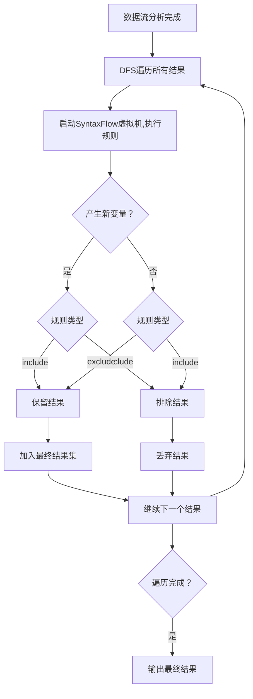
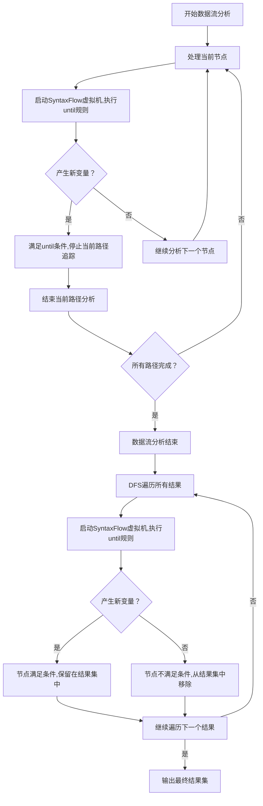

# 6. 数据流运算：追踪定义和使用

在静态代码分析和安全审计中，**Use-Def 链**（Use-Definition Chain，简称 UD 链）和 **Def-Use 链**（Definition-Use Chain，简称 DU 链）的追踪是至关重要的技术。它们能够帮助审计员精准地追踪变量或函数的使用与定义关系，从而有效识别潜在的安全漏洞。**SyntaxFlow** 支持对 UD 链和 DU 链的追踪，充分利用 SSA（静态单赋值）形式的优势，实现对数据流的精确追踪。本文将详细介绍 **SyntaxFlow** 中 Use-Def 链追踪的运算定义、语法规则、使用实例以及实战中的注意事项。

import TOCInline from '@theme/TOCInline';

<TOCInline toc={toc} />


## 简介

**Use-Def 链**和**Def-Use 链**是数据流分析中的基本概念。

- **Use-Def 链（UD 链）**：描述一个变量的使用位置与其定义位置之间的关系。
- **Def-Use 链（DU 链）**：描述一个变量的定义位置与其后续使用位置之间的关系。

通过追踪这些链，审计员可以精准地识别数据在代码中的流向，从而发现潜在的安全漏洞，如 SQL 注入、命令注入、跨站脚本（XSS）等。

**SyntaxFlow** 提供了强大的语法规则，支持对 UD 链和 DU 链的递归追踪，以实现高效、精确的代码审计。

## Use-Def 链追踪语法定义

在 **SyntaxFlow** 中，Use-Def 链追踪通过特定的运算符来实现。这些运算符可以简化复杂的链式调用追踪，使得规则编写更加简洁和高效。以下是相关的语法定义和运算符解释。

### 运算符概览

1. **`->` 和 `-->`（使用链追踪）**
   - `->`：追踪到下一个使用该变量或函数的地方。这是追踪变量“一级”使用的基本方式。
   - `-->`：追踪直到使用链的结束。这个运算符将继续追踪，直到没有更多的使用，即完全展开整个使用链。

2. **`#>` 和 `#->`（定义链追踪）**
   - `#>`：追踪到变量或函数的直接定义点。通常指变量被赋值或函数被声明的地方。
   - `#->`：追踪直到定义链的起点。使用这个运算符可以追踪到变量或函数的最初定义，穿过所有中间的定义点。

3. **`-{}` 和 `-{...}->`（定制追踪深度或设置数据流分析配置项）**
   - `-{depth: 5}->`：表示追踪使用链，且追踪深度限制为5层。
   - `-{include:...}->`：设置配置项，数据流分析的结果只保留符合配置项的。
   - `-{exclude:...}->`：设置配置项，数据流分析的结果排除符合配置项的。

### 语法结构

```antlr
filterItem
    : filterItemFirst                            # First
    ...
    | '->'                                       # NextFilter
    | '#>'                                       # DefFilter
    | '-->'                                      # DeepNextFilter
    | '-{' (recursiveConfig)? '}->'             # DeepNextConfigFilter
    | '#->'                                      # TopDefFilter
    | '#{' (recursiveConfig)? '}->'             # TopDefConfigFilter
    ...
    ;
```

- **`filterItemFirst`**：定义过滤项的起始。
- **`->`**：向下追踪一级使用链节点。
- **`-->`**：向下追踪使用链节点直到链结束(也叫Bottom-Use分析)。
- **`#>`**：向上追踪一级定义链节点。
- **`#->`**：向上追踪定义链直到链结束(也叫Top-Def分析)。
- **`-{...}->`**：在追踪过程中设置参数，如追踪深度。

## 使用实例与解释

通过具体的代码案例，结合 **SyntaxFlow** 的语法规则，可以更直观地理解 Use-Def 链追踪的应用。

### 案例一：审计针对 ProcessBuilder 的 RCE

#### 审计代码示例

```java
import java.io.*;

public class TestRCE {
    public static void main(String[] args) {
        String cmd = "ping example.com";
        
        // 这行代码将被上面的规则捕获
        ProcessBuilder pb = new ProcessBuilder(cmd.split(" "));
        pb.start();
    }
}
```

#### SyntaxFlow 规则案例

```syntaxflow
// 审计潜在的远程代码执行风险
desc(title: "rce")
// 捕获创建 ProcessBuilder 对象时的所有参数
ProcessBuilder(* as $cmd) as $builder
// 追踪 ProcessBuilder 对象启动进程的方法调用
$builder.start() as $execBuilder
// 检查是否成功执行了 start 方法，如果未执行，则可能存在漏洞
check $execBuilder then "fine" else "rce 2 SyntaxFlow error"
// 如果发现了未正确处理的 ProcessBuilder 参数，则触发警报
alert $execBuilder for {
    message: "发现潜在的远程代码执行漏洞，未正确处理 ProcessBuilder 的参数。",
    risk: rce,
    level: high,
}
```

#### 执行效果

执行以下命令进行审计：

```bash
yak ssa -t . --program rce && yak sf --program rce rce.sf
```

输出示例：

```
[INFO] 2024-06-26 14:11:10 [ssacli:132] start to compile file: .
[INFO] 2024-06-26 14:11:10 [ssacli:148] compile save to database with program name: rce
[INFO] 2024-06-26 14:11:10 [ssa:42] init ssa database: /Users/v1ll4n/yakit-projects/default-yakssa.db
[INFO] 2024-06-26 14:11:10 [language_parser:46] parse project in fs: *filesys.LocalFs, localpath: .
...
...
[INFO] 2024-06-26 14:11:10 [ssacli:272] syntax flow query result:
rule md5 hash: d04b7fc1476e8957cdad9f8ba36214a6
rule preview: // 审计潜在的远程代码执行风险 desc(title: "rc...e" else "rce 2 SyntaxFlow error"
description: {title: "title", $execBuilder: "fine"}
Result Vars:
  cmd:
    t1283661: Undefined-ProcessBuilder
        Sample.java:8:32 - 8:62
    t1283666: Undefined-cmd.split(" ")
        Sample.java:8:51 - 8:61
  builder:
    t1283662: Undefined-ProcessBuilder
        Sample.java:8:32 - 8:62
```

#### 解释

- **`ProcessBuilder(* as $cmd) as $builder`**：捕获 `ProcessBuilder` 构造函数的所有参数，并存储在 `$cmd` 中，同时将 `ProcessBuilder` 对象存储在 `$builder` 中。
- **`$builder.start() as $execBuilder`**：追踪 `ProcessBuilder` 对象调用 `start()` 方法，并将结果存储在 `$execBuilder` 中。
- **`check $execBuilder then "fine" else "rce 2 SyntaxFlow error"`**：检查 `start()` 方法是否成功执行，若未执行则报告潜在的 RCE 漏洞。

### 案例二：GroovyShell 代码执行漏洞

#### 审计代码示例

```java
package org.vuln.javasec.controller.basevul.rce;
import groovy.lang.GroovyShell;
import org.springframework.stereotype.Controller;
import org.springframework.ui.Model;
import org.springframework.web.bind.annotation.GetMapping;
import org.springframework.web.bind.annotation.RequestMapping;

@Controller
@RequestMapping("/home/rce")
public class GroovyExec {

    @GetMapping("/groovy")
    public String groovyExec(String cmd, Model model) {
        GroovyShell shell = new GroovyShell();
        try {
            shell.evaluate(cmd);
            model.addAttribute("results", "执行成功！！！");
        } catch (Exception e) {
            e.printStackTrace();
            model.addAttribute("results", e.toString());
        }
        return "basevul/rce/groovy";
    }
}
```

#### SyntaxFlow 规则案例

```syntaxflow
// 审计通过 GroovyShell 实例执行代码的情况
desc(title: "groovy shell eval")

// 捕获 GroovyShell 的 evaluate 方法调用时传递的所有参数
GroovyShell().evaluate(* as $cmd)
// 追踪参数 $cmd 的定义来源，直到最初的定义点
$cmd #-> * as $target

// 检查是否能追踪到 $cmd 的源头，若无法追踪，则可能存在代码注入风险
check $target then "fine" else "not found groovyShell.evaluate parameter"
```

#### 执行效果

执行以下命令进行审计：

```bash
yak ssa -t . --program groovy && yak sf --program groovy rce.sf
```

输出示例：

```
...
...
[INFO] 2024-06-26 14:24:11 [ssacli:272] syntax flow query result:
rule md5 hash: 17476c2166f26d3dfc5fe3f1c116451b
rule preview: // 审计通过 GroovyShell 实例执行代码的情况 de... groovyShell.evaluate parameter"
description: {title: "title", $target: "fine"}
Result Vars:
  cmd:
    t1323355: Parameter-cmd
        Groovy.java:13:29 - 13:39
  _:
    t1323363: Undefined-shell.evaluate(valid)
        Groovy.java:16:18 - 16:31
  target:
    t1323355: Parameter-cmd
        Groovy.java:13:29 - 13:39
```

#### 解释

- **`GroovyShell().evaluate(* as $cmd)`**：捕获 `GroovyShell` 实例调用 `evaluate` 方法时传递的所有参数，并存储在 `$cmd` 中。
- **`$cmd #-> * as $target`**：追踪 `$cmd` 的定义来源，直到最初的定义点，将结果存储在 `$target` 中。
- **`check $target then "fine" else "not found groovyShell.evaluate parameter"`**：检查 `$cmd` 的定义点是否可追踪，若无法追踪则提示潜在的代码注入风险。

## 高级特性：数据流分析的配置项

数据流分析，包括Top-Def和Bottom-Use分析，默认情况下会追踪到最顶级的定义或最底层的使用。但在某些情况下，期望限制追踪的深度或者范围。为此，**SyntaxFlow** 提供了配置项来控制数据流分析的行为。
### 1. 追踪深度限制: `depth`

    追踪深度限制可以通过 `{depth: N}` 来限制追踪的深度，其中 `N` 是一个正整数，表示最大追踪层数。
- 示例
```syntaxflow
// Top-Def限制追踪深度为 5
$sink #{depth: 5}-> $source;
// Bottom-Use限制追踪深度为 3
$source -{depth: 3}-> $sink;
```

### 2. 使用数据流分析期间的值：`hook`

    在数据流分析过程中，可以使用 `hook` 来指定在追踪过程中需要记录的值或状态。这可以帮助在分析过程中捕获特定的变量状态或函数调用。
- 示例
```syntaxflow
// 搜索 HttpServletRequest 的参数
HttpServletRequest?{opcode:param}?{<typeName>?{have:'javax.servlet.http.HttpServletRequest'}} as $req
// 使用Bottom-Use查找HttpServletRequest的使用，并记录HttpServletRequest.getParameter() 的调用作为间接参数
$req -{
  hook: `*.getParameter() as $indirectParam`
}->;
```

:::tip **提示**
hook的本质是每次运行数据流分析节点的时候，就会启用一个新的SyntaxFlow虚拟机运行一次配置项里面的规则。
比如上述示例中，每次追踪到一个 `HttpServletRequest` 被使用的地方，都会运行一次 `*.getParameter() as $indirectParam` 的规则。

配置项规则运行得到的变量，可以在数据流分析结束后继续被使用。因此可以再后续分析中使用变量`$indirectParam`。
:::

### 3.包含或排除特定条件：`include` 和 `exclude`

- **作用**
  - 在数据流分析中，可以使用 `include` 和 `exclude` 来指定需要包含或排除的特定条件。这可以帮助过滤掉不相关的结果，聚焦于感兴趣的部分。

- **原理**
   - `include`和`exclude`包含或者排除某项结果的原理是：当数据流分析（Bottom-Use或者Top-Def）结束以后，获得所有数据流分析的结果，然后使用深度优先算法（DFS）遍历结果，判断是否满足`include`或者`exclude`的条件。
   - 与`hook`类似，`include`和`exclude`在进行DFS遍历的时候，会启用一个新的SyntaxFlow虚拟机运行一次配置项里面的规则。如果运行完后发现新的虚拟机产生了新变量，那么就会认为该配置项满足条件。

具体流程可以参考下图：

- **示例**

**include例子：**
```syntaxflow
desc(
    title_zh:"检测Java弱加密 - 密钥长度不足"
)
RSAKeyGenParameterSpec?{<typeName>?{have:'java.security.spec.RSAKeyGenParameterSpec'}}(,* as $keySize);
$keySize#{
    include:`* ?{opcode:const}`
}-> as $size;
$size in (,2048) as $risk;
alert $risk for{
    message:"发现Java代码中使用不足2048位的RSA密钥长度",
    solution:"当前密码学指南建议，使用RSA算法时，密钥长度至少应为2048位。开发者应该确保遵循推荐的密钥长度，以保障加密安全。",
}
```
解释：
- 查找RSAKeyGenParameterSpec构造函数的调用，并捕获其第二个参数密钥长度作为变量 `$keySize`。
- 使用带有配置项的Top-Def算法(`#{...}->`)往上找$keySize的定义(keySize可能不是一个常量，而是一个参数，所以需要使用Top-Def找到keySize的顶级定义)。
- 使用 `include` 规则来检查 `$keySize` 是否是一个常量，如果是，则作为最后的结果`$size`。
- 检查 `$size` 是否在指定范围内（例如小于2048），如果是，则标记为风险 `$risk`。

**exclude例子：**
```syntaxflow
desc(
    title_zh:"检测Java不安全Process WaitFor使用"
)
// 查找没有设置超时时间Process.waitFor方法的Process.
.waitFor?{!(<getActualParams><slice(start=1)>)}(* as $process,)
check $process;
// 检测Process是否调用destroy或者destroyForcibly主动销毁进程
$process?{*-{
    exclude:`<self>.destroy*`,
}->} as $result
alert $result for {
    message: "发现Java的Process.waitFor方法可能导致DDOS漏洞",
    level: mid,
    type: vuln,
}
```
解释：
- 查找没有设置超时时间的 `Process.waitFor` 方法调用，并将其结果存储在 `$process` 变量中。
- 使用 `exclude` 规则来排除那些调用了 `destroy` 或 `destroyForcibly` 方法的 `Process` 实例。
- 如果 `$process` 中的实例没有调用销毁方法，则将其标记为风险 `$result`。

### 4. 直到特定条件：`until`

-   **作用**：
- 在数据流分析中，可以使用 `until` 来指定追踪的终止条件。当满足特定条件时，数据流分析将停止。

-   **原理**：

`until`的原理包括两个阶段：数据流分析时检查（过程时检查）、数据流分析结束后检查（结果检查）。
 - 在数据流分析过程中，持续检查当前追踪的状态是否满足 `until` 条件。如果满足，则停止追踪。
 - `until`检测条件是否满足的方式和`hook`类似：每次进行数据流分析节点的时候，都会启用一个新的SyntaxFlow虚拟机运行一次配置项里面的规则。如果运行完后发现新的虚拟机产生了新变量，那么就会认为该配置项满足条件，那么就会停止数据流分析。
 - 当数据流分析结束后，还会通过DFS遍历得到的结果，判断是否满足 `until` 条件，确保最终结果集中的数据流分析结果符合预期。

具体流程可以参考下图：

-   示例
```syntaxflow
desc(
    title_zh:"检测Java Servlet和SpringMVC中的命令注入漏洞"
)
<include('java-servlet-param')> as $source;
<include('java-spring-mvc-param')> as $source;
check $source;

<include('java-runtime-exec-sink')> as $sink;
<include('java-command-exec-sink')> as $sink;
check $sink;

$sink #{
    until: "* & $source"
}-> as $controlled_source_site
```
解释
- 查找 Java Servlet 和 Spring MVC 中的参数传递，并将其结果存储在 `$source` 变量中。
- 查找 Java 中的命令执行相关的 sink，并将其结果存储在 `$sink` 变量中。
- 使用 `until` 规则来追踪 `$sink` 的定义，直到找到与 `$source` 相关的参数传递点。这样可以确保只追踪那些可能导致命令注入的路径。


## 实战中的注意事项

在实际应用中，使用 Use-Def 链追踪时需要注意以下几点：

### 1. 上下文敏感

理解代码的上下文非常重要，尤其是在处理复杂逻辑或大型代码库时。使用 `-{}->` 运算符来设置适当的追踪参数，可以帮助维护追踪的可管理性。

### 2. 性能考虑

在大型项目中，使用 `-->` 或 `#->` 可能会导致性能开销。建议在可能的情况下，限制追踪的深度或明确追踪的起始点和终点，以提高审计效率。

### 3. 追踪的精确性

使用运算符时，需要确保理解每个符号的具体含义，以便精确地捕捉到所需的数据流和定义点。避免误匹配和漏匹配。


## 重要性与优势

**Use-Def 链**和**Def-Use 链**的追踪在代码审计和安全分析中具有重要意义，主要优势包括：

### 1. **精准的数据流追踪**

通过追踪变量或函数的使用与定义关系，能够精准地识别数据在代码中的流向，发现潜在的安全漏洞。

### 2. **充分利用 SSA 优势**

SSA 形式的代码确保每个变量在生命周期内只被赋值一次，简化了数据流分析，提升了追踪的准确性和效率。

### 3. **简化规则编写**

**SyntaxFlow** 提供的运算符和语法规则，使得复杂的数据流追踪过程更加简洁高效，减少了手动编写繁琐规则的工作量。

### 4. **提升审计覆盖率**

通过递归追踪，确保无论目标变量或函数通过多少层链式调用被使用，都能被准确捕捉到，提升审计的全面性。

## 最佳实践

为了充分发挥 **SyntaxFlow** 中 Use-Def 链追踪的优势，建议遵循以下最佳实践：

### 1. **明确目标方法或变量**

确保目标方法或变量名准确无误，以避免误匹配和漏匹配。例如，在定义规则时，仔细检查方法名和变量名的拼写。

### 2. **合理设置追踪深度**

根据代码的复杂度和实际需求，合理设置追踪深度或使用限定条件，避免过度追踪导致性能问题。

### 3. **结合其他过滤条件**

Use-Def 链追踪可以与其他过滤条件（如参数类型、返回值等）结合使用，提升规则的精准度。例如，可以结合方法参数的类型或调用环境，进一步筛选潜在的风险点。

### 4. **模块化编写规则**

将复杂的审计任务分解为多个模块，每个模块专注于特定的链式调用层级，提升规则的可读性和可维护性。

### 5. **定期审查和更新规则**

随着代码库的演进，定期审查和更新审计规则，确保其始终适用于最新的代码结构和调用模式，保持审计的有效性。

## 总结

**Use-Def 链**和**Def-Use 链**的追踪是静态代码分析和安全审计中的核心技术。通过 **SyntaxFlow** 提供的运算符和语法规则，审计员能够高效、精准地追踪变量和函数的使用与定义关系，发现潜在的安全漏洞。结合实际案例的解析，本文展示了如何在实际审计中应用这些规则，从而提升审计效率和覆盖率。

掌握并应用本文介绍的 Use-Def 链追踪方法和最佳实践，能够帮助开发和安全团队更有效地进行代码审计和安全分析，保障代码的整体安全性与稳定性。